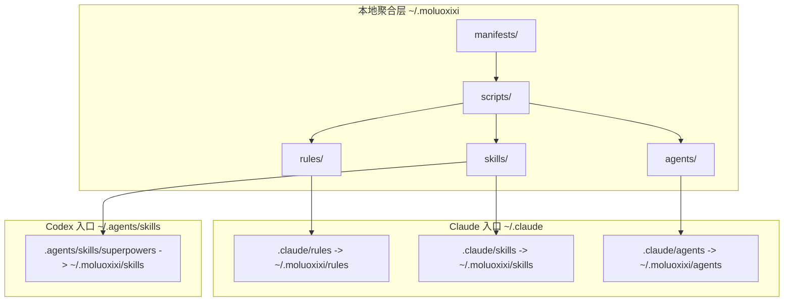
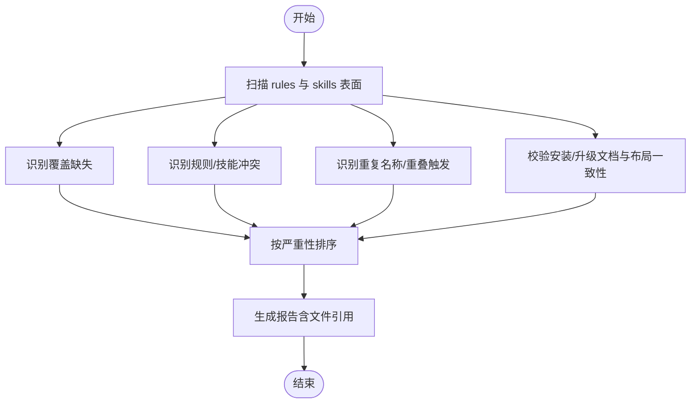
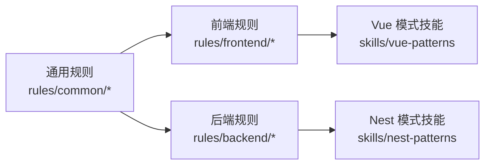
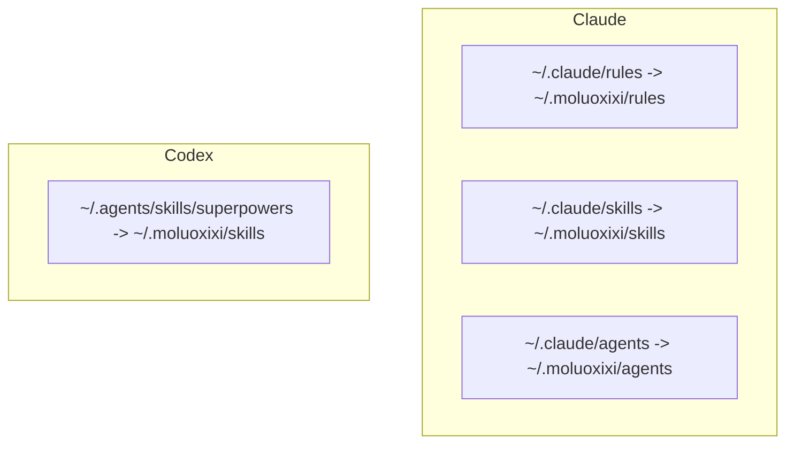
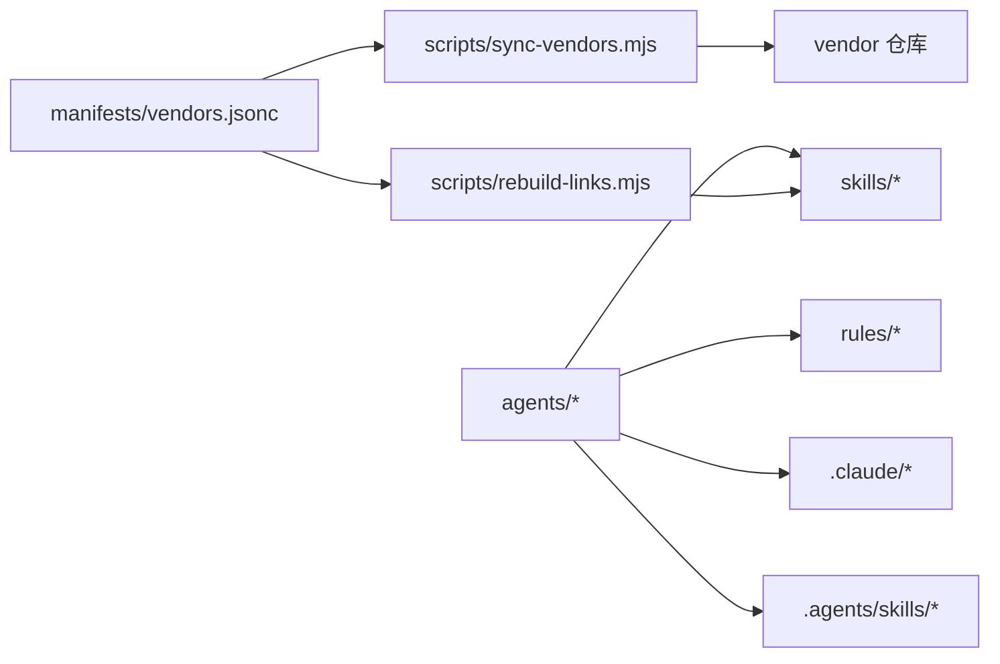

# 代理系统

<cite>
**本文引用的文件**
- [agents/stack-reviewer.md](file://agents/stack-reviewer.md)
- [README.md](file://README.md)
- [package.json](file://package.json)
- [manifests/vendors.jsonc](file://manifests/vendors.jsonc)
- [.codex/AGENTS.md](file://.codex/AGENTS.md)
- [.codex/INSTALL.md](file://.codex/INSTALL.md)
- [.codex/UPGRADE.md](file://.codex/UPGRADE.md)
- [.claude/INSTALL.md](file://.claude/INSTALL.md)
- [.claude/UPGRADE.md](file://.claude/UPGRADE.md)
- [rules/common/overview.md](file://rules/common/overview.md)
- [rules/frontend/overview.md](file://rules/frontend/overview.md)
- [skills/vue-patterns/SKILL.md](file://skills/vue-patterns/SKILL.md)
- [skills/nest-patterns/SKILL.md](file://skills/nest-patterns/SKILL.md)
- [scripts/sync-vendors.mjs](file://scripts/sync-vendors.mjs)
- [scripts/lib/vendor-sync.mjs](file://scripts/lib/vendor-sync.mjs)
- [scripts/lib/vendors.mjs](file://scripts/lib/vendors.mjs)
- [scripts/rebuild-links.mjs](file://scripts/rebuild-links.mjs)
- [rules/README.md](file://rules/README.md)
</cite>

## 目录
1. [简介](#简介)
2. [项目结构](#项目结构)
3. [核心组件](#核心组件)
4. [架构总览](#架构总览)
5. [详细组件分析](#详细组件分析)
6. [依赖关系分析](#依赖关系分析)
7. [性能考量](#性能考量)
8. [故障排查指南](#故障排查指南)
9. [结论](#结论)
10. [附录](#附录)

## 简介
本仓库是一个基于 superpowers 的个人 AI 开发工作流仓库，核心目标是为 Claude 与 Codex 提供统一的规则（rules）、技能（skills）与代理（agents）组织与分发能力。代理系统中的“堆栈审查器”代理用于在发布变更前，对仓库中的规则、技能与特定技术栈的指导进行审查，识别覆盖缺失、冲突、重复以及文档漂移等问题，并以严重性排序输出带文件引用的报告。

本系统通过 vendor 管理第三方技能来源，采用统一的聚合层与软链接机制，确保规则、技能与代理在 Claude 与 Codex 中的一致性与可维护性。

**章节来源**
- [README.md:1-50](file://README.md#L1-L50)

## 项目结构
仓库采用“规则-技能-代理-供应商”的分层组织方式，配合安装与升级脚本，将内容统一暴露给 Claude 与 Codex：

- 核心目录
  - rules：第一方规则，定义通用与技术栈特定的约束与流程
  - skills：第一方与第三方技能，提供任务流程与实现策略
  - agents：AI 代理定义，描述角色、工具与目标
  - manifests：供应商清单，声明第三方技能来源与链接规则
  - scripts：安装与同步脚本，负责 vendor 拉取与链接重建
  - .claude / .codex：面向 Claude/Codex 的安装与升级指引及入口



**图表来源**
- [.claude/INSTALL.md:23-29](file://.claude/INSTALL.md#L23-L29)
- [.claude/INSTALL.md:51-56](file://.claude/INSTALL.md#L51-L56)
- [.codex/INSTALL.md:13-22](file://.codex/INSTALL.md#L13-L22)
- [.codex/INSTALL.md:48-51](file://.codex/INSTALL.md#L48-L51)

**章节来源**
- [.claude/INSTALL.md:11-29](file://.claude/INSTALL.md#L11-L29)
- [.codex/INSTALL.md:9-22](file://.codex/INSTALL.md#L9-L22)
- [rules/README.md:1-31](file://rules/README.md#L1-L31)

## 核心组件
- 代理定义（堆栈审查器）
  - 名称与描述：用于在发布前审查规则、技能与技术栈指导，识别覆盖缺失、冲突、重复与文档漂移
  - 工具集：Read、Grep、Glob（用于扫描与匹配）
  - 模型：gpt-5（用于生成审查结果）
  - 输出：按严重性排序的发现列表，尽可能附带文件引用
- 规则与技能
  - 规则层：定义通用约束与流程，如注释规范、代码组织原则等
  - 技能层：提供任务流程与实现策略，如 Vue/Nest 等技术栈模式
- 供应商与链接
  - 通过清单文件聚合第三方技能，经脚本重建软链接，统一暴露至 skills 目录
- 安装与升级
  - Claude 与 Codex 分别提供安装与升级指引，确保入口正确指向聚合层

**章节来源**
- [agents/stack-reviewer.md:1-20](file://agents/stack-reviewer.md#L1-L20)
- [rules/common/overview.md:1-10](file://rules/common/overview.md#L1-L10)
- [rules/frontend/overview.md:1-11](file://rules/frontend/overview.md#L1-L11)
- [skills/vue-patterns/SKILL.md:1-29](file://skills/vue-patterns/SKILL.md#L1-L29)
- [skills/nest-patterns/SKILL.md:1-28](file://skills/nest-patterns/SKILL.md#L1-L28)
- [manifests/vendors.jsonc:1-107](file://manifests/vendors.jsonc#L1-L107)

## 架构总览
下图展示了从安装到运行代理的整体流程，以及规则、技能与代理之间的关系：

```mermaid
sequenceDiagram
participant User as "用户"
participant Installer as "安装脚本"
participant Vendor as "供应商清单"
participant Sync as "同步脚本"
participant Link as "链接重建脚本"
participant Claude as "Claude 入口"
participant Codex as "Codex 入口"
participant Agent as "堆栈审查器代理"
User->>Installer : 执行安装/升级
Installer->>Vendor : 读取清单
Installer->>Sync : 拉取/更新 vendor 仓库
Sync-->>Installer : 完成 vendor 同步
Installer->>Link : 重建软链接
Link-->>Installer : 完成链接
Installer->>Claude : 建立 ~/.claude/* 指向
Installer->>Codex : 建立 ~/.agents/skills/superpowers 指向
User->>Agent : 触发审查任务
Agent->>Claude : 读取 rules/skills/agents
Agent-->>User : 返回审查报告严重性排序
```

**图表来源**
- [.claude/INSTALL.md:31-56](file://.claude/INSTALL.md#L31-L56)
- [.codex/INSTALL.md:24-51](file://.codex/INSTALL.md#L24-L51)
- [scripts/sync-vendors.mjs:46-58](file://scripts/sync-vendors.mjs#L46-L58)
- [scripts/rebuild-links.mjs:50-70](file://scripts/rebuild-links.mjs#L50-L70)
- [agents/stack-reviewer.md:8-19](file://agents/stack-reviewer.md#L8-L19)

## 详细组件分析

### 堆栈审查器代理（Stack Reviewer Agent）
- 角色与职责
  - 在发布变更前，对规则与技能表面进行全面审查
  - 关注点：缺失的技术栈覆盖、规则与技能间的冲突、重复的技能名称或重叠触发、安装与升级文档与实际布局的漂移
- 输入与工具
  - 输入：rules、skills、agents 目录内容
  - 工具：Read、Grep、Glob（用于扫描与匹配）
- 处理逻辑
  - 识别覆盖缺失与冲突
  - 发现重复与重叠
  - 校验文档与实际布局一致性
  - 按严重性排序输出，尽可能附带文件引用
- 输出格式
  - 结构化报告，包含严重性级别与文件定位信息



**图表来源**
- [agents/stack-reviewer.md:10-19](file://agents/stack-reviewer.md#L10-L19)

**章节来源**
- [agents/stack-reviewer.md:1-20](file://agents/stack-reviewer.md#L1-L20)

### 规则与技能体系
- 规则层
  - 通用规则：定义跨技术栈的约束与流程
  - 技术栈规则：前端、后端、测试等领域的特定约束
- 技能层
  - Vue/Nest 等技术栈的实现模式与检查清单
  - 与规则层协作，规则定义“要做什么”，技能提供“怎么做”



**图表来源**
- [rules/common/overview.md:1-10](file://rules/common/overview.md#L1-L10)
- [rules/frontend/overview.md:1-11](file://rules/frontend/overview.md#L1-L11)
- [skills/vue-patterns/SKILL.md:1-29](file://skills/vue-patterns/SKILL.md#L1-L29)
- [skills/nest-patterns/SKILL.md:1-28](file://skills/nest-patterns/SKILL.md#L1-L28)

**章节来源**
- [rules/common/overview.md:1-10](file://rules/common/overview.md#L1-L10)
- [rules/frontend/overview.md:1-11](file://rules/frontend/overview.md#L1-L11)
- [skills/vue-patterns/SKILL.md:1-29](file://skills/vue-patterns/SKILL.md#L1-L29)
- [skills/nest-patterns/SKILL.md:1-28](file://skills/nest-patterns/SKILL.md#L1-L28)

### 供应商与链接重建
- 供应商清单
  - 声明第三方技能来源与链接规则，统一聚合至 ~/.moluoxixi/skills
- 同步与链接
  - 同步脚本：克隆/更新 vendor 仓库并切换到默认分支
  - 链接重建脚本：根据清单重建软链接，保证入口一致

```mermaid
sequenceDiagram
participant Manifest as "供应商清单"
participant Sync as "同步脚本"
participant VendorRepo as "vendor 仓库"
participant Link as "链接重建脚本"
participant Skills as "~/.moluoxixi/skills"
Manifest-->>Sync : 加载清单
Sync->>VendorRepo : clone/fetch/merge 到默认分支
Sync-->>Link : 产出已同步的 vendor 根
Link->>Skills : 重建软链接
Link-->>Skills : 暴露统一入口
```

**图表来源**
- [manifests/vendors.jsonc:1-107](file://manifests/vendors.jsonc#L1-L107)
- [scripts/sync-vendors.mjs:46-58](file://scripts/sync-vendors.mjs#L46-L58)
- [scripts/rebuild-links.mjs:50-70](file://scripts/rebuild-links.mjs#L50-L70)

**章节来源**
- [manifests/vendors.jsonc:1-107](file://manifests/vendors.jsonc#L1-L107)
- [scripts/lib/vendor-sync.mjs:58-77](file://scripts/lib/vendor-sync.mjs#L58-L77)
- [scripts/rebuild-links.mjs:50-70](file://scripts/rebuild-links.mjs#L50-L70)

### Claude 与 Codex 集成
- Claude
  - 通过软链接将 ~/.claude/rules、~/.claude/skills、~/.claude/agents 指向 ~/.moluoxixi 对应目录
- Codex
  - 通过 ~/.agents/skills/superpowers 指向 ~/.moluoxixi/skills，统一暴露技能入口



**图表来源**
- [.claude/INSTALL.md:23-29](file://.claude/INSTALL.md#L23-L29)
- [.claude/INSTALL.md:51-56](file://.claude/INSTALL.md#L51-L56)
- [.codex/INSTALL.md:13-22](file://.codex/INSTALL.md#L13-L22)
- [.codex/INSTALL.md:48-51](file://.codex/INSTALL.md#L48-L51)

**章节来源**
- [.claude/INSTALL.md:31-56](file://.claude/INSTALL.md#L31-L56)
- [.codex/INSTALL.md:24-51](file://.codex/INSTALL.md#L24-L51)

## 依赖关系分析
- 组件耦合
  - 代理依赖 Claude/Codex 的入口与规则/技能/代理目录
  - 规则与技能通过统一的聚合层与软链接被代理读取
  - 供应商清单驱动同步与链接重建脚本
- 外部依赖
  - Git：用于 vendor 仓库的 clone/fetch/merge
  - Node.js：运行脚本与解析清单
- 可能的循环依赖
  - 通过软链接与清单声明避免直接循环依赖，保持单向聚合与暴露



**图表来源**
- [agents/stack-reviewer.md:1-20](file://agents/stack-reviewer.md#L1-L20)
- [manifests/vendors.jsonc:1-107](file://manifests/vendors.jsonc#L1-L107)
- [scripts/sync-vendors.mjs:46-58](file://scripts/sync-vendors.mjs#L46-L58)
- [scripts/rebuild-links.mjs:50-70](file://scripts/rebuild-links.mjs#L50-L70)

**章节来源**
- [package.json:1-11](file://package.json#L1-L11)
- [scripts/lib/vendors.mjs:64-66](file://scripts/lib/vendors.mjs#L64-L66)

## 性能考量
- 仓库规模与扫描范围
  - vendor 仓库数量与大小会影响同步与链接重建的时间
  - 建议在变更较少时批量执行同步与链接重建
- 平台差异
  - Windows 使用 junction，类 Unix 使用目录链接，注意权限与符号链接行为
- 缓存与增量
  - 当前脚本为全量同步与重建，若仓库规模扩大可考虑基于变更的增量处理

[本节为通用建议，无需特定文件来源]

## 故障排查指南
- 安装/升级后入口未生效
  - 检查 ~/.claude 与 ~/.agents/skills/superpowers 是否正确指向 ~/.moluoxixi
  - 参考安装/升级验证步骤
- vendor 仓库未同步或分支不正确
  - 确认清单中仓库地址与 cloneDir 正确
  - 检查默认分支解析与当前分支是否一致
- 链接重建失败
  - 确认 source 路径存在且可访问
  - 检查平台链接类型（Windows junction，类 Unix dir）

**章节来源**
- [.claude/INSTALL.md:89-107](file://.claude/INSTALL.md#L89-L107)
- [.codex/INSTALL.md:82-95](file://.codex/INSTALL.md#L82-L95)
- [scripts/lib/vendor-sync.mjs:58-77](file://scripts/lib/vendor-sync.mjs#L58-L77)
- [scripts/rebuild-links.mjs:60-70](file://scripts/rebuild-links.mjs#L60-L70)

## 结论
本代理系统通过规则、技能与代理的分层组织，结合 vendor 聚合与软链接机制，为 Claude 与 Codex 提供了统一、可维护且可扩展的 AI 工作流基础。堆栈审查器代理在发布前提供关键的质量保障，确保规则与技能的一致性与完整性。通过标准化的安装与升级流程，团队可以在不同环境中保持一致的体验与产出。

[本节为总结，无需特定文件来源]

## 附录

### 代理配置与定制指南
- 代理参数
  - 工具集：Read、Grep、Glob（用于扫描与匹配）
  - 模型：gpt-5（用于生成审查结果）
- 触发条件
  - 在发布变更前自动触发，或在安装/升级后手动触发
- 输出格式
  - 按严重性排序的报告，尽可能附带文件引用

**章节来源**
- [agents/stack-reviewer.md:4-5](file://agents/stack-reviewer.md#L4-L5)
- [agents/stack-reviewer.md:19](file://agents/stack-reviewer.md#L19)

### 与规则系统和技能系统的集成
- 规则系统
  - 代理读取 rules 目录，识别覆盖缺失与冲突
- 技能系统
  - 代理读取 skills 目录，识别重复与重叠
- 供应商系统
  - 通过清单与脚本统一聚合第三方技能，确保入口一致

**章节来源**
- [rules/README.md:1-31](file://rules/README.md#L1-L31)
- [manifests/vendors.jsonc:1-107](file://manifests/vendors.jsonc#L1-L107)

### 实际使用案例与最佳实践
- 使用案例
  - 发布前审查：在合并前运行堆栈审查器，输出问题清单并修复
  - 安装/升级后验证：确认文档与布局一致，检查重复与冲突
- 最佳实践
  - 优先在 rules 层定义可复用约束，再由技能引用
  - 定期同步 vendor 并重建链接，保持入口一致
  - 在 Claude/Codex 中通过统一入口调用代理与技能

**章节来源**
- [README.md:13-13](file://README.md#L13-L13)
- [.codex/AGENTS.md:11-60](file://.codex/AGENTS.md#L11-L60)