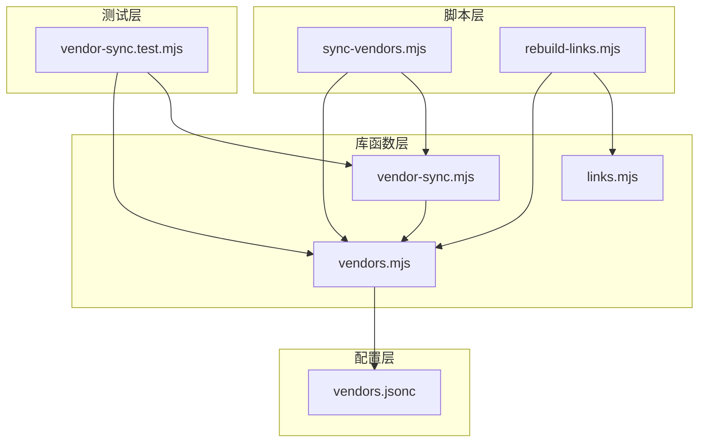
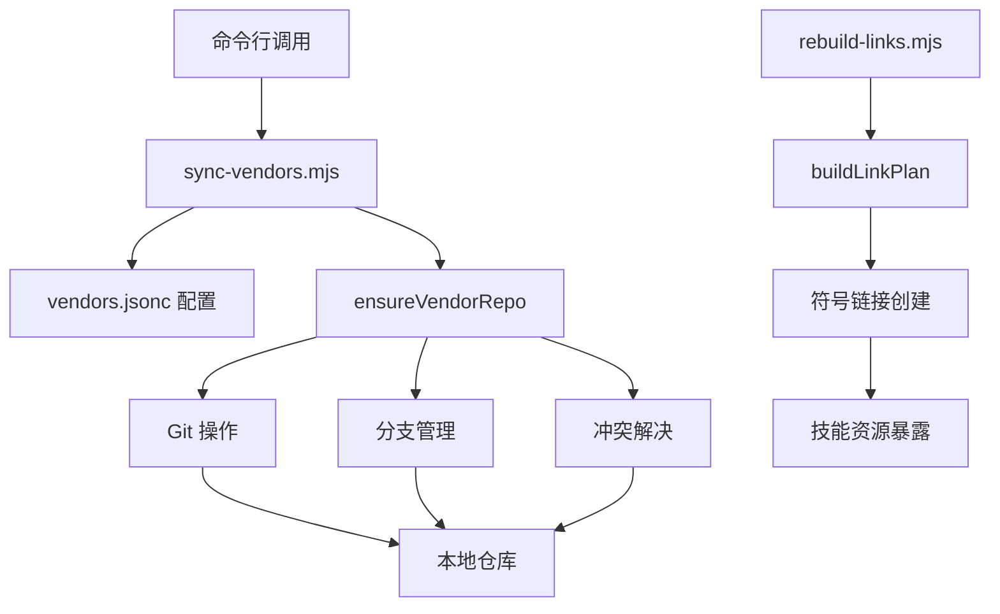
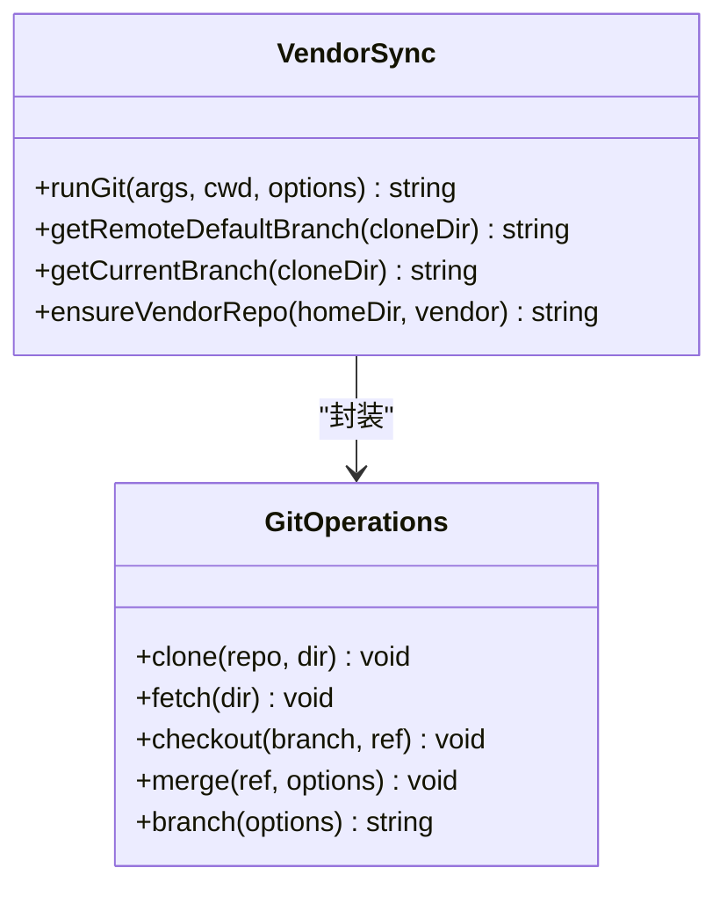
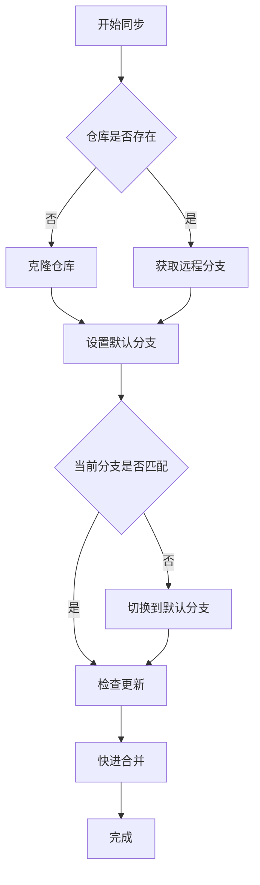
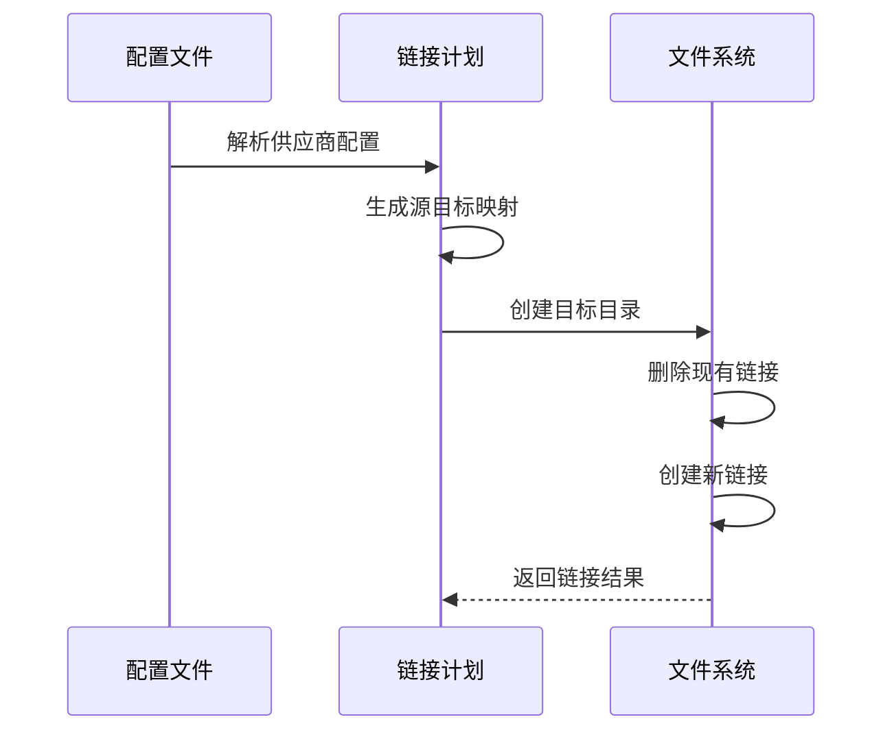
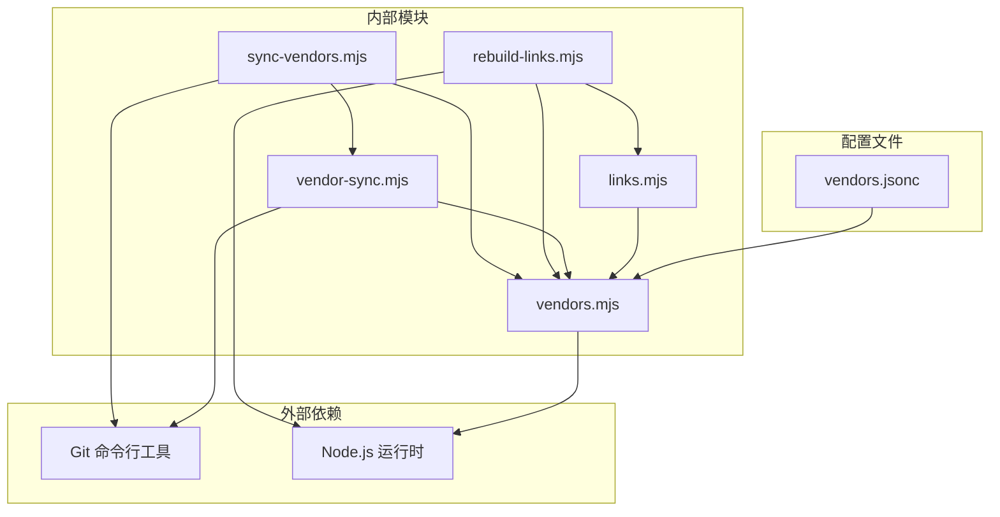
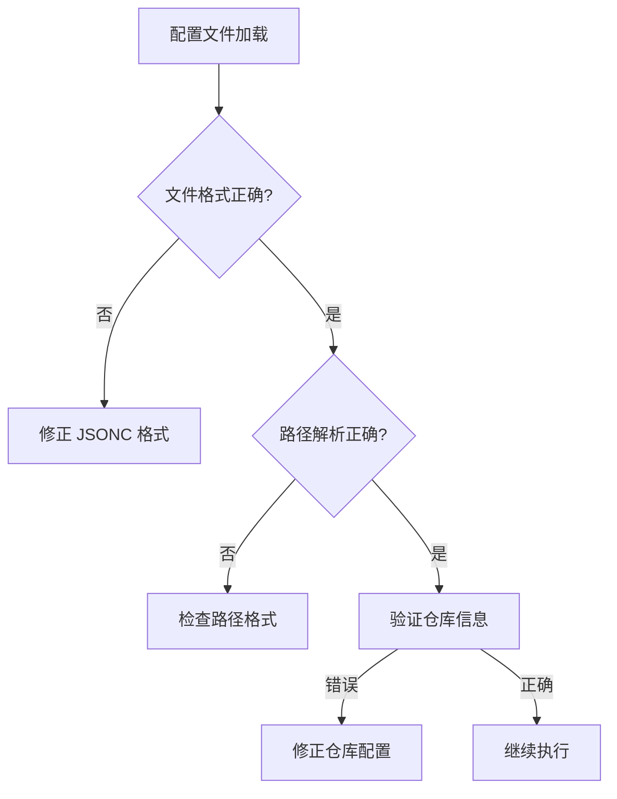

# 供应商同步机制

<cite>
**本文档引用的文件**
- [vendor-sync.mjs](file://scripts/lib/vendor-sync.mjs)
- [sync-vendors.mjs](file://scripts/sync-vendors.mjs)
- [vendors.mjs](file://scripts/lib/vendors.mjs)
- [links.mjs](file://scripts/lib/links.mjs)
- [rebuild-links.mjs](file://scripts/rebuild-links.mjs)
- [vendors.jsonc](file://manifests/vendors.jsonc)
- [vendor-sync.test.mjs](file://tests/vendor-sync.test.mjs)
- [README.md](file://README.md)
- [package.json](file://package.json)
</cite>

## 目录
1. [简介](#简介)
2. [项目结构](#项目结构)
3. [核心组件](#核心组件)
4. [架构概览](#架构概览)
5. [详细组件分析](#详细组件分析)
6. [依赖关系分析](#依赖关系分析)
7. [性能考虑](#性能考虑)
8. [故障排除指南](#故障排除指南)
9. [结论](#结论)

## 简介

供应商同步机制是 AIRules 项目中的一个关键功能模块，用于管理和同步多个第三方供应商仓库。该系统通过统一的配置文件管理供应商信息，自动克隆或更新远程仓库，并建立符号链接以暴露所需的技能资源。

该机制的核心目标是：
- 自动化供应商仓库的生命周期管理
- 确保所有供应商仓库保持最新状态
- 提供统一的技能资源访问接口
- 支持多平台兼容性（Windows、Linux、macOS）

## 项目结构

AIRules 项目的供应商同步系统主要由以下组件构成：



**图表来源**
- [sync-vendors.mjs:1-62](file://scripts/sync-vendors.mjs#L1-L62)
- [vendor-sync.mjs:1-78](file://scripts/lib/vendor-sync.mjs#L1-L78)
- [vendors.mjs:1-75](file://scripts/lib/vendors.mjs#L1-L75)
- [links.mjs:1-23](file://scripts/lib/links.mjs#L1-L23)
- [vendors.jsonc:1-107](file://manifests/vendors.jsonc#L1-L107)

**章节来源**
- [README.md:1-50](file://README.md#L1-L50)
- [package.json:1-11](file://package.json#L1-L11)

## 核心组件

### 供应商同步主程序

`sync-vendors.mjs` 是整个同步系统的主要入口点，负责解析命令行参数、加载配置文件并协调各个同步步骤。

### 供应商仓库管理器

`vendor-sync.mjs` 模块提供了核心的 Git 操作功能，包括仓库克隆、分支检测、合并策略等。

### 配置管理系统

`vendors.mjs` 模块负责处理 JSONC 格式的配置文件，提供路径规范化、注释移除、语法解析等功能。

### 链接构建器

`links.mjs` 模块根据配置文件生成符号链接计划，确保供应商资源正确映射到目标目录。

**章节来源**
- [sync-vendors.mjs:46-62](file://scripts/sync-vendors.mjs#L46-L62)
- [vendor-sync.mjs:58-78](file://scripts/lib/vendor-sync.mjs#L58-L78)
- [vendors.mjs:64-75](file://scripts/lib/vendors.mjs#L64-L75)
- [links.mjs:5-23](file://scripts/lib/links.mjs#L5-L23)

## 架构概览

供应商同步系统采用分层架构设计，每个层次都有明确的职责分工：



**图表来源**
- [sync-vendors.mjs:46-62](file://scripts/sync-vendors.mjs#L46-L62)
- [vendor-sync.mjs:58-78](file://scripts/lib/vendor-sync.mjs#L58-L78)
- [links.mjs:5-23](file://scripts/lib/links.mjs#L5-L23)

### 核心工作流程

供应商同步的核心流程包括以下几个关键步骤：

1. **配置加载**：从 `vendors.jsonc` 文件中读取供应商配置
2. **仓库克隆**：检查本地是否存在仓库，不存在则克隆
3. **分支检测**：确定远程默认分支
4. **分支切换**：确保当前分支与默认分支一致
5. **内容同步**：执行快进合并以保持最新
6. **链接重建**：根据配置创建符号链接

**章节来源**
- [vendor-sync.mjs:58-78](file://scripts/lib/vendor-sync.mjs#L58-L78)
- [sync-vendors.mjs:53-59](file://scripts/sync-vendors.mjs#L53-L59)

## 详细组件分析

### 供应商同步脚本 (vendor-sync.mjs)

该模块提供了供应商仓库管理的核心功能：

#### 主要函数



**图表来源**
- [vendor-sync.mjs:5-78](file://scripts/lib/vendor-sync.mjs#L5-L78)

#### 异步操作处理

虽然该模块使用了同步的 `spawnSync` 方法，但其设计具有良好的扩展性：

- **错误处理**：所有 Git 操作都会检查返回码并在失败时抛出异常
- **编码处理**：统一使用 UTF-8 编码确保跨平台兼容性
- **Shell 支持**：Windows 平台自动启用 shell 模式

#### 分支管理策略



**图表来源**
- [vendor-sync.mjs:58-78](file://scripts/lib/vendor-sync.mjs#L58-L78)

**章节来源**
- [vendor-sync.mjs:1-78](file://scripts/lib/vendor-sync.mjs#L1-L78)

### 命令行参数解析

`sync-vendors.mjs` 提供了完整的命令行接口：

#### 参数定义

| 参数 | 类型 | 默认值 | 描述 |
|------|------|--------|------|
| --home | 字符串 | `~/.moluoxixi` | 指定供应商根目录 |
| --manifest | 字符串 | `manifests/vendors.jsonc` | 指定配置文件路径 |
| --help | 标志 | false | 显示帮助信息 |

#### 使用示例

```bash
# 基本使用
node scripts/sync-vendors.mjs

# 指定自定义目录
node scripts/sync-vendors.mjs --home /custom/path

# 指定自定义配置文件
node scripts/sync-vendors.mjs --manifest ./custom/vendors.jsonc

# 查看帮助
node scripts/sync-vendors.mjs --help
```

**章节来源**
- [sync-vendors.mjs:9-44](file://scripts/sync-vendors.mjs#L9-L44)

### 配置文件管理

`vendors.mjs` 模块提供了强大的配置文件处理能力：

#### JSONC 解析器

该模块实现了完整的 JSONC（JSON with Comments）解析器，支持：
- 行内注释 (`//`)
- 块注释 (`/* */`)
- 单引号字符串
- 尾随逗号自动移除

#### 路径处理


**图表来源**
- [vendors.mjs:4-75](file://scripts/lib/vendors.mjs#L4-L75)

**章节来源**
- [vendors.mjs:1-75](file://scripts/lib/vendors.mjs#L1-L75)

### 符号链接管理

`links.mjs` 模块负责将供应商资源映射到最终的技能目录：

#### 链接计划生成



**图表来源**
- [links.mjs:5-23](file://scripts/lib/links.mjs#L5-L23)

**章节来源**
- [links.mjs:1-23](file://scripts/lib/links.mjs#L1-L23)

## 依赖关系分析

供应商同步系统的依赖关系清晰且模块化：



**图表来源**
- [sync-vendors.mjs:6-7](file://scripts/sync-vendors.mjs#L6-L7)
- [vendor-sync.mjs:1-3](file://scripts/lib/vendor-sync.mjs#L1-L3)
- [vendors.mjs:1-2](file://scripts/lib/vendors.mjs#L1-L2)
- [links.mjs:1-3](file://scripts/lib/links.mjs#L1-L3)
- [rebuild-links.mjs:2-7](file://scripts/rebuild-links.mjs#L2-L7)

### 关键依赖特性

1. **Git 依赖**：完全依赖系统 Git 命令行工具进行版本控制操作
2. **Node.js 模块**：使用标准库进行文件系统操作和进程管理
3. **配置驱动**：所有行为都由 `vendors.jsonc` 配置文件控制
4. **平台兼容**：自动适配不同操作系统平台

**章节来源**
- [vendor-sync.mjs:1-78](file://scripts/lib/vendor-sync.mjs#L1-L78)
- [sync-vendors.mjs:1-62](file://scripts/sync-vendors.mjs#L1-L62)

## 性能考虑

### 并发处理策略

当前实现采用串行处理方式，每个供应商仓库依次处理。这种设计的优势：
- **简单可靠**：避免复杂的并发控制逻辑
- **资源友好**：不会过度占用系统资源
- **错误隔离**：单个仓库的失败不会影响其他仓库

### 网络优化建议

1. **批量操作**：可以考虑在 `ensureVendorRepo` 函数中添加并发控制
2. **缓存机制**：Git 操作结果可以适当缓存以减少重复请求
3. **连接复用**：对于多个供应商，可以考虑复用网络连接

### 存储优化

1. **增量更新**：只在必要时执行 `git fetch` 操作
2. **磁盘空间**：定期清理未使用的临时文件和旧版本数据
3. **索引优化**：合理组织文件结构以提高文件系统访问效率

## 故障排除指南

### 常见问题及解决方案

#### Git 相关错误

| 错误类型 | 可能原因 | 解决方案 |
|----------|----------|----------|
| 认证失败 | Git 凭据配置错误 | 检查 SSH 密钥或用户名密码 |
| 网络超时 | 网络连接不稳定 | 检查网络设置或使用代理 |
| 分支冲突 | 远程分支更新 | 手动执行 `git pull` 后重试 |
| 权限不足 | 文件系统权限问题 | 检查目录权限并提升权限 |

#### 配置文件错误



**图表来源**
- [vendors.mjs:64-66](file://scripts/lib/vendors.mjs#L64-L66)

#### 平台兼容性问题

| 平台 | 特殊注意事项 | 解决方案 |
|------|-------------|---------|
| Windows | 符号链接权限限制 | 使用管理员权限运行 |
| Linux | SELinux 策略限制 | 检查 SELinux 状态 |
| macOS | 文件系统权限 | 检查沙盒权限设置 |

### 调试技巧

1. **启用详细日志**：在命令行中添加调试输出
2. **手动验证**：直接在终端执行相同的 Git 命令
3. **检查中间状态**：验证每个步骤的执行结果
4. **环境隔离**：在临时目录中测试配置变更

**章节来源**
- [vendor-sync.test.mjs:24-72](file://tests/vendor-sync.test.mjs#L24-L72)

## 结论

供应商同步机制是一个设计精良的自动化系统，具有以下特点：

### 优势

1. **模块化设计**：清晰的分层架构便于维护和扩展
2. **配置驱动**：通过配置文件控制所有行为，灵活性强
3. **平台兼容**：自动适配不同操作系统平台
4. **错误处理**：完善的错误检测和报告机制

### 改进建议

1. **并发支持**：考虑添加可选的并发处理选项
2. **进度反馈**：为长时间操作提供进度指示
3. **增量更新**：优化网络带宽使用
4. **监控集成**：添加健康检查和性能指标

该系统为 AIRules 项目提供了可靠的供应商管理基础设施，支持多供应商、多平台的复杂场景需求。