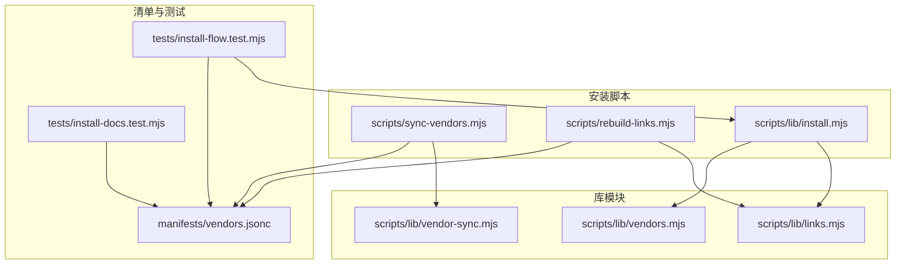
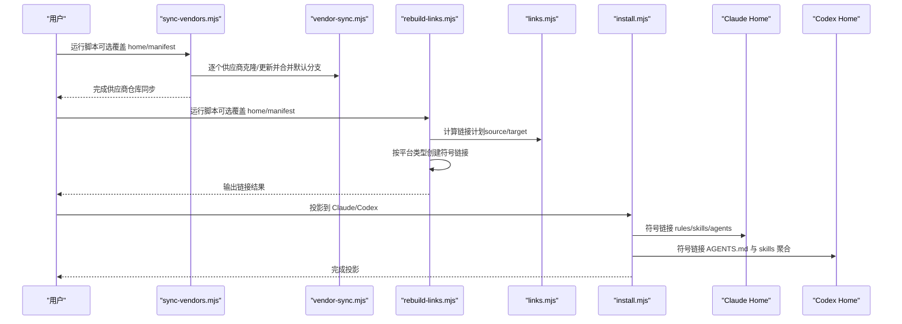
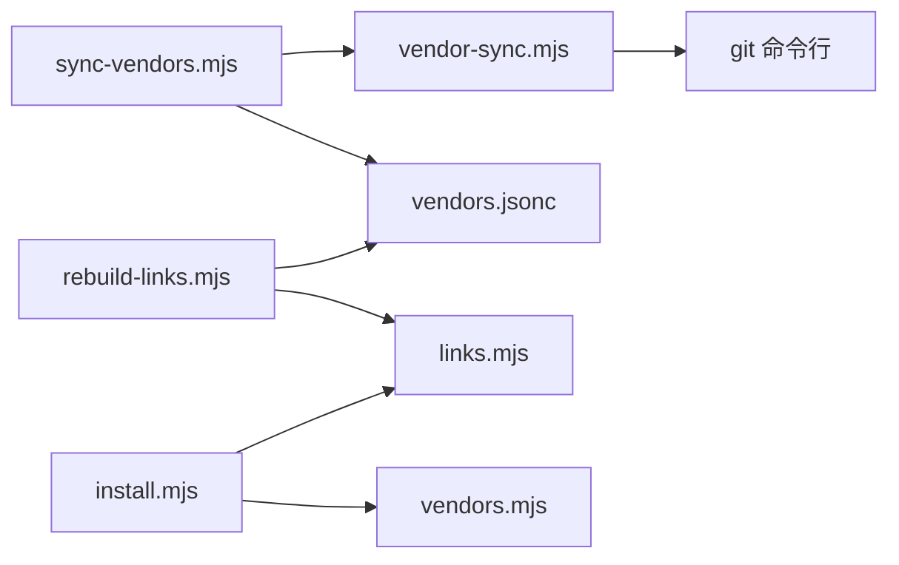

# 供应商安装流程

<cite>
**本文引用的文件**
- [scripts/lib/install.mjs](file://scripts/lib/install.mjs)
- [scripts/sync-vendors.mjs](file://scripts/sync-vendors.mjs)
- [scripts/rebuild-links.mjs](file://scripts/rebuild-links.mjs)
- [scripts/lib/vendors.mjs](file://scripts/lib/vendors.mjs)
- [scripts/lib/vendor-sync.mjs](file://scripts/lib/vendor-sync.mjs)
- [scripts/lib/links.mjs](file://scripts/lib/links.mjs)
- [manifests/vendors.jsonc](file://manifests/vendors.jsonc)
- [tests/install-flow.test.mjs](file://tests/install-flow.test.mjs)
- [tests/install-docs.test.mjs](file://tests/install-docs.test.mjs)
- [README.md](file://README.md)
- [package.json](file://package.json)
</cite>

## 目录
1. [简介](#简介)
2. [项目结构](#项目结构)
3. [核心组件](#核心组件)
4. [架构总览](#架构总览)
5. [详细组件分析](#详细组件分析)
6. [依赖关系分析](#依赖关系分析)
7. [性能考虑](#性能考虑)
8. [故障排查指南](#故障排查指南)
9. [结论](#结论)
10. [附录](#附录)

## 简介
本文件面向供应商（第三方技能）的安装与集成流程，基于仓库内的脚本与清单，提供从准备到验证的完整操作指南。安装目标是将第一方与第三方技能统一聚合到用户主目录下的统一工作区，并分别投影到 Claude 与 Codex 的读取位置，确保两类客户端能够一致地访问规则、技能与代理资源。

## 项目结构
围绕供应商安装的关键文件与职责如下：
- 安装与投影逻辑：scripts/lib/install.mjs
- 供应商仓库同步：scripts/sync-vendors.mjs 与 scripts/lib/vendor-sync.mjs
- 软链接重建：scripts/rebuild-links.mjs 与 scripts/lib/links.mjs
- 清单解析与路径工具：scripts/lib/vendors.mjs
- 供应商清单：manifests/vendors.jsonc
- 流程与文档测试：tests/install-flow.test.mjs、tests/install-docs.test.mjs
- 顶层说明与脚本定义：README.md、package.json

图表来源
- [scripts/sync-vendors.mjs:1-62](file://scripts/sync-vendors.mjs#L1-L62)
- [scripts/rebuild-links.mjs:1-74](file://scripts/rebuild-links.mjs#L1-L74)
- [scripts/lib/install.mjs:1-105](file://scripts/lib/install.mjs#L1-L105)
- [scripts/lib/vendor-sync.mjs:1-78](file://scripts/lib/vendor-sync.mjs#L1-L78)
- [scripts/lib/links.mjs:1-23](file://scripts/lib/links.mjs#L1-L23)
- [scripts/lib/vendors.mjs:1-75](file://scripts/lib/vendors.mjs#L1-L75)
- [manifests/vendors.jsonc:1-107](file://manifests/vendors.jsonc#L1-L107)
- [tests/install-flow.test.mjs:1-101](file://tests/install-flow.test.mjs#L1-L101)
- [tests/install-docs.test.mjs:1-14](file://tests/install-docs.test.mjs#L1-L14)

章节来源
- [README.md:1-50](file://README.md#L1-L50)
- [package.json:1-11](file://package.json#L1-L11)

## 核心组件
- 安装路径与根目录准备
  - 默认安装路径包含用户主目录、统一工作区（~/.moluoxixi）、以及 Claude/Codex 投影目录。
  - 确保安装根目录存在，包括 vendors 子目录。
- 同步供应商仓库
  - 读取供应商清单，克隆或更新各供应商仓库到统一 vendors 目录下，并切换至默认分支，执行快进合并。
- 构建软链接计划并重建链接
  - 基于清单中的链接规则，计算每个目标的软链接来源，按平台选择 junction/dir 类型进行重建。
- 投影到 Claude 与 Codex
  - 将统一工作区中的 rules、skills、agents 等内容分别以符号链接方式投影到 Claude 与 Codex 的读取位置；同时为 Codex 的 agent skills 创建专用聚合目录。

章节来源
- [scripts/lib/install.mjs:40-105](file://scripts/lib/install.mjs#L40-L105)
- [scripts/sync-vendors.mjs:46-61](file://scripts/sync-vendors.mjs#L46-L61)
- [scripts/lib/vendor-sync.mjs:58-77](file://scripts/lib/vendor-sync.mjs#L58-L77)
- [scripts/lib/links.mjs:5-22](file://scripts/lib/links.mjs#L5-L22)
- [scripts/rebuild-links.mjs:50-71](file://scripts/rebuild-links.mjs#L50-L71)

## 架构总览
供应商安装的整体流程分为“准备—同步—链接—投影”四个阶段，最终形成 Claude 与 Codex 可直接读取的统一视图。

图表来源
- [scripts/sync-vendors.mjs:46-61](file://scripts/sync-vendors.mjs#L46-L61)
- [scripts/lib/vendor-sync.mjs:58-77](file://scripts/lib/vendor-sync.mjs#L58-L77)
- [scripts/rebuild-links.mjs:50-71](file://scripts/rebuild-links.mjs#L50-L71)
- [scripts/lib/links.mjs:5-22](file://scripts/lib/links.mjs#L5-L22)
- [scripts/lib/install.mjs:68-105](file://scripts/lib/install.mjs#L68-L105)

## 详细组件分析

### 1) 安装路径与根目录准备
- 功能要点
  - 计算默认安装路径（用户主目录、统一工作区、Claude/Codex 投影目录）。
  - 确保安装根目录及 vendors 子目录存在。
- 关键行为
  - 若目录不存在则创建；若已存在则保持不变。
- 使用建议
  - 在首次安装时确保用户主目录具备写权限；如需自定义安装位置，可通过脚本参数覆盖。

章节来源
- [scripts/lib/install.mjs:40-60](file://scripts/lib/install.mjs#L40-L60)

### 2) 供应商仓库同步（全量安装）
- 功能要点
  - 读取供应商清单，遍历每个供应商条目，克隆或更新其仓库到统一 vendors 目录。
  - 获取远程默认分支，切换到本地默认分支并执行快进合并，保证本地与上游一致。
- 参数与选项
  - 支持覆盖安装根目录与清单路径的命令行参数。
- 行为特征
  - 使用 git 子进程执行命令，失败时抛出错误并包含退出码与标准错误信息。
- 使用场景
  - 新环境首次安装或需要强制刷新所有供应商仓库时使用。

章节来源
- [scripts/sync-vendors.mjs:21-59](file://scripts/sync-vendors.mjs#L21-L59)
- [scripts/lib/vendor-sync.mjs:58-77](file://scripts/lib/vendor-sync.mjs#L58-L77)

### 3) 软链接计划与重建（增量安装）
- 功能要点
  - 基于供应商清单与 home 目录，计算每个链接目标的来源路径，生成排序后的链接计划。
  - 对每个计划项，若源存在则创建父目录、删除旧目标、按平台类型创建符号链接。
- 参数与选项
  - 支持覆盖 home 与 manifest 的命令行参数。
- 行为特征
  - 跳过缺失的源路径并输出跳过提示；成功后输出链接日志。
- 使用场景
  - 已完成全量安装后，仅需更新或修复个别技能链接时使用。

章节来源
- [scripts/lib/links.mjs:5-22](file://scripts/lib/links.mjs#L5-L22)
- [scripts/rebuild-links.mjs:21-71](file://scripts/rebuild-links.mjs#L21-L71)

### 4) 投影到 Claude 与 Codex
- 功能要点
  - 将统一工作区中的 rules、skills、agents 等内容以符号链接方式投影到 Claude 的读取位置。
  - 为 Codex 创建 AGENTS.md 文件与 skills 聚合目录，并将 vendor 的 skills 聚合到 Codex 的 agent skills 目录。
- 平台差异
  - Windows 使用 junction，类 Unix 使用 dir 类型符号链接。
- 使用场景
  - 完成仓库同步与链接重建后，将内容暴露给具体客户端使用。

章节来源
- [scripts/lib/install.mjs:68-105](file://scripts/lib/install.mjs#L68-L105)

### 5) 供应商清单与链接规则
- 功能要点
  - 清单描述每个供应商的仓库地址、克隆目录、以及将源目录映射到统一 skills 目录的链接规则。
  - 支持多供应商、多链接规则，形成统一的技能命名空间。
- 解析能力
  - 支持 JSONC 注释与尾随逗号，便于人类可读的配置管理。
- 使用建议
  - 修改清单后，需重新执行链接重建步骤以应用变更。

章节来源
- [manifests/vendors.jsonc:1-107](file://manifests/vendors.jsonc#L1-L107)
- [scripts/lib/vendors.mjs:64-75](file://scripts/lib/vendors.mjs#L64-L75)

### 6) 安装流程测试与文档一致性
- 功能要点
  - 测试用例验证安装流程：将第一方内容与聚合技能投影到 Claude 与 Codex 的 home 目录。
  - 测试用例验证安装文档中提及的“以 superpowers 为基础”的流程与 ~/.moluoxixi 布局。
- 使用建议
  - 在修改安装逻辑或清单后运行测试，确保流程正确性与文档一致性。

章节来源
- [tests/install-flow.test.mjs:55-100](file://tests/install-flow.test.mjs#L55-L100)
- [tests/install-docs.test.mjs:5-13](file://tests/install-docs.test.mjs#L5-L13)

## 依赖关系分析
- 组件耦合
  - 安装脚本依赖链接与清单解析模块；同步脚本依赖供应商同步模块；链接脚本依赖链接与清单模块。
- 外部依赖
  - 依赖 Node.js 文件系统与子进程模块；依赖 git 命令行工具用于仓库同步。
- 可能的循环依赖
  - 当前模块间为单向依赖，无明显循环。

图表来源
- [scripts/sync-vendors.mjs:6-7](file://scripts/sync-vendors.mjs#L6-L7)
- [scripts/lib/vendor-sync.mjs:3](file://scripts/lib/vendor-sync.mjs#L3)
- [scripts/rebuild-links.mjs:6-7](file://scripts/rebuild-links.mjs#L6-L7)
- [scripts/lib/links.mjs:3](file://scripts/lib/links.mjs#L3)
- [scripts/lib/install.mjs:14-15](file://scripts/lib/install.mjs#L14-L15)
- [scripts/lib/vendors.mjs:1-2](file://scripts/lib/vendors.mjs#L1-L2)

章节来源
- [scripts/lib/vendor-sync.mjs:1-19](file://scripts/lib/vendor-sync.mjs#L1-L19)
- [scripts/lib/links.mjs:1-4](file://scripts/lib/links.mjs#L1-L4)
- [scripts/lib/vendors.mjs:1-6](file://scripts/lib/vendors.mjs#L1-L6)

## 性能考虑
- 仓库同步
  - 首次克隆可能耗时较长，后续更新通常较快；建议在网络稳定时执行。
- 链接重建
  - 链接数量较多时，重建时间主要取决于文件系统性能；可分批执行或仅针对受影响的供应商。
- 投影阶段
  - 符号链接创建开销极低，主要受磁盘 I/O 影响。

## 故障排查指南
- 网络连接问题
  - 现象：供应商仓库克隆或 fetch 失败。
  - 排查：确认网络可达与代理设置；检查 git 凭据配置。
  - 处理：重试同步脚本；必要时手动克隆仓库并调整清单中的 cloneDir。
- 磁盘空间不足
  - 现象：克隆或更新失败，提示空间不足。
  - 排查：检查安装根目录所在分区剩余空间。
  - 处理：清理空间或更换更大的安装位置。
- 权限不足
  - 现象：无法创建目录、写入文件或创建符号链接。
  - 排查：确认用户对安装根目录具有读写权限；Windows 上检查是否以管理员身份运行。
  - 处理：提升权限或更换到有权限的目录。
- 软链接失败
  - 现象：链接重建阶段报错或链接无效。
  - 排查：确认源路径存在且可访问；检查平台类型（Windows 使用 junction）。
  - 处理：修正清单中的 source/target；重新执行链接重建。
- 客户端未识别内容
  - 现象：Claude 或 Codex 无法读取规则/技能。
  - 排查：确认投影目录已正确创建；检查符号链接是否指向有效路径。
  - 处理：重新执行安装脚本的投影步骤；验证清单中的链接规则。

章节来源
- [scripts/lib/vendor-sync.mjs:13-18](file://scripts/lib/vendor-sync.mjs#L13-L18)
- [scripts/rebuild-links.mjs:60-70](file://scripts/rebuild-links.mjs#L60-L70)
- [scripts/lib/install.mjs:68-105](file://scripts/lib/install.mjs#L68-L105)

## 结论
该安装体系通过“统一仓库—统一链接—统一投影”的设计，实现了对第一方与第三方技能的集中管理与跨客户端共享。首次安装推荐使用全量安装流程，后续维护可采用增量链接重建流程，以最小成本维持内容一致性与可用性。

## 附录

### A. 安装前准备工作
- 环境要求
  - Node.js 运行时（ES 模块支持）。
  - git 命令行工具可用。
- 依赖检查
  - 确认 Node.js 与 git 版本满足基本需求。
- 权限配置
  - 确保对安装根目录（默认 ~/.moluoxixi）具备读写权限；Windows 上必要时以管理员身份运行。

章节来源
- [package.json:5](file://package.json#L5)
- [README.md:15-49](file://README.md#L15-L49)

### B. 安装脚本执行流程与参数
- 全量安装（供应商仓库同步）
  - 脚本：scripts/sync-vendors.mjs
  - 参数：--home <dir>、--manifest <file>、--help
  - 行为：读取清单，逐个供应商克隆/更新并合并默认分支。
- 增量安装（软链接重建）
  - 脚本：scripts/rebuild-links.mjs
  - 参数：--home <dir>、--manifest <file>、--help
  - 行为：根据清单生成链接计划并重建符号链接。
- 投影到客户端
  - 脚本：scripts/lib/install.mjs（内部函数）
  - 行为：将统一工作区内容投影到 Claude 与 Codex 的读取位置。

章节来源
- [scripts/sync-vendors.mjs:9-44](file://scripts/sync-vendors.mjs#L9-L44)
- [scripts/rebuild-links.mjs:9-48](file://scripts/rebuild-links.mjs#L9-L48)
- [scripts/lib/install.mjs:68-105](file://scripts/lib/install.mjs#L68-L105)

### C. 增量安装与全量安装的区别与使用场景
- 全量安装
  - 适用：新环境首次部署、需要强制刷新所有供应商仓库。
  - 步骤：同步供应商仓库 → 重建链接 → 投影到客户端。
- 增量安装
  - 适用：已部署环境的日常维护、修复个别链接。
  - 步骤：仅重建链接 → 投影到客户端（如需）。

章节来源
- [scripts/sync-vendors.mjs:46-61](file://scripts/sync-vendors.mjs#L46-L61)
- [scripts/rebuild-links.mjs:50-71](file://scripts/rebuild-links.mjs#L50-L71)

### D. 安装验证与故障诊断
- 验证清单
  - 确认清单中各供应商的 repo、cloneDir、links 字段完整且路径有效。
- 验证链接
  - 检查生成的链接计划与实际文件是否存在；Windows 使用 junction，类 Unix 使用 dir 类型。
- 验证投影
  - 确认 Claude 与 Codex 的读取目录存在并包含预期内容。
- 诊断工具
  - 查看脚本输出与错误信息；必要时手动执行 git 命令验证仓库状态。

章节来源
- [tests/install-flow.test.mjs:55-100](file://tests/install-flow.test.mjs#L55-L100)
- [tests/install-docs.test.mjs:5-13](file://tests/install-docs.test.mjs#L5-L13)