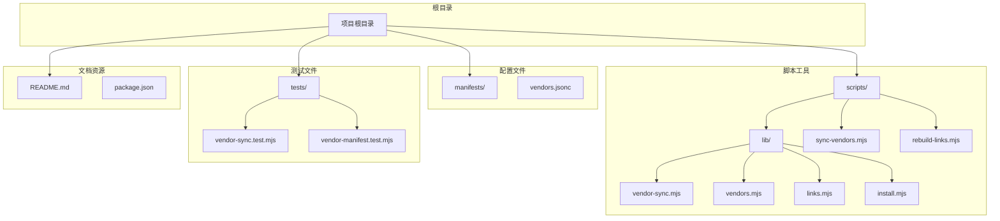
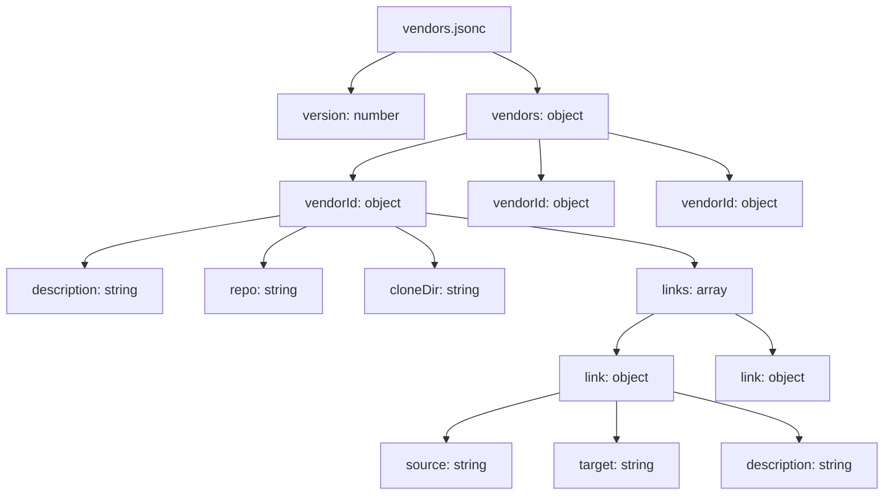
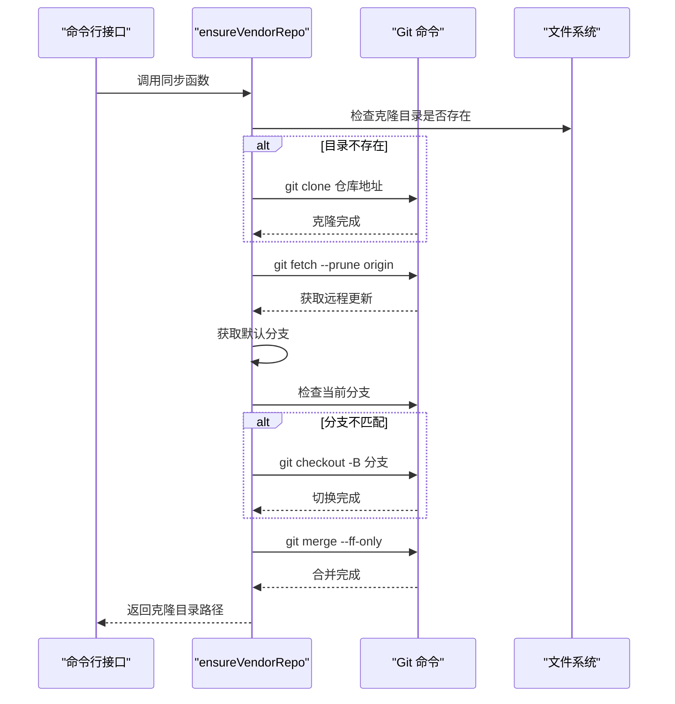
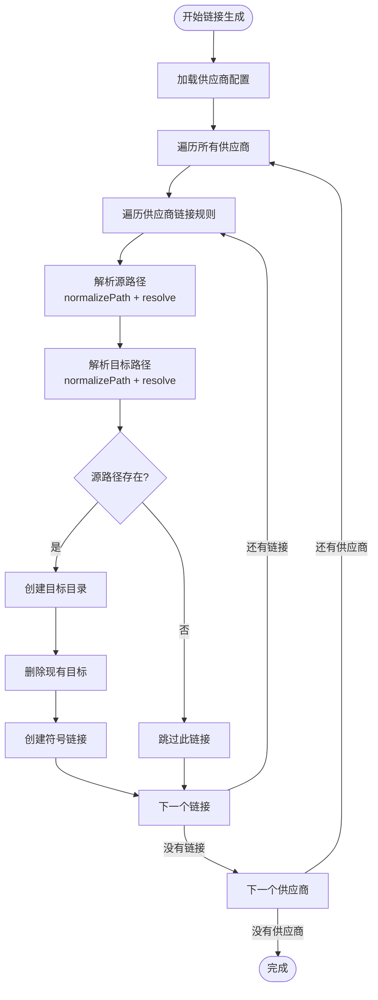
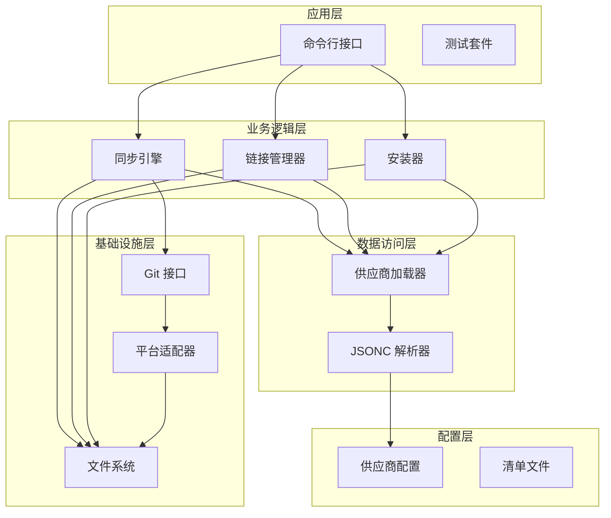
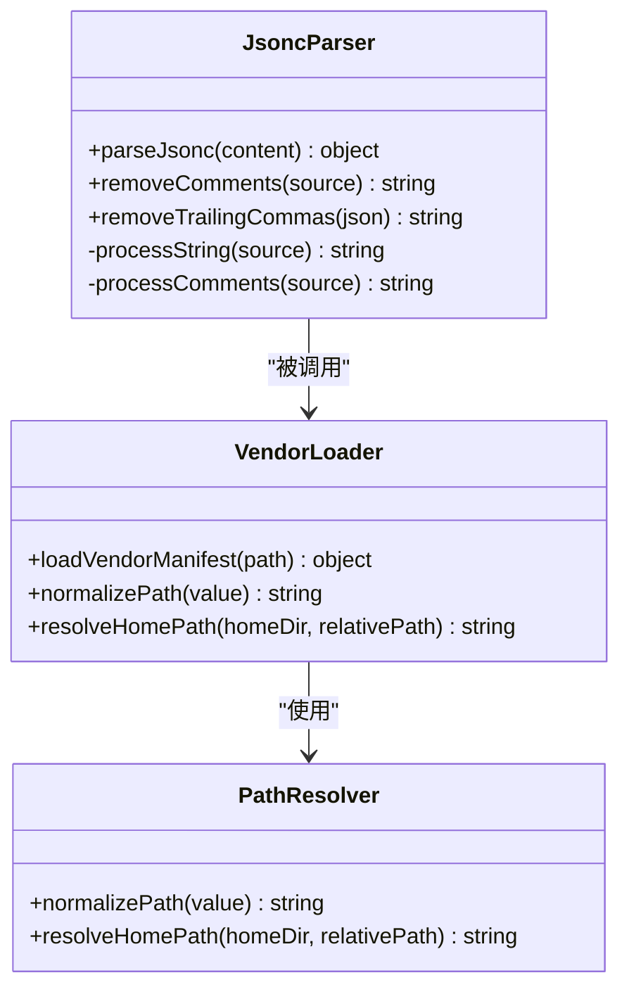
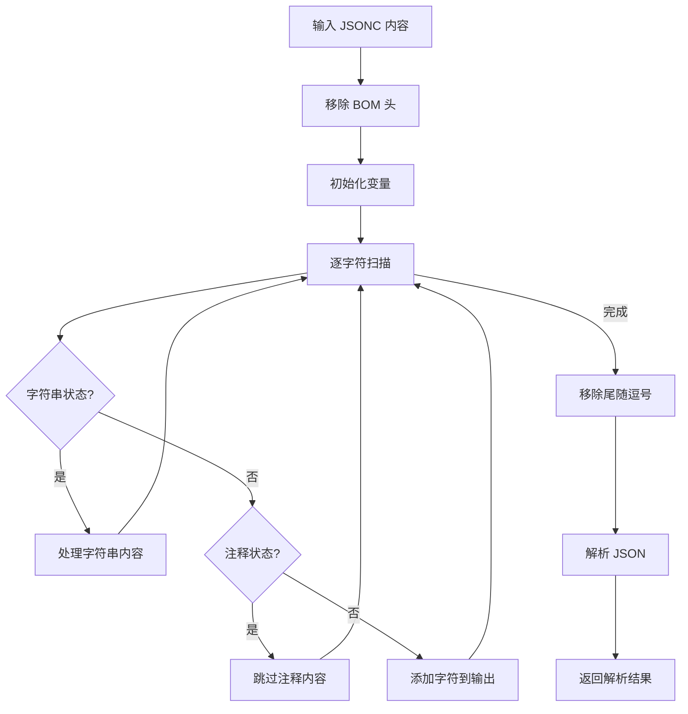
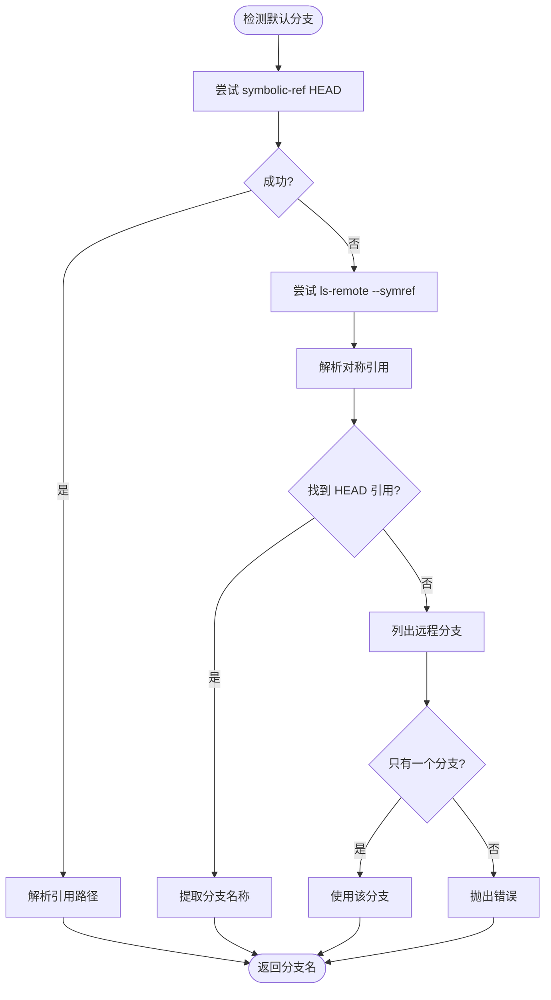
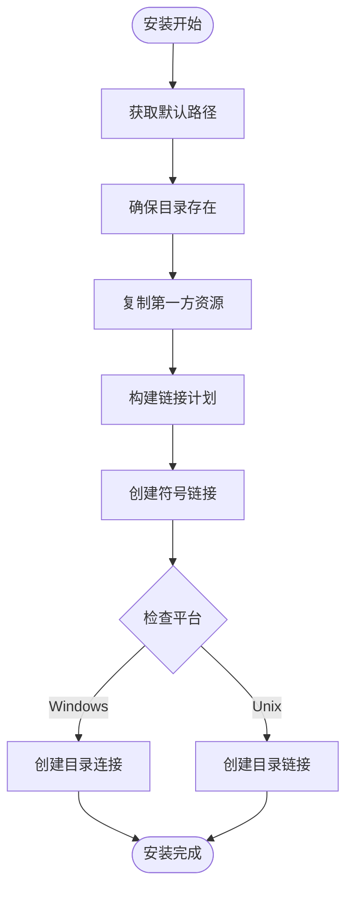
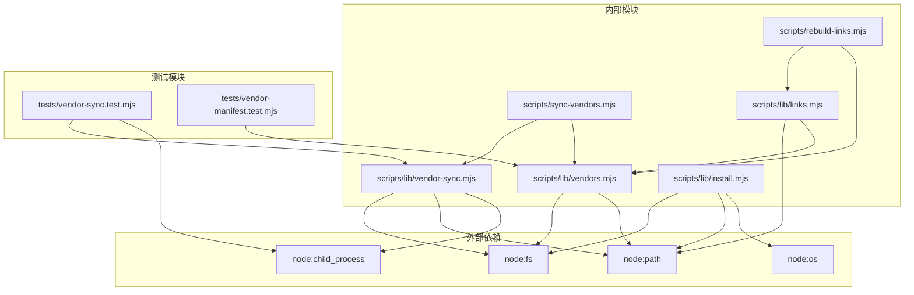

# 供应商管理系统

<cite>
**本文档引用的文件**
- [vendors.jsonc](file://manifests/vendors.jsonc)
- [sync-vendors.mjs](file://scripts/sync-vendors.mjs)
- [vendor-sync.mjs](file://scripts/lib/vendor-sync.mjs)
- [vendors.mjs](file://scripts/lib/vendors.mjs)
- [links.mjs](file://scripts/lib/links.mjs)
- [install.mjs](file://scripts/lib/install.mjs)
- [rebuild-links.mjs](file://scripts/rebuild-links.mjs)
- [vendor-sync.test.mjs](file://tests/vendor-sync.test.mjs)
- [vendor-manifest.test.mjs](file://tests/vendor-manifest.test.mjs)
- [README.md](file://README.md)
- [package.json](file://package.json)
</cite>

## 目录
1. [简介](#简介)
2. [项目结构](#项目结构)
3. [核心组件](#核心组件)
4. [架构概览](#架构概览)
5. [详细组件分析](#详细组件分析)
6. [依赖关系分析](#依赖关系分析)
7. [性能考虑](#性能考虑)
8. [故障排除指南](#故障排除指南)
9. [结论](#结论)
10. [附录](#附录)

## 简介

供应商管理系统是一个基于 Node.js 的工具集，用于管理和同步第三方技能（skills）资源。该系统的核心目标是将来自多个 Git 仓库的技能资源统一管理，并通过符号链接的方式暴露给不同的客户端（Claude 和 Codex）使用。

系统采用分层架构设计：
- **供应商配置层**：通过 JSONC 格式的配置文件定义供应商信息
- **同步执行层**：负责克隆、更新和分支管理
- **链接管理层**：将供应商资源映射到统一的访问路径
- **安装部署层**：将资源投影到不同客户端的期望目录结构

## 项目结构

项目采用模块化的文件组织方式，主要包含以下目录结构：



**图表来源**
- [README.md:1-50](file://README.md#L1-L50)
- [package.json:1-11](file://package.json#L1-L11)

**章节来源**
- [README.md:1-50](file://README.md#L1-L50)
- [package.json:1-11](file://package.json#L1-L11)

## 核心组件

### 供应商配置系统

供应商配置系统通过 `vendors.jsonc` 文件定义所有外部技能源的信息。JSONC 格式允许使用 C 风格注释，提高了配置文件的可读性。

#### 配置文件结构

配置文件采用层次化的结构设计：



**图表来源**
- [vendors.jsonc:1-107](file://manifests/vendors.jsonc#L1-L107)

#### 配置参数详解

每个供应商配置包含以下关键参数：

| 参数名 | 类型 | 必需 | 描述 | 示例 |
|--------|------|------|------|------|
| `description` | string | 否 | 供应商描述信息 | "底层工作流基线" |
| `repo` | string | 是 | Git 仓库地址 | "https://github.com/obra/superpowers.git" |
| `cloneDir` | string | 是 | 本地克隆目录相对路径 | "vendors/superpowers" |
| `links` | array | 是 | 路径映射规则数组 | [{source, target, description}] |

**章节来源**
- [vendors.jsonc:1-107](file://manifests/vendors.jsonc#L1-L107)

### 同步执行引擎

同步执行引擎负责处理供应商仓库的实际克隆、更新和分支管理操作。

#### 核心同步流程



**图表来源**
- [vendor-sync.mjs:58-77](file://scripts/lib/vendor-sync.mjs#L58-L77)

**章节来源**
- [vendor-sync.mjs:1-78](file://scripts/lib/vendor-sync.mjs#L1-L78)

### 链接管理器

链接管理器负责将供应商资源映射到统一的访问路径，支持跨平台的符号链接创建。

#### 链接生成算法



**图表来源**
- [links.mjs:5-22](file://scripts/lib/links.mjs#L5-L22)

**章节来源**
- [links.mjs:1-23](file://scripts/lib/links.mjs#L1-L23)

## 架构概览

系统采用分层架构设计，各层职责明确，耦合度低，便于维护和扩展。



**图表来源**
- [sync-vendors.mjs:46-59](file://scripts/sync-vendors.mjs#L46-L59)
- [rebuild-links.mjs:50-71](file://scripts/rebuild-links.mjs#L50-L71)
- [install.mjs:68-83](file://scripts/lib/install.mjs#L68-L83)

**章节来源**
- [sync-vendors.mjs:1-62](file://scripts/sync-vendors.mjs#L1-L62)
- [rebuild-links.mjs:1-74](file://scripts/rebuild-links.mjs#L1-L74)
- [install.mjs:1-105](file://scripts/lib/install.mjs#L1-L105)

## 详细组件分析

### 供应商配置加载器

供应商配置加载器负责解析 JSONC 格式的配置文件，支持注释和尾随逗号等特性。

#### JSONC 解析器实现



**图表来源**
- [vendors.mjs:8-66](file://scripts/lib/vendors.mjs#L8-L66)
- [vendors.mjs:68-75](file://scripts/lib/vendors.mjs#L68-L75)

#### 解析流程



**图表来源**
- [vendors.mjs:8-62](file://scripts/lib/vendors.mjs#L8-L62)

**章节来源**
- [vendors.mjs:1-75](file://scripts/lib/vendors.mjs#L1-L75)

### 同步引擎核心功能

同步引擎实现了完整的 Git 仓库管理功能，包括克隆、更新、分支切换和合并。

#### 默认分支检测机制



**图表来源**
- [vendor-sync.mjs:21-52](file://scripts/lib/vendor-sync.mjs#L21-L52)

#### 错误处理策略

同步引擎采用严格的错误处理机制：

| 错误类型 | 处理方式 | 影响范围 |
|----------|----------|----------|
| Git 命令失败 | 抛出详细错误信息 | 当前供应商同步 |
| 无法确定默认分支 | 抛出格式化错误 | 整个同步过程 |
| 文件系统权限错误 | 传播原始错误 | 同步中断 |
| 网络连接失败 | 传播 Git 错误 | 供应商克隆失败 |

**章节来源**
- [vendor-sync.mjs:1-78](file://scripts/lib/vendor-sync.mjs#L1-L78)

### 安装部署系统

安装部署系统负责将统一的供应商资源投影到不同客户端的期望目录结构中。

#### 平台适配机制



**图表来源**
- [install.mjs:40-105](file://scripts/lib/install.mjs#L40-L105)

**章节来源**
- [install.mjs:1-105](file://scripts/lib/install.mjs#L1-L105)

## 依赖关系分析

系统采用模块化设计，各组件之间的依赖关系清晰明确。



**图表来源**
- [sync-vendors.mjs:6-7](file://scripts/sync-vendors.mjs#L6-L7)
- [rebuild-links.mjs:6-7](file://scripts/rebuild-links.mjs#L6-L7)
- [vendor-sync.mjs:1-3](file://scripts/lib/vendor-sync.mjs#L1-L3)

**章节来源**
- [sync-vendors.mjs:1-62](file://scripts/sync-vendors.mjs#L1-L62)
- [rebuild-links.mjs:1-74](file://scripts/rebuild-links.mjs#L1-L74)
- [vendor-sync.mjs:1-78](file://scripts/lib/vendor-sync.mjs#L1-L78)

## 性能考虑

### 同步性能优化

系统在设计时充分考虑了性能因素：

1. **并发处理**：当前实现采用串行处理供应商，可考虑引入并发控制以提高大规模供应商同步的效率
2. **增量更新**：利用 Git 的增量更新机制，避免不必要的完整克隆
3. **缓存策略**：可以考虑实现本地缓存机制，减少重复的网络请求

### 内存使用优化

- JSONC 解析器采用流式处理，避免一次性加载大文件
- 符号链接创建采用批量处理，减少文件系统操作次数

### 网络效率

- 使用 `git fetch --prune` 减少传输冗余数据
- 支持断点续传和增量同步

## 故障排除指南

### 常见问题及解决方案

#### Git 相关错误

| 错误现象 | 可能原因 | 解决方案 |
|----------|----------|----------|
| `git clone failed` | 网络连接问题 | 检查网络连接，重试同步 |
| `Permission denied` | 访问权限不足 | 检查仓库访问权限 |
| `Repository not found` | 仓库地址错误 | 验证仓库 URL 正确性 |
| `Unable to determine default branch` | 远程仓库格式异常 | 手动指定分支或检查仓库配置 |

#### 文件系统错误

| 错误现象 | 可能原因 | 解决方案 |
|----------|----------|----------|
| `EACCES: permission denied` | 目录权限不足 | 修改目标目录权限 |
| `ENOTDIR: not a directory` | 路径冲突 | 清理冲突的文件或目录 |
| `EPERM: operation not permitted` | Windows 权限限制 | 以管理员身份运行 |

#### 配置文件错误

| 错误现象 | 可能原因 | 解决方案 |
|----------|----------|----------|
| `SyntaxError: Unexpected token` | JSONC 语法错误 | 检查注释和逗号使用 |
| `Missing required field` | 配置字段缺失 | 补充必需的配置项 |
| `Invalid path format` | 路径格式错误 | 使用正斜杠分隔符 |

**章节来源**
- [vendor-sync.test.mjs:24-71](file://tests/vendor-sync.test.mjs#L24-L71)
- [vendor-manifest.test.mjs:5-12](file://tests/vendor-manifest.test.mjs#L5-L12)

### 调试技巧

1. **启用详细日志**：在同步脚本中添加调试输出
2. **手动验证 Git 操作**：直接在命令行执行相同的 Git 命令
3. **检查中间状态**：验证克隆目录的 Git 状态
4. **隔离测试**：为单个供应商创建独立的测试环境

## 结论

供应商管理系统通过精心设计的架构和实现，成功解决了多来源技能资源的统一管理问题。系统的主要优势包括：

1. **模块化设计**：清晰的分层架构便于维护和扩展
2. **跨平台兼容**：完善的平台适配机制确保在不同操作系统上正常运行
3. **健壮的错误处理**：全面的错误检测和处理机制
4. **灵活的配置系统**：支持复杂的路径映射和供应商管理需求

该系统为个人 AI 开发工作流提供了坚实的基础，能够有效管理来自多个 Git 仓库的技能资源，并通过统一的接口暴露给不同的客户端使用。

## 附录

### 新增供应商完整指南

#### 步骤 1：编辑配置文件

在 `manifests/vendors.jsonc` 中添加新的供应商条目：

```jsonc
{
  "version": 1,
  "vendors": {
    "newVendor": {
      "description": "新供应商描述",
      "repo": "https://github.com/user/repo.git",
      "cloneDir": "vendors/new-vendor",
      "links": [
        {
          "source": "skills/source-path",
          "target": "skills/target-path",
          "description": "路径映射说明"
        }
      ]
    }
  }
}
```

#### 步骤 2：执行同步

```bash
node scripts/sync-vendors.mjs
```

#### 步骤 3：重建链接

```bash
node scripts/rebuild-links.mjs
```

#### 最佳实践

1. **路径规范**：始终使用正斜杠作为路径分隔符
2. **版本控制**：为配置文件变更建立版本控制
3. **测试验证**：新增供应商后进行功能测试
4. **文档记录**：为新供应商添加详细的使用说明

### 跨平台兼容性说明

系统支持以下操作系统：

- **Windows**：使用目录连接（junction）替代符号链接
- **macOS/Linux**：使用标准符号链接
- **自动检测**：根据 `process.platform` 自动选择合适的链接类型

**章节来源**
- [rebuild-links.mjs:46-48](file://scripts/rebuild-links.mjs#L46-L48)
- [install.mjs:36-38](file://scripts/lib/install.mjs#L36-L38)