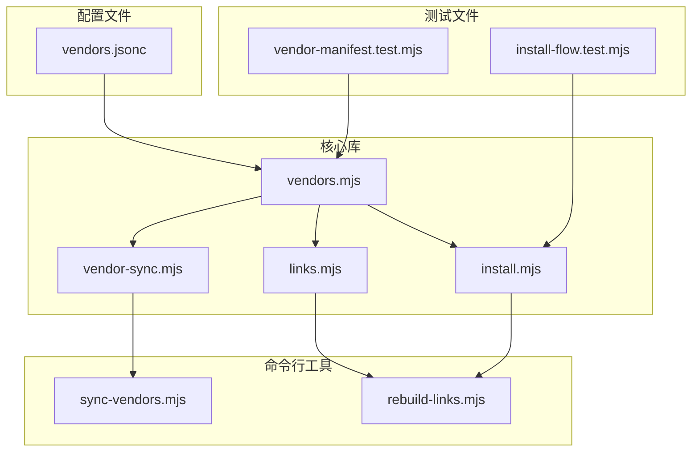
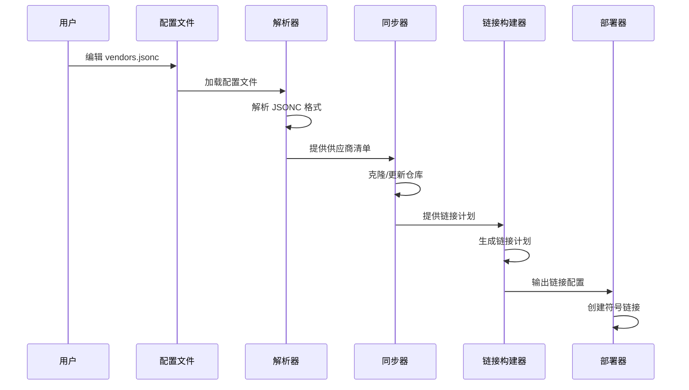
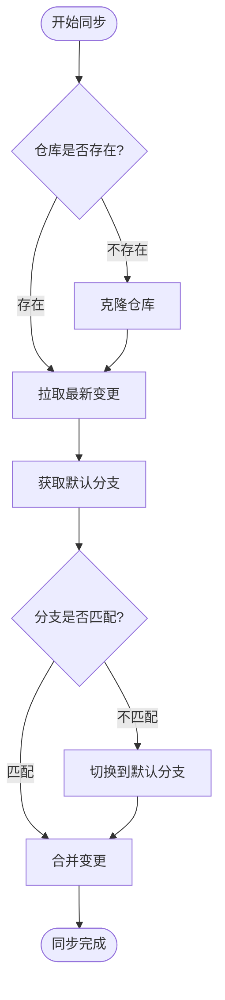
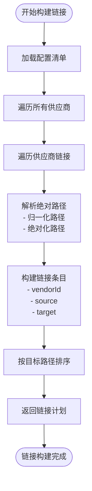
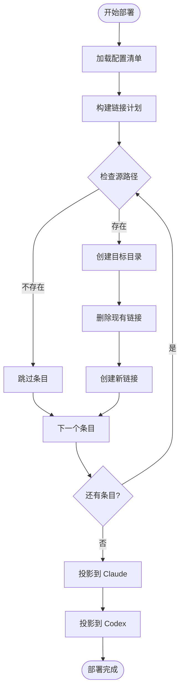
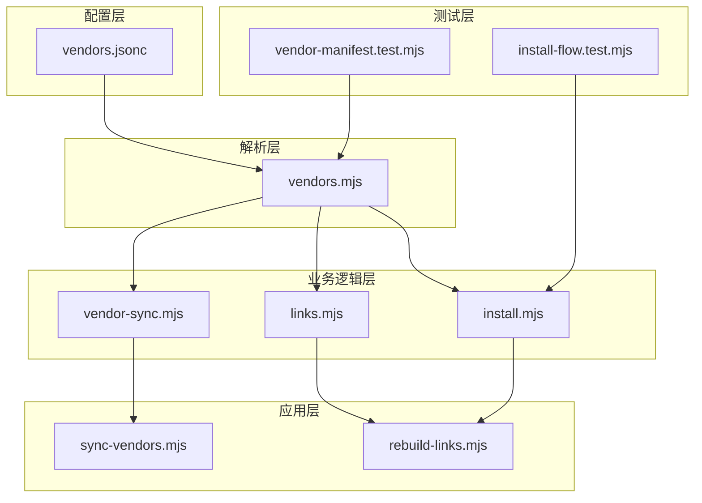

# 供应商配置管理

<cite>
**本文档引用的文件**
- [manifests/vendors.jsonc](file://manifests/vendors.jsonc)
- [scripts/lib/vendors.mjs](file://scripts/lib/vendors.mjs)
- [scripts/lib/links.mjs](file://scripts/lib/links.mjs)
- [scripts/lib/vendor-sync.mjs](file://scripts/lib/vendor-sync.mjs)
- [scripts/lib/install.mjs](file://scripts/lib/install.mjs)
- [scripts/sync-vendors.mjs](file://scripts/sync-vendors.mjs)
- [scripts/rebuild-links.mjs](file://scripts/rebuild-links.mjs)
- [tests/vendor-manifest.test.mjs](file://tests/vendor-manifest.test.mjs)
- [tests/install-flow.test.mjs](file://tests/install-flow.test.mjs)
</cite>

## 目录
1. [简介](#简介)
2. [项目结构](#项目结构)
3. [核心组件](#核心组件)
4. [架构概览](#架构概览)
5. [详细组件分析](#详细组件分析)
6. [依赖关系分析](#依赖关系分析)
7. [性能考虑](#性能考虑)
8. [故障排除指南](#故障排除指南)
9. [结论](#结论)

## 简介

供应商配置管理系统是一个用于管理第三方技能来源的自动化工具集。该系统通过 `vendors.jsonc` 配置文件定义供应商信息，实现对多个 GitHub 仓库的统一管理和链接映射。系统的核心目标是将来自不同供应商的技能内容聚合到统一的目录结构中，并为 Claude 和 Codex 平台提供标准化的访问接口。

该系统采用模块化设计，包含配置解析、仓库同步、链接构建和部署等功能模块，确保供应商配置的正确性和可维护性。

## 项目结构

项目采用功能模块化的组织方式，主要分为以下几部分：



**图表来源**
- [manifests/vendors.jsonc:1-107](file://manifests/vendors.jsonc#L1-L107)
- [scripts/lib/vendors.mjs:1-75](file://scripts/lib/vendors.mjs#L1-L75)
- [scripts/lib/links.mjs:1-23](file://scripts/lib/links.mjs#L1-L23)

**章节来源**
- [manifests/vendors.jsonc:1-107](file://manifests/vendors.jsonc#L1-L107)
- [scripts/lib/vendors.mjs:1-75](file://scripts/lib/vendors.mjs#L1-L75)

## 核心组件

### 配置文件结构

`vendors.jsonc` 文件采用 JSONC（JSON with Comments）格式，支持单行和多行注释。文件结构包含两个主要部分：

#### 版本字段
- **字段名**: `version`
- **类型**: 数字
- **作用**: 指定配置文件的版本号，用于向后兼容性检查
- **当前值**: 1

#### 供应商对象定义
每个供应商由一个唯一的标识符作为键，包含以下必需字段：

- **description**: 供应商的描述信息
- **repo**: Git 仓库的 URL 地址
- **cloneDir**: 本地克隆目录的相对路径
- **links**: 链接配置数组

**章节来源**
- [manifests/vendors.jsonc:4-106](file://manifests/vendors.jsonc#L4-L106)

### 链接配置数组格式

链接配置数组中的每个条目包含三个必需字段：

#### source 字段
- **类型**: 字符串
- **作用**: 指定从供应商仓库中要链接的源路径
- **路径约定**: 相对于 `cloneDir` 的路径
- **示例**: `"skills/frontend-design"`

#### target 字段
- **类型**: 字符串
- **作用**: 指定在用户主目录中创建链接的目标路径
- **路径约定**: 相对于用户主目录的绝对路径
- **示例**: `"skills/frontend-design"`

#### description 字段
- **类型**: 字符串
- **作用**: 描述链接的目的和用途
- **用途**: 帮助用户理解链接配置的意义

**章节来源**
- [manifests/vendors.jsonc:10-16](file://manifests/vendors.jsonc#L10-L16)
- [manifests/vendors.jsonc:22-33](file://manifests/vendors.jsonc#L22-L33)
- [manifests/vendors.jsonc:39-50](file://manifests/vendors.jsonc#L39-L50)

## 架构概览

系统采用分层架构设计，从配置文件到最终部署的完整流程如下：



**图表来源**
- [scripts/sync-vendors.mjs:46-59](file://scripts/sync-vendors.mjs#L46-L59)
- [scripts/lib/vendor-sync.mjs:58-77](file://scripts/lib/vendor-sync.mjs#L58-L77)
- [scripts/lib/links.mjs:5-22](file://scripts/lib/links.mjs#L5-L22)
- [scripts/rebuild-links.mjs:50-71](file://scripts/rebuild-links.mjs#L50-L71)

## 详细组件分析

### 配置解析组件

配置解析组件负责处理 JSONC 格式的配置文件，支持注释和尾随逗号等特性。

#### 解析算法流程

```mermaid
flowchart TD
Start([开始解析]) --> RemoveBOM["移除 BOM 字符"]
RemoveBOM --> InitVars["初始化变量<br/>- inString=false<br/>- stringQuote='\"'<br/>- isEscaped=false"]
InitVars --> LoopChars["遍历字符"]
LoopChars --> CheckString{"字符串状态?"}
CheckString --> |是| HandleString["处理字符串内容<br/>- 转义字符<br/>- 字符串结束"]
CheckString --> |否| CheckComment{"注释检测"}
CheckComment --> |单行注释| SkipLine["跳过整行"]
CheckComment --> |多行注释| SkipBlock["跳过注释块"]
CheckComment --> |普通字符| AddChar["添加到输出"]
HandleString --> LoopChars
SkipLine --> LoopChars
SkipBlock --> LoopChars
AddChar --> LoopChars
LoopChars --> Done{"到达末尾?"}
Done --> |否| LoopChars
Done --> |是| RemoveTrailing["移除尾随逗号"]
RemoveTrailing --> ParseJSON["解析 JSON"]
ParseJSON --> End([返回解析结果])
```

**图表来源**
- [scripts/lib/vendors.mjs:8-62](file://scripts/lib/vendors.mjs#L8-L62)

#### 错误处理机制

解析器实现了完善的错误处理机制：
- 支持转义字符处理
- 处理单行和多行注释
- 自动移除尾随逗号
- 提供详细的错误信息

**章节来源**
- [scripts/lib/vendors.mjs:8-62](file://scripts/lib/vendors.mjs#L8-L62)

### 仓库同步组件

仓库同步组件负责管理供应商仓库的克隆、更新和分支切换。

#### 同步流程



**图表来源**
- [scripts/lib/vendor-sync.mjs:58-77](file://scripts/lib/vendor-sync.mjs#L58-L77)

#### 分支管理策略

系统采用智能分支管理策略：
- 自动检测远程默认分支
- 支持多种分支检测方法
- 提供回退机制
- 确保本地分支与远程保持同步

**章节来源**
- [scripts/lib/vendor-sync.mjs:21-52](file://scripts/lib/vendor-sync.mjs#L21-L52)

### 链接构建组件

链接构建组件负责根据配置生成符号链接计划。

#### 链接生成算法



**图表来源**
- [scripts/lib/links.mjs:5-22](file://scripts/lib/links.mjs#L5-L22)

#### 跨平台兼容性

链接构建器支持不同操作系统的符号链接类型：
- Windows: 使用 junction（目录连接）
- Unix/Linux: 使用 dir（目录符号链接）

**章节来源**
- [scripts/lib/links.mjs:46-48](file://scripts/lib/links.mjs#L46-L48)

### 部署组件

部署组件负责将聚合的技能内容部署到目标平台。

#### 部署流程



**图表来源**
- [scripts/lib/install.mjs:68-83](file://scripts/lib/install.mjs#L68-L83)
- [scripts/lib/install.mjs:85-104](file://scripts/lib/install.mjs#L85-L104)

**章节来源**
- [scripts/lib/install.mjs:68-104](file://scripts/lib/install.mjs#L68-L104)

## 依赖关系分析

系统各组件之间的依赖关系如下：



**图表来源**
- [scripts/lib/vendors.mjs:1-75](file://scripts/lib/vendors.mjs#L1-L75)
- [scripts/lib/vendor-sync.mjs:1-78](file://scripts/lib/vendor-sync.mjs#L1-L78)
- [scripts/lib/links.mjs:1-23](file://scripts/lib/links.mjs#L1-L23)
- [scripts/lib/install.mjs:1-105](file://scripts/lib/install.mjs#L1-L105)

### 关键依赖关系

1. **vendors.jsonc → vendors.mjs**: 配置文件依赖解析器
2. **vendors.mjs → vendor-sync.mjs**: 解析器依赖仓库同步功能
3. **vendors.mjs → links.mjs**: 解析器依赖链接构建功能
4. **links.mjs → rebuild-links.mjs**: 链接构建器依赖命令行工具
5. **vendor-sync.mjs → sync-vendors.mjs**: 同步器依赖命令行工具

**章节来源**
- [scripts/sync-vendors.mjs:6-7](file://scripts/sync-vendors.mjs#L6-L7)
- [scripts/rebuild-links.mjs:6-7](file://scripts/rebuild-links.mjs#L6-L7)

## 性能考虑

### 解析性能优化

配置解析器采用了高效的单次遍历算法，时间复杂度为 O(n)，其中 n 是配置文件的字符数。主要优化点包括：

- **字符级处理**: 逐字符扫描，避免额外的正则表达式开销
- **状态机设计**: 使用布尔标志跟踪字符串和注释状态
- **内存优化**: 逐步构建输出字符串，减少中间对象创建

### 同步性能优化

仓库同步器通过以下方式优化性能：

- **批量操作**: 合并 git 操作减少进程启动开销
- **智能检测**: 只在必要时执行分支切换和合并
- **并行处理**: 支持多个供应商仓库的并发同步

### 链接构建性能

链接构建器采用以下优化策略：

- **路径缓存**: 避免重复的路径解析操作
- **排序优化**: 使用原生比较函数进行高效排序
- **增量更新**: 只重建必要的链接

## 故障排除指南

### 常见配置错误

#### JSONC 解析错误
**症状**: 配置文件加载失败
**原因**: 
- 语法错误（缺少引号、括号不匹配）
- 不支持的注释格式
- 尾随逗号问题

**解决方案**:
- 使用 JSON 验证工具检查语法
- 移除不支持的注释格式
- 确保所有对象和数组正确闭合

#### 路径解析错误
**症状**: 链接创建失败或路径不正确
**原因**:
- 相对路径计算错误
- 跨平台路径分隔符问题
- 环境变量未正确展开

**解决方案**:
- 使用绝对路径避免相对路径问题
- 确保路径分隔符正确（使用 `/`）
- 验证环境变量的可用性

#### 仓库同步错误
**症状**: 无法克隆或更新仓库
**原因**:
- 网络连接问题
- Git 认证失败
- 权限不足

**解决方案**:
- 检查网络连接和代理设置
- 配置适当的 Git 凭据
- 确保有足够的磁盘空间和权限

### 调试技巧

#### 启用详细日志
使用命令行参数启用详细输出：
```bash
node scripts/sync-vendors.mjs --help
node scripts/rebuild-links.mjs --help
```

#### 验证配置
运行测试套件验证配置的正确性：
```bash
node tests/vendor-manifest.test.mjs
node tests/install-flow.test.mjs
```

#### 手动验证步骤
1. 检查配置文件语法
2. 验证仓库可达性
3. 确认路径权限
4. 测试链接创建

**章节来源**
- [scripts/sync-vendors.mjs:9-19](file://scripts/sync-vendors.mjs#L9-L19)
- [scripts/rebuild-links.mjs:9-19](file://scripts/rebuild-links.mjs#L9-L19)

## 结论

供应商配置管理系统提供了一个完整、可靠的第三方技能来源管理解决方案。系统通过清晰的配置文件结构、健壮的解析机制、智能的仓库同步和灵活的链接构建，实现了对多供应商技能内容的有效管理。

### 主要优势

1. **模块化设计**: 各组件职责明确，易于维护和扩展
2. **跨平台兼容**: 支持 Windows、macOS 和 Linux 系统
3. **智能同步**: 自动处理仓库更新和分支管理
4. **灵活配置**: 支持复杂的链接映射需求
5. **完善的测试**: 包含全面的单元测试和集成测试

### 最佳实践建议

1. **配置文件管理**: 使用版本控制管理配置文件变更
2. **路径约定**: 建立统一的路径命名约定
3. **注释规范**: 为复杂的配置添加详细说明
4. **定期同步**: 建立定期同步供应商仓库的流程
5. **监控告警**: 设置配置变更和同步失败的告警机制

该系统为个人和团队提供了强大的技能内容管理能力，通过标准化的配置和自动化流程，大大简化了多来源技能内容的集成和维护工作。