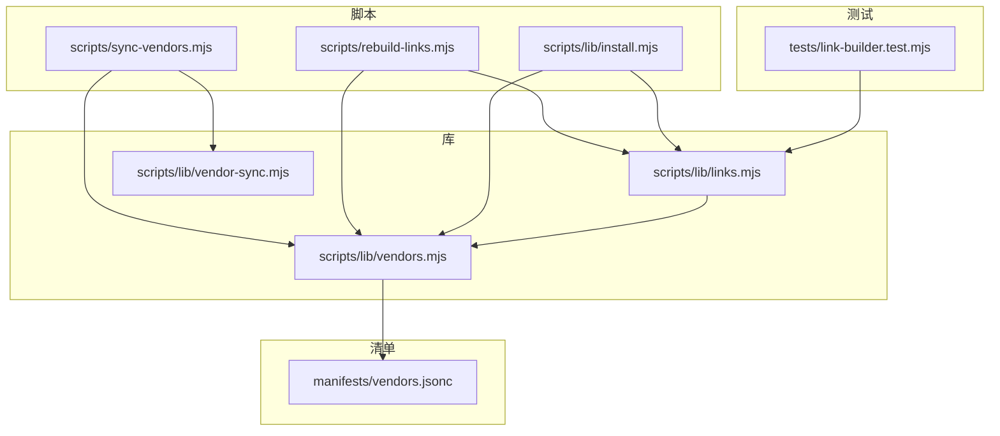
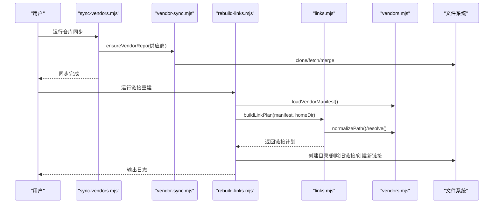
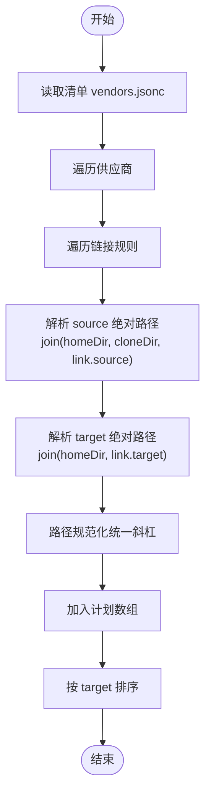
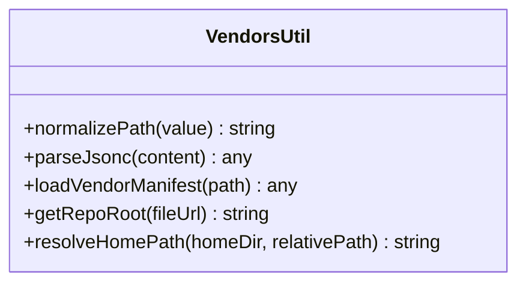
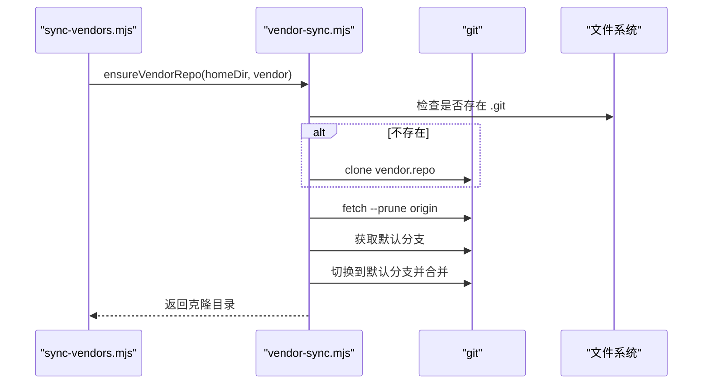
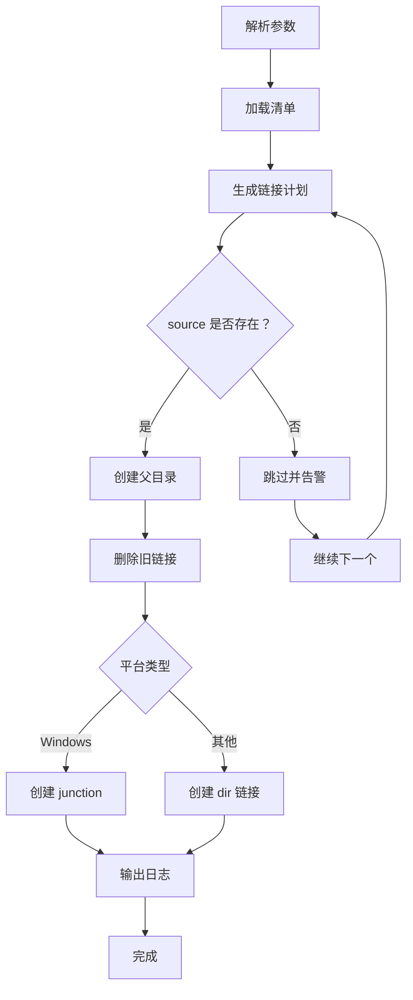
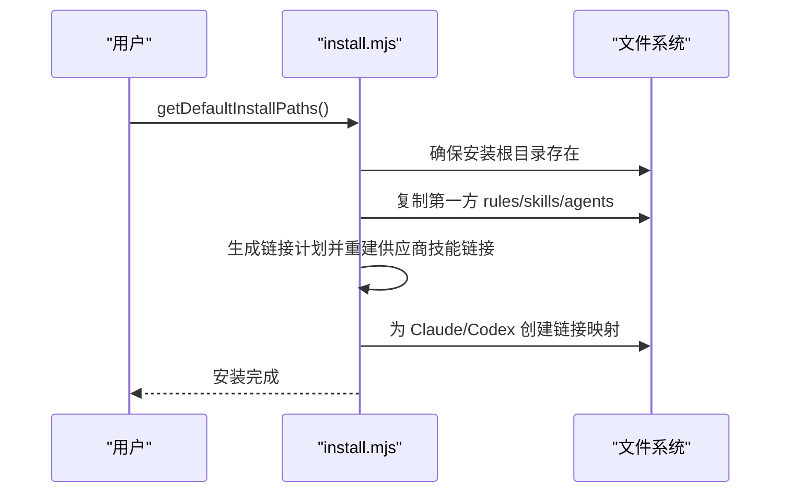
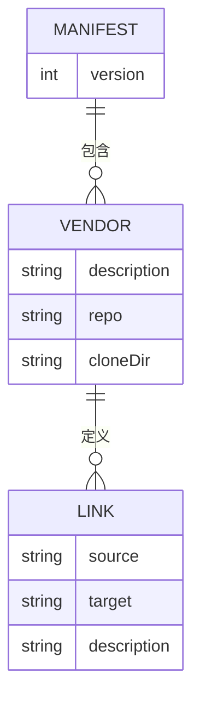
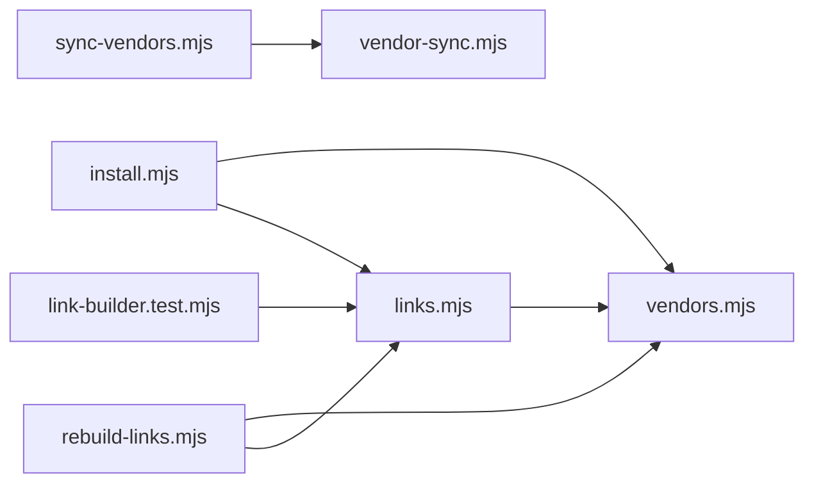

# 链接管理

<cite>
**本文引用的文件**
- [scripts/lib/links.mjs](file://scripts/lib/links.mjs)
- [scripts/rebuild-links.mjs](file://scripts/rebuild-links.mjs)
- [scripts/lib/vendors.mjs](file://scripts/lib/vendors.mjs)
- [manifests/vendors.jsonc](file://manifests/vendors.jsonc)
- [scripts/sync-vendors.mjs](file://scripts/sync-vendors.mjs)
- [scripts/lib/vendor-sync.mjs](file://scripts/lib/vendor-sync.mjs)
- [scripts/lib/install.mjs](file://scripts/lib/install.mjs)
- [tests/link-builder.test.mjs](file://tests/link-builder.test.mjs)
- [README.md](file://README.md)
- [package.json](file://package.json)
</cite>

## 目录
1. [简介](#简介)
2. [项目结构](#项目结构)
3. [核心组件](#核心组件)
4. [架构总览](#架构总览)
5. [详细组件分析](#详细组件分析)
6. [依赖关系分析](#依赖关系分析)
7. [性能考量](#性能考量)
8. [故障排查指南](#故障排查指南)
9. [结论](#结论)
10. [附录](#附录)

## 简介
本技术文档围绕链接管理系统展开，重点解释软链接与符号链接的概念及其在“供应商（vendor）管理”中的作用；深入解析 links.mjs 脚本的链接计划生成机制，以及 rebuild-links.mjs 的链接重建流程；同时覆盖跨平台兼容性处理（Windows、macOS、Linux），并提供链接冲突检测与解决方案，包括重复链接与路径冲突的处理策略。

该系统的核心目标是：
- 将多个第三方供应商仓库克隆到统一根目录下；
- 基于清单（manifest）定义的链接规则，将各供应商的特定内容映射到统一的对外暴露路径；
- 支持在不同操作系统上以最合适的链接类型（Windows 使用连接点，其他系统使用目录链接）进行链接；
- 提供一键重建链接的能力，确保外部工具（如 Claude/Codex）能够稳定读取统一的技能与规则集合。

**章节来源**
- [README.md:1-50](file://README.md#L1-L50)

## 项目结构
该项目采用“功能模块化 + 脚本驱动”的组织方式：
- scripts/lib：核心逻辑库，包含链接计划生成、供应商清单解析、仓库同步、安装与链接重建等；
- scripts：命令行脚本，用于执行仓库同步、链接重建、安装等任务；
- manifests：供应商清单（JSONC 格式），描述供应商来源、克隆目录与链接规则；
- tests：单元测试，验证链接计划生成等关键逻辑；
- README/package.json：项目说明与脚本配置。

**图表来源**
- [scripts/rebuild-links.mjs:1-74](file://scripts/rebuild-links.mjs#L1-L74)
- [scripts/sync-vendors.mjs:1-62](file://scripts/sync-vendors.mjs#L1-L62)
- [scripts/lib/links.mjs:1-23](file://scripts/lib/links.mjs#L1-L23)
- [scripts/lib/vendors.mjs:1-75](file://scripts/lib/vendors.mjs#L1-L75)
- [scripts/lib/vendor-sync.mjs:1-78](file://scripts/lib/vendor-sync.mjs#L1-L78)
- [scripts/lib/install.mjs:1-105](file://scripts/lib/install.mjs#L1-L105)
- [manifests/vendors.jsonc:1-107](file://manifests/vendors.jsonc#L1-L107)
- [tests/link-builder.test.mjs:1-36](file://tests/link-builder.test.mjs#L1-L36)

**章节来源**
- [package.json:1-11](file://package.json#L1-L11)

## 核心组件
- 链接计划生成器（links.mjs）
  - 功能：遍历供应商清单，基于每个供应商的克隆目录与链接规则，计算出最终的链接计划（source/target），并对结果按目标路径排序。
  - 关键点：使用路径规范化函数统一斜杠风格，保证跨平台一致性。
- 供应商清单解析器（vendors.mjs）
  - 功能：解析 JSONC（带注释的 JSON）为标准 JSON；提供路径规范化、仓库根路径解析、主目录路径解析等工具。
- 供应商仓库同步（vendor-sync.mjs）
  - 功能：克隆或更新供应商仓库，切换到默认分支并进行快进合并，确保本地仓库与远端一致。
- 链接重建脚本（rebuild-links.mjs）
  - 功能：加载清单、生成链接计划、逐条重建链接（自动创建父目录、删除旧链接、按平台选择链接类型）。
- 安装与链接集成（install.mjs）
  - 功能：提供完整的安装流程，包括复制第一方内容、重建供应商技能链接、将统一目录映射到 Claude/Codex 的读取位置。
- 供应商同步脚本（sync-vendors.mjs）
  - 功能：批量克隆/更新所有供应商仓库，为后续链接重建做准备。

**章节来源**
- [scripts/lib/links.mjs:1-23](file://scripts/lib/links.mjs#L1-L23)
- [scripts/lib/vendors.mjs:1-75](file://scripts/lib/vendors.mjs#L1-L75)
- [scripts/lib/vendor-sync.mjs:1-78](file://scripts/lib/vendor-sync.mjs#L1-L78)
- [scripts/rebuild-links.mjs:1-74](file://scripts/rebuild-links.mjs#L1-L74)
- [scripts/lib/install.mjs:1-105](file://scripts/lib/install.mjs#L1-L105)
- [scripts/sync-vendors.mjs:1-62](file://scripts/sync-vendors.mjs#L1-L62)

## 架构总览
系统通过“清单驱动 + 脚本编排”的方式实现链接管理：
- 清单（vendors.jsonc）定义供应商来源、克隆目录与链接规则；
- 同步脚本负责拉取/更新仓库；
- 链接计划生成器根据清单与主目录计算链接目标；
- 链接重建脚本按平台选择合适的链接类型，完成链接的创建与更新；
- 安装脚本提供更完整的安装流程，包括对 Claude/Codex 的映射。

**图表来源**
- [scripts/sync-vendors.mjs:1-62](file://scripts/sync-vendors.mjs#L1-L62)
- [scripts/lib/vendor-sync.mjs:1-78](file://scripts/lib/vendor-sync.mjs#L1-L78)
- [scripts/rebuild-links.mjs:1-74](file://scripts/rebuild-links.mjs#L1-L74)
- [scripts/lib/links.mjs:1-23](file://scripts/lib/links.mjs#L1-L23)
- [scripts/lib/vendors.mjs:1-75](file://scripts/lib/vendors.mjs#L1-L75)

## 详细组件分析

### 链接计划生成器（links.mjs）
- 输入：供应商清单对象、主目录路径
- 处理流程：
  - 遍历每个供应商及其链接规则；
  - 计算 source 与 target 的绝对路径（结合主目录与克隆目录）；
  - 将每个链接项加入计划数组；
  - 按目标路径进行本地比较排序，便于后续稳定输出。
- 输出：已排序的链接计划数组，包含 vendorId、source、target 字段。

**图表来源**
- [scripts/lib/links.mjs:5-22](file://scripts/lib/links.mjs#L5-L22)
- [scripts/lib/vendors.mjs:4-6](file://scripts/lib/vendors.mjs#L4-L6)

**章节来源**
- [scripts/lib/links.mjs:1-23](file://scripts/lib/links.mjs#L1-L23)
- [tests/link-builder.test.mjs:1-36](file://tests/link-builder.test.mjs#L1-L36)

### 供应商清单解析器（vendors.mjs）
- JSONC 解析：支持单行注释、多行注释与尾随逗号，最终转换为标准 JSON。
- 路径工具：
  - normalizePath：统一路径分隔符为正斜杠；
  - resolveHomePath：将相对路径解析为主目录下的绝对路径；
  - getRepoRoot：从模块 URL 推导仓库根路径。
- 用途：为链接计划生成与仓库同步提供基础数据与路径处理能力。

**图表来源**
- [scripts/lib/vendors.mjs:1-75](file://scripts/lib/vendors.mjs#L1-L75)

**章节来源**
- [scripts/lib/vendors.mjs:1-75](file://scripts/lib/vendors.mjs#L1-L75)

### 供应商仓库同步（vendor-sync.mjs）
- Git 操作封装：封装 git 子进程调用，处理错误返回码与输出编码；
- 默认分支确定：优先使用 symbolic-ref，回退到 ls-remote 与分支列表推断；
- 仓库状态同步：确保当前分支与默认分支一致，并进行快进合并；
- 平台适配：Windows 上使用 shell=true 以提升兼容性。

**图表来源**
- [scripts/sync-vendors.mjs:1-62](file://scripts/sync-vendors.mjs#L1-L62)
- [scripts/lib/vendor-sync.mjs:1-78](file://scripts/lib/vendor-sync.mjs#L1-L78)

**章节来源**
- [scripts/lib/vendor-sync.mjs:1-78](file://scripts/lib/vendor-sync.mjs#L1-L78)

### 链接重建脚本（rebuild-links.mjs）
- 参数解析：支持 --home、--manifest、--help；
- 平台判断：Windows 使用“junction”，其他系统使用“dir”；
- 执行流程：
  - 加载清单并生成链接计划；
  - 对每个计划项：
    - 若 source 不存在则跳过；
    - 确保 target 父目录存在；
    - 删除旧链接；
    - 创建新链接（按平台类型）；
    - 输出日志。
- 与 install.mjs 的关系：install.mjs 提供了更完整的安装流程，其中也包含“重建供应商技能链接”的函数。

**图表来源**
- [scripts/rebuild-links.mjs:1-74](file://scripts/rebuild-links.mjs#L1-L74)
- [scripts/lib/links.mjs:1-23](file://scripts/lib/links.mjs#L1-L23)
- [scripts/lib/vendors.mjs:1-75](file://scripts/lib/vendors.mjs#L1-L75)

**章节来源**
- [scripts/rebuild-links.mjs:1-74](file://scripts/rebuild-links.mjs#L1-L74)
- [scripts/lib/install.mjs:68-83](file://scripts/lib/install.mjs#L68-L83)

### 安装与链接集成（install.mjs）
- 提供默认安装路径（主目录、Claude/Codex 映射等）；
- 复制第一方内容到统一目录；
- 重建供应商技能链接；
- 将统一目录映射到 Claude 与 Codex 的读取位置；
- 平台适配：与链接重建脚本一致，按平台选择链接类型。

**图表来源**
- [scripts/lib/install.mjs:1-105](file://scripts/lib/install.mjs#L1-L105)

**章节来源**
- [scripts/lib/install.mjs:1-105](file://scripts/lib/install.mjs#L1-L105)

### 供应商清单（vendors.jsonc）
- 描述版本、供应商列表、每个供应商的仓库地址、克隆目录与链接规则；
- 链接规则包含 source（相对克隆目录的路径）、target（统一暴露路径）与描述信息；
- 该清单是链接计划生成与链接重建的唯一权威来源。

**图表来源**
- [manifests/vendors.jsonc:1-107](file://manifests/vendors.jsonc#L1-L107)

**章节来源**
- [manifests/vendors.jsonc:1-107](file://manifests/vendors.jsonc#L1-L107)

## 依赖关系分析
- links.mjs 依赖 vendors.mjs 的路径规范化与解析能力；
- rebuild-links.mjs 依赖 links.mjs 生成计划，并依赖 vendors.mjs 加载清单；
- sync-vendors.mjs 依赖 vendor-sync.mjs 进行仓库同步；
- install.mjs 同时依赖 links.mjs 与 vendors.mjs，并提供更高层的安装流程；
- 测试文件 link-builder.test.mjs 仅依赖 links.mjs，验证链接计划生成逻辑。

**图表来源**
- [scripts/lib/links.mjs:1-23](file://scripts/lib/links.mjs#L1-L23)
- [scripts/lib/vendors.mjs:1-75](file://scripts/lib/vendors.mjs#L1-L75)
- [scripts/rebuild-links.mjs:1-74](file://scripts/rebuild-links.mjs#L1-L74)
- [scripts/sync-vendors.mjs:1-62](file://scripts/sync-vendors.mjs#L1-L62)
- [scripts/lib/vendor-sync.mjs:1-78](file://scripts/lib/vendor-sync.mjs#L1-L78)
- [scripts/lib/install.mjs:1-105](file://scripts/lib/install.mjs#L1-L105)
- [tests/link-builder.test.mjs:1-36](file://tests/link-builder.test.mjs#L1-L36)

**章节来源**
- [scripts/lib/links.mjs:1-23](file://scripts/lib/links.mjs#L1-L23)
- [scripts/lib/vendors.mjs:1-75](file://scripts/lib/vendors.mjs#L1-L75)
- [scripts/rebuild-links.mjs:1-74](file://scripts/rebuild-links.mjs#L1-L74)
- [scripts/sync-vendors.mjs:1-62](file://scripts/sync-vendors.mjs#L1-L62)
- [scripts/lib/vendor-sync.mjs:1-78](file://scripts/lib/vendor-sync.mjs#L1-L78)
- [scripts/lib/install.mjs:1-105](file://scripts/lib/install.mjs#L1-L105)
- [tests/link-builder.test.mjs:1-36](file://tests/link-builder.test.mjs#L1-L36)

## 性能考量
- 链接计划生成：时间复杂度近似 O(N log N)，N 为链接总数，主要由排序决定；建议在大规模供应商场景下保持清单简洁，避免冗余链接。
- 文件系统操作：重建链接涉及多次 mkdir/rm/symlink 调用，建议在批量执行前进行预检查（例如 source 存在性），减少无效操作。
- 跨平台差异：Windows 使用 junction，其他系统使用 dir 链接，前者在权限与稳定性上更优，但需管理员权限；后者无需特殊权限，但可能受文件系统限制。
- Git 同步：仓库同步为 I/O 密集型操作，建议在网络条件允许时一次性完成，避免频繁重复 fetch/merge。

[本节为通用性能讨论，不直接分析具体文件，故无“章节来源”]

## 故障排查指南
- 链接失败（Windows 权限不足）
  - 现象：创建 junction 失败，提示权限不足；
  - 解决：以管理员身份运行命令行；或改用非管理员环境，使用非 junction 的链接类型（若可行）。
- 源路径不存在
  - 现象：链接重建脚本跳过某些链接并输出警告；
  - 解决：确认供应商仓库是否已同步成功；检查清单中的 cloneDir 与 source 路径是否正确。
- 目标路径冲突
  - 现象：多个供应商指向同一目标路径，导致链接被覆盖；
  - 解决：调整清单中任一供应商的 target，确保唯一性；或在链接重建前手动清理旧链接。
- 路径分隔符问题
  - 现象：在不同平台间出现路径不一致；
  - 解决：使用 vendors.mjs 的路径规范化函数统一斜杠；确保清单中的路径使用正斜杠或相对路径。
- Git 同步失败
  - 现象：vendor-sync 报错，无法获取默认分支或合并失败；
  - 解决：检查网络与代理设置；确认仓库可访问；必要时手动删除克隆目录后重试。

**章节来源**
- [scripts/rebuild-links.mjs:60-70](file://scripts/rebuild-links.mjs#L60-L70)
- [scripts/lib/vendor-sync.mjs:5-19](file://scripts/lib/vendor-sync.mjs#L5-L19)
- [scripts/lib/vendors.mjs:4-6](file://scripts/lib/vendors.mjs#L4-L6)

## 结论
该链接管理系统通过“清单驱动 + 脚本编排”的方式，实现了对多供应商技能与规则的统一管理与暴露。links.mjs 负责生成稳定的链接计划，rebuild-links.mjs 与 install.mjs 提供了跨平台的链接重建与安装流程。配合 vendor-sync.mjs 的仓库同步能力，系统能够在不同平台上稳定地将第一方与第三方内容整合到统一的对外路径，满足 Claude/Codex 的读取需求。通过合理的路径规范化、平台适配与冲突检测策略，系统具备良好的可维护性与扩展性。

[本节为总结性内容，不直接分析具体文件，故无“章节来源”]

## 附录

### 软链接与符号链接概念说明
- 软链接（符号链接）：在文件系统中创建一个指向目标路径的引用，跨平台通用；在 Windows 上通常称为“junction”（连接点），在类 Unix 系统上为“dir 链接”。本系统在 Windows 使用 junction，在其他系统使用 dir 链接。
- 在本系统中，链接的目标是供应商仓库内的特定子目录，源是统一主目录下的克隆目录，最终对外暴露为统一的 skills/rules/agents 目录树。

[本节为概念性说明，不直接分析具体文件，故无“章节来源”]

### 跨平台兼容性处理
- 平台判断：通过 process.platform 判断是否为 win32；
- 链接类型：Windows 使用 junction，其他系统使用 dir；
- Git 调用：Windows 上启用 shell=true 以提升兼容性；
- 路径规范化：统一使用正斜杠，避免不同平台路径分隔符差异。

**章节来源**
- [scripts/rebuild-links.mjs:46-48](file://scripts/rebuild-links.mjs#L46-L48)
- [scripts/lib/install.mjs:36-38](file://scripts/lib/install.mjs#L36-L38)
- [scripts/lib/vendor-sync.mjs:9](file://scripts/lib/vendor-sync.mjs#L9)
- [scripts/lib/vendors.mjs:4-6](file://scripts/lib/vendors.mjs#L4-L6)

### 链接冲突检测与解决方案
- 冲突类型：
  - 重复链接：同一目标路径被多个供应商指向；
  - 路径冲突：目标路径与现有文件/目录重名且不可替换；
- 检测方法：
  - 在生成链接计划时对目标路径去重或排序，便于人工核验；
  - 在执行链接重建前检查源路径是否存在，避免无效链接；
- 解决方案：
  - 调整清单中的 target，确保唯一性；
  - 在链接重建前手动清理旧链接或目标目录；
  - 使用测试用例验证链接计划生成的正确性。

**章节来源**
- [scripts/lib/links.mjs:21](file://scripts/lib/links.mjs#L21)
- [tests/link-builder.test.mjs:29-35](file://tests/link-builder.test.mjs#L29-L35)
- [scripts/rebuild-links.mjs:60-70](file://scripts/rebuild-links.mjs#L60-L70)