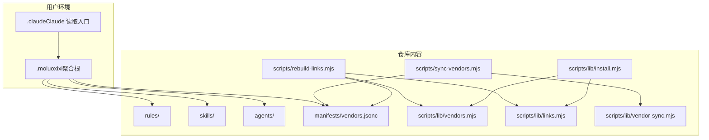
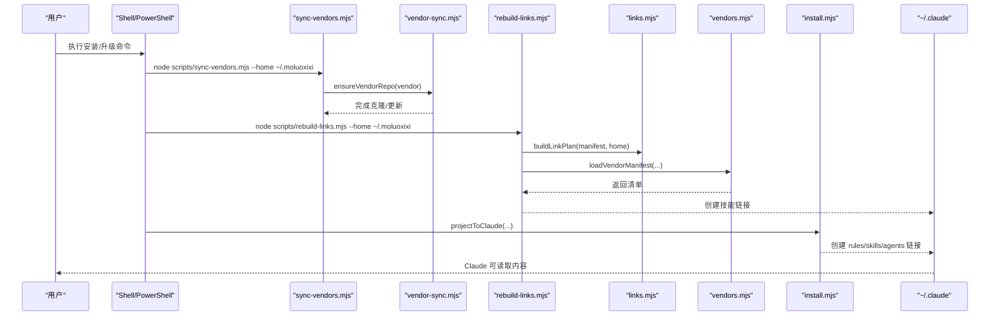
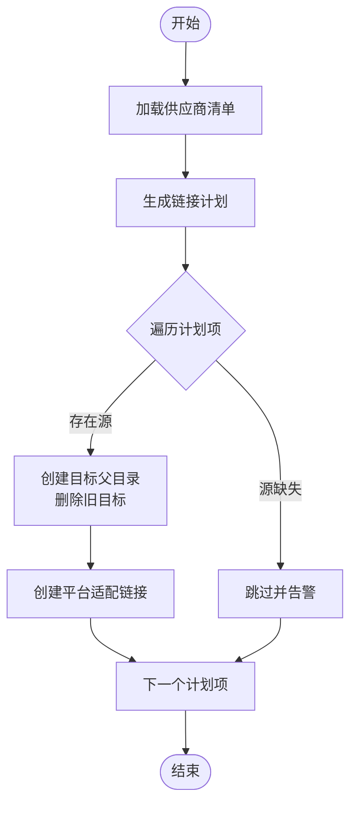
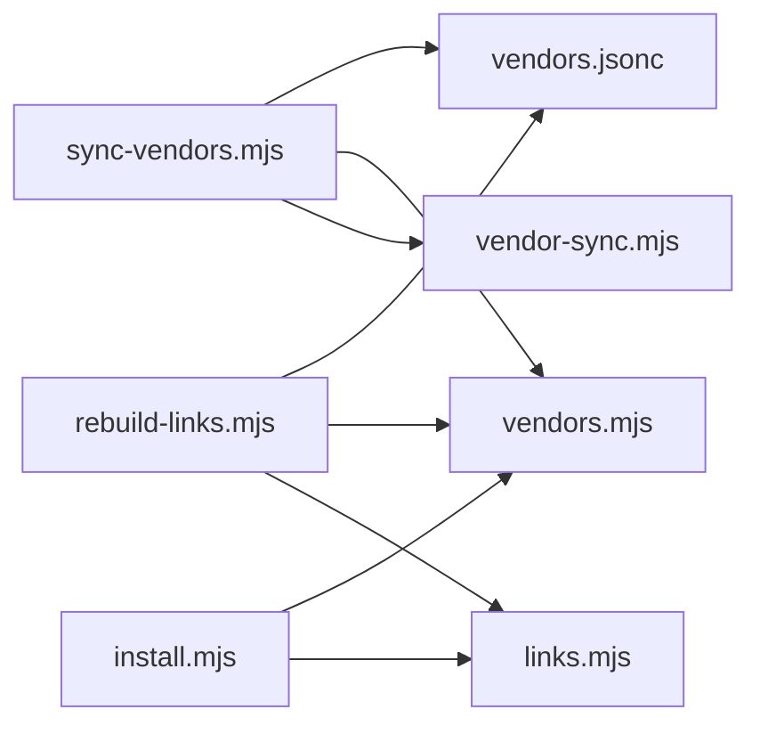

# Claude 平台集成

<cite>
**本文引用的文件**
- [.claude/INSTALL.md](file://.claude/INSTALL.md)
- [.claude/UPGRADE.md](file://.claude/UPGRADE.md)
- [README.md](file://README.md)
- [scripts/lib/install.mjs](file://scripts/lib/install.mjs)
- [scripts/lib/links.mjs](file://scripts/lib/links.mjs)
- [scripts/lib/vendors.mjs](file://scripts/lib/vendors.mjs)
- [scripts/lib/vendor-sync.mjs](file://scripts/lib/vendor-sync.mjs)
- [scripts/sync-vendors.mjs](file://scripts/sync-vendors.mjs)
- [scripts/rebuild-links.mjs](file://scripts/rebuild-links.mjs)
- [manifests/vendors.jsonc](file://manifests/vendors.jsonc)
- [tests/install-docs.test.mjs](file://tests/install-docs.test.mjs)
- [tests/install-flow.test.mjs](file://tests/install-flow.test.mjs)
- [rules/frontend/workflow.md](file://rules/frontend/workflow.md)
- [skills/java-backend-patterns/SKILL.md](file://skills/java-backend-patterns/SKILL.md)
- [agents/stack-reviewer.md](file://agents/stack-reviewer.md)
</cite>

## 目录
1. [简介](#简介)
2. [项目结构](#项目结构)
3. [核心组件](#核心组件)
4. [架构总览](#架构总览)
5. [详细组件分析](#详细组件分析)
6. [依赖关系分析](#依赖关系分析)
7. [性能考虑](#性能考虑)
8. [故障排除指南](#故障排除指南)
9. [结论](#结论)
10. [附录](#附录)

## 简介
本文件面向希望在 Claude 平台上集成并使用 Moluoxixi AI Rules 的用户与维护者，系统性说明安装、升级与配置管理流程，覆盖 macOS/Linux 与 Windows 平台差异；解释 Git 仓库克隆、Node.js 脚本执行与符号链接（软链接/硬链接）机制；并提供安装验证方法与故障排除建议。

## 项目结构
该项目采用“第一方内容 + 第三方供应商聚合”的组织方式，通过统一的安装与链接脚本，将规则、技能、代理等内容投影到 Claude 与 Codex 的读取入口。关键目录与文件如下：
- 安装与升级文档：.claude/INSTALL.md、.claude/UPGRADE.md
- 安装脚本与库：scripts/sync-vendors.mjs、scripts/rebuild-links.mjs、scripts/lib/install.mjs、scripts/lib/links.mjs、scripts/lib/vendors.mjs、scripts/lib/vendor-sync.mjs
- 供应商清单：manifests/vendors.jsonc
- 示例内容：rules/、skills/、agents/
- 顶层说明：README.md

图表来源
- [.claude/INSTALL.md:31-57](file://.claude/INSTALL.md#L31-L57)
- [scripts/sync-vendors.mjs:46-59](file://scripts/sync-vendors.mjs#L46-L59)
- [scripts/rebuild-links.mjs:50-71](file://scripts/rebuild-links.mjs#L50-L71)
- [scripts/lib/install.mjs:68-94](file://scripts/lib/install.mjs#L68-L94)

章节来源
- [.claude/INSTALL.md:1-108](file://.claude/INSTALL.md#L1-L108)
- [README.md:15-49](file://README.md#L15-L49)

## 核心组件
- 安装与升级文档：定义了 macOS/Linux 与 Windows 的安装与升级步骤、验证要点与注意事项。
- 供应商同步脚本：根据清单克隆/更新第三方仓库，确保 vendor 源处于最新默认分支。
- 链接重建脚本：基于清单生成链接计划，将第三方 skills 聚合到统一的 skills 目录，并创建平台适配的链接。
- 安装库函数：封装默认路径、拷贝第一方内容、重建链接、将项目映射到 Claude/Codex 入口等。
- 供应商清单：声明所有第三方技能来源、克隆目录与链接规则。

章节来源
- [scripts/sync-vendors.mjs:1-62](file://scripts/sync-vendors.mjs#L1-L62)
- [scripts/rebuild-links.mjs:1-74](file://scripts/rebuild-links.mjs#L1-L74)
- [scripts/lib/install.mjs:1-105](file://scripts/lib/install.mjs#L1-L105)
- [manifests/vendors.jsonc:1-107](file://manifests/vendors.jsonc#L1-L107)

## 架构总览
下图展示了从仓库到 Claude 入口的关键步骤：克隆/更新供应商、重建技能链接、将 rules/skills/agents 映射到 .claude。

图表来源
- [scripts/sync-vendors.mjs:46-59](file://scripts/sync-vendors.mjs#L46-L59)
- [scripts/lib/vendor-sync.mjs:58-77](file://scripts/lib/vendor-sync.mjs#L58-L77)
- [scripts/rebuild-links.mjs:50-71](file://scripts/rebuild-links.mjs#L50-L71)
- [scripts/lib/links.mjs:5-22](file://scripts/lib/links.mjs#L5-L22)
- [scripts/lib/vendors.mjs:64-66](file://scripts/lib/vendors.mjs#L64-L66)
- [scripts/lib/install.mjs:85-94](file://scripts/lib/install.mjs#L85-L94)

## 详细组件分析

### 安装流程（macOS/Linux）
- 步骤概览
  - 准备：确保已安装 Git 与 Node.js，Claude 可正常使用。
  - 在用户主目录创建聚合根目录（若不存在则克隆仓库，否则执行快进拉取）。
  - 同步供应商：执行脚本以克隆/更新清单中声明的所有第三方仓库。
  - 重建链接：根据清单生成链接计划，将各 vendor 的 skills 聚合到统一目录。
  - 建立入口：在 Claude 入口目录创建指向聚合根的链接。
- 平台差异
  - 使用符号链接（dir 类型）在类 Unix 系统上建立链接。
  - 验证：列出聚合根与 Claude 入口下的内容，确认链接有效。

章节来源
- [.claude/INSTALL.md:33-57](file://.claude/INSTALL.md#L33-L57)

### 安装流程（Windows）
- 步骤概览
  - 准备：确保已安装 Git 与 Node.js，Claude 可正常使用。
  - 在用户目录创建聚合根目录（若不存在则克隆仓库，否则执行快进拉取）。
  - 同步供应商：执行脚本以克隆/更新清单中声明的所有第三方仓库。
  - 重建链接：根据清单生成链接计划，将各 vendor 的 skills 聚合到统一目录。
  - 建立入口：在 Claude 入口目录创建目录连接（junction），指向聚合根。
- 平台差异
  - 使用目录连接（junction）替代符号链接。
  - 验证：列出 Claude 入口下的内容，确认链接有效。

章节来源
- [.claude/INSTALL.md:59-87](file://.claude/INSTALL.md#L59-L87)

### 升级流程（macOS/Linux）
- 步骤概览
  - 在聚合根目录执行快进拉取，更新仓库。
  - 重新同步供应商并重建链接。
  - 重新建立 Claude 入口目录的链接，确保指向最新聚合根。
- 验证
  - 确认 Claude 入口仍指向聚合根，且第三方 skills 已更新，链接有效。

章节来源
- [.claude/UPGRADE.md:5-17](file://.claude/UPGRADE.md#L5-L17)

### 升级流程（Windows）
- 步骤概览
  - 在聚合根目录执行快进拉取，更新仓库。
  - 重新同步供应商并重建链接。
  - 重新建立 Claude 入口目录的目录连接，指向最新聚合根。
- 验证
  - 确认 Claude 入口仍指向聚合根，且第三方 skills 已更新，链接有效。

章节来源
- [.claude/UPGRADE.md:19-39](file://.claude/UPGRADE.md#L19-L39)

### 供应商同步与链接重建
- 供应商同步
  - 读取清单，逐个 vendor 执行克隆/更新，确保与远程默认分支一致。
  - 使用子进程调用 git，处理错误输出并抛出异常。
- 链接重建
  - 解析清单，生成链接计划（source/target），按目标排序。
  - 对每个计划项，创建父目录、删除旧目标、创建平台适配的链接。
- 安装库函数
  - 默认路径：聚合根、Claude 入口、Codex 入口等。
  - 将第一方 rules/skills/agents 拷贝至聚合根。
  - 将聚合根映射到 Claude/Codex 入口，创建目录/连接。

图表来源
- [scripts/rebuild-links.mjs:50-71](file://scripts/rebuild-links.mjs#L50-L71)
- [scripts/lib/links.mjs:5-22](file://scripts/lib/links.mjs#L5-L22)
- [scripts/lib/vendors.mjs:64-66](file://scripts/lib/vendors.mjs#L64-L66)

章节来源
- [scripts/lib/vendor-sync.mjs:58-77](file://scripts/lib/vendor-sync.mjs#L58-L77)
- [scripts/rebuild-links.mjs:1-74](file://scripts/rebuild-links.mjs#L1-L74)
- [scripts/lib/install.mjs:68-94](file://scripts/lib/install.mjs#L68-L94)

### 安装验证
- macOS/Linux
  - 列出聚合根中的供应商与技能，确认 superpowers 已安装。
  - 列出 Claude 入口中的 skills，确认其指向聚合根。
- Windows
  - 列出 Claude 入口中的 skills，确认其指向聚合根。
- 自动化验证
  - 测试用例断言安装文档中提及的“先安装 superpowers”与“~/.moluoxixi”布局。
  - 测试用例断言安装流程将第一方内容与聚合技能投影到 Claude/Codex 入口。

章节来源
- [.claude/INSTALL.md:89-102](file://.claude/INSTALL.md#L89-L102)
- [.claude/UPGRADE.md:41-52](file://.claude/UPGRADE.md#L41-L52)
- [tests/install-docs.test.mjs:1-14](file://tests/install-docs.test.mjs#L1-L14)
- [tests/install-flow.test.mjs:55-100](file://tests/install-flow.test.mjs#L55-L100)

### 平台特定注意事项与最佳实践
- macOS/Linux
  - 使用符号链接（dir 类型）；权限需允许创建链接与写入目标目录。
  - 若网络受限，可提前在代理环境中执行 git 操作。
- Windows
  - 需要管理员权限以创建目录连接（junction）。
  - 若 PowerShell 无法执行外部命令，检查执行策略与 PATH。
- 通用
  - 始终先同步供应商，再重建链接，保证链接指向的源存在。
  - 升级时先拉取仓库，再同步供应商与重建链接，最后重建入口链接。
  - 定期运行验证步骤，确保链接有效且内容最新。

章节来源
- [.claude/INSTALL.md:33-87](file://.claude/INSTALL.md#L33-L87)
- [.claude/UPGRADE.md:5-39](file://.claude/UPGRADE.md#L5-L39)
- [scripts/lib/install.mjs:36-38](file://scripts/lib/install.mjs#L36-L38)
- [scripts/rebuild-links.mjs:46-48](file://scripts/rebuild-links.mjs#L46-L48)

## 依赖关系分析
- 安装脚本依赖
  - scripts/sync-vendors.mjs 依赖 scripts/lib/vendor-sync.mjs 与 scripts/lib/vendors.mjs。
  - scripts/rebuild-links.mjs 依赖 scripts/lib/links.mjs 与 scripts/lib/vendors.mjs。
  - scripts/lib/install.mjs 依赖 scripts/lib/links.mjs 与 scripts/lib/vendors.mjs。
- 清单依赖
  - manifest/vendors.jsonc 定义供应商、克隆目录与链接规则，决定链接计划与最终暴露的技能集合。
- 入口映射
  - scripts/lib/install.mjs 提供 projectToClaude 与 projectToCodex，将聚合根映射到 Claude/Codex 入口。

图表来源
- [scripts/sync-vendors.mjs:6-7](file://scripts/sync-vendors.mjs#L6-L7)
- [scripts/rebuild-links.mjs:6-7](file://scripts/rebuild-links.mjs#L6-L7)
- [scripts/lib/install.mjs:14-15](file://scripts/lib/install.mjs#L14-L15)
- [manifests/vendors.jsonc:1-107](file://manifests/vendors.jsonc#L1-L107)

章节来源
- [scripts/sync-vendors.mjs:1-62](file://scripts/sync-vendors.mjs#L1-L62)
- [scripts/rebuild-links.mjs:1-74](file://scripts/rebuild-links.mjs#L1-L74)
- [scripts/lib/install.mjs:1-105](file://scripts/lib/install.mjs#L1-L105)
- [manifests/vendors.jsonc:1-107](file://manifests/vendors.jsonc#L1-L107)

## 性能考虑
- 供应商同步
  - 多个 vendor 并行克隆/更新会占用带宽与磁盘 IO；建议在网络空闲时段执行。
  - 使用快进合并减少冲突与回滚成本。
- 链接重建
  - 链接数量较多时，重建过程耗时与磁盘写入相关；建议在 SSD 上执行。
  - 链接计划按目标排序，避免重复写入同一目标。
- 入口映射
  - 符号链接/目录连接的开销极低，主要影响在首次访问时的解析时间。

## 故障排除指南
- 无法创建链接
  - macOS/Linux：检查目标目录权限与磁盘空间；确认未被只读挂载覆盖。
  - Windows：以管理员身份运行 PowerShell；确认已启用开发者模式或具备创建 junction 的权限。
- 供应商同步失败
  - 检查网络连通性与代理设置；确认 git 可正常执行。
  - 若远程 HEAD 获取失败，尝试手动指定分支或检查仓库状态。
- 链接目标缺失
  - 供应商仓库未包含所需子目录；检查清单中的 source/target 是否正确。
  - 先执行供应商同步，再执行链接重建。
- 入口未指向聚合根
  - 重新执行 projectToClaude；确认 .claude/rules、.claude/skills、.claude/agents 存在且为链接。
- 验证失败
  - 使用安装/升级文档中的验证命令列出目录内容，核对链接有效性。

章节来源
- [scripts/lib/vendor-sync.mjs:5-19](file://scripts/lib/vendor-sync.mjs#L5-L19)
- [scripts/rebuild-links.mjs:60-64](file://scripts/rebuild-links.mjs#L60-L64)
- [.claude/INSTALL.md:89-102](file://.claude/INSTALL.md#L89-L102)
- [.claude/UPGRADE.md:41-52](file://.claude/UPGRADE.md#L41-L52)

## 结论
通过统一的安装与升级流程、清晰的供应商清单与链接重建机制，Moluoxixi AI Rules 能够在 Claude 平台上稳定地提供第一方与第三方技能的聚合体验。遵循本文档的步骤与注意事项，可在不同平台上高效完成安装、升级与验证，并在出现问题时快速定位与解决。

## 附录
- 示例内容
  - 前端工作流规则：用于指导前端页面与组件开发的流程与验证规则。
  - Java 后端模式技能：面向 Java 后端系统（尤其是 Spring Boot）的开发与重构指引。
  - Stack Reviewer 代理：用于审查规则与技能表面，发现潜在问题并报告。

章节来源
- [rules/frontend/workflow.md:1-43](file://rules/frontend/workflow.md#L1-L43)
- [skills/java-backend-patterns/SKILL.md:1-28](file://skills/java-backend-patterns/SKILL.md#L1-L28)
- [agents/stack-reviewer.md:1-20](file://agents/stack-reviewer.md#L1-L20)