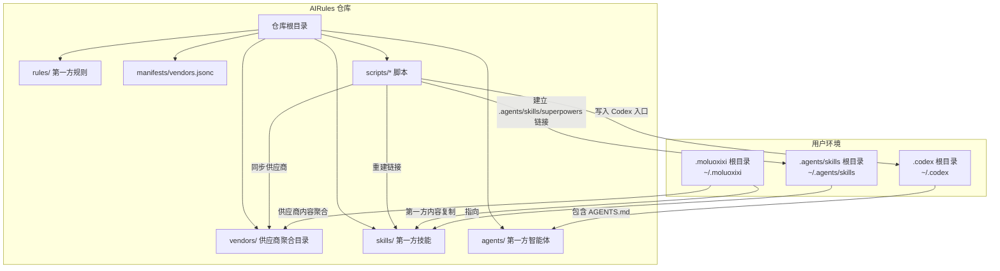
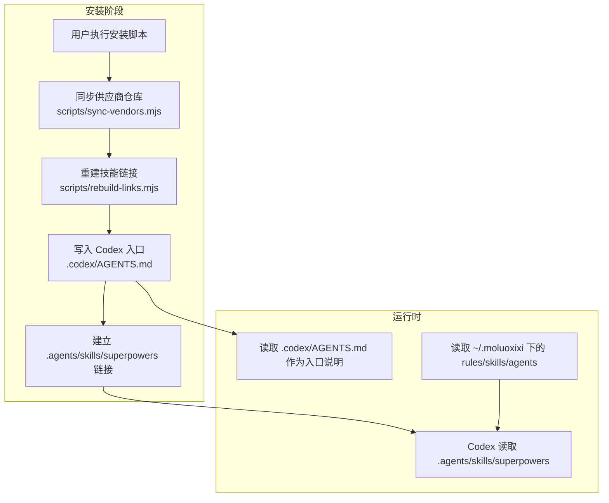
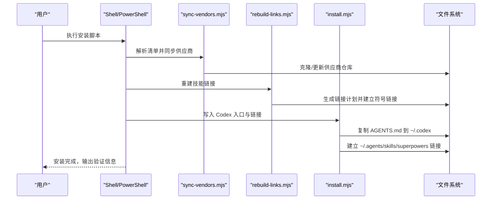
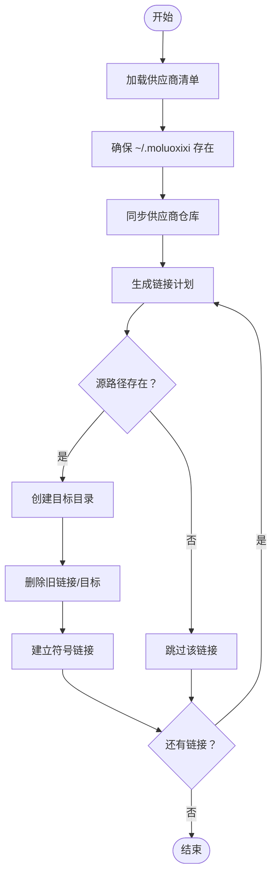
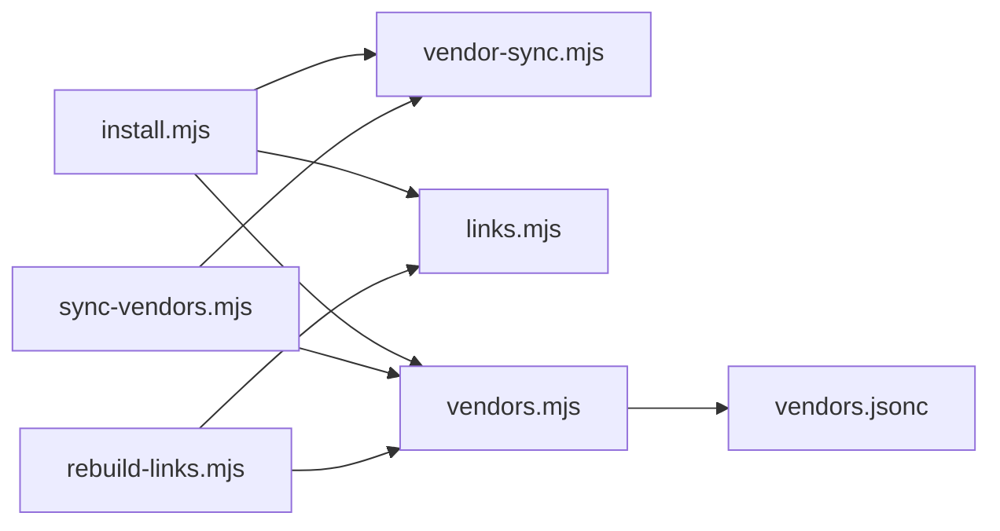

# Codex 平台集成

<cite>
**本文引用的文件**
- [.codex/INSTALL.md](file://.codex/INSTALL.md)
- [.codex/UPGRADE.md](file://.codex/UPGRADE.md)
- [.codex/AGENTS.md](file://.codex/AGENTS.md)
- [README.md](file://README.md)
- [scripts/lib/install.mjs](file://scripts/lib/install.mjs)
- [scripts/sync-vendors.mjs](file://scripts/sync-vendors.mjs)
- [scripts/rebuild-links.mjs](file://scripts/rebuild-links.mjs)
- [scripts/lib/vendor-sync.mjs](file://scripts/lib/vendor-sync.mjs)
- [scripts/lib/links.mjs](file://scripts/lib/links.mjs)
- [scripts/lib/vendors.mjs](file://scripts/lib/vendors.mjs)
- [manifests/vendors.jsonc](file://manifests/vendors.jsonc)
- [package.json](file://package.json)
- [skills/java-backend-patterns/SKILL.md](file://skills/java-backend-patterns/SKILL.md)
- [skills/nest-patterns/SKILL.md](file://skills/nest-patterns/SKILL.md)
- [skills/rust-service-patterns/SKILL.md](file://skills/rust-service-patterns/SKILL.md)
</cite>

## 目录
1. [简介](#简介)
2. [项目结构](#项目结构)
3. [核心组件](#核心组件)
4. [架构总览](#架构总览)
5. [详细组件分析](#详细组件分析)
6. [依赖关系分析](#依赖关系分析)
7. [性能考虑](#性能考虑)
8. [故障排查指南](#故障排查指南)
9. [结论](#结论)
10. [附录](#附录)

## 简介
本文件面向在 Codex 平台上使用 AIRules 的用户与维护者，系统性说明 AIRules 如何与 Codex 代码生成平台集成，涵盖安装配置、升级流程、代理支持、平台特定配置与脚本、功能限制与使用建议，以及与 Claude 平台的差异及适用场景。

AIRules 是建立在 superpowers 之上的个人 AI 开发工作流仓库，提供第一方 rules、skills、agents，以及通过 vendor 管理的第三方 skills，并以统一的聚合安装结构同时服务于 Claude 与 Codex。在 Codex 环境中，安装完成后，superpowers 作为底层工作流能力保留，而 AIRules 将第一方规则、技能与 agent 组织起来，统一投影到 Codex 可读取的位置。

章节来源
- [README.md:15-49](file://README.md#L15-L49)

## 项目结构
Codex 平台集成的关键文件与目录如下：
- 平台安装与升级文档：.codex/INSTALL.md、.codex/UPGRADE.md、.codex/AGENTS.md
- 安装与部署脚本：scripts/lib/install.mjs、scripts/sync-vendors.mjs、scripts/rebuild-links.mjs
- 供应商同步与链接逻辑：scripts/lib/vendor-sync.mjs、scripts/lib/links.mjs、scripts/lib/vendors.mjs
- 供应商清单：manifests/vendors.jsonc
- 包与测试：package.json
- 示例技能文档：skills/*/SKILL.md

图表来源
- [.codex/INSTALL.md:24-52](file://.codex/INSTALL.md#L24-L52)
- [scripts/lib/install.mjs:96-104](file://scripts/lib/install.mjs#L96-L104)
- [scripts/sync-vendors.mjs:46-59](file://scripts/sync-vendors.mjs#L46-L59)
- [scripts/rebuild-links.mjs:50-71](file://scripts/rebuild-links.mjs#L50-L71)

章节来源
- [.codex/INSTALL.md:1-95](file://.codex/INSTALL.md#L1-L95)
- [scripts/lib/install.mjs:40-104](file://scripts/lib/install.mjs#L40-L104)
- [scripts/sync-vendors.mjs:1-62](file://scripts/sync-vendors.mjs#L1-L62)
- [scripts/rebuild-links.mjs:1-74](file://scripts/rebuild-links.mjs#L1-L74)
- [manifests/vendors.jsonc:1-107](file://manifests/vendors.jsonc#L1-L107)

## 核心组件
- 安装与升级文档（Codex）
  - 安装指南：定义前提条件、目标路径、安装步骤与验证要点
  - 升级指南：快速升级步骤与验证要点
  - AGENTS.md：角色分层、首选工作流、已安装外部技能、冲突解决与验证要求
- 安装脚本
  - scripts/lib/install.mjs：提供默认路径、确保安装根目录、复制第一方内容、将内容投影到 Claude/Codex
  - scripts/sync-vendors.mjs：解析供应商清单、克隆或更新供应商仓库
  - scripts/rebuild-links.mjs：基于清单重建技能链接
- 供应商与链接逻辑
  - scripts/lib/vendor-sync.mjs：通过 git 获取默认分支、切换到默认分支并执行快进合并
  - scripts/lib/links.mjs：根据清单生成链接计划
  - scripts/lib/vendors.mjs：解析 JSONC 清单、路径规范化、仓库根定位
- 供应商清单 manifests/vendors.jsonc：声明各供应商仓库、克隆目录与链接规则
- 示例技能文档：展示不同技术栈的技能使用要点

章节来源
- [.codex/INSTALL.md:1-95](file://.codex/INSTALL.md#L1-L95)
- [.codex/UPGRADE.md:1-48](file://.codex/UPGRADE.md#L1-L48)
- [.codex/AGENTS.md:1-61](file://.codex/AGENTS.md#L1-L61)
- [scripts/lib/install.mjs:1-105](file://scripts/lib/install.mjs#L1-L105)
- [scripts/sync-vendors.mjs:1-62](file://scripts/sync-vendors.mjs#L1-L62)
- [scripts/rebuild-links.mjs:1-74](file://scripts/rebuild-links.mjs#L1-L74)
- [scripts/lib/vendor-sync.mjs:1-78](file://scripts/lib/vendor-sync.mjs#L1-L78)
- [scripts/lib/links.mjs:1-23](file://scripts/lib/links.mjs#L1-L23)
- [scripts/lib/vendors.mjs:1-75](file://scripts/lib/vendors.mjs#L1-L75)
- [manifests/vendors.jsonc:1-107](file://manifests/vendors.jsonc#L1-L107)

## 架构总览
下图展示了 AIRules 在 Codex 平台中的安装与运行时架构：

图表来源
- [.codex/INSTALL.md:24-52](file://.codex/INSTALL.md#L24-L52)
- [scripts/sync-vendors.mjs:46-59](file://scripts/sync-vendors.mjs#L46-L59)
- [scripts/rebuild-links.mjs:50-71](file://scripts/rebuild-links.mjs#L50-L71)
- [scripts/lib/install.mjs:96-104](file://scripts/lib/install.mjs#L96-L104)

## 详细组件分析

### 安装与升级流程（Codex）
- 前提条件
  - 已安装 Git、Node.js、Codex
- 安装目标
  - 统一聚合层：~/.moluoxixi
  - Codex 原生技能发现目录：~/.agents/skills/
  - 最终仅暴露一个命名空间入口：~/.agents/skills/superpowers -> ~/.moluoxixi/skills
- 安装步骤（macOS/Linux 与 Windows PowerShell）
  - 创建 ~/.moluoxixi 并克隆或更新仓库
  - 同步供应商仓库（优先安装 superpowers）
  - 重建 vendor 技能链接至 ~/.moluoxixi/skills
  - 复制 .codex/AGENTS.md 到 ~/.codex/AGENTS.md
  - 建立 ~/.agents/skills/superpowers 链接指向 ~/.moluoxixi/skills
- 升级步骤
  - 拉取最新仓库、同步供应商、重建链接
  - 更新 ~/.codex/AGENTS.md
  - 刷新 ~/.agents/skills/superpowers 链接
- 验证要点
  - 已先安装 superpowers
  - ~/.moluoxixi/skills/ 聚合第一方与第三方 skills
  - ~/.agents/skills/superpowers 指向 ~/.moluoxixi/skills
  - ~/.codex/AGENTS.md 与仓库布局保持一致

图表来源
- [.codex/INSTALL.md:24-52](file://.codex/INSTALL.md#L24-L52)
- [scripts/sync-vendors.mjs:46-59](file://scripts/sync-vendors.mjs#L46-L59)
- [scripts/rebuild-links.mjs:50-71](file://scripts/rebuild-links.mjs#L50-L71)
- [scripts/lib/install.mjs:96-104](file://scripts/lib/install.mjs#L96-L104)

章节来源
- [.codex/INSTALL.md:1-95](file://.codex/INSTALL.md#L1-L95)
- [.codex/UPGRADE.md:1-48](file://.codex/UPGRADE.md#L1-L48)

### 供应商同步与链接机制
- 供应商清单（manifests/vendors.jsonc）
  - 声明各供应商仓库地址、克隆目录与链接规则
  - 支持多供应商聚合，统一暴露到 ~/.moluoxixi/skills
- 供应商同步（scripts/lib/vendor-sync.mjs）
  - 使用 git 获取默认分支、切换到默认分支并执行快进合并
  - 保证本地仓库与上游默认分支一致
- 链接计划（scripts/lib/links.mjs）
  - 基于清单生成链接计划，排序后逐条执行
- 链接重建（scripts/rebuild-links.mjs）
  - 读取清单、构建链接计划、创建符号链接（Windows 使用 junction，其他平台使用目录链接）

图表来源
- [scripts/sync-vendors.mjs:46-59](file://scripts/sync-vendors.mjs#L46-L59)
- [scripts/rebuild-links.mjs:50-71](file://scripts/rebuild-links.mjs#L50-L71)
- [scripts/lib/vendor-sync.mjs:58-77](file://scripts/lib/vendor-sync.mjs#L58-L77)
- [scripts/lib/links.mjs:5-22](file://scripts/lib/links.mjs#L5-L22)

章节来源
- [manifests/vendors.jsonc:1-107](file://manifests/vendors.jsonc#L1-L107)
- [scripts/lib/vendor-sync.mjs:1-78](file://scripts/lib/vendor-sync.mjs#L1-L78)
- [scripts/lib/links.mjs:1-23](file://scripts/lib/links.mjs#L1-L23)
- [scripts/rebuild-links.mjs:1-74](file://scripts/rebuild-links.mjs#L1-L74)

### Codex 特有的配置文件与安装脚本
- .codex/AGENTS.md
  - 角色分层与首选工作流
  - 已安装外部技能列表（如 frontend-design、webapp-testing、cache-components、code-reviewer、pr-creator、fix、update-docs、find-skills、fullstack-developer）
  - 冲突解决原则与验证要求
- 安装脚本职责
  - scripts/lib/install.mjs：提供默认路径、确保安装根目录、复制第一方内容、将内容投影到 Codex
  - scripts/sync-vendors.mjs：解析清单并克隆/更新供应商仓库
  - scripts/rebuild-links.mjs：基于清单重建技能链接

章节来源
- [.codex/AGENTS.md:1-61](file://.codex/AGENTS.md#L1-L61)
- [scripts/lib/install.mjs:40-104](file://scripts/lib/install.mjs#L40-L104)
- [scripts/sync-vendors.mjs:1-62](file://scripts/sync-vendors.mjs#L1-L62)
- [scripts/rebuild-links.mjs:1-74](file://scripts/rebuild-links.mjs#L1-L74)

### 代理支持说明
- 仓库未提供专门的代理配置文件或脚本
- 供应商同步通过 git 操作进行，默认遵循系统 git 代理设置
- 若需代理，请在系统层面配置 git 代理（例如 http.proxy/https.proxy），或在执行脚本前设置相应环境变量

章节来源
- [scripts/lib/vendor-sync.mjs:5-19](file://scripts/lib/vendor-sync.mjs#L5-L19)

### 平台特定的安装步骤与配置选项
- Codex 安装步骤
  - macOS/Linux：创建 ~/.moluoxixi，克隆或更新仓库，同步供应商，重建链接，复制 AGENTS.md，建立 .agents/skills/superpowers 链接
  - Windows PowerShell：同上，使用 junction 建立链接
- 配置选项
  - --home <dir>：覆盖默认 ~/.moluoxixi 根目录
  - --manifest <file>：覆盖默认清单路径
  - --help：显示帮助信息

章节来源
- [.codex/INSTALL.md:24-80](file://.codex/INSTALL.md#L24-L80)
- [scripts/sync-vendors.mjs:9-44](file://scripts/sync-vendors.mjs#L9-L44)
- [scripts/rebuild-links.mjs:9-44](file://scripts/rebuild-links.mjs#L9-L44)

### 功能限制与使用建议
- 功能限制
  - 仓库未内置代理配置；若网络受限，需依赖系统 git 代理
  - 安装与升级流程依赖 Git 与 Node.js
  - 链接类型在 Windows 上使用 junction，在类 Unix 系统上使用目录链接
- 使用建议
  - 首次安装建议先安装 superpowers，再同步其他供应商
  - 修改第一方内容后，需重新运行安装/升级流程以保持 .agents/skills/superpowers 与仓库布局一致
  - 升级后验证 AGENTS.md 与链接有效性

章节来源
- [.codex/INSTALL.md:82-95](file://.codex/INSTALL.md#L82-L95)
- [.codex/UPGRADE.md:40-48](file://.codex/UPGRADE.md#L40-L48)
- [.codex/AGENTS.md:45-61](file://.codex/AGENTS.md#L45-L61)

### 与 Claude 平台的差异与适用场景
- 安装入口
  - README.md 提供了在 Claude 与 Codex 中分别获取安装/升级文档的指引
- 结构差异
  - Codex 通过 .agents/skills/superpowers 暴露技能集合
  - 安装脚本提供将内容投影到 Claude/Codex 的能力
- 适用场景
  - 两者共享同一套 rules/skills/agents 与供应商清单，差异主要体现在平台入口与读取位置
  - 用户可根据所用平台选择对应的安装/升级文档

章节来源
- [README.md:15-49](file://README.md#L15-L49)
- [scripts/lib/install.mjs:85-94](file://scripts/lib/install.mjs#L85-L94)

## 依赖关系分析
- 组件耦合
  - 安装脚本依赖供应商清单与链接逻辑
  - 供应商同步依赖 git 命令与远程仓库
  - 链接重建依赖清单解析与路径规范化
- 外部依赖
  - Node.js 运行时
  - Git 命令行工具
  - 文件系统操作（创建目录、符号链接、复制、删除）

图表来源
- [scripts/sync-vendors.mjs:6-7](file://scripts/sync-vendors.mjs#L6-L7)
- [scripts/rebuild-links.mjs:6-7](file://scripts/rebuild-links.mjs#L6-L7)
- [scripts/lib/install.mjs:14-15](file://scripts/lib/install.mjs#L14-L15)
- [scripts/lib/vendor-sync.mjs:1-3](file://scripts/lib/vendor-sync.mjs#L1-L3)
- [scripts/lib/links.mjs:1-3](file://scripts/lib/links.mjs#L1-L3)
- [scripts/lib/vendors.mjs:1-6](file://scripts/lib/vendors.mjs#L1-L6)
- [manifests/vendors.jsonc:1-107](file://manifests/vendors.jsonc#L1-L107)

章节来源
- [scripts/sync-vendors.mjs:1-62](file://scripts/sync-vendors.mjs#L1-L62)
- [scripts/rebuild-links.mjs:1-74](file://scripts/rebuild-links.mjs#L1-L74)
- [scripts/lib/install.mjs:1-105](file://scripts/lib/install.mjs#L1-L105)
- [scripts/lib/vendor-sync.mjs:1-78](file://scripts/lib/vendor-sync.mjs#L1-L78)
- [scripts/lib/links.mjs:1-23](file://scripts/lib/links.mjs#L1-L23)
- [scripts/lib/vendors.mjs:1-75](file://scripts/lib/vendors.mjs#L1-L75)

## 性能考虑
- 供应商同步采用快进合并策略，减少冲突与回滚成本
- 链接重建按目标路径排序，保证一致性与可预测性
- Windows 使用 junction 减少符号链接开销
- 建议在网络稳定时执行同步与升级，避免频繁失败重试

## 故障排查指南
- 安装/升级后验证
  - 确认 ~/.moluoxixi/skills/ 已聚合第一方与第三方技能
  - 确认 ~/.agents/skills/superpowers 指向正确
  - 确认 ~/.codex/AGENTS.md 与仓库布局一致
- 常见问题
  - 供应商仓库克隆失败：检查网络与 git 代理设置
  - 链接缺失：检查清单中 source 是否存在，重新执行链接重建
  - Windows 链接异常：确认使用 junction，权限与路径正确

章节来源
- [.codex/INSTALL.md:82-95](file://.codex/INSTALL.md#L82-L95)
- [.codex/UPGRADE.md:40-48](file://.codex/UPGRADE.md#L40-L48)
- [scripts/lib/vendor-sync.mjs:5-19](file://scripts/lib/vendor-sync.mjs#L5-L19)
- [scripts/rebuild-links.mjs:60-71](file://scripts/rebuild-links.mjs#L60-L71)

## 结论
AIRules 通过统一的安装与升级流程，将第一方与第三方技能聚合到 ~/.moluoxixi，并以 .agents/skills/superpowers 作为 Codex 的统一入口。安装脚本与供应商清单共同保障了可维护性与可扩展性。对于 Codex 用户，建议遵循提供的安装/升级文档，定期同步并验证链接与入口文件，以获得最佳使用体验。

## 附录
- 示例技能文档（用于理解技能使用场景）
  - Java Backend Patterns
  - Nest Patterns
  - Rust Service Patterns

章节来源
- [skills/java-backend-patterns/SKILL.md:1-28](file://skills/java-backend-patterns/SKILL.md#L1-L28)
- [skills/nest-patterns/SKILL.md:1-28](file://skills/nest-patterns/SKILL.md#L1-L28)
- [skills/rust-service-patterns/SKILL.md:1-28](file://skills/rust-service-patterns/SKILL.md#L1-L28)
- [package.json:1-11](file://package.json#L1-L11)