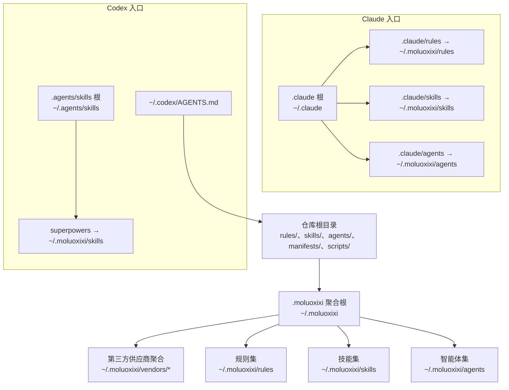
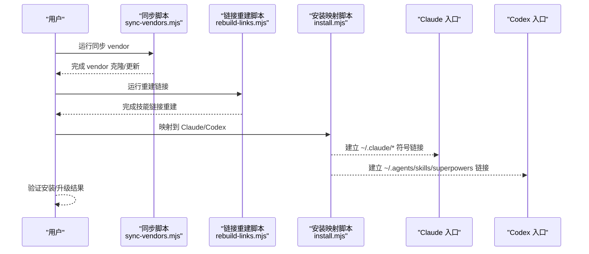
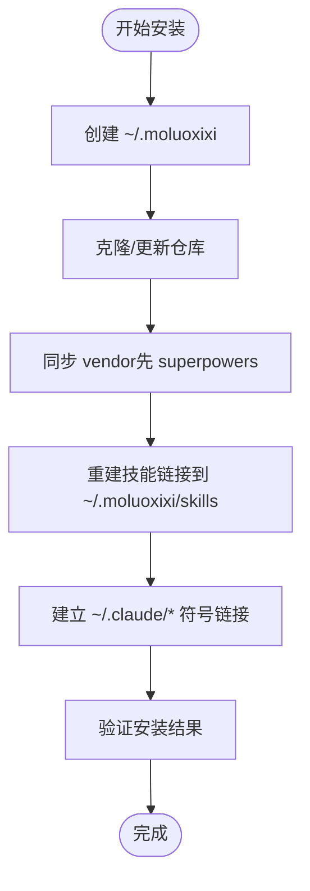
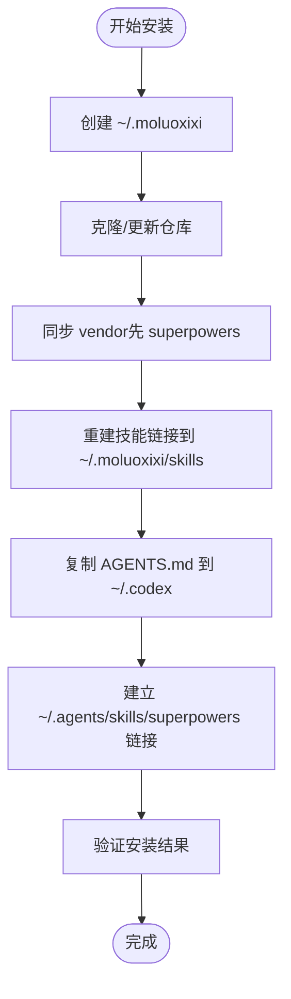
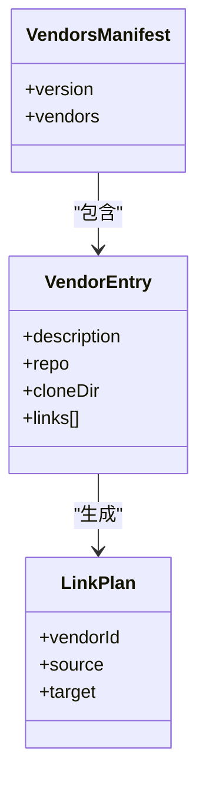
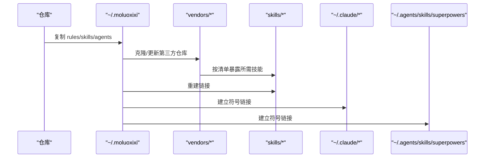
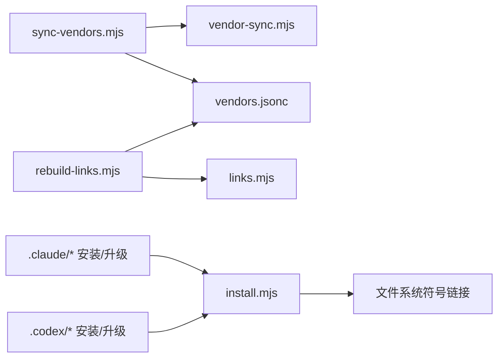

# 平台集成

<cite>
**本文引用的文件**
- [README.md](file://README.md)
- [.claude/INSTALL.md](file://.claude/INSTALL.md)
- [.claude/UPGRADE.md](file://.claude/UPGRADE.md)
- [.codex/INSTALL.md](file://.codex/INSTALL.md)
- [.codex/UPGRADE.md](file://.codex/UPGRADE.md)
- [.codex/AGENTS.md](file://.codex/AGENTS.md)
- [scripts/lib/install.mjs](file://scripts/lib/install.mjs)
- [scripts/lib/vendor-sync.mjs](file://scripts/lib/vendor-sync.mjs)
- [scripts/lib/links.mjs](file://scripts/lib/links.mjs)
- [scripts/sync-vendors.mjs](file://scripts/sync-vendors.mjs)
- [scripts/rebuild-links.mjs](file://scripts/rebuild-links.mjs)
- [manifests/vendors.jsonc](file://manifests/vendors.jsonc)
- [rules/README.md](file://rules/README.md)
- [skills/java-backend-patterns/SKILL.md](file://skills/java-backend-patterns/SKILL.md)
- [agents/stack-reviewer.md](file://agents/stack-reviewer.md)
- [package.json](file://package.json)
</cite>

## 目录
1. [简介](#简介)
2. [项目结构](#项目结构)
3. [核心组件](#核心组件)
4. [架构总览](#架构总览)
5. [详细组件分析](#详细组件分析)
6. [依赖关系分析](#依赖关系分析)
7. [性能考量](#性能考量)
8. [故障排查指南](#故障排查指南)
9. [结论](#结论)
10. [附录](#附录)

## 简介
本仓库基于 superpowers 构建个人 AI 开发工作流，提供统一的规则（rules）、技能（skills）与智能体（agents），并通过“聚合安装结构”同时适配 Claude 与 Codex 平台。安装完成后，Claude 与 Codex 将从统一的 ~/.moluoxixi 聚合根下读取内容；Claude 通过符号链接将 ~/.claude/rules、~/.claude/skills、~/.claude/agents 指向 ~/.moluoxixi 对应目录；Codex 则通过 ~/.agents/skills/superpowers 指向 ~/.moluoxixi/skills，从而实现跨平台一致的使用体验。

## 项目结构
仓库采用“平台无关的统一聚合层 + 平台特定入口”的组织方式：
- 统一聚合层：~/.moluoxixi（vendors、rules、skills、agents）
- 平台入口：
  - Claude：~/.claude/rules、~/.claude/skills、~/.claude/agents
  - Codex：~/.agents/skills/superpowers 与 ~/.codex/AGENTS.md

图表来源
- [.claude/INSTALL.md:23-29](file://.claude/INSTALL.md#L23-L29)
- [.codex/INSTALL.md:11-22](file://.codex/INSTALL.md#L11-L22)
- [scripts/lib/install.mjs:85-104](file://scripts/lib/install.mjs#L85-L104)

章节来源
- [README.md:13-13](file://README.md#L13-L13)
- [.claude/INSTALL.md:11-29](file://.claude/INSTALL.md#L11-L29)
- [.codex/INSTALL.md:9-22](file://.codex/INSTALL.md#L9-L22)

## 核心组件
- 统一聚合与分发
  - scripts/lib/install.mjs：提供路径解析、目录重置、复制、符号链接、面向 Claude/Codex 的映射函数。
  - scripts/sync-vendors.mjs：根据 manifests/vendors.jsonc 克隆/更新第三方仓库。
  - scripts/rebuild-links.mjs：基于清单重建技能链接。
  - scripts/lib/links.mjs：将清单转换为链接计划。
  - scripts/lib/vendor-sync.mjs：确保 vendor 仓库处于目标分支并执行快进合并。
  - manifests/vendors.jsonc：声明第三方供应商及其链接规则。
- 平台安装与升级
  - .claude/INSTALL.md、.claude/UPGRADE.md：macOS/Linux 与 Windows 的安装/升级步骤与验证。
  - .codex/INSTALL.md、.codex/UPGRADE.md：macOS/Linux 与 Windows 的安装/升级步骤与验证。
  - .codex/AGENTS.md：Codex 使用说明与工作流建议。
- 内容层
  - rules/README.md：规则层设计原则与目录结构。
  - skills/*：第一方与第三方技能定义。
  - agents/*：智能体定义与工具声明。

章节来源
- [scripts/lib/install.mjs:40-104](file://scripts/lib/install.mjs#L40-L104)
- [scripts/sync-vendors.mjs:46-59](file://scripts/sync-vendors.mjs#L46-L59)
- [scripts/rebuild-links.mjs:50-71](file://scripts/rebuild-links.mjs#L50-L71)
- [scripts/lib/links.mjs:5-22](file://scripts/lib/links.mjs#L5-L22)
- [scripts/lib/vendor-sync.mjs:58-77](file://scripts/lib/vendor-sync.mjs#L58-L77)
- [manifests/vendors.jsonc:1-107](file://manifests/vendors.jsonc#L1-L107)
- [rules/README.md:1-31](file://rules/README.md#L1-L31)

## 架构总览
整体架构围绕“统一聚合 + 平台入口”展开，核心流程如下：
- 安装阶段：克隆/更新仓库 → 同步 vendor → 重建技能链接 → 建立平台入口。
- 升级阶段：拉取最新仓库 → 同步 vendor → 重建技能链接 → 刷新平台入口。
- 使用阶段：Claude 与 Codex 分别从各自入口读取统一聚合层内容。

图表来源
- [scripts/sync-vendors.mjs:46-59](file://scripts/sync-vendors.mjs#L46-L59)
- [scripts/rebuild-links.mjs:50-71](file://scripts/rebuild-links.mjs#L50-L71)
- [scripts/lib/install.mjs:85-104](file://scripts/lib/install.mjs#L85-L104)
- [.claude/INSTALL.md:31-57](file://.claude/INSTALL.md#L31-L57)
- [.codex/INSTALL.md:24-52](file://.codex/INSTALL.md#L24-L52)

## 详细组件分析

### 安装与升级流程（Claude）
- 安装步骤要点
  - 创建 ~/.moluoxixi 聚合根并克隆/更新仓库。
  - 同步 vendor（先安装 superpowers，再叠加第三方技能）。
  - 重建技能链接至 ~/.moluoxixi/skills。
  - 建立 ~/.claude/rules、~/.claude/skills、~/.claude/agents 指向聚合根。
- 升级步骤要点
  - 拉取最新仓库 → 同步 vendor → 重建链接 → 刷新 ~/.claude/* 入口。
- 验证要点
  - 确认 ~/.moluoxixi/skills 与 ~/.claude/skills 指向一致。
  - 确认 superpowers 与第三方技能均可用。

图表来源
- [.claude/INSTALL.md:31-57](file://.claude/INSTALL.md#L31-L57)
- [.claude/UPGRADE.md:5-17](file://.claude/UPGRADE.md#L5-L17)

章节来源
- [.claude/INSTALL.md:31-57](file://.claude/INSTALL.md#L31-L57)
- [.claude/UPGRADE.md:5-17](file://.claude/UPGRADE.md#L5-L17)

### 安装与升级流程（Codex）
- 安装步骤要点
  - 创建 ~/.moluoxixi 聚合根并克隆/更新仓库。
  - 同步 vendor → 重建技能链接至 ~/.moluoxixi/skills。
  - 复制 .codex/AGENTS.md 至 ~/.codex/AGENTS.md。
  - 建立 ~/.agents/skills/superpowers → ~/.moluoxixi/skills。
- 升级步骤要点
  - 拉取最新仓库 → 同步 vendor → 重建链接 → 刷新 ~/.agents/skills/superpowers 与 ~/.codex/AGENTS.md。
- 验证要点
  - 确认 superpowers 与第三方技能聚合在 ~/.moluoxixi/skills。
  - 确认 ~/.agents/skills/superpowers 指向正确且 AGENTS.md 已同步。

图表来源
- [.codex/INSTALL.md:24-52](file://.codex/INSTALL.md#L24-L52)
- [.codex/UPGRADE.md:5-18](file://.codex/UPGRADE.md#L5-L18)

章节来源
- [.codex/INSTALL.md:24-52](file://.codex/INSTALL.md#L24-L52)
- [.codex/UPGRADE.md:5-18](file://.codex/UPGRADE.md#L5-L18)

### 第三方供应商与链接重建
- 供应商清单
  - manifests/vendors.jsonc 声明多个供应商及其仓库地址与链接规则，统一聚合到 ~/.moluoxixi/vendors/<vendor>，再通过 links 将所需子目录暴露到 ~/.moluoxixi/skills。
- 链接重建
  - scripts/lib/links.mjs 将清单转换为链接计划。
  - scripts/rebuild-links.mjs 按计划创建符号链接，Windows 使用 junction，类 Unix 使用 dir 链接。
- vendor 同步
  - scripts/lib/vendor-sync.mjs 确保每个 vendor 仓库处于默认分支并执行快进合并，避免历史偏移导致的链接失效。

图表来源
- [manifests/vendors.jsonc:1-107](file://manifests/vendors.jsonc#L1-L107)
- [scripts/lib/links.mjs:5-22](file://scripts/lib/links.mjs#L5-L22)

章节来源
- [manifests/vendors.jsonc:1-107](file://manifests/vendors.jsonc#L1-L107)
- [scripts/lib/links.mjs:5-22](file://scripts/lib/links.mjs#L5-L22)
- [scripts/rebuild-links.mjs:50-71](file://scripts/rebuild-links.mjs#L50-L71)
- [scripts/lib/vendor-sync.mjs:58-77](file://scripts/lib/vendor-sync.mjs#L58-L77)

### 平台特定配置与使用建议（Codex）
- AGENTS.md 提供角色分层、首选工作流、已安装外部技能列表与冲突解决原则，指导用户在 Codex 环境中优先使用 superpowers 进行规划与验证，再使用第一方与第三方技能进行实现细节处理。

章节来源
- [.codex/AGENTS.md:1-61](file://.codex/AGENTS.md#L1-L61)

### 平台差异对比分析
- 安装目标
  - Claude：~/.claude/rules、~/.claude/skills、~/.claude/agents 三个入口分别指向聚合根对应目录。
  - Codex：仅暴露单一命名空间入口 ~/.agents/skills/superpowers 指向 ~/.moluoxixi/skills，并同步 ~/.codex/AGENTS.md。
- 入口管理
  - Claude：安装/升级时删除并重建 ~/.claude/* 符号链接。
  - Codex：安装/升级时重置 ~/.agents/skills 并重建 superpowers 链接，同时同步 AGENTS.md。
- 验证关注点
  - Claude：确认 ~/.claude/* 与 ~/.moluoxixi/* 指向一致，superpowers 与第三方技能可用。
  - Codex：确认 ~/.agents/skills/superpowers 链接有效，AGENTS.md 与仓库布局对齐。

章节来源
- [.claude/INSTALL.md:23-29](file://.claude/INSTALL.md#L23-L29)
- [.claude/UPGRADE.md:12-17](file://.claude/UPGRADE.md#L12-L17)
- [.codex/INSTALL.md:11-22](file://.codex/INSTALL.md#L11-L22)
- [.codex/INSTALL.md:48-52](file://.codex/INSTALL.md#L48-L52)
- [.codex/UPGRADE.md:12-18](file://.codex/UPGRADE.md#L12-L18)
- [.codex/UPGRADE.md:15-18](file://.codex/UPGRADE.md#L15-L18)

### 数据流与控制流
- 数据流
  - 仓库内容 → ~/.moluoxixi（统一聚合）→ 平台入口（符号链接）→ Claude/Codex 读取。
- 控制流
  - 安装/升级脚本负责：克隆/更新 → 同步 vendor → 重建链接 → 建立/刷新入口。
  - 用户通过 Claude/Codex 的提示词引导执行对应平台安装/升级文档。

图表来源
- [scripts/lib/install.mjs:62-104](file://scripts/lib/install.mjs#L62-L104)
- [scripts/sync-vendors.mjs:53-58](file://scripts/sync-vendors.mjs#L53-L58)
- [scripts/rebuild-links.mjs:57-70](file://scripts/rebuild-links.mjs#L57-L70)

## 依赖关系分析
- 组件耦合
  - scripts/sync-vendors.mjs 依赖 scripts/lib/vendor-sync.mjs 与 manifests/vendors.jsonc。
  - scripts/rebuild-links.mjs 依赖 scripts/lib/links.mjs 与 manifests/vendors.jsonc。
  - scripts/lib/install.mjs 作为平台入口映射的统一实现，被平台安装/升级文档调用。
- 外部依赖
  - Git：用于克隆/更新 vendor 仓库。
  - Node.js：运行安装/升级脚本。
  - 平台原生命令：macOS/Linux 使用 ln -sf，Windows 使用 mklink /J。

图表来源
- [scripts/sync-vendors.mjs:6-7](file://scripts/sync-vendors.mjs#L6-L7)
- [scripts/lib/vendor-sync.mjs:1-3](file://scripts/lib/vendor-sync.mjs#L1-L3)
- [scripts/rebuild-links.mjs:6-7](file://scripts/rebuild-links.mjs#L6-L7)
- [scripts/lib/links.mjs:3-3](file://scripts/lib/links.mjs#L3-L3)
- [scripts/lib/install.mjs:14-15](file://scripts/lib/install.mjs#L14-L15)

章节来源
- [scripts/sync-vendors.mjs:6-7](file://scripts/sync-vendors.mjs#L6-L7)
- [scripts/lib/vendor-sync.mjs:1-3](file://scripts/lib/vendor-sync.mjs#L1-L3)
- [scripts/rebuild-links.mjs:6-7](file://scripts/rebuild-links.mjs#L6-L7)
- [scripts/lib/links.mjs:3-3](file://scripts/lib/links.mjs#L3-L3)
- [scripts/lib/install.mjs:14-15](file://scripts/lib/install.mjs#L14-L15)

## 性能考量
- 链接重建成本低：符号链接无需复制大文件，适合频繁升级场景。
- vendor 同步策略：快进合并减少冲突，降低链接失效概率。
- 平台入口最小化：Claude 与 Codex 仅通过少量入口访问统一聚合层，减少 IO 开销。

## 故障排查指南
- 安装/升级后 Claude/Codex 未显示最新内容
  - 检查 ~/.claude/* 或 ~/.agents/skills/superpowers 是否仍指向 ~/.moluoxixi 对应目录。
  - 重新运行对应平台的安装/升级文档中的步骤。
- 第三方技能缺失
  - 确认 manifests/vendors.jsonc 中对应 vendor 的链接是否存在于 ~/.moluoxixi/skills。
  - 重新执行“同步 vendor”与“重建链接”流程。
- Windows 下链接失败
  - 确认以管理员权限运行 PowerShell。
  - 确认目标路径不存在或已被清理后再创建 junction。
- AGENTS.md 未生效（Codex）
  - 确认 ~/.codex/AGENTS.md 已从仓库 .codex/AGENTS.md 同步。

章节来源
- [.claude/INSTALL.md:89-102](file://.claude/INSTALL.md#L89-L102)
- [.codex/INSTALL.md:82-94](file://.codex/INSTALL.md#L82-L94)
- [.codex/UPGRADE.md:40-48](file://.codex/UPGRADE.md#L40-L48)

## 结论
本仓库通过统一的聚合层与平台入口映射，实现了 Claude 与 Codex 的一致使用体验。安装/升级流程清晰、可自动化，第三方供应商通过清单化管理与链接重建实现灵活扩展。遵循平台安装/升级文档与验证步骤，可稳定地在两个平台上使用第一方与第三方技能。

## 附录
- 平台入口与内容层概览
  - 规则层：rules/README.md 描述了规则层的设计原则与目录结构。
  - 技能层：skills/* 包含第一方与第三方技能定义。
  - 智能体层：agents/* 定义智能体及其工具声明。
- 示例内容
  - skills/java-backend-patterns/SKILL.md：展示技能文档的结构与工作流要点。
  - agents/stack-reviewer.md：展示智能体文档的结构与职责范围。

章节来源
- [rules/README.md:1-31](file://rules/README.md#L1-L31)
- [skills/java-backend-patterns/SKILL.md:1-28](file://skills/java-backend-patterns/SKILL.md#L1-L28)
- [agents/stack-reviewer.md:1-20](file://agents/stack-reviewer.md#L1-L20)
- [package.json:7-9](file://package.json#L7-L9)