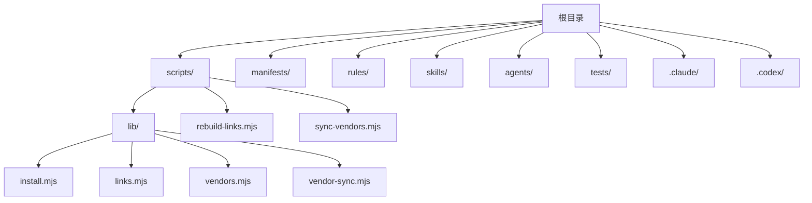
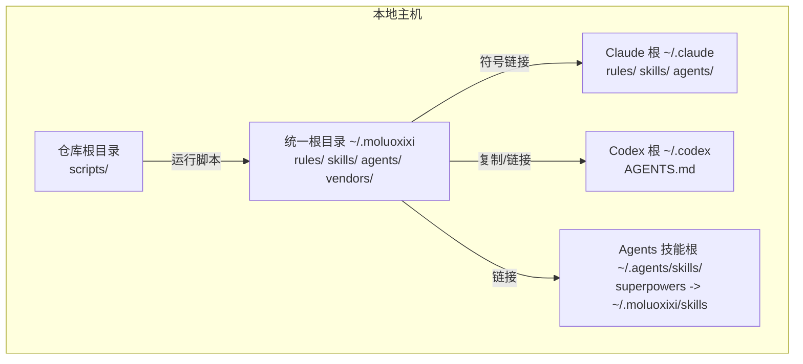
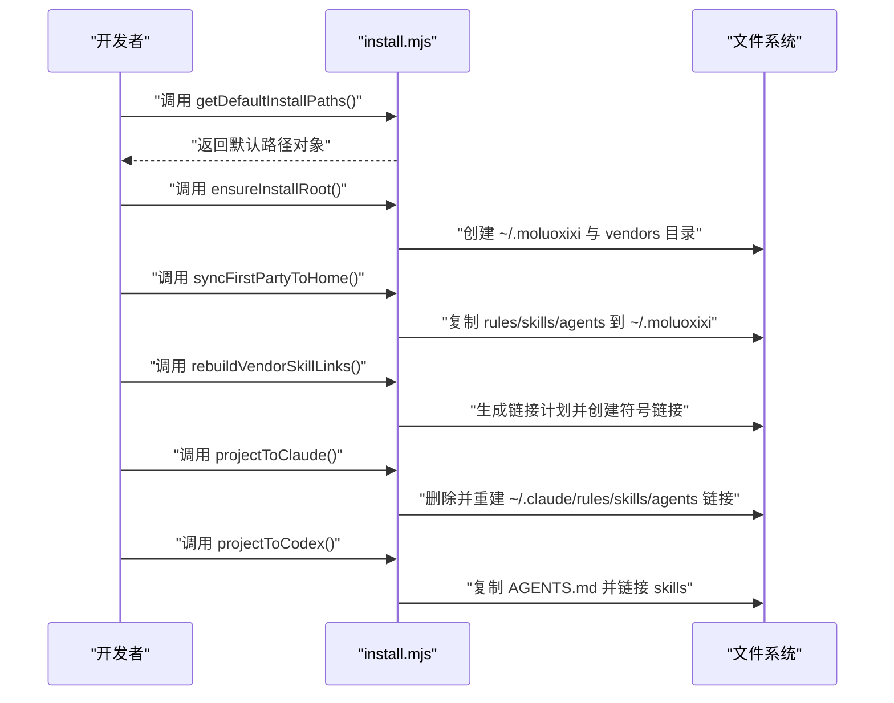
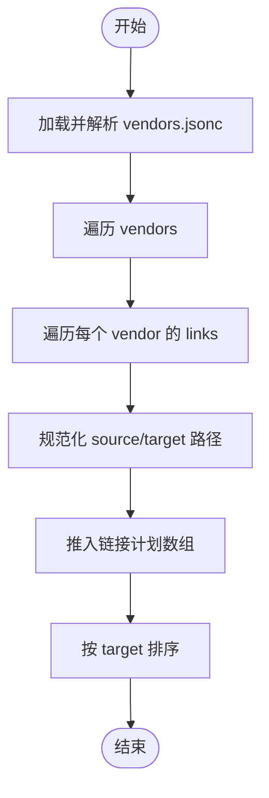
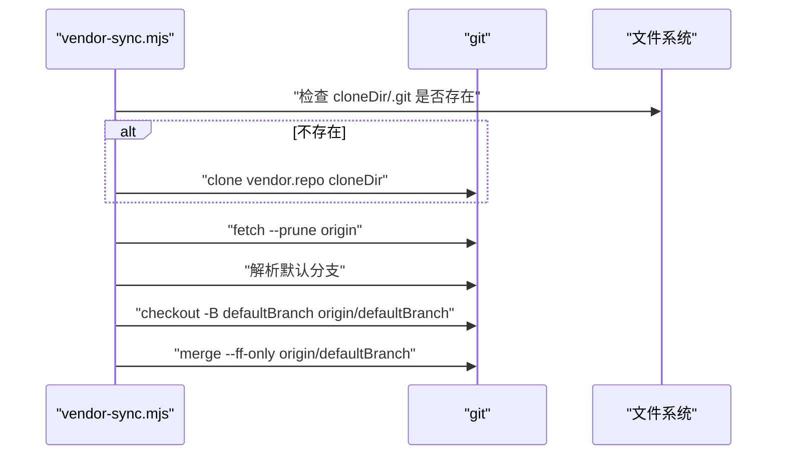
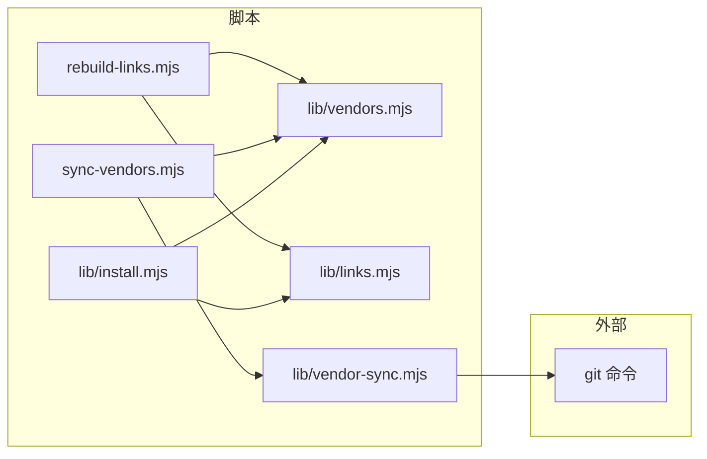

# 开发指南

<cite>
**本文引用的文件**
- [README.md](file://README.md)
- [package.json](file://package.json)
- [scripts/lib/install.mjs](file://scripts/lib/install.mjs)
- [scripts/lib/links.mjs](file://scripts/lib/links.mjs)
- [scripts/lib/vendors.mjs](file://scripts/lib/vendors.mjs)
- [scripts/lib/vendor-sync.mjs](file://scripts/lib/vendor-sync.mjs)
- [scripts/rebuild-links.mjs](file://scripts/rebuild-links.mjs)
- [scripts/sync-vendors.mjs](file://scripts/sync-vendors.mjs)
- [.claude/INSTALL.md](file://.claude/INSTALL.md)
- [.claude/UPGRADE.md](file://.claude/UPGRADE.md)
- [.codex/INSTALL.md](file://.codex/INSTALL.md)
- [.codex/UPGRADE.md](file://.codex/UPGRADE.md)
- [rules/README.md](file://rules/README.md)
- [rules/common/overview.md](file://rules/common/overview.md)
- [skills/java-backend-patterns/SKILL.md](file://skills/java-backend-patterns/SKILL.md)
- [tests/install-docs.test.mjs](file://tests/install-docs.test.mjs)
- [tests/install-flow.test.mjs](file://tests/install-flow.test.mjs)
- [tests/link-builder.test.mjs](file://tests/link-builder.test.mjs)
- [tests/vendor-manifest.test.mjs](file://tests/vendor-manifest.test.mjs)
- [tests/vendor-sync.test.mjs](file://tests/vendor-sync.test.mjs)
</cite>

## 目录
1. [简介](#简介)
2. [项目结构](#项目结构)
3. [核心组件](#核心组件)
4. [架构总览](#架构总览)
5. [详细组件分析](#详细组件分析)
6. [依赖关系分析](#依赖关系分析)
7. [性能考虑](#性能考虑)
8. [故障排查指南](#故障排查指南)
9. [结论](#结论)
10. [附录](#附录)

## 简介
本指南面向希望参与 AIRules 项目的开发者，目标是帮助你快速理解项目结构、掌握开发与贡献流程、扩展供应商管理与链接构建机制，并提供调试与最佳实践建议。AIRules 是在 superpowers 之上构建的个人 AI 开发工作流仓库，通过统一的安装与链接机制，将第一方规则、技能与代理整合到 Claude 与 Codex 的读取位置。

## 项目结构
仓库采用按职责分层的组织方式：
- 根目录包含安装与升级说明、脚本与测试等核心支撑文件
- scripts 目录提供供应商同步、链接重建与安装投影的可执行脚本与库函数
- manifests 存放供应商清单（JSONC）
- rules、skills、agents 分别存放第一方规则、技能与代理
- tests 目录包含对安装流程、链接构建、供应商清单与同步逻辑的测试

图表来源
- [scripts/lib/install.mjs:1-105](file://scripts/lib/install.mjs#L1-L105)
- [scripts/lib/links.mjs:1-23](file://scripts/lib/links.mjs#L1-L23)
- [scripts/lib/vendors.mjs:1-75](file://scripts/lib/vendors.mjs#L1-L75)
- [scripts/lib/vendor-sync.mjs:1-78](file://scripts/lib/vendor-sync.mjs#L1-L78)
- [scripts/rebuild-links.mjs:1-74](file://scripts/rebuild-links.mjs#L1-L74)
- [scripts/sync-vendors.mjs:1-62](file://scripts/sync-vendors.mjs#L1-L62)

章节来源
- [README.md:1-50](file://README.md#L1-L50)
- [package.json:1-11](file://package.json#L1-L11)

## 核心组件
- 安装与投影库：负责在用户主目录下建立统一的项目根（~/.moluoxixi），并将规则、技能、代理分别投影到 Claude 与 Codex 的读取位置
- 供应商清单与解析：支持 JSONC（带注释）格式，解析供应商仓库、克隆目录与链接映射
- 供应商同步：克隆或更新供应商仓库，确保与远端默认分支保持一致
- 链接重建：根据清单生成链接计划，为不同平台选择合适的符号链接类型（Windows 使用 junction，类 Unix 使用目录链接）

章节来源
- [scripts/lib/install.mjs:40-105](file://scripts/lib/install.mjs#L40-L105)
- [scripts/lib/vendors.mjs:64-75](file://scripts/lib/vendors.mjs#L64-L75)
- [scripts/lib/vendor-sync.mjs:58-78](file://scripts/lib/vendor-sync.mjs#L58-L78)
- [scripts/lib/links.mjs:5-23](file://scripts/lib/links.mjs#L5-L23)

## 架构总览
整体架构围绕“统一根目录 + 双入口投影”的模式设计：
- 统一根目录（~/.moluoxixi）：集中存放第一方与第三方资源
- 双入口投影：
  - Claude：将 ~/.claude/rules、skills、agents 直接链接到 ~/.moluoxixi 对应目录
  - Codex：将 AGENTS.md 复制到 ~/.codex，同时将 ~/.moluoxixi/skills 投影到 ~/.agents/skills/superpowers

图表来源
- [scripts/lib/install.mjs:85-105](file://scripts/lib/install.mjs#L85-L105)
- [.claude/INSTALL.md:23-29](file://.claude/INSTALL.md#L23-L29)
- [.codex/INSTALL.md:1-50](file://.codex/INSTALL.md#L1-L50)

## 详细组件分析

### 安装与投影流程（install.mjs）
- 默认路径计算：确定 ~/.moluoxixi、~/.claude、~/.codex 以及 ~/.agents/skills 的位置
- 初始化根目录：确保 ~/.moluoxixi 与 ~/.moluoxixi/vendors 存在
- 同步第一方内容：将 rules、skills、agents 复制到 ~/.moluoxixi
- 重建供应商技能链接：基于清单生成链接计划并创建符号链接
- 投影到 Claude：删除旧链接并重新链接 rules、skills、agents
- 投影到 Codex：复制 AGENTS.md 并将 skills 链接到 ~/.agents/skills/superpowers

图表来源
- [scripts/lib/install.mjs:40-105](file://scripts/lib/install.mjs#L40-L105)

章节来源
- [scripts/lib/install.mjs:40-105](file://scripts/lib/install.mjs#L40-L105)

### 供应商清单与链接计划（vendors.mjs、links.mjs）
- 清单解析：支持 JSONC（去除注释与尾随逗号），解析 vendors 数组与每个 vendor 的 links 列表
- 链接计划：遍历 vendors 与 links，规范化路径并生成 source/target 条目，按 target 排序输出

图表来源
- [scripts/lib/vendors.mjs:64-75](file://scripts/lib/vendors.mjs#L64-L75)
- [scripts/lib/links.mjs:5-23](file://scripts/lib/links.mjs#L5-L23)

章节来源
- [scripts/lib/vendors.mjs:64-75](file://scripts/lib/vendors.mjs#L64-L75)
- [scripts/lib/links.mjs:5-23](file://scripts/lib/links.mjs#L5-L23)

### 供应商同步（vendor-sync.mjs）
- 仓库克隆：若不存在 .git，则执行 git clone
- 远端默认分支检测：通过 symbolic-ref 或 ls-remote 解析默认分支
- 分支切换与合并：确保当前分支与远端默认分支一致并执行快进合并

图表来源
- [scripts/lib/vendor-sync.mjs:58-78](file://scripts/lib/vendor-sync.mjs#L58-L78)

章节来源
- [scripts/lib/vendor-sync.mjs:58-78](file://scripts/lib/vendor-sync.mjs#L58-L78)

### 可执行脚本（rebuild-links.mjs、sync-vendors.mjs）
- rebuild-links.mjs：从命令行参数解析 home 与 manifest，加载清单并重建链接
- sync-vendors.mjs：从命令行参数解析 home 与 manifest，逐个同步供应商仓库

章节来源
- [scripts/rebuild-links.mjs:50-74](file://scripts/rebuild-links.mjs#L50-L74)
- [scripts/sync-vendors.mjs:46-62](file://scripts/sync-vendors.mjs#L46-L62)

### 安装与升级说明（.claude/INSTALL.md、.codex/INSTALL.md）
- 安装前提：需安装 Git 与 Node.js，Claude/Codex 可正常使用
- 安装目标：统一根目录 ~/.moluoxixi 下包含 vendors、rules、skills、agents 与各工具的 .claude/.codex 目录
- 安装步骤：克隆或更新仓库 → 同步供应商 → 重建链接 → 投影到 Claude/Codex
- 验证要点：确认 vendor 仓库与技能链接存在，确认 Claude/Codex 的链接指向正确

章节来源
- [.claude/INSTALL.md:1-108](file://.claude/INSTALL.md#L1-L108)
- [.codex/INSTALL.md:1-50](file://.codex/INSTALL.md#L1-L50)

### 规则与技能示例
- 规则总览：rules/README.md 描述了规则层的设计原则与当前层级
- 通用规则概览：rules/common/overview.md 提供通用约束与原则
- 技能示例：skills/java-backend-patterns/SKILL.md 展示了技能的结构与工作流

章节来源
- [rules/README.md:1-31](file://rules/README.md#L1-L31)
- [rules/common/overview.md:1-10](file://rules/common/overview.md#L1-L10)
- [skills/java-backend-patterns/SKILL.md:1-28](file://skills/java-backend-patterns/SKILL.md#L1-L28)

## 依赖关系分析
- Node.js 模块化：使用 ES Modules（type: module），通过 import 导入内置模块（fs、os、path）与自定义库
- 脚本耦合度：install.mjs 依赖 links.mjs 与 vendors.mjs；rebuild-links.mjs 与 sync-vendors.mjs 依赖 lib 下的库函数
- 外部依赖：git 命令用于仓库同步；平台差异通过 process.platform 判断链接类型

图表来源
- [scripts/rebuild-links.mjs:6-7](file://scripts/rebuild-links.mjs#L6-L7)
- [scripts/sync-vendors.mjs:7-8](file://scripts/sync-vendors.mjs#L7-L8)
- [scripts/lib/install.mjs:14-16](file://scripts/lib/install.mjs#L14-L16)

章节来源
- [scripts/rebuild-links.mjs:6-7](file://scripts/rebuild-links.mjs#L6-L7)
- [scripts/sync-vendors.mjs:7-8](file://scripts/sync-vendors.mjs#L7-L8)
- [scripts/lib/install.mjs:14-16](file://scripts/lib/install.mjs#L14-L16)

## 性能考虑
- 链接重建：按 target 排序后批量创建链接，减少重复 IO
- 供应商同步：仅在必要时执行 fetch/merge，避免不必要的网络与磁盘操作
- 文件系统操作：在创建链接前先清理目标，确保幂等性与一致性

## 故障排查指南
- 安装说明一致性测试：测试确保安装文档中提及 superpowers 与 ~/.moluoxixi 布局
- 安装流程集成测试：覆盖从初始化根目录、同步第一方内容、重建链接到投影到 Claude/Codex 的完整链路
- 链接构建测试：验证链接计划生成与符号链接创建
- 供应商清单测试：验证 JSONC 解析与清单结构
- 供应商同步测试：验证仓库克隆、默认分支识别与快进合并

章节来源
- [tests/install-docs.test.mjs:5-14](file://tests/install-docs.test.mjs#L5-L14)
- [tests/install-flow.test.mjs:55-101](file://tests/install-flow.test.mjs#L55-L101)
- [tests/link-builder.test.mjs](file://tests/link-builder.test.mjs)
- [tests/vendor-manifest.test.mjs](file://tests/vendor-manifest.test.mjs)
- [tests/vendor-sync.test.mjs](file://tests/vendor-sync.test.mjs)

## 结论
本指南提供了 AIRules 项目的结构说明、开发环境要求、贡献流程与核心模块的扩展方法。通过统一根目录与双入口投影，项目实现了对 Claude 与 Codex 的一致化支持；通过供应商清单与链接重建，实现了第三方技能的可维护聚合。建议在新增供应商或调整链接策略时，遵循现有测试与脚本约定，确保安装与升级流程的稳定性与可验证性。

## 附录

### 开发环境搭建
- Node.js 版本：脚本以 ES Modules 编写，需使用支持 ES Modules 的 Node.js 版本
- 依赖安装：项目无额外 npm 依赖，直接使用 Node 内置模块与 git 命令
- 环境变量：无需特殊环境变量，脚本通过 process.env 与命令行参数控制行为

章节来源
- [package.json:7-9](file://package.json#L7-L9)
- [.claude/INSTALL.md:5-7](file://.claude/INSTALL.md#L5-L7)

### 贡献指南
- 代码规范：遵循现有脚本风格（ES Modules、路径规范化、平台兼容）
- 提交流程：在本地完成修改与测试后提交，确保测试通过
- Pull Request 要求：PR 应包含相关测试用例，覆盖安装流程、链接构建与供应商同步等场景

章节来源
- [tests/install-docs.test.mjs:5-14](file://tests/install-docs.test.mjs#L5-L14)
- [tests/install-flow.test.mjs:55-101](file://tests/install-flow.test.mjs#L55-L101)

### 核心模块扩展方法
- 新增供应商：在 manifests/vendors.jsonc 中添加 vendor 与 links，确保 source/target 路径正确
- 自定义链接策略：修改 links.mjs 的排序或过滤逻辑，或在 install.mjs 中调整链接类型判断
- 扩展安装流程：在 install.mjs 中增加新的投影目标或清理步骤

章节来源
- [scripts/lib/links.mjs:5-23](file://scripts/lib/links.mjs#L5-L23)
- [scripts/lib/install.mjs:36-38](file://scripts/lib/install.mjs#L36-L38)

### 调试技巧与开发工具
- 使用 Node 测试：通过 package.json 的 test 脚本运行全部测试
- 交互式调试：在脚本中添加日志输出，观察路径解析与链接创建过程
- 平台差异验证：在 Windows 与类 Unix 系统分别验证链接类型与权限

章节来源
- [package.json:7-9](file://package.json#L7-L9)
- [scripts/rebuild-links.mjs:60-71](file://scripts/rebuild-links.mjs#L60-L71)

### 新功能开发最佳实践
- 以测试驱动：先编写测试用例，再实现功能，确保可验证性
- 幂等性设计：确保多次执行不会产生副作用，如重复链接、重复克隆
- 平台兼容：区分 Windows 与类 Unix 的链接类型，避免硬编码路径分隔符
- 文档同步：更新安装与升级说明，确保与实际行为一致

章节来源
- [scripts/lib/install.mjs:17-20](file://scripts/lib/install.mjs#L17-L20)
- [scripts/lib/vendor-sync.mjs:21-52](file://scripts/lib/vendor-sync.mjs#L21-L52)
- [tests/install-docs.test.mjs:5-14](file://tests/install-docs.test.mjs#L5-L14)