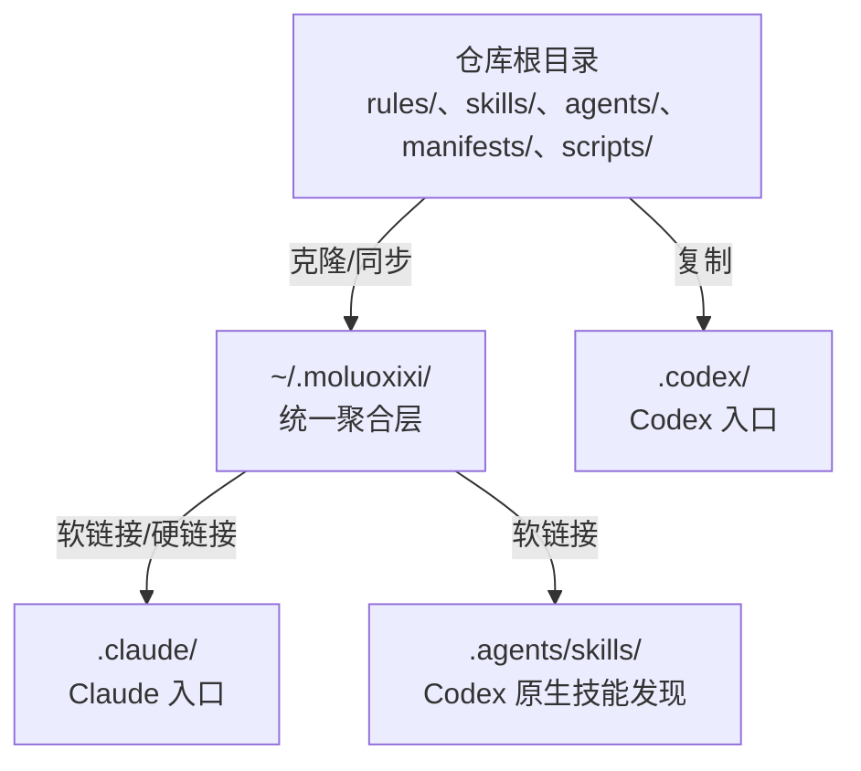
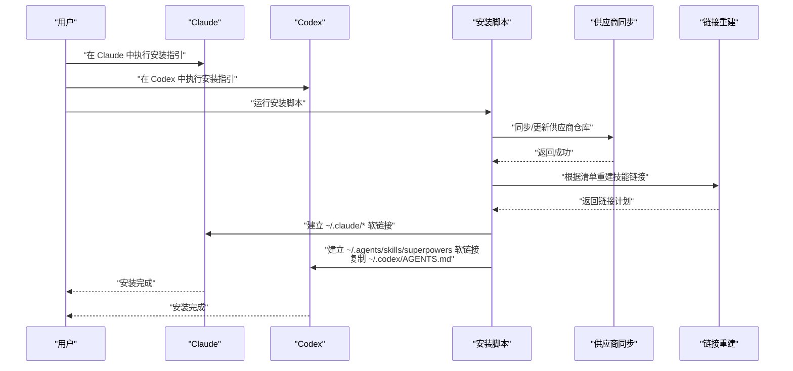
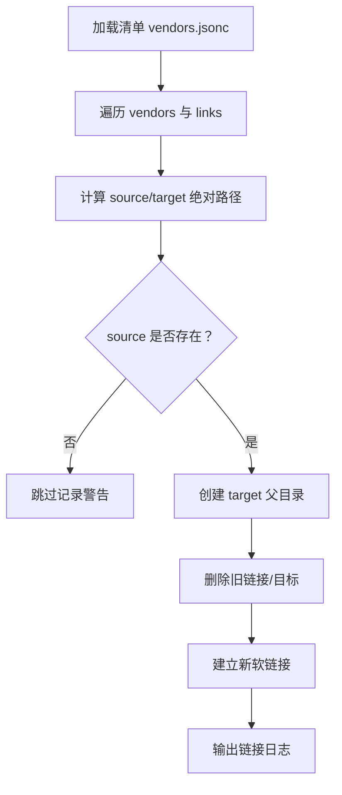
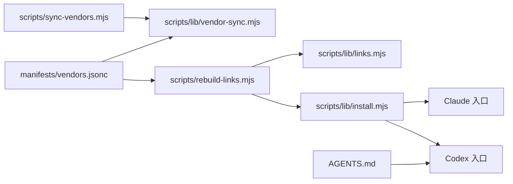

# 快速开始

<cite>
**本文引用的文件**
- [README.md](file://README.md)
- [.claude/INSTALL.md](file://.claude/INSTALL.md)
- [.claude/UPGRADE.md](file://.claude/UPGRADE.md)
- [.codex/INSTALL.md](file://.codex/INSTALL.md)
- [.codex/UPGRADE.md](file://.codex/UPGRADE.md)
- [.codex/AGENTS.md](file://.codex/AGENTS.md)
- [package.json](file://package.json)
- [scripts/lib/install.mjs](file://scripts/lib/install.mjs)
- [scripts/lib/vendor-sync.mjs](file://scripts/lib/vendor-sync.mjs)
- [scripts/lib/links.mjs](file://scripts/lib/links.mjs)
- [scripts/sync-vendors.mjs](file://scripts/sync-vendors.mjs)
- [scripts/rebuild-links.mjs](file://scripts/rebuild-links.mjs)
- [manifests/vendors.jsonc](file://manifests/vendors.jsonc)
- [rules/README.md](file://rules/README.md)
- [tests/install-docs.test.mjs](file://tests/install-docs.test.mjs)
- [tests/install-flow.test.mjs](file://tests/install-flow.test.mjs)
</cite>

## 目录
1. [简介](#简介)
2. [项目结构](#项目结构)
3. [核心组件](#核心组件)
4. [架构总览](#架构总览)
5. [详细组件解析](#详细组件解析)
6. [依赖关系分析](#依赖关系分析)
7. [性能与可靠性建议](#性能与可靠性建议)
8. [故障排除指南](#故障排除指南)
9. [结论](#结论)
10. [附录](#附录)

## 简介
本指南面向首次使用 AIRules 的用户，目标是帮助你在 Claude 与 Codex 平台上完成安装与初始化配置，使规则、技能与代理（agents）在两个平台中均可被正确识别与调用。AIRules 基于 superpowers 构建，采用“统一聚合 + 平台入口映射”的方式，既保证了第一方规则与技能的稳定，也支持第三方技能的灵活扩展。

- 安装完成后，superpowers 作为底层工作流能力保留，AIRules 将第一方规则、技能与代理组织并统一投影到 Claude 与 Codex 的读取位置。
- 本仓库同时支持 Claude 与 Codex 的安装与升级，两者共享同一套聚合层，但平台入口不同。

章节来源
- [README.md:15-49](file://README.md#L15-L49)

## 项目结构
仓库采用“平台无关的统一聚合层 + 平台特定入口”的组织方式：
- 统一聚合层：~/.moluoxixi（包含 rules、skills、agents、vendors 等）
- 平台入口：
  - Claude：~/.claude/rules、~/.claude/skills、~/.claude/agents
  - Codex：~/.agents/skills/superpowers、~/.codex/AGENTS.md

图表来源
- [.claude/INSTALL.md:13-29](file://.claude/INSTALL.md#L13-L29)
- [.codex/INSTALL.md:13-22](file://.codex/INSTALL.md#L13-L22)

章节来源
- [.claude/INSTALL.md:9-21](file://.claude/INSTALL.md#L9-L21)
- [.codex/INSTALL.md:9-22](file://.codex/INSTALL.md#L9-L22)

## 核心组件
- 安装与升级文档（Claude/Codex）
  - Claude 安装与升级：见 [.claude/INSTALL.md](file://.claude/INSTALL.md)、[.claude/UPGRADE.md](file://.claude/UPGRADE.md)
  - Codex 安装与升级：见 [.codex/INSTALL.md](file://.codex/INSTALL.md)、[.codex/UPGRADE.md](file://.codex/UPGRADE.md)
- 聚合与链接管理脚本
  - 统一安装与映射：[scripts/lib/install.mjs](file://scripts/lib/install.mjs)
  - 第三方供应商同步：[scripts/lib/vendor-sync.mjs](file://scripts/lib/vendor-sync.mjs)、[scripts/sync-vendors.mjs](file://scripts/sync-vendors.mjs)
  - 链接重建：[scripts/rebuild-links.mjs](file://scripts/rebuild-links.mjs)、[scripts/lib/links.mjs](file://scripts/lib/links.mjs)
- 供应商清单与规则
  - 供应商清单：[manifests/vendors.jsonc](file://manifests/vendors.jsonc)
  - 规则说明：[rules/README.md](file://rules/README.md)
- 平台入口说明
  - Codex 入口说明：[.codex/AGENTS.md](file://.codex/AGENTS.md)
- 测试与验证
  - 安装文档一致性测试：[tests/install-docs.test.mjs](file://tests/install-docs.test.mjs)
  - 安装流程集成测试：[tests/install-flow.test.mjs](file://tests/install-flow.test.mjs)

章节来源
- [scripts/lib/install.mjs:40-104](file://scripts/lib/install.mjs#L40-L104)
- [scripts/sync-vendors.mjs:46-59](file://scripts/sync-vendors.mjs#L46-L59)
- [scripts/rebuild-links.mjs:50-71](file://scripts/rebuild-links.mjs#L50-L71)
- [manifests/vendors.jsonc:1-107](file://manifests/vendors.jsonc#L1-L107)
- [.codex/AGENTS.md:1-61](file://.codex/AGENTS.md#L1-L61)

## 架构总览
下图展示了安装与升级在 Claude 与 Codex 两侧的总体流程与关键步骤。

图表来源
- [.claude/INSTALL.md:35-57](file://.claude/INSTALL.md#L35-L57)
- [.codex/INSTALL.md:28-52](file://.codex/INSTALL.md#L28-L52)
- [scripts/sync-vendors.mjs:46-59](file://scripts/sync-vendors.mjs#L46-L59)
- [scripts/rebuild-links.mjs:50-71](file://scripts/rebuild-links.mjs#L50-L71)
- [scripts/lib/install.mjs:85-104](file://scripts/lib/install.mjs#L85-L104)

## 详细组件解析

### 安装前准备（Claude）
- 环境要求
  - 已安装 Git
  - 已安装 Node.js
  - Claude 可正常使用
- 目标布局
  - 统一聚合层：~/.moluoxixi（vendors、rules、skills、agents）
  - Claude 入口：~/.claude/rules、~/.claude/skills、~/.claude/agents

安装步骤（macOS/Linux）
- 创建聚合目录
- 克隆或更新仓库至 ~/.moluoxixi
- 同步供应商并重建技能链接
- 建立 ~/.claude/* 软链接

安装步骤（Windows PowerShell）
- 创建聚合目录
- 克隆或更新仓库至 %USERPROFILE%\.moluoxixi
- 同步供应商并重建技能链接
- 建立符号链接（Windows 使用目录连接）

验证要点
- 确认 ~/.moluoxixi/vendors/superpowers 存在
- 确认 ~/.moluoxixi/skills 与 ~/.claude/skills 均存在且指向正确

章节来源
- [.claude/INSTALL.md:3-21](file://.claude/INSTALL.md#L3-L21)
- [.claude/INSTALL.md:33-57](file://.claude/INSTALL.md#L33-L57)
- [.claude/INSTALL.md:59-87](file://.claude/INSTALL.md#L59-L87)
- [.claude/INSTALL.md:89-102](file://.claude/INSTALL.md#L89-L102)

### 安装前准备（Codex）
- 环境要求
  - 已安装 Git
  - 已安装 Node.js
  - 已安装 Codex
- 目标布局
  - 统一聚合层：~/.moluoxixi
  - Codex 入口：~/.agents/skills/superpowers、~/.codex/AGENTS.md

安装步骤（macOS/Linux）
- 创建聚合目录
- 克隆或更新仓库至 ~/.moluoxixi
- 同步供应商并重建技能链接
- 复制 AGENTS.md 至 ~/.codex/
- 建立 ~/.agents/skills/superpowers 软链接

安装步骤（Windows PowerShell）
- 创建聚合目录
- 克隆或更新仓库至 %USERPROFILE%\.moluoxixi
- 同步供应商并重建技能链接
- 复制 AGENTS.md 至 %USERPROFILE%\.codex\
- 建立符号链接（Windows 使用目录连接）

验证要点
- 确认 ~/.moluoxixi/vendors/superpowers 存在
- 确认 ~/.agents/skills/superpowers 指向 ~/.moluoxixi/skills
- 确认 ~/.codex/AGENTS.md 已同步

章节来源
- [.codex/INSTALL.md:3-22](file://.codex/INSTALL.md#L3-L22)
- [.codex/INSTALL.md:24-52](file://.codex/INSTALL.md#L24-L52)
- [.codex/INSTALL.md:54-80](file://.codex/INSTALL.md#L54-L80)
- [.codex/INSTALL.md:82-95](file://.codex/INSTALL.md#L82-L95)

### 升级流程（Claude）
- 更新 ~/.moluoxixi 仓库
- 同步供应商并重建技能链接
- 刷新 ~/.claude/* 软链接

验证要点
- ~/.claude/skills 仍指向 ~/.moluoxixi/skills
- superpowers 与第三方技能均已更新

章节来源
- [.claude/UPGRADE.md:3-17](file://.claude/UPGRADE.md#L3-L17)
- [.claude/UPGRADE.md:19-39](file://.claude/UPGRADE.md#L19-L39)
- [.claude/UPGRADE.md:41-52](file://.claude/UPGRADE.md#L41-L52)

### 升级流程（Codex）
- 更新 ~/.moluoxixi 仓库
- 同步供应商并重建技能链接
- 刷新 ~/.agents/skills/superpowers 软链接
- 重新复制 AGENTS.md

验证要点
- superpowers 已更新
- 链接与 AGENTS.md 均保持一致

章节来源
- [.codex/UPGRADE.md:3-18](file://.codex/UPGRADE.md#L3-L18)
- [.codex/UPGRADE.md:20-38](file://.codex/UPGRADE.md#L20-L38)
- [.codex/UPGRADE.md:40-48](file://.codex/UPGRADE.md#L40-L48)

### 供应商与链接机制
- 供应商清单（manifests/vendors.jsonc）
  - 统一声明第三方仓库与链接规则
  - 示例：superpowers、anthropicSkills、vercelSkills、vercelLabsSkills、geminiSkills、reactSkills、awesomeLlmApps
- 链接重建流程
  - 读取清单，生成链接计划
  - 在 ~/.moluoxixi/skills 下建立软链接
  - 平台入口通过软链接指向统一聚合层

图表来源
- [scripts/rebuild-links.mjs:57-71](file://scripts/rebuild-links.mjs#L57-L71)
- [scripts/lib/links.mjs:5-22](file://scripts/lib/links.mjs#L5-L22)
- [manifests/vendors.jsonc:1-107](file://manifests/vendors.jsonc#L1-L107)

章节来源
- [scripts/lib/links.mjs:5-22](file://scripts/lib/links.mjs#L5-L22)
- [scripts/rebuild-links.mjs:50-71](file://scripts/rebuild-links.mjs#L50-L71)
- [manifests/vendors.jsonc:1-107](file://manifests/vendors.jsonc#L1-L107)

### 平台入口映射
- Claude 映射
  - ~/.claude/rules → ~/.moluoxixi/rules
  - ~/.claude/skills → ~/.moluoxixi/skills
  - ~/.claude/agents → ~/.moluoxixi/agents
- Codex 映射
  - ~/.agents/skills/superpowers → ~/.moluoxixi/skills
  - ~/.codex/AGENTS.md → 仓库内 AGENTS.md

章节来源
- [.claude/INSTALL.md:23-29](file://.claude/INSTALL.md#L23-L29)
- [.codex/INSTALL.md:18-22](file://.codex/INSTALL.md#L18-L22)
- [.codex/AGENTS.md:1-61](file://.codex/AGENTS.md#L1-L61)

## 依赖关系分析
- 安装脚本依赖
  - scripts/lib/install.mjs：提供路径、复制第一方内容、重建链接、映射到 Claude/Codex
  - scripts/sync-vendors.mjs：解析参数、加载清单、逐个同步供应商仓库
  - scripts/lib/vendor-sync.mjs：执行 git clone/fetch/merge 等操作
  - scripts/rebuild-links.mjs：基于清单生成链接计划并执行
  - scripts/lib/links.mjs：将清单转换为链接计划
- 清单依赖
  - manifests/vendors.jsonc：定义供应商仓库、克隆目录与链接规则
- 平台入口依赖
  - .codex/AGENTS.md：Codex 环境下的角色分层与工作流建议

图表来源
- [scripts/sync-vendors.mjs:46-59](file://scripts/sync-vendors.mjs#L46-L59)
- [scripts/rebuild-links.mjs:50-71](file://scripts/rebuild-links.mjs#L50-L71)
- [scripts/lib/install.mjs:85-104](file://scripts/lib/install.mjs#L85-L104)
- [manifests/vendors.jsonc:1-107](file://manifests/vendors.jsonc#L1-L107)
- [.codex/AGENTS.md:1-61](file://.codex/AGENTS.md#L1-L61)

章节来源
- [scripts/sync-vendors.mjs:1-62](file://scripts/sync-vendors.mjs#L1-L62)
- [scripts/rebuild-links.mjs:1-74](file://scripts/rebuild-links.mjs#L1-L74)
- [scripts/lib/install.mjs:1-105](file://scripts/lib/install.mjs#L1-L105)
- [manifests/vendors.jsonc:1-107](file://manifests/vendors.jsonc#L1-L107)

## 性能与可靠性建议
- 使用脚本而非手动复制
  - 通过 scripts/sync-vendors.mjs 与 scripts/rebuild-links.mjs 自动化处理，减少手工错误
- 保持清单与链接一致性
  - 修改清单后务必重新执行链接重建
- 平台入口稳定性
  - Claude 与 Codex 的入口均通过软链接指向统一聚合层，升级时需同步刷新入口
- 跨平台兼容性
  - Windows 使用目录连接（junction），其他系统使用目录链接（dir）

章节来源
- [scripts/lib/install.mjs:36-38](file://scripts/lib/install.mjs#L36-L38)
- [scripts/rebuild-links.mjs:46-48](file://scripts/rebuild-links.mjs#L46-L48)

## 故障排除指南
- 无法找到 Git 或 Node.js
  - 症状：安装脚本报错，提示找不到命令
  - 处理：安装 Git 与 Node.js，并确保 PATH 正确
- 供应商仓库同步失败
  - 症状：git clone/fetch/merge 失败
  - 处理：检查网络与认证配置；必要时手动清理克隆目录后重试
- 链接目标不存在
  - 症状：链接重建时出现“缺少 source”警告
  - 处理：确认供应商仓库中对应目录是否存在；如不存在，调整清单或等待上游更新
- Windows 符号链接权限问题
  - 症状：mklink 失败或无权限
  - 处理：以管理员身份运行 PowerShell；或使用开发者模式
- 平台入口未生效
  - 症状：Claude/Codex 无法读取 rules/skills/agents
  - 处理：确认软链接是否正确；重新执行安装/升级流程刷新入口

章节来源
- [scripts/lib/vendor-sync.mjs:5-19](file://scripts/lib/vendor-sync.mjs#L5-L19)
- [scripts/rebuild-links.mjs:60-64](file://scripts/rebuild-links.mjs#L60-L64)
- [.claude/INSTALL.md:59-87](file://.claude/INSTALL.md#L59-L87)
- [.codex/INSTALL.md:54-80](file://.codex/INSTALL.md#L54-L80)

## 结论
通过本指南，你可以在 Claude 与 Codex 上完成 AIRules 的安装与升级，统一聚合层确保规则与技能的一致性，平台入口映射保障两个平台的无缝使用体验。建议在修改清单或第一方内容后，及时执行链接重建与入口刷新，以维持最佳使用状态。

## 附录

### 常用命令与路径速查
- 统一聚合层：~/.moluoxixi
- Claude 入口：~/.claude/rules、~/.claude/skills、~/.claude/agents
- Codex 入口：~/.agents/skills/superpowers、~/.codex/AGENTS.md
- 供应商清单：manifests/vendors.jsonc
- 安装脚本：scripts/sync-vendors.mjs、scripts/rebuild-links.mjs
- 映射逻辑：scripts/lib/install.mjs

章节来源
- [.claude/INSTALL.md:13-29](file://.claude/INSTALL.md#L13-L29)
- [.codex/INSTALL.md:13-22](file://.codex/INSTALL.md#L13-L22)
- [scripts/lib/install.mjs:40-104](file://scripts/lib/install.mjs#L40-L104)