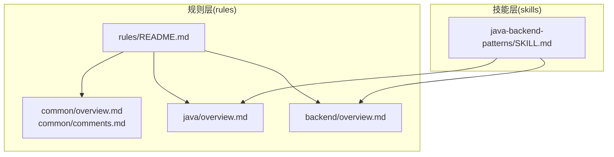
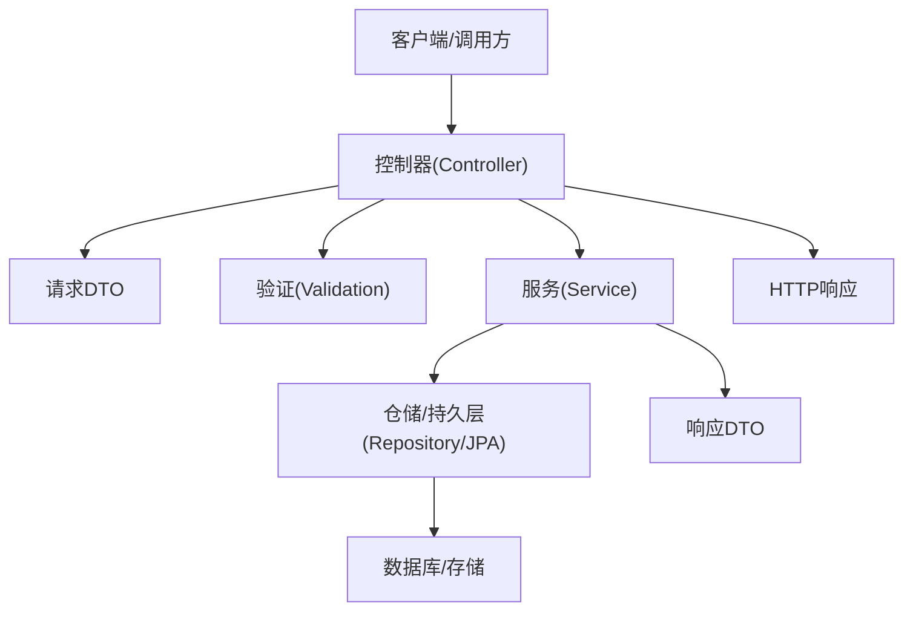
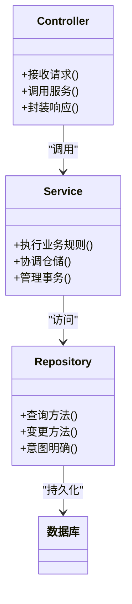
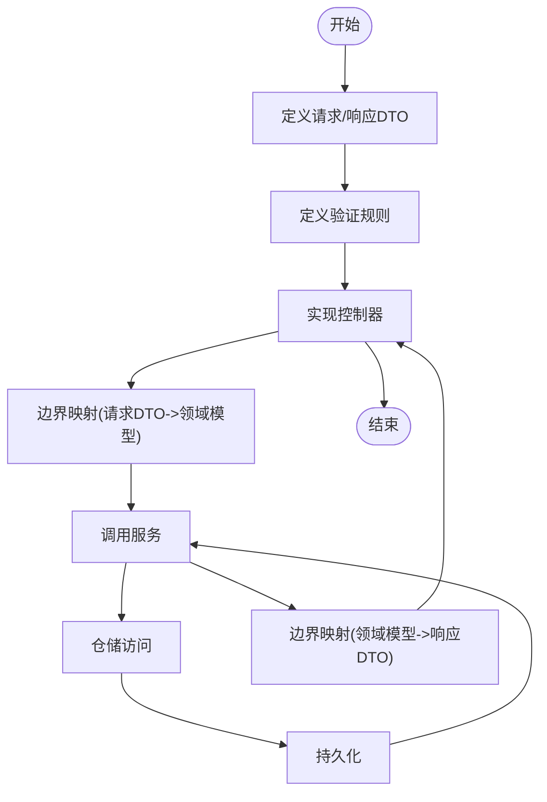
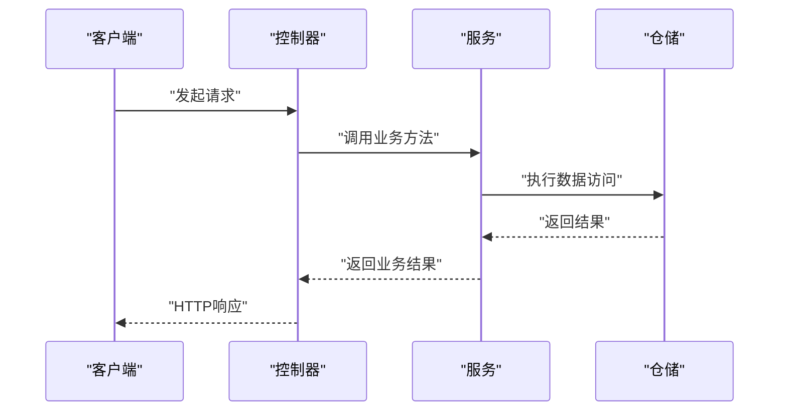
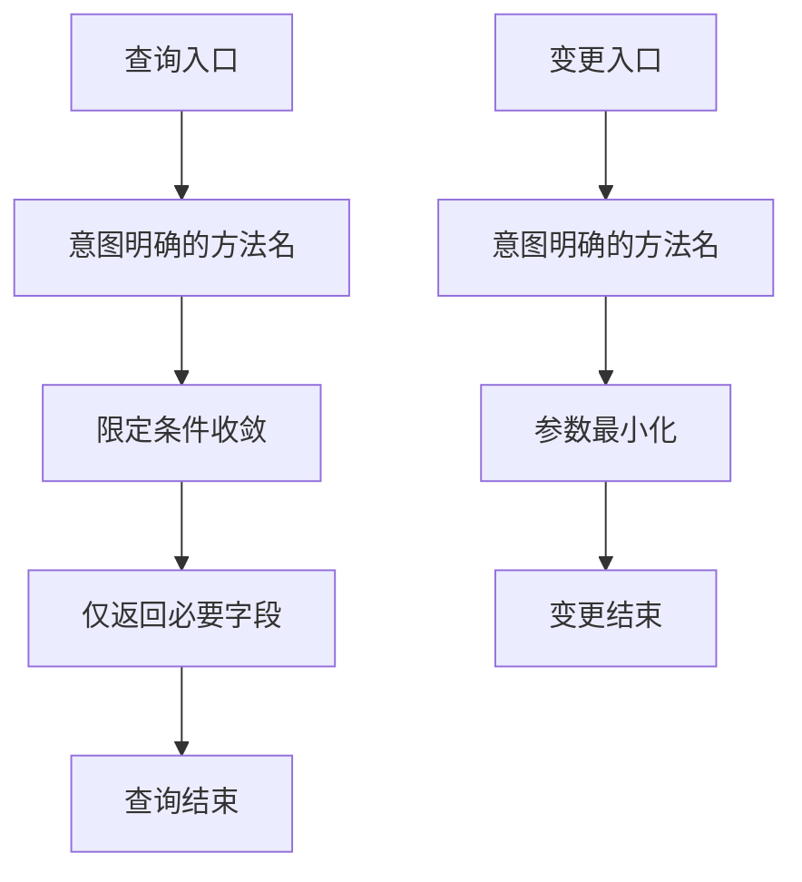
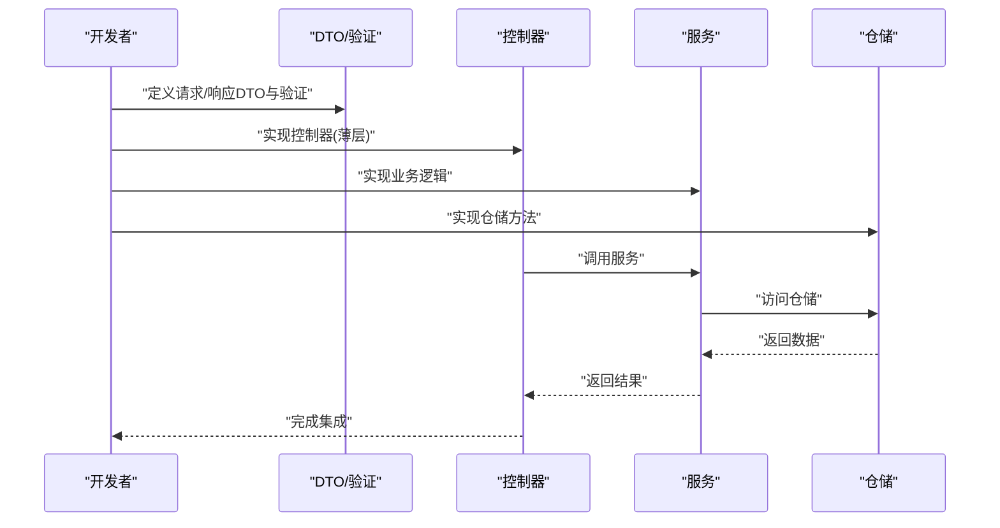
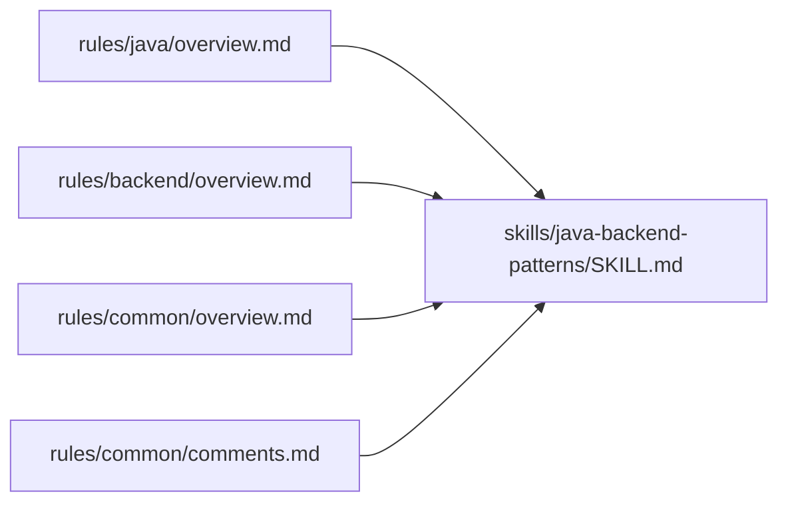

# Java 后端模式

<cite>
**本文引用的文件**
- [README.md](file://README.md)
- [skills/java-backend-patterns/SKILL.md](file://skills/java-backend-patterns/SKILL.md)
- [rules/java/overview.md](file://rules/java/overview.md)
- [rules/backend/overview.md](file://rules/backend/overview.md)
- [rules/common/overview.md](file://rules/common/overview.md)
- [rules/common/comments.md](file://rules/common/comments.md)
- [rules/README.md](file://rules/README.md)
</cite>

## 目录
1. [简介](#简介)
2. [项目结构](#项目结构)
3. [核心组件](#核心组件)
4. [架构总览](#架构总览)
5. [详细组件分析](#详细组件分析)
6. [依赖分析](#依赖分析)
7. [性能考虑](#性能考虑)
8. [故障排查指南](#故障排查指南)
9. [结论](#结论)
10. [附录](#附录)

## 简介
本文件面向 Java 后端（Spring Boot）开发团队，系统阐述“控制器-服务-仓储”三层架构的最佳实践，覆盖 DTO 映射、验证规则、事务管理与仓储方法设计等关键主题。文档以仓库中的规则与技能为依据，结合可操作的开发流程与审查清单，帮助团队在保持边界清晰的前提下，实现高可测试性、低耦合与强一致性的后端系统。

## 项目结构
该仓库采用“规则层 + 技能层”的分层组织方式：
- rules：沉淀通用约束与语言/框架特定规则，强调“要做什么”
- skills：聚焦任务流程、检查清单与实现策略，强调“如何做”
- 本文件围绕 Java 后端模式，重点引用 rules/java 与 skills/java-backend-patterns

图表来源
- [rules/README.md:1-31](file://rules/README.md#L1-L31)
- [rules/common/overview.md:1-10](file://rules/common/overview.md#L1-L10)
- [rules/common/comments.md:1-29](file://rules/common/comments.md#L1-L29)
- [rules/java/overview.md:1-9](file://rules/java/overview.md#L1-L9)
- [rules/backend/overview.md:1-9](file://rules/backend/overview.md#L1-L9)
- [skills/java-backend-patterns/SKILL.md:1-28](file://skills/java-backend-patterns/SKILL.md#L1-L28)

章节来源
- [README.md:1-50](file://README.md#L1-L50)
- [rules/README.md:1-31](file://rules/README.md#L1-L31)

## 核心组件
- 控制器（Controller）
  - 职责：仅负责传输层映射（请求解析、响应封装），不承载业务规则
  - 边界：与 DTO/验证解耦，便于单元测试与最小框架启动
- 服务（Service）
  - 职责：承载业务规则与编排，隔离领域逻辑
  - 边界：对仓储与外部依赖保持稳定契约，支持纯函数与可测试性
- 仓储（Repository/JPA）
  - 职责：专注数据访问与存储细节，方法命名应意图明确、范围收敛
  - 边界：避免隐藏事务与复杂查询逻辑，保证可预测性与可维护性
- DTO 与验证
  - 职责：在边界处定义输入输出契约与验证规则，确保数据一致性
  - 边界：与业务逻辑解耦，避免在控制器/服务中散落映射与校验
- 事务管理
  - 职责：明确事务边界，避免隐藏行为，确保失败可回滚、成功可提交
  - 边界：尽量在服务层声明式或编程式控制，保持与数据访问层清晰分离

章节来源
- [skills/java-backend-patterns/SKILL.md:10-28](file://skills/java-backend-patterns/SKILL.md#L10-L28)
- [rules/java/overview.md:5-8](file://rules/java/overview.md#L5-L8)
- [rules/backend/overview.md:5-8](file://rules/backend/overview.md#L5-L8)

## 架构总览
下图展示典型的 Spring Boot API 分层架构与数据流：

图表来源
- [skills/java-backend-patterns/SKILL.md:15-21](file://skills/java-backend-patterns/SKILL.md#L15-L21)
- [rules/java/overview.md:5-8](file://rules/java/overview.md#L5-L8)

## 详细组件分析

### 控制器-服务-仓储边界与协作
- 控制器仅负责：
  - 解析请求（绑定/映射到请求 DTO）
  - 触发验证
  - 调用服务并组装响应
- 服务负责：
  - 业务编排与规则落地
  - 事务边界的声明与控制
  - 与仓储交互获取/更新领域数据
- 仓储负责：
  - 数据访问方法命名意图明确
  - 查询与变更操作分离
  - 保持方法粒度小、职责单一

图表来源
- [skills/java-backend-patterns/SKILL.md:10-21](file://skills/java-backend-patterns/SKILL.md#L10-L21)
- [rules/java/overview.md:5-8](file://rules/java/overview.md#L5-L8)

章节来源
- [skills/java-backend-patterns/SKILL.md:10-21](file://skills/java-backend-patterns/SKILL.md#L10-L21)
- [rules/java/overview.md:5-8](file://rules/java/overview.md#L5-L8)

### DTO 映射与验证规则
- 在编写控制器与服务之前，先定义请求/响应 DTO 与验证规则
- 验证应发生在边界（控制器/DTO 层），避免在业务层散落校验
- 映射逻辑应集中且可测试，避免在控制器/服务中出现重复映射

图表来源
- [skills/java-backend-patterns/SKILL.md:17-20](file://skills/java-backend-patterns/SKILL.md#L17-L20)
- [rules/java/overview.md:6](file://rules/java/overview.md#L6)

章节来源
- [skills/java-backend-patterns/SKILL.md:17-20](file://skills/java-backend-patterns/SKILL.md#L17-L20)
- [rules/java/overview.md:6](file://rules/java/overview.md#L6)

### 事务管理最佳实践
- 明确事务边界，避免隐藏事务行为
- 优先在服务层声明事务语义，保持与数据访问层清晰分离
- 大事务拆分为小事务，降低锁竞争与超时风险
- 对幂等性与补偿机制进行设计与测试

图表来源
- [skills/java-backend-patterns/SKILL.md:12-13](file://skills/java-backend-patterns/SKILL.md#L12-L13)
- [rules/java/overview.md:7](file://rules/java/overview.md#L7)

章节来源
- [skills/java-backend-patterns/SKILL.md:12-13](file://skills/java-backend-patterns/SKILL.md#L12-L13)
- [rules/java/overview.md:7](file://rules/java/overview.md#L7)

### 仓储方法设计原则
- 方法命名意图明确，避免模糊查询
- 查询与变更分离，减少副作用
- 保持方法粒度小，便于测试与复用
- 对复杂查询进行封装，暴露稳定契约

图表来源
- [skills/java-backend-patterns/SKILL.md:13-20](file://skills/java-backend-patterns/SKILL.md#L13-L20)

章节来源
- [skills/java-backend-patterns/SKILL.md:13-20](file://skills/java-backend-patterns/SKILL.md#L13-L20)

### 开发工作流程（从 DTO 到业务分离）
- 步骤 1：定义请求/响应 DTO 与验证规则
- 步骤 2：控制器仅负责传输映射与调用服务
- 步骤 3：服务承载业务规则与编排
- 步骤 4：仓储专注于数据访问与存储细节

图表来源
- [skills/java-backend-patterns/SKILL.md:15-21](file://skills/java-backend-patterns/SKILL.md#L15-L21)

章节来源
- [skills/java-backend-patterns/SKILL.md:15-21](file://skills/java-backend-patterns/SKILL.md#L15-L21)

## 依赖分析
- 规则与技能的协作关系
  - rules/java 与 rules/backend 为通用约束与后端边界治理提供基础
  - skills/java-backend-patterns 将规则转化为可执行的工作流与检查清单
- 依赖方向
  - 技能依赖规则，确保实现策略与约束一致
  - 规则层独立于第三方，保持稳定与可复用

图表来源
- [rules/java/overview.md:1-9](file://rules/java/overview.md#L1-L9)
- [rules/backend/overview.md:1-9](file://rules/backend/overview.md#L1-L9)
- [rules/common/overview.md:1-10](file://rules/common/overview.md#L1-L10)
- [rules/common/comments.md:1-29](file://rules/common/comments.md#L1-L29)
- [skills/java-backend-patterns/SKILL.md:1-28](file://skills/java-backend-patterns/SKILL.md#L1-L28)

章节来源
- [rules/README.md:26-31](file://rules/README.md#L26-L31)

## 性能考虑
- 控制器薄化：减少序列化/反序列化与映射开销
- 服务层幂等与重试：避免重复请求导致的资源浪费
- 仓储层索引与查询优化：避免 N+1 与全表扫描
- 事务粒度：小事务、短持有、批量提交
- 缓存与异步：在服务层合理引入缓存与消息队列，降低同步延迟

## 故障排查指南
- 验证规则是否在边界处显式定义
  - 检查控制器/DTO 是否包含必要的验证注解与错误处理
- 事务边界是否清晰
  - 确认服务层是否显式声明事务，避免隐藏行为
- 映射逻辑是否集中
  - 避免在控制器/服务中散落映射，统一在 DTO/映射层处理
- 服务测试是否可最小化启动
  - 确保服务逻辑可脱离 HTTP 与数据库进行单元测试

章节来源
- [skills/java-backend-patterns/SKILL.md:22-28](file://skills/java-backend-patterns/SKILL.md#L22-L28)

## 结论
通过将规则层的约束与技能层的流程相结合，Java 后端模式强调“边界清晰、职责分离、可测试性强”。以 DTO/验证为边界、以服务承载业务、以仓储专注数据访问，辅以明确的事务与仓储方法设计原则，能够有效提升系统的可维护性与扩展性。

## 附录

### 审查清单（基于技能与规则）
- DTO 与验证是否在业务实现之前定义？
- 控制器是否仅承担传输映射职责？
- 业务规则是否集中在服务层？
- 仓储方法是否意图明确、范围收敛？
- 事务边界是否清晰且可观察？
- 映射逻辑是否集中，避免散落？
- 服务是否可在最小框架下进行单元测试？

章节来源
- [skills/java-backend-patterns/SKILL.md:22-28](file://skills/java-backend-patterns/SKILL.md#L22-L28)
- [rules/java/overview.md:5-8](file://rules/java/overview.md#L5-L8)
- [rules/backend/overview.md:5-8](file://rules/backend/overview.md#L5-L8)