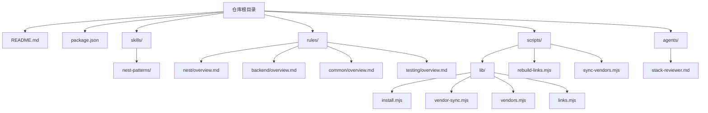
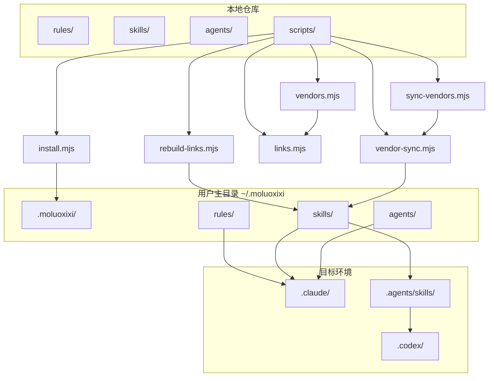
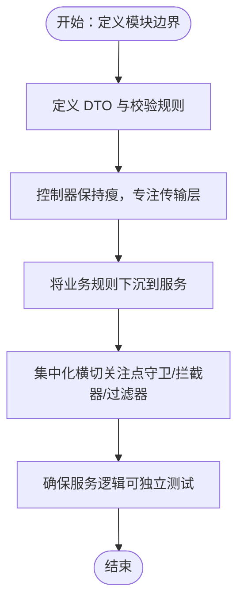
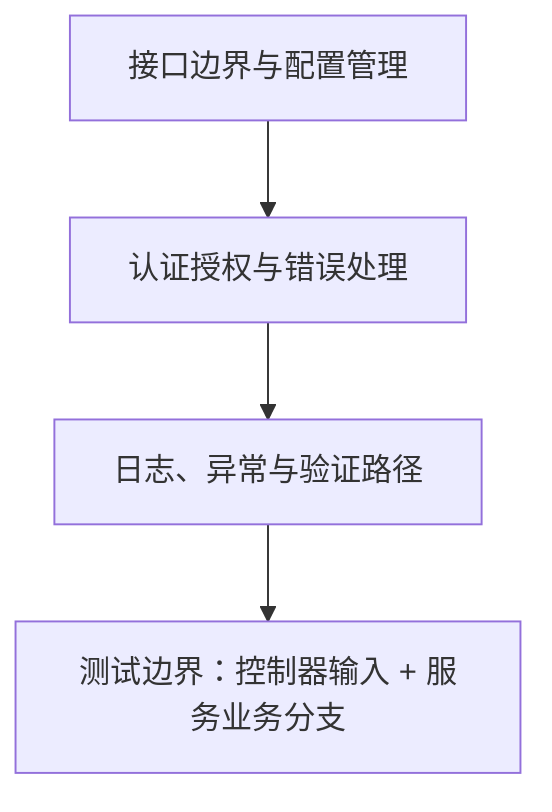
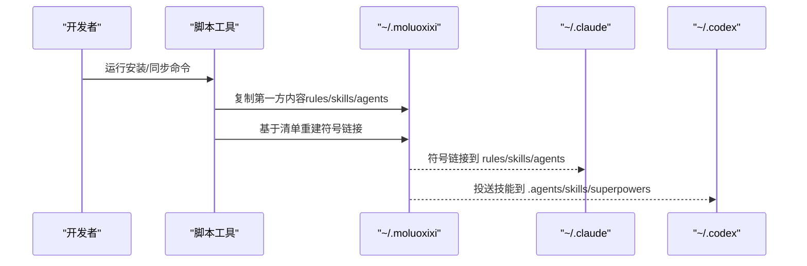
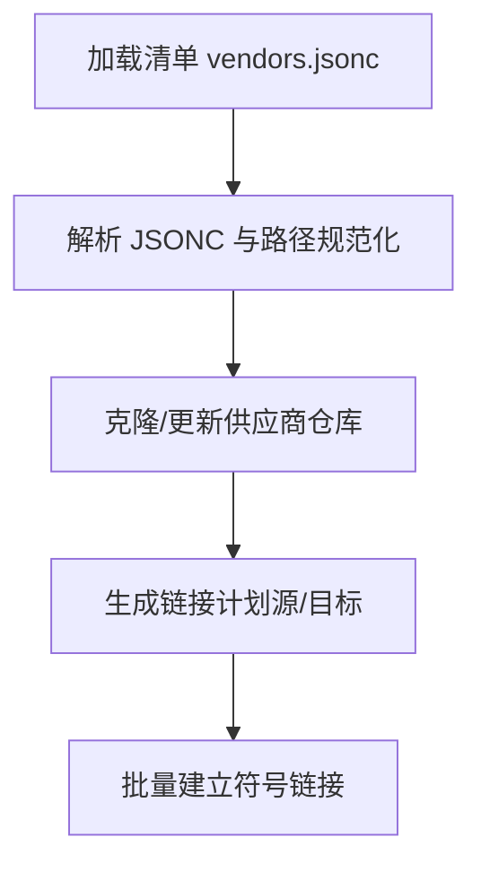
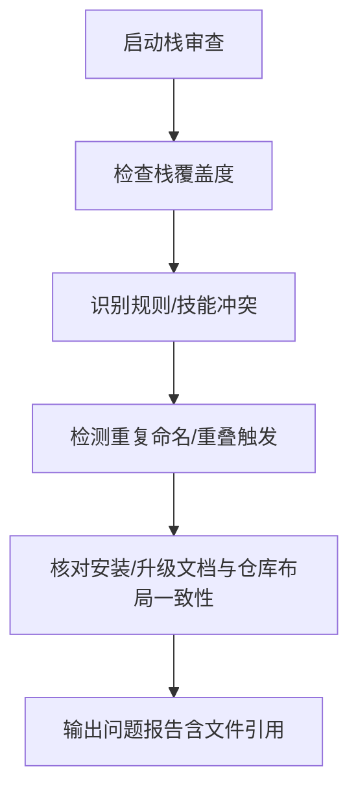
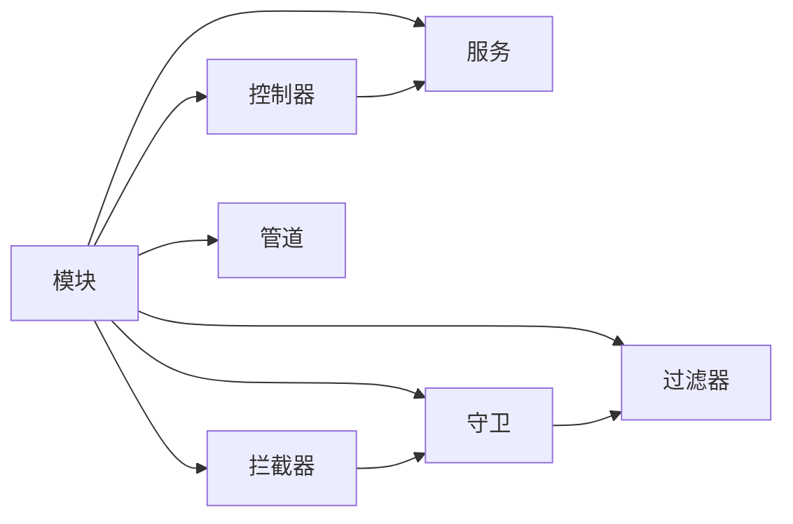

# NestJS 模式

<cite>
**本文引用的文件**
- [README.md](file://README.md)
- [package.json](file://package.json)
- [skills/nest-patterns/README.md](file://skills/nest-patterns/README.md)
- [skills/nest-patterns/SKILL.md](file://skills/nest-patterns/SKILL.md)
- [rules/nest/overview.md](file://rules/nest/overview.md)
- [rules/backend/overview.md](file://rules/backend/overview.md)
- [rules/common/overview.md](file://rules/common/overview.md)
- [rules/testing/overview.md](file://rules/testing/overview.md)
- [scripts/lib/install.mjs](file://scripts/lib/install.mjs)
- [scripts/lib/vendor-sync.mjs](file://scripts/lib/vendor-sync.mjs)
- [scripts/lib/vendors.mjs](file://scripts/lib/vendors.mjs)
- [scripts/lib/links.mjs](file://scripts/lib/links.mjs)
- [scripts/rebuild-links.mjs](file://scripts/rebuild-links.mjs)
- [scripts/sync-vendors.mjs](file://scripts/sync-vendors.mjs)
- [agents/stack-reviewer.md](file://agents/stack-reviewer.md)
</cite>

## 目录
1. [简介](#简介)
2. [项目结构](#项目结构)
3. [核心组件](#核心组件)
4. [架构总览](#架构总览)
5. [详细组件分析](#详细组件分析)
6. [依赖分析](#依赖分析)
7. [性能考虑](#性能考虑)
8. [故障排查指南](#故障排查指南)
9. [结论](#结论)
10. [附录](#附录)

## 简介
本文件系统化阐述基于 NestJS 的企业级 TypeScript 应用开发模式，围绕模块化架构、依赖注入、装饰器使用与中间件设计展开，明确控制器、服务、模块与拦截器的职责边界与交互关系，并提供从项目初始化到部署的完整流程指南。同时结合本仓库中的规则与技能，给出错误处理、日志记录与性能优化的最佳实践参考。

## 项目结构
该仓库并非一个具体的 NestJS 应用工程，而是以“规则（rules）+ 技能（skills）+ 代理（agents）+ 脚本（scripts）”为核心的个人 AI 工作流知识库，用于指导与规范 NestJS 开发实践，并通过脚本工具将规则、技能与代理统一投射到 Claude/Codex 的可读取位置。

- 根目录包含项目元信息与安装/升级指引
- skills 下的 nest-patterns 定义了 NestJS 开发的模式与检查清单
- rules 下的 nest 与 backend 提供分层与后端开发的约束
- scripts 提供安装、同步与链接重建等自动化工具
- agents 提供栈审查等代理能力

图表来源
- [README.md:1-50](file://README.md#L1-L50)
- [package.json:1-11](file://package.json#L1-L11)
- [skills/nest-patterns/SKILL.md:1-28](file://skills/nest-patterns/SKILL.md#L1-L28)
- [rules/nest/overview.md:1-9](file://rules/nest/overview.md#L1-L9)
- [rules/backend/overview.md:1-9](file://rules/backend/overview.md#L1-L9)
- [rules/common/overview.md:1-10](file://rules/common/overview.md#L1-L10)
- [rules/testing/overview.md:1-9](file://rules/testing/overview.md#L1-L9)
- [scripts/lib/install.mjs:1-105](file://scripts/lib/install.mjs#L1-L105)
- [scripts/rebuild-links.mjs:1-74](file://scripts/rebuild-links.mjs#L1-L74)
- [scripts/sync-vendors.mjs:1-62](file://scripts/sync-vendors.mjs#L1-L62)
- [agents/stack-reviewer.md:1-20](file://agents/stack-reviewer.md#L1-L20)

章节来源
- [README.md:1-50](file://README.md#L1-L50)
- [package.json:1-11](file://package.json#L1-L11)

## 核心组件
本节从开发模式角度拆解 NestJS 的关键构件与其职责边界，并结合仓库中的规则与技能进行对照。

- 模块（Module）
  - 职责：定义边界、声明提供者、导入依赖模块、暴露公共 API
  - 关键点：provider 依赖收敛，避免跨层直接耦合；配置加载通过模块或专用服务集中化
- 控制器（Controller）
  - 职责：处理传输层逻辑（路由、参数提取、响应封装），保持“瘦控制器”
  - 关键点：输入参数校验优先（DTO/管道），业务逻辑下沉至服务
- 服务（Service）
  - 职责：承载核心业务规则与领域逻辑，可独立测试
  - 关键点：无 HTTP 传输依赖，便于单元测试与复用
- 拦截器（Interceptor）、守卫（Guard）、管道（Pipe）、过滤器（Filter）
  - 职责：横切关注点（认证、日志、异常、参数转换与验证）
  - 关键点：标准化实现，集中化配置与复用

章节来源
- [skills/nest-patterns/SKILL.md:10-28](file://skills/nest-patterns/SKILL.md#L10-L28)
- [rules/nest/overview.md:5-8](file://rules/nest/overview.md#L5-L8)
- [rules/backend/overview.md:3-8](file://rules/backend/overview.md#L3-L8)

## 架构总览
下图展示了从“规则/技能/代理”到“目标环境（Claude/Codex）”的知识投射与同步机制，体现本仓库如何将 NestJS 模式与实践固化为可升级、可验证的安装/升级路径。

图表来源
- [scripts/lib/install.mjs:40-105](file://scripts/lib/install.mjs#L40-L105)
- [scripts/rebuild-links.mjs:50-74](file://scripts/rebuild-links.mjs#L50-L74)
- [scripts/sync-vendors.mjs:46-62](file://scripts/sync-vendors.mjs#L46-L62)
- [scripts/lib/vendors.mjs:64-75](file://scripts/lib/vendors.mjs#L64-L75)
- [scripts/lib/links.mjs:5-23](file://scripts/lib/links.mjs#L5-L23)
- [scripts/lib/vendor-sync.mjs:58-77](file://scripts/lib/vendor-sync.mjs#L58-L77)

## 详细组件分析

### NestJS 模式与检查清单
- 设计原则
  - 控制器保持“瘦”：仅处理传输相关逻辑
  - 业务逻辑下沉至服务：提升可测试性与可维护性
  - 输入校验优先：通过 DTO 与管道进行参数校验
  - 集中化横切关注点：通过守卫、拦截器、过滤器实现认证、日志与异常处理
- 工作流步骤
  1) 明确模块边界与公开提供者
  2) 在控制器实现前先定义 DTO
  3) 控制器方法聚焦传输层
  4) 将业务规则放入服务与领域辅助类
- 审查清单
  - DTO 与校验规则是否先于逻辑分支定义
  - 配置是否通过专用模块或服务加载
  - 认证、日志与异常处理是否标准化
  - 服务逻辑能否脱离 HTTP 传输进行测试

图表来源
- [skills/nest-patterns/SKILL.md:15-28](file://skills/nest-patterns/SKILL.md#L15-L28)

章节来源
- [skills/nest-patterns/SKILL.md:1-28](file://skills/nest-patterns/SKILL.md#L1-L28)

### 后端开发约束与测试边界
- 接口边界、配置管理、认证授权、错误处理与可维护性
- 控制器薄、服务层清晰；DTO/schema 先于业务实现
- 环境变量与密钥不硬编码；日志、异常与验证路径明确
- 测试覆盖：至少覆盖控制器输入边界与服务业务分支

图表来源
- [rules/backend/overview.md:3-9](file://rules/backend/overview.md#L3-L9)
- [rules/testing/overview.md:5-9](file://rules/testing/overview.md#L5-L9)

章节来源
- [rules/backend/overview.md:1-9](file://rules/backend/overview.md#L1-L9)
- [rules/testing/overview.md:1-9](file://rules/testing/overview.md#L1-L9)

### 安装与投送流程（从仓库到 Claude/Codex）
- 安装路径与目录结构
  - 默认安装根目录：~/.moluoxixi
  - 目标目录：~/.claude、~/.codex、~/.agents/skills
- 同步策略
  - 同步第一方内容（rules/skills/agents）到 ~/.moluoxixi
  - 基于清单重建符号链接，将技能投送到目标位置
  - 供应商仓库克隆与合并，确保可升级与可回滚

图表来源
- [scripts/lib/install.mjs:62-104](file://scripts/lib/install.mjs#L62-L104)
- [scripts/rebuild-links.mjs:50-74](file://scripts/rebuild-links.mjs#L50-L74)
- [scripts/sync-vendors.mjs:46-62](file://scripts/sync-vendors.mjs#L46-L62)

章节来源
- [scripts/lib/install.mjs:40-105](file://scripts/lib/install.mjs#L40-L105)
- [scripts/rebuild-links.mjs:1-74](file://scripts/rebuild-links.mjs#L1-L74)
- [scripts/sync-vendors.mjs:1-62](file://scripts/sync-vendors.mjs#L1-L62)

### 供应商仓库同步与清单解析
- 清单解析：支持 JSONC（带注释）与尾随逗号，解析 vendor 清单
- 供应商仓库：按清单克隆/更新，切换到默认分支并执行快进合并
- 链接计划：根据清单生成源/目标路径，排序后批量建立符号链接

图表来源
- [scripts/lib/vendors.mjs:64-75](file://scripts/lib/vendors.mjs#L64-L75)
- [scripts/lib/vendor-sync.mjs:58-77](file://scripts/lib/vendor-sync.mjs#L58-L77)
- [scripts/lib/links.mjs:5-23](file://scripts/lib/links.mjs#L5-L23)

章节来源
- [scripts/lib/vendors.mjs:1-75](file://scripts/lib/vendors.mjs#L1-L75)
- [scripts/lib/vendor-sync.mjs:1-78](file://scripts/lib/vendor-sync.mjs#L1-L78)
- [scripts/lib/links.mjs:1-23](file://scripts/lib/links.mjs#L1-L23)

### 栈审查代理（Stack Reviewer）
- 目标：在发布变更前，审查规则与技能覆盖面、冲突、重复命名与安装/升级文档一致性
- 输出：按严重程度排序的问题报告，附带文件引用

图表来源
- [agents/stack-reviewer.md:10-20](file://agents/stack-reviewer.md#L10-L20)

章节来源
- [agents/stack-reviewer.md:1-20](file://agents/stack-reviewer.md#L1-L20)

## 依赖分析
- 组件内聚与耦合
  - 模块内聚：在同一模块内收敛 provider 依赖，避免跨层耦合
  - 横切关注点集中：守卫/拦截器/过滤器统一实现，减少重复
- 外部依赖与集成点
  - 通过脚本工具与清单驱动的供应商仓库集成，保证可升级与可回滚
  - 安装/同步脚本对平台差异（Windows junction/dir）进行适配

图表来源
- [skills/nest-patterns/SKILL.md:10-28](file://skills/nest-patterns/SKILL.md#L10-L28)
- [rules/nest/overview.md:5-8](file://rules/nest/overview.md#L5-L8)

章节来源
- [skills/nest-patterns/SKILL.md:1-28](file://skills/nest-patterns/SKILL.md#L1-L28)
- [rules/nest/overview.md:1-9](file://rules/nest/overview.md#L1-L9)

## 性能考虑
- 控制器保持“瘦”，将计算密集型逻辑下沉到服务，避免在传输层引入阻塞
- 使用拦截器统一处理耗时操作（如审计日志、指标上报），但注意异步与非阻塞
- 管道与守卫应尽量轻量化，复杂校验与鉴权逻辑放在服务层
- 配置加载集中化，避免在运行期频繁 IO；缓存合理使用，避免过期数据
- 测试先行，通过服务层的纯函数与可注入依赖，提高可测性与稳定性

## 故障排查指南
- 安装/同步失败
  - 检查清单路径与权限：确认 manifests/vendors.jsonc 可读且路径正确
  - 平台差异：Windows 使用 junction，其他系统使用 dir 符号链接
  - 供应商仓库：确认网络可达，必要时手动清理缓存后重试
- 投送不生效
  - 确认 ~/.moluoxixi 下已同步第一方内容
  - 检查链接是否已重建，目标路径是否存在
- 文档与实际布局不一致
  - 使用栈审查代理扫描缺失覆盖、冲突与重复命名
  - 对照安装/升级文档与仓库实际结构

章节来源
- [scripts/lib/install.mjs:68-105](file://scripts/lib/install.mjs#L68-L105)
- [scripts/rebuild-links.mjs:50-74](file://scripts/rebuild-links.mjs#L50-L74)
- [scripts/sync-vendors.mjs:46-62](file://scripts/sync-vendors.mjs#L46-L62)
- [agents/stack-reviewer.md:12-20](file://agents/stack-reviewer.md#L12-L20)

## 结论
本仓库以规则与技能的形式，系统化沉淀了 NestJS 企业级开发的模式与最佳实践，强调“瘦控制器、厚服务、标准化横切关注点”。配合安装/同步脚本与栈审查代理，形成可验证、可升级、可回滚的交付闭环。建议在实际项目中严格遵循模块边界、输入校验优先与测试边界覆盖的原则，持续通过规则与技能迭代优化架构质量。

## 附录
- 常用脚本命令
  - 同步供应商仓库：node scripts/sync-vendors.mjs
  - 重建链接：node scripts/rebuild-links.mjs
  - 安装到用户主目录：参考安装/升级文档与脚本参数
- 相关文件路径
  - 规则与技能：rules/、skills/
  - 代理：agents/
  - 脚本：scripts/lib/*.mjs、scripts/*.mjs