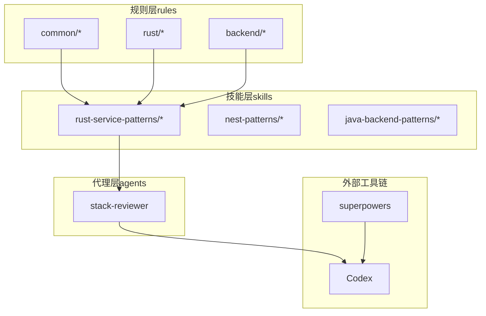
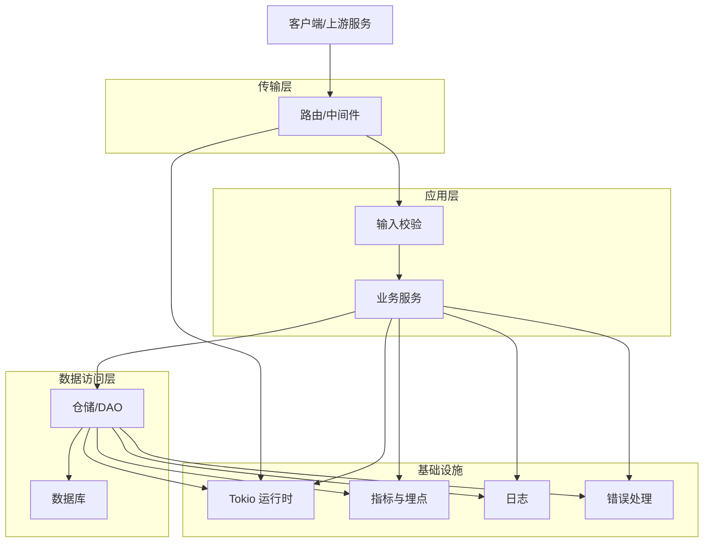
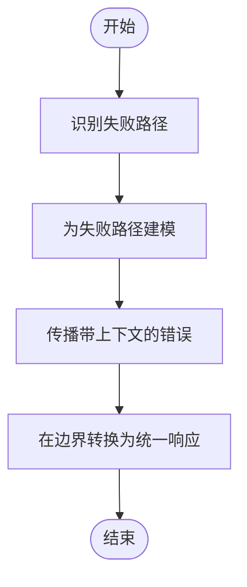
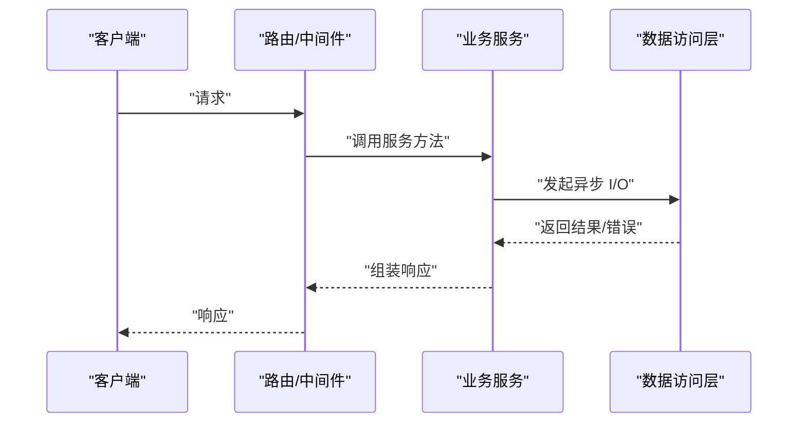
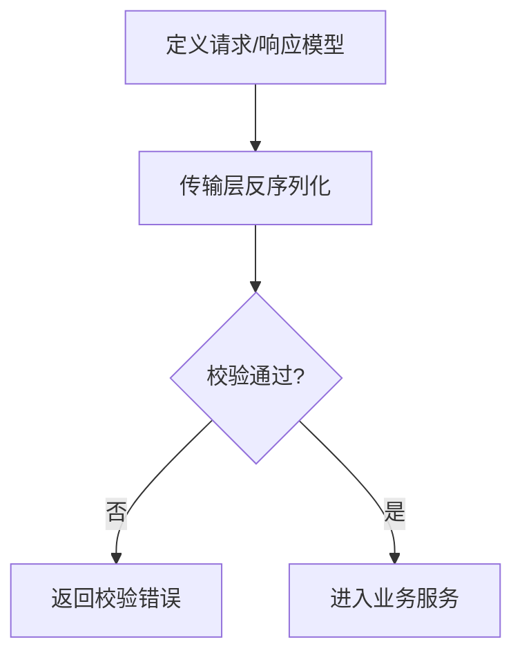
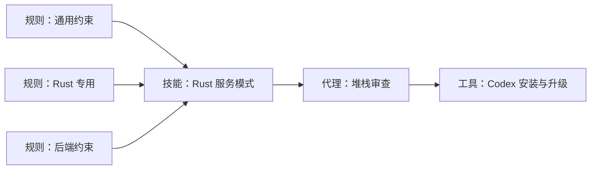

# Rust 服务模式

<cite>
**本文引用的文件**
- [README.md](file://README.md)
- [rules/README.md](file://rules/README.md)
- [rules/rust/overview.md](file://rules/rust/overview.md)
- [skills/rust-service-patterns/README.md](file://skills/rust-service-patterns/README.md)
- [skills/rust-service-patterns/SKILL.md](file://skills/rust-service-patterns/SKILL.md)
- [.codex/INSTALL.md](file://.codex/INSTALL.md)
- [agents/stack-reviewer.md](file://agents/stack-reviewer.md)
- [rules/backend/overview.md](file://rules/backend/overview.md)
- [rules/common/overview.md](file://rules/common/overview.md)
- [rules/common/comments.md](file://rules/common/comments.md)
</cite>

## 目录
1. [简介](#简介)
2. [项目结构](#项目结构)
3. [核心组件](#核心组件)
4. [架构总览](#架构总览)
5. [详细组件分析](#详细组件分析)
6. [依赖关系分析](#依赖关系分析)
7. [性能考量](#性能考量)
8. [故障排查指南](#故障排查指南)
9. [结论](#结论)
10. [附录](#附录)

## 简介
本文件面向使用 Rust 构建高性能、可维护服务的团队与个人开发者，系统阐述服务开发模式与工程化实践。内容围绕所有权系统、并发模型与内存安全保证展开，结合实际可落地的框架选型建议（如 Actix、Axum、Tokio）、数据库集成与异步编程范式，给出微服务架构设计、错误处理与监控集成的实现指南，并提供性能基准测试、内存优化与生产部署的最佳实践。

本仓库以“规则（rules）+ 技能（skills）+ 代理（agents）”的分层方式组织知识资产，其中 Rust 服务模式由规则与技能共同定义：规则提供通用约束与原则，技能给出可执行的工作流与检查清单。该结构确保了可迁移、可升级、可验证的知识体系。

章节来源
- [README.md:1-50](file://README.md#L1-L50)
- [rules/README.md:1-31](file://rules/README.md#L1-L31)

## 项目结构
仓库采用“规则层 + 技能层 + 代理层”的组织方式：
- rules：沉淀通用约束与跨语言原则，以及特定语言/框架的规则（如 Rust、Nest、Java 等）
- skills：提供可复用的工程化工作流与检查清单（如 Rust 服务模式、Nest 模式等）
- agents：用于审查与对齐规则、技能与安装升级路径的一致性

下图展示仓库结构与角色定位：

图表来源
- [rules/README.md:11-31](file://rules/README.md#L11-L31)
- [.codex/INSTALL.md:13-22](file://.codex/INSTALL.md#L13-L22)

章节来源
- [rules/README.md:1-31](file://rules/README.md#L1-L31)
- [.codex/INSTALL.md:1-95](file://.codex/INSTALL.md#L1-L95)

## 核心组件
本节聚焦 Rust 服务开发的核心原则与工作流，这些原则来自规则与技能的提炼，贯穿设计、实现与测试各阶段。

- 纯逻辑与 I/O 分离：将业务规则与网络、数据库等外部依赖解耦，提升可测试性与可维护性
- 显式错误类型：为失败路径建模，保留足够的上下文信息，便于定位与恢复
- 可见的异步边界：明确 async 边界，隔离并发控制与业务逻辑
- 强类型与小模块：通过强类型与细粒度模块划分，降低耦合并提高可读性
- 早期定义请求/响应模型：在接入 I/O 之前完成数据契约设计，确保边界清晰
- 在扩大并发前先建模失败路径：优先保证稳健性，再扩展性能
- 仅在核心逻辑可测试后引入集成点：确保业务主干稳定后再接入外部系统

章节来源
- [skills/rust-service-patterns/SKILL.md:10-27](file://skills/rust-service-patterns/SKILL.md#L10-L27)
- [rules/rust/overview.md:5-8](file://rules/rust/overview.md#L5-L8)

## 架构总览
下图展示了典型的 Rust 服务架构：控制器/路由层负责传输协议映射，服务层承载业务规则，仓储/数据访问层封装持久化细节；异步运行时与连接池支撑高并发；日志、指标与错误处理贯穿全链路。

说明
- 传输层：负责 HTTP/WS 等协议与路由分发，尽量保持薄层
- 应用层：集中业务规则，输入校验与输出序列化在边界处进行
- 数据访问层：抽象存储细节，支持事务与连接池
- 基础设施：统一的日志、指标与错误处理，贯穿各层

## 详细组件分析

### 1) 错误处理与失败路径建模
- 显式错误类型：为每个领域与子系统定义错误枚举，携带必要上下文（如资源标识、操作阶段）
- 失败路径优先建模：在引入并发与外部依赖前，先穷举失败场景并设计恢复策略
- 上下文传播：在错误类型中保留调用栈片段与关键参数，便于定位问题
- 统一错误响应：在传输层将领域错误转换为对外一致的响应格式

章节来源
- [skills/rust-service-patterns/SKILL.md:24](file://skills/rust-service-patterns/SKILL.md#L24)
- [rules/rust/overview.md:5](file://rules/rust/overview.md#L5)

### 2) 异步与并发边界
- 可见的异步边界：将 I/O 与并发包装为清晰的函数或 trait，避免分散在业务逻辑中
- 运行时与任务调度：使用运行时线程池与任务拆分，避免阻塞调用
- 资源竞争与死锁预防：通过所有权与生命周期约束减少共享状态，必要时使用消息传递或不可变共享
- 背压与限流：在网关或服务入口设置速率限制与熔断，保护下游

章节来源
- [skills/rust-service-patterns/SKILL.md:12](file://skills/rust-service-patterns/SKILL.md#L12)
- [skills/rust-service-patterns/SKILL.md:25](file://skills/rust-service-patterns/SKILL.md#L25)

### 3) 数据模型与序列化边界
- 请求/响应模型先行：在接入 I/O 之前定义强类型 DTO，明确字段含义与约束
- 序列化与校验边界：在传输层进行反序列化与校验，失败即早返回
- 版本与兼容：通过版本号或字段策略保证演进兼容

章节来源
- [skills/rust-service-patterns/SKILL.md:18](file://skills/rust-service-patterns/SKILL.md#L18)
- [skills/rust-service-patterns/SKILL.md:27](file://skills/rust-service-patterns/SKILL.md#L27)

### 4) 微服务架构设计要点
- 单一职责与边界：按业务能力拆分服务，明确 API 与数据边界
- 异步通信与事件驱动：在跨服务交互中优先使用消息队列或事件总线
- 熔断与降级：在依赖调用处实现超时、熔断与优雅降级
- 配置与治理：集中化配置与服务注册发现，配合灰度发布

章节来源
- [rules/backend/overview.md:5-8](file://rules/backend/overview.md#L5-L8)

### 5) 监控与可观测性
- 指标采集：在关键路径埋点（QPS、P95/P99、错误率、队列长度）
- 日志分级：区分结构化日志与追踪 ID，便于关联查询
- 健康检查：提供就绪/存活探针，支持滚动更新
- 链路追踪：为请求生成唯一 TraceId，贯穿服务链路

章节来源
- [rules/backend/overview.md:8](file://rules/backend/overview.md#L8)

### 6) 数据库集成与事务管理
- 仓储模式：将数据访问抽象为仓储接口，隐藏 ORM/SQL 细节
- 事务边界：明确事务范围，避免跨事务的长事务与循环依赖
- 连接池与超时：合理配置连接数与超时，防止资源耗尽
- 读写分离与分片：根据业务特征进行分库分表与读写分离

章节来源
- [rules/backend/overview.md:7](file://rules/backend/overview.md#L7)

### 7) 框架与运行时选型建议
- 运行时：Tokio 提供高性能事件循环与任务调度
- Web 框架：Axum 与 Actix-Web 均可，前者更贴近生态与类型安全，后者生态成熟、性能优异
- 序列化：Serde 作为默认序列化方案，结合 JSON/YAML/二进制格式
- 配置：dotenv、config 等库管理环境变量与配置文件
- 日志：tracing/log 结合，生产使用 structured logging
- 监控：prometheus 与 OpenTelemetry 生态

章节来源
- [skills/rust-service-patterns/SKILL.md:3](file://skills/rust-service-patterns/SKILL.md#L3)

## 依赖关系分析
下图展示规则、技能与代理之间的依赖与协作关系，体现“规则约束 + 技能执行 + 代理审查”的闭环。

图表来源
- [rules/README.md:11-31](file://rules/README.md#L11-L31)
- [skills/rust-service-patterns/SKILL.md:1-4](file://skills/rust-service-patterns/SKILL.md#L1-L4)
- [agents/stack-reviewer.md:12-19](file://agents/stack-reviewer.md#L12-L19)

章节来源
- [rules/README.md:1-31](file://rules/README.md#L1-L31)
- [agents/stack-reviewer.md:1-20](file://agents/stack-reviewer.md#L1-L20)

## 性能考量
- 基准测试：使用 criterion 或自研压测工具，覆盖关键路径（序列化、校验、I/O、业务计算）
- 内存优化：避免不必要的拷贝与分配，优先使用无分配序列化、零拷贝解析；及时释放大对象
- 并发与吞吐：合理拆分任务，避免热点竞争；使用无锁容器或分区策略
- 缓存与预热：对热点数据与计算结果进行缓存，注意一致性与失效策略
- GC/分配器：在需要时调整分配器参数或启用 jemalloc，减少碎片与停顿

## 故障排查指南
- 日志与追踪：为每个请求生成 TraceId，串联链路日志；区分 ERROR/WARN/INFO/DEBUG 级别
- 错误分类：区分业务错误、系统错误与网络错误，分别采取重试、熔断或降级
- 快速止损：在异常比例升高时自动熔断，快速失败并上报
- 回滚与灰度：通过版本与流量切分实现灰度发布与快速回滚
- 压测与演练：定期进行容量评估与故障演练，提前暴露风险点

章节来源
- [rules/backend/overview.md:8](file://rules/backend/overview.md#L8)

## 结论
Rust 服务开发的关键在于：以所有权与类型系统为基石，将纯逻辑与 I/O 解耦，通过显式错误类型与可见的异步边界保障可测试性与可维护性；在微服务架构中，强调单一职责、事件驱动与可观测性；在工程化层面，依托规则与技能形成可复用的工作流，并通过代理持续审查与对齐。遵循上述模式，可在保证内存安全与系统级性能的同时，构建高可靠、可演进的服务体系。

## 附录
- 安装与升级路径：参考 Codex 安装脚本与链接建立流程，确保本地技能入口与仓库布局一致
- 注释与文档：遵循“解释为什么、约束与边界”的原则，避免噪声注释，保持注释与代码同步

章节来源
- [.codex/INSTALL.md:24-95](file://.codex/INSTALL.md#L24-L95)
- [rules/common/comments.md:11-29](file://rules/common/comments.md#L11-L29)
- [rules/common/overview.md:5-10](file://rules/common/overview.md#L5-L10)