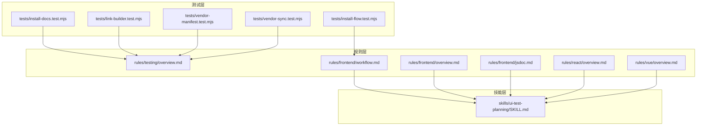
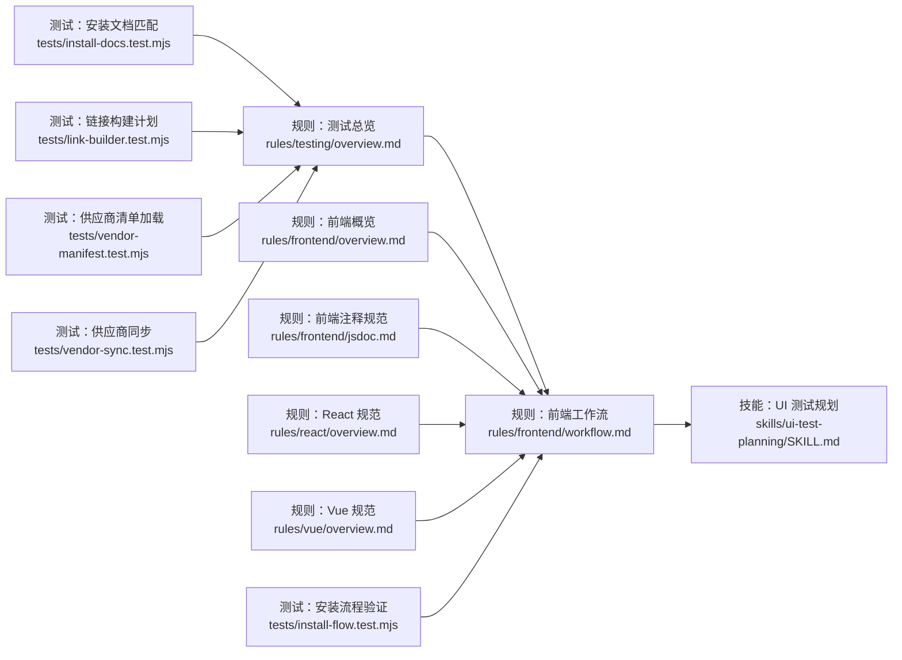
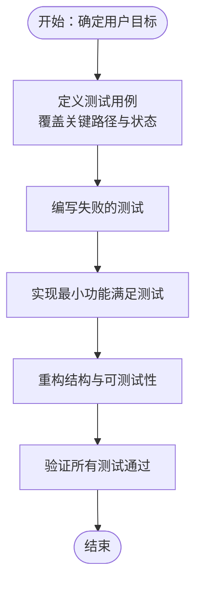
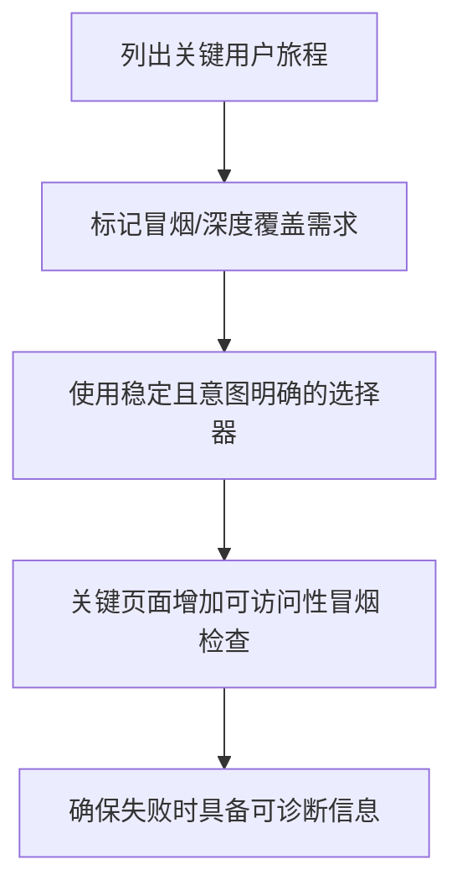
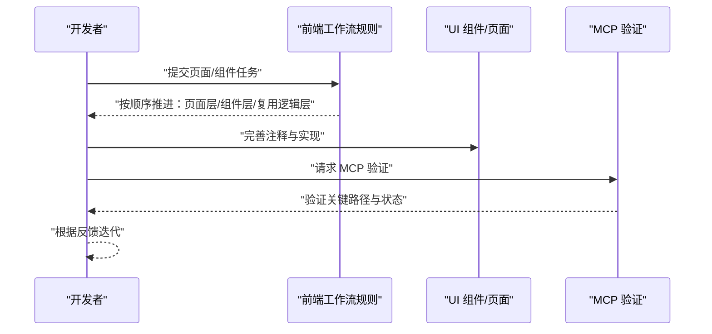
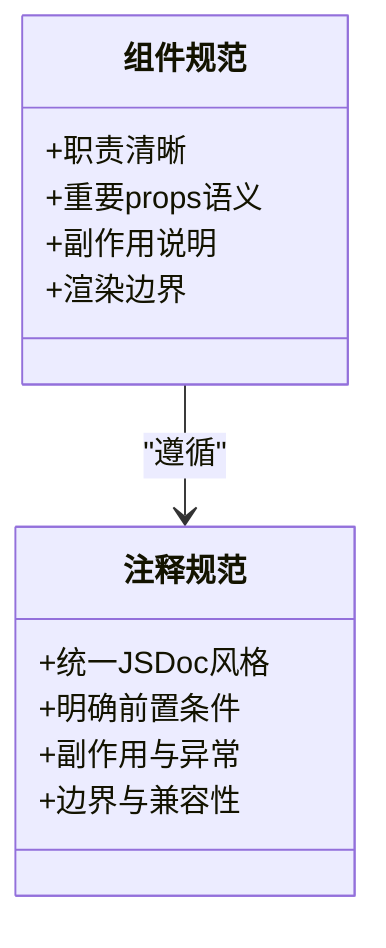
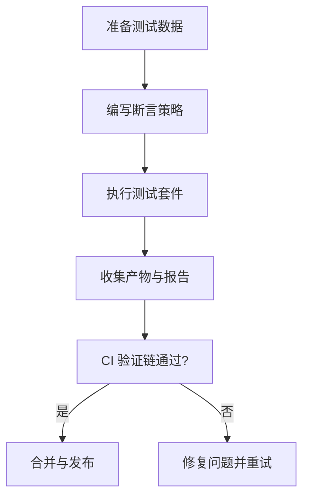
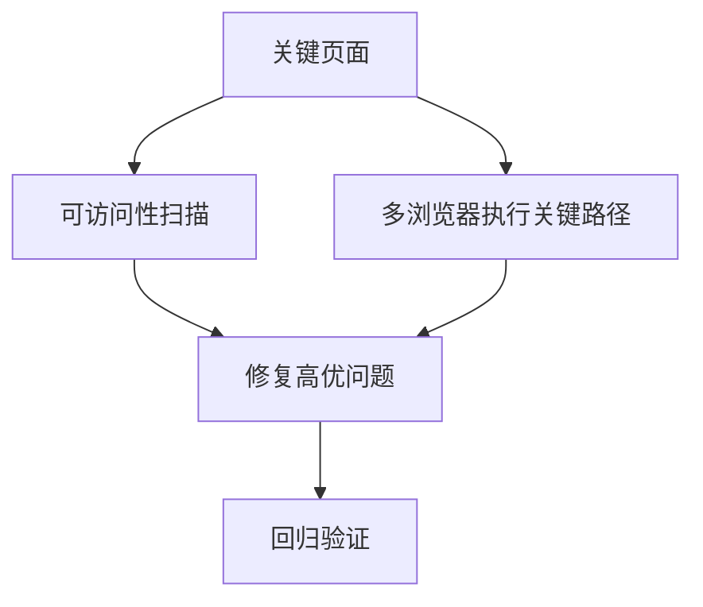
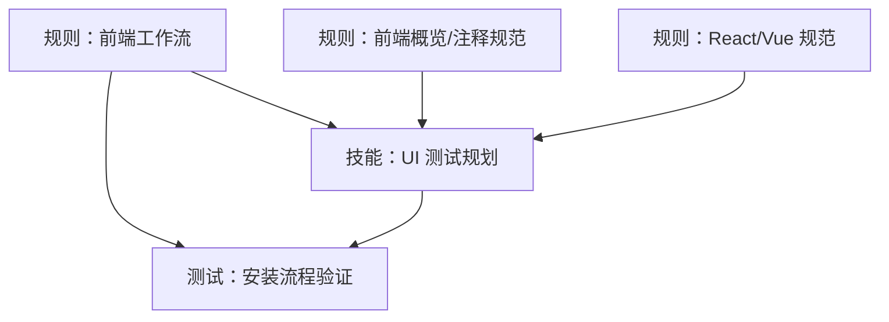
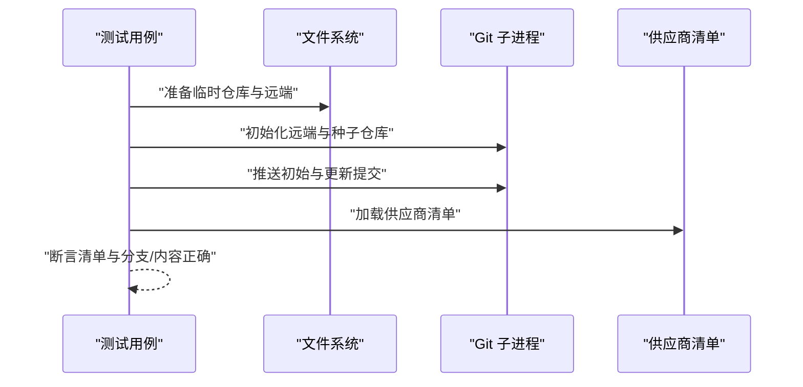

# UI 测试规划

<cite>
**本文引用的文件**
- [README.md](file://README.md)
- [package.json](file://package.json)
- [skills/ui-test-planning/README.md](file://skills/ui-test-planning/README.md)
- [skills/ui-test-planning/SKILL.md](file://skills/ui-test-planning/SKILL.md)
- [rules/testing/overview.md](file://rules/testing/overview.md)
- [rules/frontend/overview.md](file://rules/frontend/overview.md)
- [rules/frontend/workflow.md](file://rules/frontend/workflow.md)
- [rules/frontend/jsdoc.md](file://rules/frontend/jsdoc.md)
- [rules/react/overview.md](file://rules/react/overview.md)
- [rules/vue/overview.md](file://rules/vue/overview.md)
- [tests/install-docs.test.mjs](file://tests/install-docs.test.mjs)
- [tests/install-flow.test.mjs](file://tests/install-flow.test.mjs)
- [tests/link-builder.test.mjs](file://tests/link-builder.test.mjs)
- [tests/vendor-manifest.test.mjs](file://tests/vendor-manifest.test.mjs)
- [tests/vendor-sync.test.mjs](file://tests/vendor-sync.test.mjs)
</cite>

## 目录
1. [引言](#引言)
2. [项目结构](#项目结构)
3. [核心组件](#核心组件)
4. [架构总览](#架构总览)
5. [详细组件分析](#详细组件分析)
6. [依赖分析](#依赖分析)
7. [性能考虑](#性能考虑)
8. [故障排查指南](#故障排查指南)
9. [结论](#结论)
10. [附录](#附录)

## 引言
本文件面向 UI 测试规划与实施，结合仓库中的测试规则、技能与示例测试，系统阐述如何围绕用户可见行为制定测试策略，平衡测试金字塔中的单元测试、集成测试与端到端测试；介绍测试驱动开发（TDD）在 UI 开发中的落地方法；给出可访问性与跨浏览器兼容性测试的实施建议；并提供基于现有脚手架与测试实践的工具与流程参考。

## 项目结构
该仓库以“规则（rules）+ 技能（skills）+ 代理（agents）+ 测试（tests）”组织内容，其中与 UI 测试直接相关的关键要素包括：
- 规则层：前端工作流、测试总体规则、React/Vue 规范等，指导测试关注点与验证流程
- 技能层：UI 测试规划技能，明确测试范围、选择器策略与可访问性检查
- 测试层：Node 内置测试框架示例，覆盖安装流程、链接构建、供应商同步等

图表来源
- [rules/frontend/workflow.md:23-28](file://rules/frontend/workflow.md#L23-L28)
- [rules/frontend/overview.md:1-11](file://rules/frontend/overview.md#L1-L11)
- [rules/frontend/jsdoc.md:1-50](file://rules/frontend/jsdoc.md#L1-L50)
- [rules/react/overview.md:1-11](file://rules/react/overview.md#L1-L11)
- [rules/vue/overview.md:1-11](file://rules/vue/overview.md#L1-L11)
- [skills/ui-test-planning/SKILL.md:1-28](file://skills/ui-test-planning/SKILL.md#L1-L28)
- [tests/install-docs.test.mjs:1-14](file://tests/install-docs.test.mjs#L1-L14)
- [tests/install-flow.test.mjs:1-101](file://tests/install-flow.test.mjs#L1-L101)
- [tests/link-builder.test.mjs:1-36](file://tests/link-builder.test.mjs#L1-L36)
- [tests/vendor-manifest.test.mjs:1-13](file://tests/vendor-manifest.test.mjs#L1-L13)
- [tests/vendor-sync.test.mjs:1-72](file://tests/vendor-sync.test.mjs#L1-L72)

章节来源
- [README.md:1-50](file://README.md#L1-L50)
- [package.json:1-11](file://package.json#L1-L11)

## 核心组件
- 测试规则总览：强调关键路径优先、UI 测试聚焦用户可见行为、避免脆弱选择器、构建-校验-测试-文档一体化
- 前端工作流规则：明确 MCP 验证阶段需覆盖关键用户路径、用户可见行为及加载/空/错误/成功状态
- UI 测试规划技能：列出关键用户旅程、区分冒烟与深度覆盖、使用稳定且意图明确的选择器、对关键页面做可访问性冒烟检查
- 前端规范与注释：统一文档注释风格，支撑组件与交互的可测试性与可维护性
- React/Vue 规范：强调组件职责、数据流与状态边界，为 UI 测试提供稳定的被测对象

章节来源
- [rules/testing/overview.md:1-9](file://rules/testing/overview.md#L1-L9)
- [rules/frontend/workflow.md:23-28](file://rules/frontend/workflow.md#L23-L28)
- [skills/ui-test-planning/SKILL.md:1-28](file://skills/ui-test-planning/SKILL.md#L1-L28)
- [rules/frontend/overview.md:1-11](file://rules/frontend/overview.md#L1-L11)
- [rules/frontend/jsdoc.md:1-50](file://rules/frontend/jsdoc.md#L1-L50)
- [rules/react/overview.md:1-11](file://rules/react/overview.md#L1-L11)
- [rules/vue/overview.md:1-11](file://rules/vue/overview.md#L1-L11)

## 架构总览
下图展示了从规则到技能再到测试实践的整体关系，体现“规则指导测试方向、技能沉淀测试方法、测试验证规则与技能”的闭环：

图表来源
- [rules/testing/overview.md:1-9](file://rules/testing/overview.md#L1-L9)
- [rules/frontend/workflow.md:23-28](file://rules/frontend/workflow.md#L23-L28)
- [rules/frontend/overview.md:1-11](file://rules/frontend/overview.md#L1-L11)
- [rules/frontend/jsdoc.md:1-50](file://rules/frontend/jsdoc.md#L1-L50)
- [rules/react/overview.md:1-11](file://rules/react/overview.md#L1-L11)
- [rules/vue/overview.md:1-11](file://rules/vue/overview.md#L1-L11)
- [skills/ui-test-planning/SKILL.md:1-28](file://skills/ui-test-planning/SKILL.md#L1-L28)
- [tests/install-docs.test.mjs:1-14](file://tests/install-docs.test.mjs#L1-L14)
- [tests/install-flow.test.mjs:1-101](file://tests/install-flow.test.mjs#L1-L101)
- [tests/link-builder.test.mjs:1-36](file://tests/link-builder.test.mjs#L1-L36)
- [tests/vendor-manifest.test.mjs:1-13](file://tests/vendor-manifest.test.mjs#L1-L13)
- [tests/vendor-sync.test.mjs:1-72](file://tests/vendor-sync.test.mjs#L1-L72)

## 详细组件分析

### 组件一：测试金字塔与 TDD 在 UI 中的应用
- 单元测试：针对组件内部逻辑、组合式函数、工具函数进行断言，确保状态边界与数据流正确
- 集成测试：验证组件间协作、事件传播与副作用，关注关键用户旅程的端到端片段
- 端到端测试：在真实或模拟环境中覆盖完整用户目标路径，关注加载、空、错误、成功等状态
- TDD 实践：先写失败的测试，再写出满足测试的最小实现，最后重构优化结构与可测试性

章节来源
- [rules/testing/overview.md:5-9](file://rules/testing/overview.md#L5-L9)
- [rules/frontend/workflow.md:23-28](file://rules/frontend/workflow.md#L23-L28)

### 组件二：UI 测试规划技能（选择器、可访问性、冒烟与深度覆盖）
- 选择器策略：优先基于标签、角色或稳定测试 ID 的意图明确选择器，降低布局变更带来的脆弱性
- 覆盖范围：从最高价值用户旅程出发，区分冒烟覆盖与深度覆盖
- 可访问性：对关键页面进行可访问性冒烟检查
- 失败定位：确保截图、日志、痕迹易于排查

章节来源
- [skills/ui-test-planning/SKILL.md:10-28](file://skills/ui-test-planning/SKILL.md#L10-L28)

### 组件三：前端工作流与 MCP 验证
- 触发条件：页面、组件与交互任务
- 实施顺序：识别技术栈 → 页面层/组件层/复用逻辑层职责划分 → 注释完善 → MCP 验证
- MCP 验证要点：关键用户路径、用户可见行为、加载/空/错误/成功状态
- 不确定性处理：优先 MCP 调试与真实页面/接口验证，再回溯代码与上下文

图表来源
- [rules/frontend/workflow.md:17-28](file://rules/frontend/workflow.md#L17-L28)

章节来源
- [rules/frontend/workflow.md:1-43](file://rules/frontend/workflow.md#L1-L43)

### 组件四：前端规范与注释（支撑可测试性）
- 统一 JSDoc 风格，明确参数、返回、副作用、异常与边界条件
- React/Vue 组件注释强调职责、重要 props 语义、副作用与渲染边界
- 为导出组件、hooks 与复杂 util 补齐注释，提升测试可读性与可维护性

图表来源
- [rules/frontend/jsdoc.md:29-43](file://rules/frontend/jsdoc.md#L29-L43)
- [rules/react/overview.md:5-10](file://rules/react/overview.md#L5-L10)
- [rules/vue/overview.md:5-10](file://rules/vue/overview.md#L5-L10)

章节来源
- [rules/frontend/jsdoc.md:1-50](file://rules/frontend/jsdoc.md#L1-L50)
- [rules/react/overview.md:1-11](file://rules/react/overview.md#L1-L11)
- [rules/vue/overview.md:1-11](file://rules/vue/overview.md#L1-L11)

### 组件五：测试工具与断言策略（概念性说明）
- 断言策略：围绕用户目标与可见行为，优先断言 DOM 属性、可访问性属性、文本内容与交互结果
- 测试数据管理：集中管理 fixture 数据，按场景拆分；对敏感数据进行脱敏或隔离
- 持续集成：将构建、lint、测试、文档检查串联为同一验证链，确保每次提交的质量门禁

（本节为概念性说明，不直接分析具体文件）

### 组件六：可访问性测试与跨浏览器兼容性测试（概念性说明）
- 可访问性测试：在关键页面执行自动化可访问性扫描，关注对比度、键盘可达性、ARIA 角色与标签一致性
- 跨浏览器兼容性：在主流浏览器与设备上执行关键路径验证，关注布局、交互与可访问性差异

（本节为概念性说明，不直接分析具体文件）

## 依赖分析
- 规则与技能：前端工作流规则与 UI 测试规划技能共同定义了“MCP 验证”的测试范围与方法
- 测试与规则：测试用例覆盖安装流程、链接构建与供应商同步，验证规则在工程化层面的落地
- 组件耦合：前端规范与注释规范为 UI 测试提供稳定的被测对象与可读性保障

图表来源
- [rules/frontend/workflow.md:23-28](file://rules/frontend/workflow.md#L23-L28)
- [skills/ui-test-planning/SKILL.md:1-28](file://skills/ui-test-planning/SKILL.md#L1-L28)
- [tests/install-flow.test.mjs:55-100](file://tests/install-flow.test.mjs#L55-L100)

章节来源
- [rules/frontend/workflow.md:1-43](file://rules/frontend/workflow.md#L1-L43)
- [skills/ui-test-planning/SKILL.md:1-28](file://skills/ui-test-planning/SKILL.md#L1-L28)
- [tests/install-flow.test.mjs:1-101](file://tests/install-flow.test.mjs#L1-L101)

## 性能考虑
- 选择器稳定性：减少对布局与结构的依赖，降低测试执行成本与失败率
- 测试粒度：单元测试优先，集成与端到端测试聚焦关键路径，避免过度测试导致的执行时间过长
- CI 并行：将测试拆分为多个并行任务，缩短反馈周期

（本节提供一般性建议，不直接分析具体文件）

## 故障排查指南
- 安装文档匹配测试：验证安装文档中是否提及底层工作流与用户目录布局，确保指引一致性
- 安装流程测试：验证首次部署与聚合内容投递到 Claude/Codex 的正确性
- 链接构建测试：验证供应商技能链接计划生成是否包含期望目标
- 供应商清单测试：验证供应商清单包含预期来源与描述
- 供应商同步测试：验证仓库恢复分离头部并同步到远端默认分支的行为

图表来源
- [tests/vendor-sync.test.mjs:10-22](file://tests/vendor-sync.test.mjs#L10-L22)
- [tests/vendor-manifest.test.mjs:5-12](file://tests/vendor-manifest.test.mjs#L5-L12)

章节来源
- [tests/install-docs.test.mjs:1-14](file://tests/install-docs.test.mjs#L1-L14)
- [tests/install-flow.test.mjs:55-100](file://tests/install-flow.test.mjs#L55-L100)
- [tests/link-builder.test.mjs:29-35](file://tests/link-builder.test.mjs#L29-L35)
- [tests/vendor-manifest.test.mjs:5-12](file://tests/vendor-manifest.test.mjs#L5-L12)
- [tests/vendor-sync.test.mjs:24-71](file://tests/vendor-sync.test.mjs#L24-L71)

## 结论
本仓库通过“规则—技能—测试”的协同体系，为 UI 测试提供了从策略到实践的完整参考：以用户目标为导向，以稳定选择器与可访问性为基线，以 MCP 验证与测试金字塔为抓手，辅以工程化测试与 CI 验证链，确保质量与效率的平衡。结合前端规范与注释，进一步提升了可测试性与可维护性。

## 附录
- 术语
  - MCP：模型对话式验证（在前端工作流规则中用于关键路径与状态验证）
  - 冒烟测试：快速验证核心功能可用性的基础测试
  - 深度测试：覆盖更全面场景与边界条件的测试

（本节为补充说明，不直接分析具体文件）