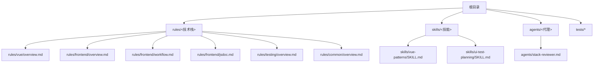
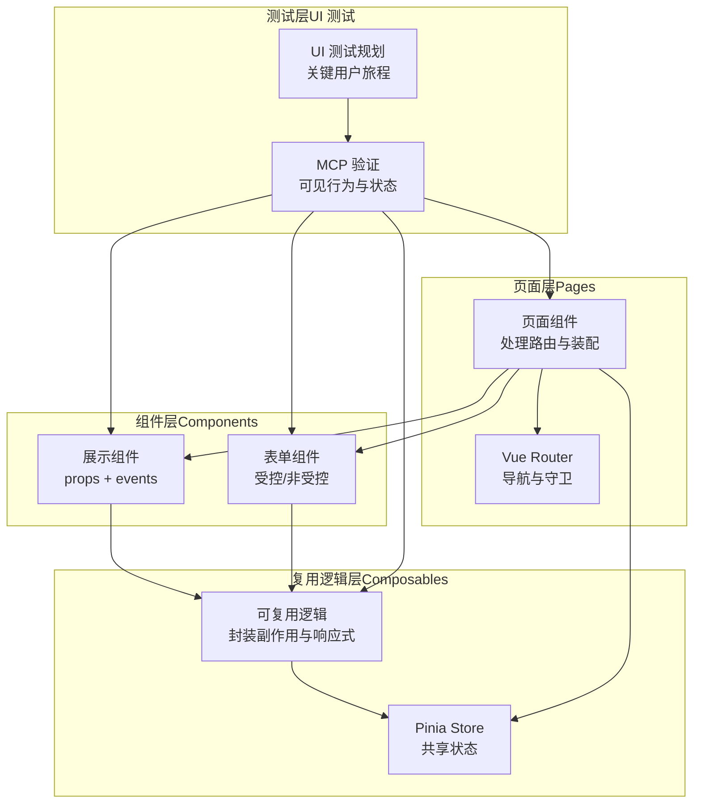
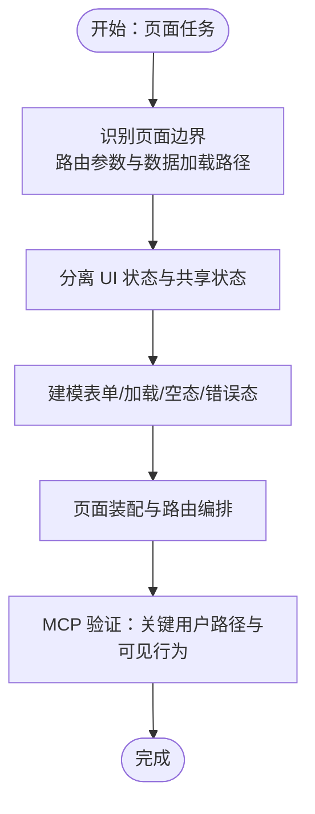
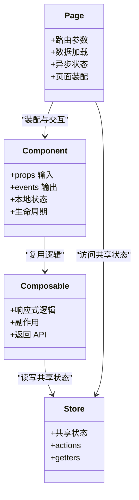
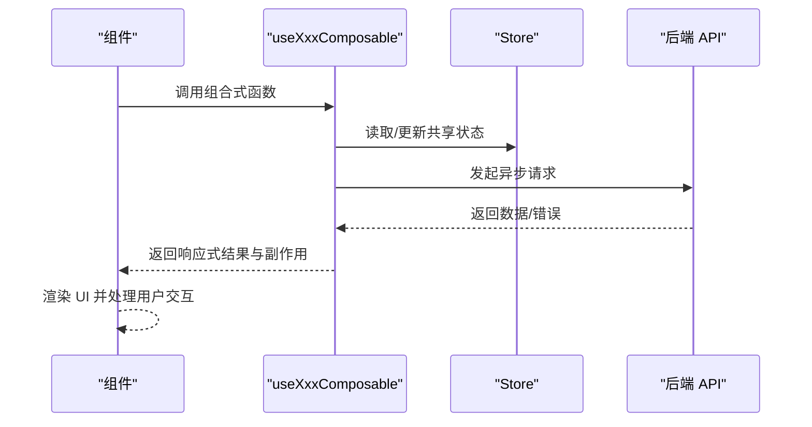
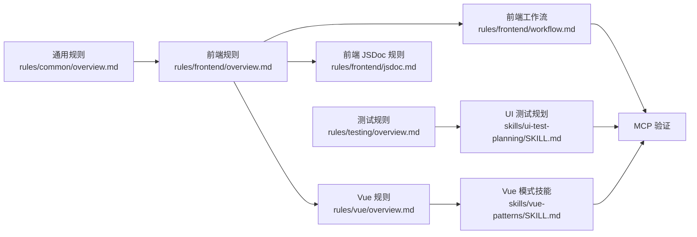

# Vue 模式

<cite>
**本文档引用的文件**
- [README.md](file://README.md)
- [package.json](file://package.json)
- [rules/vue/overview.md](file://rules/vue/overview.md)
- [skills/vue-patterns/SKILL.md](file://skills/vue-patterns/SKILL.md)
- [rules/frontend/overview.md](file://rules/frontend/overview.md)
- [rules/frontend/workflow.md](file://rules/frontend/workflow.md)
- [rules/frontend/jsdoc.md](file://rules/frontend/jsdoc.md)
- [skills/ui-test-planning/SKILL.md](file://skills/ui-test-planning/SKILL.md)
- [rules/common/overview.md](file://rules/common/overview.md)
- [rules/testing/overview.md](file://rules/testing/overview.md)
</cite>

## 目录
1. [简介](#简介)
2. [项目结构](#项目结构)
3. [核心组件](#核心组件)
4. [架构总览](#架构总览)
5. [详细组件分析](#详细组件分析)
6. [依赖关系分析](#依赖关系分析)
7. [性能考虑](#性能考虑)
8. [故障排除指南](#故障排除指南)
9. [结论](#结论)
10. [附录](#附录)

## 简介
本仓库是一套基于 superpowers 的个人 AI 开发工作流规则与技能集合，专门用于指导 Vue 3/Vite/Pinia/Vue Router 项目的架构设计与开发实践。其核心目标是：
- 明确页面层、组件层与复用逻辑层的职责边界
- 强调 Composition API 的优先使用与可测试性
- 规范状态管理（Pinia）与路由（Vue Router）的设计
- 统一前端注释风格与测试规划方法
- 提供从简单页面到复杂应用的开发指南与最佳实践

该工作流强调“先识别页面边界与数据加载路径，再分离 UI 状态与共享状态”，并通过 MCP（MCP 验证）确保关键用户路径与可见行为得到验证。

**章节来源**
- [README.md:1-50](file://README.md#L1-L50)
- [rules/common/overview.md:1-10](file://rules/common/overview.md#L1-L10)

## 项目结构
仓库采用“规则 + 技能 + 代理”的分层组织方式，围绕前端开发提供规范与实践指导：
- rules：定义各技术栈的规则与流程（如 Vue、前端通用、测试等）
- skills：提供可复用的开发技能与评审清单（如 Vue 模式、UI 测试规划）
- agents：面向特定任务的自动化代理（如堆栈审查）

**图表来源**
- [README.md:1-50](file://README.md#L1-L50)
- [rules/vue/overview.md:1-11](file://rules/vue/overview.md#L1-L11)
- [rules/frontend/overview.md:1-11](file://rules/frontend/overview.md#L1-L11)
- [rules/frontend/workflow.md:1-43](file://rules/frontend/workflow.md#L1-L43)
- [rules/frontend/jsdoc.md:1-50](file://rules/frontend/jsdoc.md#L1-L50)
- [rules/testing/overview.md:1-9](file://rules/testing/overview.md#L1-L9)
- [rules/common/overview.md:1-10](file://rules/common/overview.md#L1-L10)
- [skills/vue-patterns/SKILL.md:1-29](file://skills/vue-patterns/SKILL.md#L1-L29)
- [skills/ui-test-planning/SKILL.md:1-28](file://skills/ui-test-planning/SKILL.md#L1-L28)

**章节来源**
- [README.md:1-50](file://README.md#L1-L50)
- [package.json:1-11](file://package.json#L1-L11)

## 核心组件
本节聚焦 Vue 开发模式的关键要素：页面层与组件层的职责划分、Composition API 的使用、状态管理与路由设计、组件通信与注释规范。

- 页面层（Pages）
  - 职责：处理路由与页面装配，协调数据加载与异步状态
  - 实践：先识别页面边界、路由参数与数据加载路径，再分离 UI 状态与共享状态
- 组件层（Components）
  - 职责：专注展示与交互，尽量保持无状态或纯展示
  - 实践：通过 props 传递数据，通过事件向上反馈，避免在组件内直接访问全局状态
- 复用逻辑层（Composables）
  - 职责：封装可复用的业务逻辑与副作用，暴露响应式 API
  - 实践：遵循 JSDoc 规范，明确输入输出、副作用与调用时机限制
- 状态管理（Pinia）
  - 职责：集中管理共享状态，避免页面级 UI 状态进入 store
  - 实践：store 仅存放跨页面共享的状态，UI 状态保留在组件本地
- 路由设计（Vue Router）
  - 职责：页面级编排与导航控制
  - 实践：路由守卫与异步加载状态显式声明，保证首屏、交互与错误态完整

**章节来源**
- [rules/vue/overview.md:1-11](file://rules/vue/overview.md#L1-L11)
- [skills/vue-patterns/SKILL.md:8-29](file://skills/vue-patterns/SKILL.md#L8-L29)
- [rules/frontend/overview.md:1-11](file://rules/frontend/overview.md#L1-L11)
- [rules/frontend/workflow.md:15-27](file://rules/frontend/workflow.md#L15-L27)

## 架构总览
下图展示了 Vue 应用在页面层、组件层与复用逻辑层之间的职责边界与交互关系，以及与状态管理、路由和测试的关系。

**图表来源**
- [rules/vue/overview.md:5-9](file://rules/vue/overview.md#L5-L9)
- [skills/vue-patterns/SKILL.md:10-21](file://skills/vue-patterns/SKILL.md#L10-L21)
- [rules/frontend/workflow.md:17-27](file://rules/frontend/workflow.md#L17-L27)
- [skills/ui-test-planning/SKILL.md:10-14](file://skills/ui-test-planning/SKILL.md#L10-L14)

## 详细组件分析

### 页面层（Pages）
- 职责边界
  - 页面层负责页面级的编排与装配，包括路由参数解析、数据加载路径与异步状态管理
  - 在页面层显式声明路由守卫与异步加载状态，确保首屏、交互与错误态完整
- 实施步骤
  - 识别页面边界、路由参数与数据加载路径
  - 分离 UI 状态与共享状态，避免将页面级 UI 状态放入 Pinia
  - 明确表单、加载、空态与错误态的建模与切换逻辑
- 可测试性
  - 通过 MCP 验证关键用户路径与可见行为，确保页面功能符合预期

**图表来源**
- [rules/frontend/workflow.md:17-27](file://rules/frontend/workflow.md#L17-L27)
- [skills/vue-patterns/SKILL.md:18-21](file://skills/vue-patterns/SKILL.md#L18-L21)

**章节来源**
- [rules/frontend/workflow.md:15-27](file://rules/frontend/workflow.md#L15-L27)
- [skills/vue-patterns/SKILL.md:16-21](file://skills/vue-patterns/SKILL.md#L16-L21)

### 组件层（Components）
- 职责边界
  - 组件层专注于展示与交互，尽量保持无状态或纯展示
  - 通过 props 传递数据，通过事件向上反馈，避免在组件内直接访问全局状态
- 单文件组件结构
  - 结构建议：template、script（Composition API）、style 分离
  - 响应式数据处理：使用 ref、reactive、computed、watch 等 API
  - 生命周期管理：在 onMounted、onUnmounted 等钩子中处理副作用与清理
- 组件通信
  - 父子通信：props 向下，events 向上
  - 兄弟或跨层级通信：通过共享状态（Pinia）或事件总线（谨慎使用）

**图表来源**
- [rules/vue/overview.md:8-9](file://rules/vue/overview.md#L8-L9)
- [skills/vue-patterns/SKILL.md:10-14](file://skills/vue-patterns/SKILL.md#L10-L14)

**章节来源**
- [rules/vue/overview.md:8-9](file://rules/vue/overview.md#L8-L9)
- [skills/vue-patterns/SKILL.md:10-14](file://skills/vue-patterns/SKILL.md#L10-L14)

### 复用逻辑层（Composables）
- 设计原则
  - 将共享逻辑抽取为可复用的组合式函数，暴露响应式 API 与副作用
  - 明确输入、返回约定、副作用与调用时机限制
- 注释规范
  - 遵循前端 JSDoc 规则，重点说明业务语义、前置条件、副作用、异常与兼容性原因
- 可测试性
  - 通过可见行为驱动测试，确保 composable 的行为可验证

**图表来源**
- [rules/vue/overview.md:7-9](file://rules/vue/overview.md#L7-L9)
- [rules/frontend/jsdoc.md:29-34](file://rules/frontend/jsdoc.md#L29-L34)
- [skills/vue-patterns/SKILL.md:25-28](file://skills/vue-patterns/SKILL.md#L25-L28)

**章节来源**
- [rules/vue/overview.md:7-9](file://rules/vue/overview.md#L7-L9)
- [rules/frontend/jsdoc.md:29-34](file://rules/frontend/jsdoc.md#L29-L34)
- [skills/vue-patterns/SKILL.md:25-28](file://skills/vue-patterns/SKILL.md#L25-L28)

### 状态管理（Pinia）
- 设计原则
  - store 仅存放共享状态，避免页面级 UI 状态进入 store
  - 将路由级编排放在页面层，组件层保持展示与交互
- 最佳实践
  - 明确状态边界与作用域，避免过度共享
  - 通过 actions 组织业务流程，通过 getters 计算派生状态
- 与组件通信
  - 组件通过 Composables 间接访问 store，保持组件的可测试性

**章节来源**
- [rules/vue/overview.md:6-7](file://rules/vue/overview.md#L6-L7)
- [skills/vue-patterns/SKILL.md:13](file://skills/vue-patterns/SKILL.md#L13)

### 路由设计（Vue Router）
- 设计原则
  - 页面级编排与导航控制，显式声明路由守卫与异步加载状态
  - 首屏、交互与错误态完整，确保用户体验一致
- 实施步骤
  - 在页面层识别数据加载路径与异步状态
  - 在路由层配置守卫与懒加载策略
  - 通过页面层完成最终装配与渲染

**章节来源**
- [rules/vue/overview.md:8](file://rules/vue/overview.md#L8)
- [skills/vue-patterns/SKILL.md:11](file://skills/vue-patterns/SKILL.md#L11)
- [rules/frontend/overview.md:6](file://rules/frontend/overview.md#L6)

## 依赖关系分析
本节梳理规则、技能与测试之间的依赖关系，以及它们如何共同支撑 Vue 应用的开发与验证。

**图表来源**
- [rules/common/overview.md:1-10](file://rules/common/overview.md#L1-L10)
- [rules/frontend/overview.md:1-11](file://rules/frontend/overview.md#L1-L11)
- [rules/vue/overview.md:1-11](file://rules/vue/overview.md#L1-L11)
- [rules/frontend/workflow.md:1-43](file://rules/frontend/workflow.md#L1-L43)
- [rules/frontend/jsdoc.md:1-50](file://rules/frontend/jsdoc.md#L1-L50)
- [rules/testing/overview.md:1-9](file://rules/testing/overview.md#L1-L9)
- [skills/ui-test-planning/SKILL.md:1-28](file://skills/ui-test-planning/SKILL.md#L1-L28)
- [skills/vue-patterns/SKILL.md:1-29](file://skills/vue-patterns/SKILL.md#L1-L29)

**章节来源**
- [rules/common/overview.md:1-10](file://rules/common/overview.md#L1-L10)
- [rules/frontend/overview.md:1-11](file://rules/frontend/overview.md#L1-L11)
- [rules/vue/overview.md:1-11](file://rules/vue/overview.md#L1-L11)
- [rules/frontend/workflow.md:1-43](file://rules/frontend/workflow.md#L1-L43)
- [rules/frontend/jsdoc.md:1-50](file://rules/frontend/jsdoc.md#L1-L50)
- [rules/testing/overview.md:1-9](file://rules/testing/overview.md#L1-L9)
- [skills/ui-test-planning/SKILL.md:1-28](file://skills/ui-test-planning/SKILL.md#L1-L28)
- [skills/vue-patterns/SKILL.md:1-29](file://skills/vue-patterns/SKILL.md#L1-L29)

## 性能考虑
- 首屏与交互体验
  - 在页面层显式建模加载、空态与错误态，减少用户等待与不确定性
  - 通过路由守卫与懒加载策略优化首屏加载时间
- 组件渲染
  - 保持组件层的展示性与无状态特性，降低不必要的重渲染
  - 使用响应式 API（ref/reactive/computed/watch）精确控制依赖与更新范围
- 状态管理
  - 将共享状态集中在 store，避免在组件内重复计算与缓存
  - 通过 getters 计算派生状态，减少重复逻辑
- 测试与验证
  - 通过 UI 测试与 MCP 验证关键用户路径，确保性能与可用性

[本节为通用性能指导，无需特定文件来源]

## 故障排除指南
- 常见问题
  - 将页面级 UI 状态放入 store：违反“store 仅放共享状态”的原则
  - 组件内直接访问全局状态：破坏组件的可测试性与职责边界
  - 忽略异步加载状态：导致首屏与交互体验不佳
- 解决方案
  - 将页面级 UI 状态保留在组件本地，通过 props 与事件与父组件通信
  - 将共享逻辑抽取为 Composables，通过 Composables 访问 store
  - 在页面层显式建模加载、空态与错误态，并在路由层配置守卫
- 验证方法
  - 使用 MCP 验证关键用户路径与可见行为
  - 通过 UI 测试规划确保选择器稳定、失败日志可诊断

**章节来源**
- [skills/vue-patterns/SKILL.md:25-28](file://skills/vue-patterns/SKILL.md#L25-L28)
- [skills/ui-test-planning/SKILL.md:22-28](file://skills/ui-test-planning/SKILL.md#L22-L28)
- [rules/frontend/workflow.md:25-28](file://rules/frontend/workflow.md#L25-L28)

## 结论
本仓库为 Vue 3/Vite/Pinia/Vue Router 项目提供了系统化的开发模式与最佳实践：
- 明确页面层、组件层与复用逻辑层的职责边界
- 强调 Composition API 的优先使用与可测试性
- 规范状态管理与路由设计，确保首屏与交互体验
- 通过 JSDoc 与 UI 测试规划提升代码质量与可维护性
- 以 MCP 验证关键用户路径，保障交付质量

[本节为总结性内容，无需特定文件来源]

## 附录
- 安装与升级
  - 支持在 Claude 与 Codex 中通过指定安装脚本完成规则与技能的集成
- 测试脚本
  - 项目提供基础测试脚本，便于验证安装与升级流程

**章节来源**
- [README.md:15-49](file://README.md#L15-L49)
- [package.json:7-9](file://package.json#L7-L9)