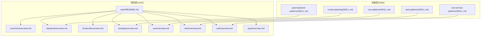
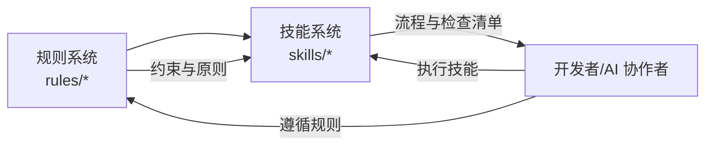
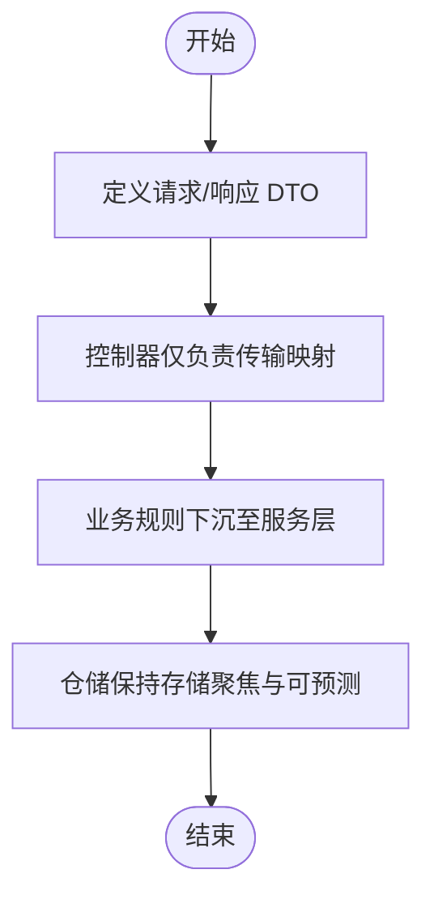
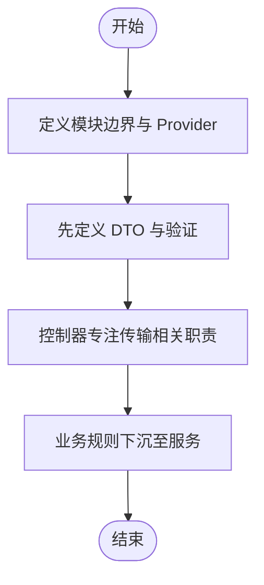
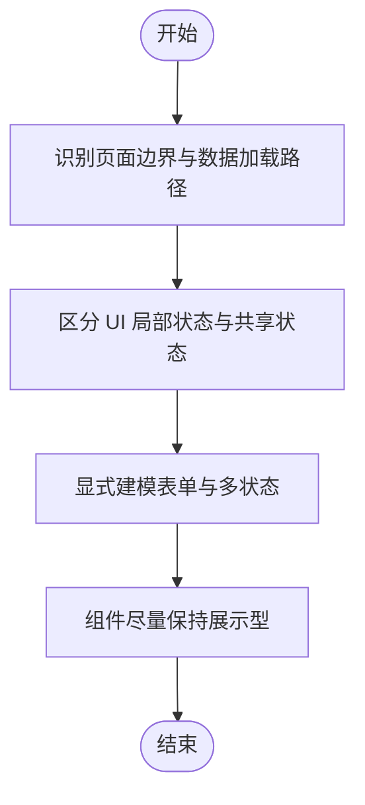
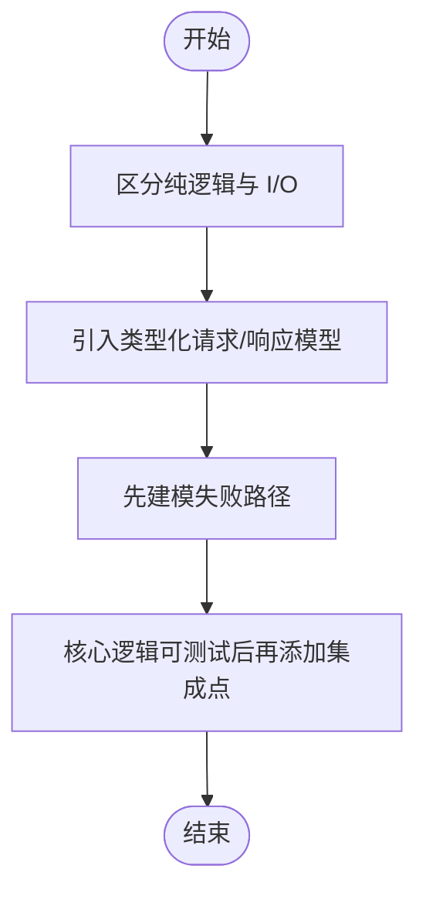
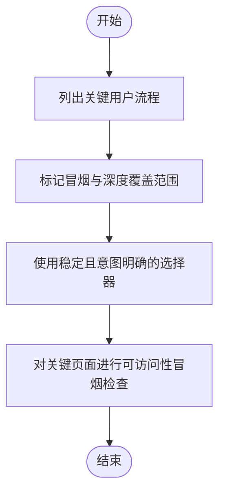
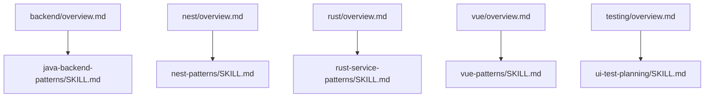

# 技能系统

<cite>
**本文引用的文件**
- [skills/java-backend-patterns/SKILL.md](file://skills/java-backend-patterns/SKILL.md)
- [skills/nest-patterns/SKILL.md](file://skills/nest-patterns/SKILL.md)
- [skills/rust-service-patterns/SKILL.md](file://skills/rust-service-patterns/SKILL.md)
- [skills/ui-test-planning/SKILL.md](file://skills/ui-test-planning/SKILL.md)
- [skills/vue-patterns/SKILL.md](file://skills/vue-patterns/SKILL.md)
- [rules/README.md](file://rules/README.md)
- [rules/common/overview.md](file://rules/common/overview.md)
- [rules/backend/overview.md](file://rules/backend/overview.md)
- [rules/frontend/overview.md](file://rules/frontend/overview.md)
- [rules/testing/overview.md](file://rules/testing/overview.md)
- [rules/vue/overview.md](file://rules/vue/overview.md)
- [rules/nest/overview.md](file://rules/nest/overview.md)
- [rules/rust/overview.md](file://rules/rust/overview.md)
- [rules/java/overview.md](file://rules/java/overview.md)
- [README.md](file://README.md)
</cite>

## 目录
1. [简介](#简介)
2. [项目结构](#项目结构)
3. [核心组件](#核心组件)
4. [架构总览](#架构总览)
5. [详细组件分析](#详细组件分析)
6. [依赖分析](#依赖分析)
7. [性能考虑](#性能考虑)
8. [故障排查指南](#故障排查指南)
9. [结论](#结论)
10. [附录](#附录)

## 简介
本仓库提供了一套面向 AI 开发工作流的“技能系统”，围绕不同技术栈（Java 后端、NestJS、Vue、Rust 服务）与 UI 测试规划，给出可复用的实现模式、检查清单与协作建议。技能系统与规则系统协同工作：规则系统提供通用约束与设计原则，技能系统聚焦任务流程、检查清单与技术栈落地策略。该体系既可用于日常开发，也可用于 AI 协作场景下的代码生成与审查。

## 项目结构
仓库采用“规则层 + 技能层”的分层组织方式：
- rules：通用与技术栈规则，定义约束与设计原则
- skills：各技术栈的技能模板，提供流程步骤与检查清单
- README：总体介绍与安装/升级指引

图表来源
- [rules/README.md:1-31](file://rules/README.md#L1-L31)
- [rules/common/overview.md:1-10](file://rules/common/overview.md#L1-L10)
- [rules/backend/overview.md:1-9](file://rules/backend/overview.md#L1-L9)
- [rules/frontend/overview.md:1-11](file://rules/frontend/overview.md#L1-L11)
- [rules/testing/overview.md:1-9](file://rules/testing/overview.md#L1-L9)
- [rules/vue/overview.md:1-11](file://rules/vue/overview.md#L1-L11)
- [rules/nest/overview.md:1-9](file://rules/nest/overview.md#L1-L9)
- [rules/rust/overview.md:1-9](file://rules/rust/overview.md#L1-L9)
- [rules/java/overview.md:1-9](file://rules/java/overview.md#L1-L9)
- [skills/java-backend-patterns/SKILL.md:1-28](file://skills/java-backend-patterns/SKILL.md#L1-L28)
- [skills/nest-patterns/SKILL.md:1-28](file://skills/nest-patterns/SKILL.md#L1-L28)
- [skills/rust-service-patterns/SKILL.md:1-28](file://skills/rust-service-patterns/SKILL.md#L1-L28)
- [skills/vue-patterns/SKILL.md:1-29](file://skills/vue-patterns/SKILL.md#L1-L29)
- [skills/ui-test-planning/SKILL.md:1-28](file://skills/ui-test-planning/SKILL.md#L1-L28)

章节来源
- [README.md:1-50](file://README.md#L1-L50)
- [rules/README.md:1-31](file://rules/README.md#L1-L31)

## 核心组件
- 规则层（rules）
  - common：通用设计原则与约束
  - backend/frontend/testing：分别覆盖后端、前端与测试领域的通用规则
  - 各技术栈子目录：java、nest、vue、rust 等，提供该技术栈特有的约束与最佳实践
- 技能层（skills）
  - java-backend-patterns：Java 后端（Spring Boot 等）的实现模式与检查清单
  - nest-patterns：NestJS 应用的模块化、DTO、管道、守卫等模式
  - rust-service-patterns：Rust 服务的异步、错误建模、模块化与可测试性
  - vue-patterns：Vue 3 / Vite / Pinia / Router 的结构化模式
  - ui-test-planning：UI 测试规划与覆盖策略

章节来源
- [rules/common/overview.md:1-10](file://rules/common/overview.md#L1-L10)
- [rules/backend/overview.md:1-9](file://rules/backend/overview.md#L1-L9)
- [rules/frontend/overview.md:1-11](file://rules/frontend/overview.md#L1-L11)
- [rules/testing/overview.md:1-9](file://rules/testing/overview.md#L1-L9)
- [rules/vue/overview.md:1-11](file://rules/vue/overview.md#L1-L11)
- [rules/nest/overview.md:1-9](file://rules/nest/overview.md#L1-L9)
- [rules/rust/overview.md:1-9](file://rules/rust/overview.md#L1-L9)
- [rules/java/overview.md:1-9](file://rules/java/overview.md#L1-L9)
- [skills/java-backend-patterns/SKILL.md:1-28](file://skills/java-backend-patterns/SKILL.md#L1-L28)
- [skills/nest-patterns/SKILL.md:1-28](file://skills/nest-patterns/SKILL.md#L1-L28)
- [skills/rust-service-patterns/SKILL.md:1-28](file://skills/rust-service-patterns/SKILL.md#L1-L28)
- [skills/vue-patterns/SKILL.md:1-29](file://skills/vue-patterns/SKILL.md#L1-L29)
- [skills/ui-test-planning/SKILL.md:1-28](file://skills/ui-test-planning/SKILL.md#L1-L28)

## 架构总览
技能系统与规则系统的协作关系如下：
- 规则系统提供“要做什么”的约束与原则，强调可复用与跨任务稳定性
- 技能系统提供“怎么做”的流程步骤、边界划分与检查清单，强调技术栈落地
- 技能引用规则，确保实现与通用约束对齐；当某条要求需要长期覆盖多个技能时，优先沉淀到规则层

图表来源
- [rules/README.md:26-31](file://rules/README.md#L26-L31)
- [README.md:1-50](file://README.md#L1-L50)

章节来源
- [rules/README.md:1-31](file://rules/README.md#L1-L31)
- [README.md:1-50](file://README.md#L1-L50)

## 详细组件分析

### Java 后端模式（skills/java-backend-patterns）
- 设计目标与组织方式
  - 明确控制器、服务与持久层边界，强调 DTO 与验证先行
  - 事务边界清晰，仓储方法聚焦且意图明确
- 使用场景
  - Spring Boot API 开发与重构
  - 需要强边界与可测试性的企业级后端
- 最佳实践
  - 先定义请求/响应 DTO，再编写控制器映射
  - 业务规则下沉至服务层，仓储仅关注存储
  - 在服务层进行最小化框架依赖的单元测试
- 实际应用示例（路径参考）
  - [技能定义:1-28](file://skills/java-backend-patterns/SKILL.md#L1-L28)
  - [后端通用规则:1-9](file://rules/backend/overview.md#L1-L9)
  - [通用规则概览:1-10](file://rules/common/overview.md#L1-L10)

图表来源
- [skills/java-backend-patterns/SKILL.md:15-21](file://skills/java-backend-patterns/SKILL.md#L15-L21)

章节来源
- [skills/java-backend-patterns/SKILL.md:1-28](file://skills/java-backend-patterns/SKILL.md#L1-L28)
- [rules/backend/overview.md:1-9](file://rules/backend/overview.md#L1-L9)
- [rules/common/overview.md:1-10](file://rules/common/overview.md#L1-L10)

### NestJS 模式（skills/nest-patterns）
- 设计目标与组织方式
  - 控制器保持纤薄，业务逻辑迁移到服务
  - 输入验证通过 DTO 与管道完成，跨领域行为集中到守卫/拦截器
- 使用场景
  - NestJS 应用的模块化、可测试性与可维护性
- 最佳实践
  - 先定义模块边界与公开 Provider，再实现控制器
  - 以 DTO 与管道统一输入验证，避免分散的校验逻辑
  - 认证、日志与错误处理标准化
- 实际应用示例（路径参考）
  - [技能定义:1-28](file://skills/nest-patterns/SKILL.md#L1-L28)
  - [Nest 通用规则:1-9](file://rules/nest/overview.md#L1-L9)

图表来源
- [skills/nest-patterns/SKILL.md:15-21](file://skills/nest-patterns/SKILL.md#L15-L21)

章节来源
- [skills/nest-patterns/SKILL.md:1-28](file://skills/nest-patterns/SKILL.md#L1-L28)
- [rules/nest/overview.md:1-9](file://rules/nest/overview.md#L1-L9)

### Vue 模式（skills/vue-patterns）
- 设计目标与组织方式
  - 优先使用 Composition API 复用逻辑，路由级编排在页面，可组合逻辑放入 Composables
  - Pinia 仅承载共享状态，不混入页面局部 UI 状态
- 使用场景
  - Vue 3 / Vite / Pinia / Router 应用的结构化开发
- 最佳实践
  - 先识别页面边界、路由参数与数据加载路径
  - 明确表单、加载、空态与错误态
  - 组件尽量保持展示型
- 实际应用示例（路径参考）
  - [技能定义:1-29](file://skills/vue-patterns/SKILL.md#L1-L29)
  - [前端通用规则:1-11](file://rules/frontend/overview.md#L1-L11)
  - [Vue 通用规则:1-11](file://rules/vue/overview.md#L1-L11)

图表来源
- [skills/vue-patterns/SKILL.md:16-22](file://skills/vue-patterns/SKILL.md#L16-L22)

章节来源
- [skills/vue-patterns/SKILL.md:1-29](file://skills/vue-patterns/SKILL.md#L1-L29)
- [rules/frontend/overview.md:1-11](file://rules/frontend/overview.md#L1-L11)
- [rules/vue/overview.md:1-11](file://rules/vue/overview.md#L1-L11)

### Rust 服务模式（skills/rust-service-patterns）
- 设计目标与组织方式
  - 纯逻辑与 I/O 分离，显式错误类型，异步边界清晰，模块小而强类型
- 使用场景
  - Rust 后端服务、异步工作者、CLI 或 API（Tokio、Axum、Actix、Serde）
- 最佳实践
  - 区分纯逻辑与 I/O，尽早引入类型化请求/响应模型
  - 在扩大并发前先建模失败路径
  - 在核心逻辑可测试后再添加集成点
- 实际应用示例（路径参考）
  - [技能定义:1-28](file://skills/rust-service-patterns/SKILL.md#L1-L28)
  - [Rust 通用规则:1-9](file://rules/rust/overview.md#L1-L9)

图表来源
- [skills/rust-service-patterns/SKILL.md:15-21](file://skills/rust-service-patterns/SKILL.md#L15-L21)

章节来源
- [skills/rust-service-patterns/SKILL.md:1-28](file://skills/rust-service-patterns/SKILL.md#L1-L28)
- [rules/rust/overview.md:1-9](file://rules/rust/overview.md#L1-L9)

### UI 测试规划（skills/ui-test-planning）
- 设计目标与组织方式
  - 从最高价值用户旅程出发，测试用户可见行为而非实现细节
  - 选择器稳定且意图明确，覆盖加载、空、错误与成功状态
- 使用场景
  - Web 页面或应用的 UI 测试覆盖率规划与评审
- 最佳实践
  - 列出关键用户流程，区分冒烟与深度覆盖
  - 优先使用与标签、角色或稳定测试 ID 绑定的选择器
  - 对关键页面进行可访问性冒烟检查
- 实际应用示例（路径参考）
  - [技能定义:1-28](file://skills/ui-test-planning/SKILL.md#L1-L28)
  - [测试通用规则:1-9](file://rules/testing/overview.md#L1-L9)

图表来源
- [skills/ui-test-planning/SKILL.md:15-21](file://skills/ui-test-planning/SKILL.md#L15-L21)

章节来源
- [skills/ui-test-planning/SKILL.md:1-28](file://skills/ui-test-planning/SKILL.md#L1-L28)
- [rules/testing/overview.md:1-9](file://rules/testing/overview.md#L1-L9)

## 依赖分析
- 技能与规则的依赖关系
  - 各技能均以相应技术栈的规则为约束基础，确保实现与通用原则一致
  - 当某条要求需要长期覆盖多个技能时，优先沉淀到规则层，再由技能引用
- 耦合与内聚
  - 技能内部高内聚（流程与检查清单），与规则层低耦合（通过引用而非复制）
  - 规则层提供稳定的跨任务约束，技能层提供灵活的技术栈落地

图表来源
- [rules/backend/overview.md:1-9](file://rules/backend/overview.md#L1-L9)
- [rules/nest/overview.md:1-9](file://rules/nest/overview.md#L1-L9)
- [rules/rust/overview.md:1-9](file://rules/rust/overview.md#L1-L9)
- [rules/vue/overview.md:1-11](file://rules/vue/overview.md#L1-L11)
- [rules/testing/overview.md:1-9](file://rules/testing/overview.md#L1-L9)
- [skills/java-backend-patterns/SKILL.md:1-28](file://skills/java-backend-patterns/SKILL.md#L1-L28)
- [skills/nest-patterns/SKILL.md:1-28](file://skills/nest-patterns/SKILL.md#L1-L28)
- [skills/rust-service-patterns/SKILL.md:1-28](file://skills/rust-service-patterns/SKILL.md#L1-L28)
- [skills/vue-patterns/SKILL.md:1-29](file://skills/vue-patterns/SKILL.md#L1-L29)
- [skills/ui-test-planning/SKILL.md:1-28](file://skills/ui-test-planning/SKILL.md#L1-L28)

章节来源
- [rules/README.md:26-31](file://rules/README.md#L26-L31)

## 性能考虑
- 通过清晰的边界与检查清单减少重复工作与回归风险
- 将验证与错误处理前置，降低运行期开销与调试成本
- 在 Rust 与 Java/Nest 等场景中，优先保证核心逻辑可测试，有助于持续优化与重构

## 故障排查指南
- 常见问题定位
  - 控制器过厚：对照 Java/Nest/Vue 技能的“保持纤薄”与“职责分离”检查项
  - 验证分散：确认是否已在 DTO/管道/Composables 中统一建模
  - 选择器脆弱：检查 UI 测试是否使用稳定属性（如标签、角色、稳定测试 ID）
  - 错误信息不足：在 Rust 技能中确认错误传播是否携带足够上下文
- 建议的检查清单
  - Java：验证规则是否在边界显式定义、事务范围是否清晰、映射逻辑是否隔离
  - Nest：DTO/管道是否先于逻辑分支、配置是否通过专用模块加载、认证/日志/错误处理是否标准化
  - Vue：逻辑是否放入 Composables、Pinia 是否仅承载共享状态、路由守卫与异步状态是否显式
  - Rust：错误是否显式建模、异步工作是否隔离、核心逻辑是否可在无网络/数据库情况下测试
  - UI 测试：每条测试是否代表用户目标、选择器是否鲁棒、登录/导航/提交路径是否覆盖

章节来源
- [skills/java-backend-patterns/SKILL.md:22-28](file://skills/java-backend-patterns/SKILL.md#L22-L28)
- [skills/nest-patterns/SKILL.md:22-28](file://skills/nest-patterns/SKILL.md#L22-L28)
- [skills/vue-patterns/SKILL.md:23-29](file://skills/vue-patterns/SKILL.md#L23-L29)
- [skills/rust-service-patterns/SKILL.md:22-28](file://skills/rust-service-patterns/SKILL.md#L22-L28)
- [skills/ui-test-planning/SKILL.md:22-28](file://skills/ui-test-planning/SKILL.md#L22-L28)

## 结论
技能系统通过“规则 + 技能”的双层结构，将通用约束与技术栈落地策略有机结合，既保证了跨任务的稳定性，又提供了灵活的实现指导。在 AI 开发工作流中，规则系统提供稳定的“要做什么”的约束，技能系统提供“怎么做”的流程与检查清单，二者协同提升代码质量与交付效率。

## 附录
- 安装与升级
  - 通过 Claude/Codex 按照根目录安装/升级指引获取最新规则与技能
- 术语
  - 规则：通用约束与设计原则
  - 技能：技术栈实现模式与检查清单
- 参考
  - [README.md:1-50](file://README.md#L1-L50)
  - [rules/README.md:1-31](file://rules/README.md#L1-L31)