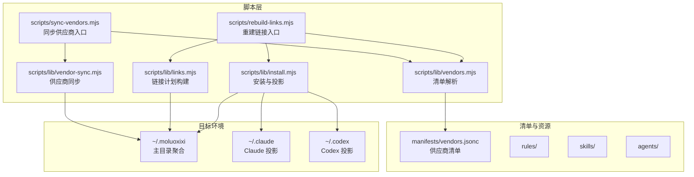
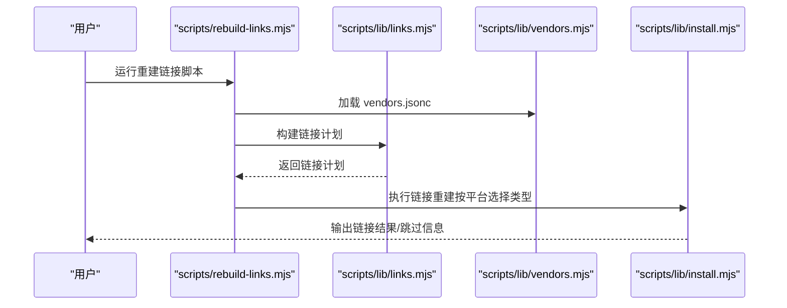
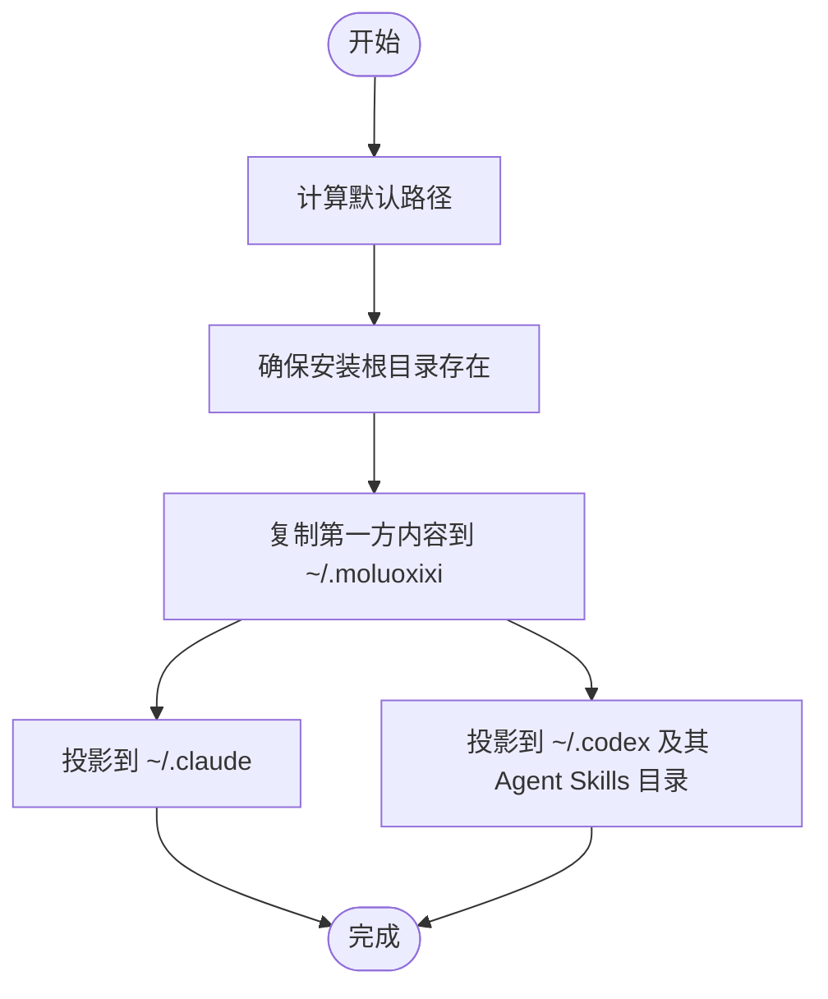
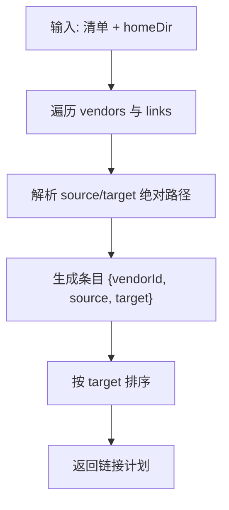
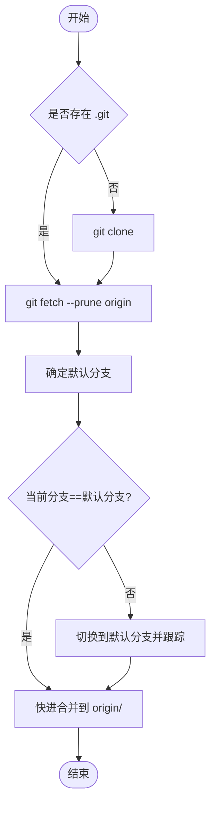
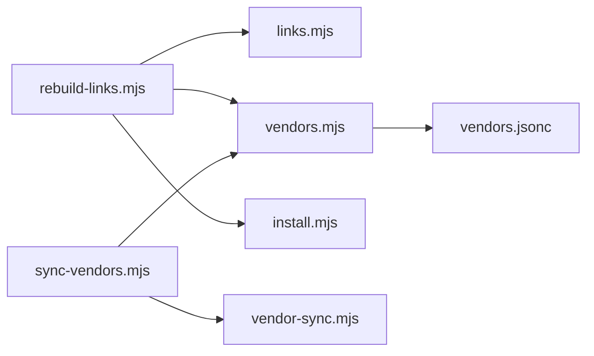

# 故障排除

<cite>
**本文引用的文件**
- [README.md](file://README.md)
- [package.json](file://package.json)
- [scripts/lib/install.mjs](file://scripts/lib/install.mjs)
- [scripts/rebuild-links.mjs](file://scripts/rebuild-links.mjs)
- [scripts/sync-vendors.mjs](file://scripts/sync-vendors.mjs)
- [scripts/lib/links.mjs](file://scripts/lib/links.mjs)
- [scripts/lib/vendors.mjs](file://scripts/lib/vendors.mjs)
- [scripts/lib/vendor-sync.mjs](file://scripts/lib/vendor-sync.mjs)
- [manifests/vendors.jsonc](file://manifests/vendors.jsonc)
- [tests/install-docs.test.mjs](file://tests/install-docs.test.mjs)
- [tests/install-flow.test.mjs](file://tests/install-flow.test.mjs)
- [tests/link-builder.test.mjs](file://tests/link-builder.test.mjs)
- [tests/vendor-manifest.test.mjs](file://tests/vendor-manifest.test.mjs)
- [tests/vendor-sync.test.mjs](file://tests/vendor-sync.test.mjs)
</cite>

## 目录
1. [简介](#简介)
2. [项目结构](#项目结构)
3. [核心组件](#核心组件)
4. [架构总览](#架构总览)
5. [详细组件分析](#详细组件分析)
6. [依赖关系分析](#依赖关系分析)
7. [性能考虑](#性能考虑)
8. [故障排除指南](#故障排除指南)
9. [结论](#结论)
10. [附录](#附录)

## 简介
本指南面向使用 AIRules（基于 superpowers 的个人 AI 开发工作流）的用户与维护者，聚焦安装、配置、脚本执行、网络与权限、路径解析、链接重建、供应商同步等常见问题的系统化诊断与解决。文档同时提供调试步骤、日志解读技巧、性能排查与优化建议，并给出社区支持与问题反馈渠道。

## 项目结构
该仓库采用“脚本驱动 + 清单管理”的组织方式：
- 安装与部署脚本位于 scripts/ 下，核心逻辑集中在 scripts/lib/。
- 供应商清单 manifests/vendors.jsonc 描述第三方技能来源与链接规则。
- tests/ 目录包含对安装流程、链接构建器、供应商清单与同步行为的测试，便于定位问题与回归验证。

图表来源
- [scripts/lib/install.mjs:1-105](file://scripts/lib/install.mjs#L1-L105)
- [scripts/lib/links.mjs:1-23](file://scripts/lib/links.mjs#L1-L23)
- [scripts/lib/vendors.mjs:1-75](file://scripts/lib/vendors.mjs#L1-L75)
- [scripts/lib/vendor-sync.mjs:1-78](file://scripts/lib/vendor-sync.mjs#L1-L78)
- [scripts/rebuild-links.mjs:1-74](file://scripts/rebuild-links.mjs#L1-L74)
- [scripts/sync-vendors.mjs:1-62](file://scripts/sync-vendors.mjs#L1-L62)
- [manifests/vendors.jsonc:1-107](file://manifests/vendors.jsonc#L1-L107)

章节来源
- [README.md:1-50](file://README.md#L1-L50)
- [package.json:1-11](file://package.json#L1-L11)

## 核心组件
- 安装与投影：将第一方 rules/skills/agents 同步至 ~/.moluoxixi，并分别投影到 ~/.claude 与 ~/.codex。
- 链接计划构建：根据 vendors.jsonc 的链接规则，计算从供应商仓库到 ~/.moluoxixi/skills 的符号链接映射。
- 供应商同步：克隆或更新各供应商仓库，确保与远端默认分支一致。
- 清单解析：支持 JSONC 注释与尾随逗号，安全解析 vendors.jsonc。
- 测试保障：通过单元与集成测试覆盖安装流程、链接构建、清单加载与供应商同步的关键路径。

章节来源
- [scripts/lib/install.mjs:1-105](file://scripts/lib/install.mjs#L1-L105)
- [scripts/lib/links.mjs:1-23](file://scripts/lib/links.mjs#L1-L23)
- [scripts/lib/vendors.mjs:1-75](file://scripts/lib/vendors.mjs#L1-L75)
- [scripts/lib/vendor-sync.mjs:1-78](file://scripts/lib/vendor-sync.mjs#L1-L78)
- [manifests/vendors.jsonc:1-107](file://manifests/vendors.jsonc#L1-L107)

## 架构总览
下图展示从命令行入口到最终目标目录的调用链与数据流：

图表来源
- [scripts/rebuild-links.mjs:1-74](file://scripts/rebuild-links.mjs#L1-L74)
- [scripts/lib/links.mjs:1-23](file://scripts/lib/links.mjs#L1-L23)
- [scripts/lib/vendors.mjs:1-75](file://scripts/lib/vendors.mjs#L1-L75)
- [scripts/lib/install.mjs:68-83](file://scripts/lib/install.mjs#L68-L83)

## 详细组件分析

### 安装与投影组件（install.mjs）
职责与关键点
- 计算默认安装路径（含 ~/.moluoxixi、~/.claude、~/.codex、~/.agents/skills）。
- 确保安装根目录存在，同步第一方内容至 ~/.moluoxixi。
- 将 rules/skills/agents 分别投影到 Claude 与 Codex 的对应目录。
- 平台差异：Windows 使用 junction，其他平台使用 dir 符号链接。

图表来源
- [scripts/lib/install.mjs:40-105](file://scripts/lib/install.mjs#L40-L105)

章节来源
- [scripts/lib/install.mjs:1-105](file://scripts/lib/install.mjs#L1-L105)

### 链接计划构建（links.mjs）
职责与关键点
- 遍历 vendors.jsonc 的 vendors 节点与每个 vendor 的 links 列表。
- 基于 homeDir 与 cloneDir 计算绝对 source 与 target 路径。
- 返回按 target 排序的链接计划，便于稳定输出与调试。

图表来源
- [scripts/lib/links.mjs:1-23](file://scripts/lib/links.mjs#L1-L23)
- [scripts/lib/vendors.mjs:4-6](file://scripts/lib/vendors.mjs#L4-L6)

章节来源
- [scripts/lib/links.mjs:1-23](file://scripts/lib/links.mjs#L1-L23)
- [scripts/lib/vendors.mjs:1-75](file://scripts/lib/vendors.mjs#L1-L75)

### 供应商同步（vendor-sync.mjs）
职责与关键点
- 若目标 cloneDir 首次出现，则 git clone。
- 拉取并裁剪远端引用，获取默认分支名。
- 若当前分支与默认分支不一致，强制切换到默认分支并快进合并。
- 对 git 子进程失败进行错误包装，便于定位网络/权限问题。

图表来源
- [scripts/lib/vendor-sync.mjs:58-77](file://scripts/lib/vendor-sync.mjs#L58-L77)

章节来源
- [scripts/lib/vendor-sync.mjs:1-78](file://scripts/lib/vendor-sync.mjs#L1-L78)

### 清单解析（vendors.mjs）
职责与关键点
- 支持 JSONC 注释与尾随逗号，避免因注释导致解析失败。
- 提供 normalizePath 统一路径分隔符，避免跨平台差异。
- 提供 getRepoRoot、resolveHomePath 等工具函数，便于路径处理。

章节来源
- [scripts/lib/vendors.mjs:1-75](file://scripts/lib/vendors.mjs#L1-L75)

### 命令行入口（rebuild-links.mjs 与 sync-vendors.mjs）
职责与关键点
- rebuild-links.mjs：加载清单、构建链接计划、逐项创建符号链接；对缺失 source 输出跳过警告。
- sync-vendors.mjs：加载清单、确保 ~/.moluoxixi 存在、逐个同步供应商仓库。

章节来源
- [scripts/rebuild-links.mjs:1-74](file://scripts/rebuild-links.mjs#L1-L74)
- [scripts/sync-vendors.mjs:1-62](file://scripts/sync-vendors.mjs#L1-L62)

## 依赖关系分析
- 脚本间耦合
  - rebuild-links.mjs 依赖 links.mjs 与 vendors.mjs；最终调用 install.mjs 的链接重建能力。
  - sync-vendors.mjs 依赖 vendor-sync.mjs 与 vendors.mjs。
- 外部依赖
  - git 命令行工具用于仓库同步与分支操作。
  - Node.js 文件系统 API 用于目录与符号链接操作。
- 潜在循环依赖
  - 无直接循环导入；通过模块导出接口解耦。

图表来源
- [scripts/rebuild-links.mjs:1-74](file://scripts/rebuild-links.mjs#L1-L74)
- [scripts/sync-vendors.mjs:1-62](file://scripts/sync-vendors.mjs#L1-L62)
- [scripts/lib/links.mjs:1-23](file://scripts/lib/links.mjs#L1-L23)
- [scripts/lib/vendors.mjs:1-75](file://scripts/lib/vendors.mjs#L1-L75)
- [scripts/lib/install.mjs:1-105](file://scripts/lib/install.mjs#L1-L105)
- [scripts/lib/vendor-sync.mjs:1-78](file://scripts/lib/vendor-sync.mjs#L1-L78)
- [manifests/vendors.jsonc:1-107](file://manifests/vendors.jsonc#L1-L107)

章节来源
- [scripts/rebuild-links.mjs:1-74](file://scripts/rebuild-links.mjs#L1-L74)
- [scripts/sync-vendors.mjs:1-62](file://scripts/sync-vendors.mjs#L1-L62)
- [scripts/lib/links.mjs:1-23](file://scripts/lib/links.mjs#L1-L23)
- [scripts/lib/vendors.mjs:1-75](file://scripts/lib/vendors.mjs#L1-L75)
- [scripts/lib/install.mjs:1-105](file://scripts/lib/install.mjs#L1-L105)
- [scripts/lib/vendor-sync.mjs:1-78](file://scripts/lib/vendor-sync.mjs#L1-L78)
- [manifests/vendors.jsonc:1-107](file://manifests/vendors.jsonc#L1-L107)

## 性能考虑
- 链接重建顺序：links.mjs 对链接计划按 target 排序，有助于稳定输出与并行化改进空间。
- 供应商同步：git fetch 与 merge 为增量操作，建议在变更频繁场景下减少不必要的重复执行。
- 路径规范化：vendors.mjs 的 normalizePath 统一分隔符，避免多次转换带来的开销。
- 日志与输出：rebuild-links.mjs 对缺失 source 输出跳过信息，有助于快速识别无效链接项。

[本节为通用指导，无需列出具体文件来源]

## 故障排除指南

### 一、安装失败
常见症状
- 安装后 Claude/Codex 无法读取 rules/skills/agents。
- 报错提示找不到目标目录或文件。

诊断步骤
1. 确认默认安装路径是否正确生成（~/.moluoxixi、~/.claude、~/.codex、~/.agents/skills）。
2. 检查第一方内容是否已复制到 ~/.moluoxixi。
3. 校验符号链接是否成功创建（Windows 使用 junction，其他平台使用 dir）。
4. 使用测试用例思路进行最小化验证：准备临时仓库与清单，运行安装流程断言关键路径存在。

定位参考
- 默认路径与投影逻辑：[scripts/lib/install.mjs:40-105](file://scripts/lib/install.mjs#L40-L105)
- 安装流程测试断言：[tests/install-flow.test.mjs:55-100](file://tests/install-flow.test.mjs#L55-L100)

章节来源
- [scripts/lib/install.mjs:40-105](file://scripts/lib/install.mjs#L40-L105)
- [tests/install-flow.test.mjs:55-100](file://tests/install-flow.test.mjs#L55-L100)

### 二、配置错误（清单与路径）
常见症状
- 链接计划为空或链接目标不正确。
- vendors.jsonc 解析报错或注释导致失败。

诊断步骤
1. 使用 vendors.mjs 的解析能力验证 vendors.jsonc 是否可被正确加载。
2. 检查 links.mjs 的链接计划是否包含预期 target；确认 source/target 绝对路径计算正确。
3. 在 Windows 上注意符号链接类型（junction/dir），避免权限不足导致创建失败。

定位参考
- 清单解析与 JSONC 支持：[scripts/lib/vendors.mjs:8-66](file://scripts/lib/vendors.mjs#L8-L66)
- 链接计划构建：[scripts/lib/links.mjs:5-22](file://scripts/lib/links.mjs#L5-L22)
- 清单样例与链接规则：[manifests/vendors.jsonc:1-107](file://manifests/vendors.jsonc#L1-L107)

章节来源
- [scripts/lib/vendors.mjs:1-75](file://scripts/lib/vendors.mjs#L1-L75)
- [scripts/lib/links.mjs:1-23](file://scripts/lib/links.mjs#L1-L23)
- [manifests/vendors.jsonc:1-107](file://manifests/vendors.jsonc#L1-L107)

### 三、脚本执行异常
常见症状
- rebuild-links.mjs 报未知参数或缺少 home/manifest 参数。
- sync-vendors.mjs 执行中断，提示 git 失败。

诊断步骤
1. 查看脚本帮助输出，确认参数传递正确。
2. 对于 rebuild-links.mjs：若 source 不存在，会输出跳过信息；需检查 vendors.jsonc 的 source 路径与实际仓库内容。
3. 对于 sync-vendors.mjs：git 失败通常由网络或权限引起，检查代理、证书与 SSH/Git 凭据。

定位参考
- 参数解析与帮助输出：[scripts/rebuild-links.mjs:9-44](file://scripts/rebuild-links.mjs#L9-L44)
- 缺失 source 跳过逻辑：[scripts/rebuild-links.mjs:60-64](file://scripts/rebuild-links.mjs#L60-L64)
- git 错误包装与分支判定：[scripts/lib/vendor-sync.mjs:5-19](file://scripts/lib/vendor-sync.mjs#L5-L19)

章节来源
- [scripts/rebuild-links.mjs:1-74](file://scripts/rebuild-links.mjs#L1-L74)
- [scripts/lib/vendor-sync.mjs:1-78](file://scripts/lib/vendor-sync.mjs#L1-L78)

### 四、网络连接问题
常见症状
- git clone/fetch 失败，提示超时或认证失败。
- 无法访问 GitHub 或企业内网镜像。

诊断步骤
1. 在终端手动执行 git 命令，观察详细错误信息。
2. 检查系统代理、SSH 密钥、HTTPS 凭据或企业防火墙策略。
3. 如需私有仓库，确认凭据注入与权限范围。

定位参考
- git 子进程调用与错误包装：[scripts/lib/vendor-sync.mjs:5-19](file://scripts/lib/vendor-sync.mjs#L5-L19)

章节来源
- [scripts/lib/vendor-sync.mjs:1-78](file://scripts/lib/vendor-sync.mjs#L1-L78)

### 五、权限问题
常见症状
- 创建符号链接失败（Windows junction 需管理员权限）。
- 写入 ~/.moluoxixi 或目标目录失败。

诊断步骤
1. 在 Windows 上以管理员身份运行终端。
2. 确认当前用户对目标目录具有写权限。
3. 避免在受保护路径（如 Program Files）执行安装。

定位参考
- 平台链接类型选择：[scripts/lib/install.mjs:36-38](file://scripts/lib/install.mjs#L36-L38)
- 重建链接入口中的平台判断：[scripts/rebuild-links.mjs:46-48](file://scripts/rebuild-links.mjs#L46-L48)

章节来源
- [scripts/lib/install.mjs:36-38](file://scripts/lib/install.mjs#L36-L38)
- [scripts/rebuild-links.mjs:46-48](file://scripts/rebuild-links.mjs#L46-L48)

### 六、路径问题
常见症状
- 路径分隔符不一致导致链接失败。
- 绝对路径与相对路径混用造成 source/target 不匹配。

诊断步骤
1. 使用 vendors.mjs 的 normalizePath 统一路径分隔符。
2. 确保 source/target 基于 homeDir 与 cloneDir 正确拼接。
3. 在 Windows 上避免使用斜杠与反斜杠混用。

定位参考
- 路径规范化与解析工具：[scripts/lib/vendors.mjs:4-74](file://scripts/lib/vendors.mjs#L4-L74)

章节来源
- [scripts/lib/vendors.mjs:1-75](file://scripts/lib/vendors.mjs#L1-L75)

### 七、日志解读与分析技巧
- rebuild-links.mjs 输出
  - 成功：打印链接创建信息，格式为“目标 -> 源”。
  - 跳过：当 source 不存在时输出“[skip] missing source: ...”，应检查 vendors.jsonc 的 source 路径与仓库内容。
- vendor-sync.mjs 输出
  - git 子进程失败会抛出带详细错误信息的异常，优先查看子进程 stderr。
- install.mjs 行为
  - 投影前会清理旧链接/目录，若失败多为权限或路径问题。

定位参考
- 跳过与链接输出：[scripts/rebuild-links.mjs:60-70](file://scripts/rebuild-links.mjs#L60-L70)
- git 错误包装：[scripts/lib/vendor-sync.mjs:13-16](file://scripts/lib/vendor-sync.mjs#L13-L16)
- 投影清理与创建：[scripts/lib/install.mjs:85-104](file://scripts/lib/install.mjs#L85-L104)

章节来源
- [scripts/rebuild-links.mjs:60-70](file://scripts/rebuild-links.mjs#L60-L70)
- [scripts/lib/vendor-sync.mjs:13-16](file://scripts/lib/vendor-sync.mjs#L13-L16)
- [scripts/lib/install.mjs:85-104](file://scripts/lib/install.mjs#L85-L104)

### 八、性能问题排查与优化建议
- 链接重建
  - 仅在清单变更或需要刷新链接时执行，避免频繁重建。
  - 对大量链接项，可考虑分批执行并记录耗时。
- 供应商同步
  - 合理安排同步频率，避免在高并发网络环境下频繁 fetch。
  - 使用本地缓存或镜像源提升拉取速度（视企业策略而定）。
- 路径与 I/O
  - 统一路径分隔符，减少跨平台路径转换次数。
  - 预创建必要目录，减少多次 mkdir 调用。

[本节为通用指导，无需列出具体文件来源]

### 九、社区支持与问题反馈
- 安装与升级指引
  - 请遵循 README 中提供的 Claude 与 Codex 安装/升级说明，确保使用官方聚合安装结构。
- 问题反馈
  - 建议在仓库中提交 Issue，附带：
    - 环境信息（操作系统、Node 版本、git 版本）
    - 复现步骤与完整日志
    - 相关脚本输出（rebuild-links.mjs、sync-vendors.mjs 的输出）
- 测试参考
  - 可参照测试用例的断言思路，快速验证安装流程与链接计划是否符合预期。

定位参考
- README 安装与升级说明：[README.md:15-49](file://README.md#L15-L49)
- 安装流程测试断言：[tests/install-flow.test.mjs:55-100](file://tests/install-flow.test.mjs#L55-L100)
- 清单与链接测试：[tests/vendor-manifest.test.mjs:1-13](file://tests/vendor-manifest.test.mjs#L1-L13)、[tests/link-builder.test.mjs:1-36](file://tests/link-builder.test.mjs#L1-L36)

章节来源
- [README.md:15-49](file://README.md#L15-L49)
- [tests/install-flow.test.mjs:55-100](file://tests/install-flow.test.mjs#L55-L100)
- [tests/vendor-manifest.test.mjs:1-13](file://tests/vendor-manifest.test.mjs#L1-L13)
- [tests/link-builder.test.mjs:1-36](file://tests/link-builder.test.mjs#L1-L36)

## 结论
通过理解安装与投影、链接计划构建、供应商同步与清单解析的核心流程，结合测试用例的断言思路与脚本输出的日志解读技巧，可以高效定位并解决安装、配置、网络、权限与路径等常见问题。建议在变更清单或供应商仓库后，按需执行重建链接与同步操作，并保留日志以便回溯。

[本节为总结性内容，无需列出具体文件来源]

## 附录

### A. 常见命令与参数速查
- 重建链接
  - 用途：基于 vendors.jsonc 重建 ~/.moluoxixi 下的技能链接。
  - 关键参数：--home、--manifest、--help。
  - 参考：[scripts/rebuild-links.mjs:9-44](file://scripts/rebuild-links.mjs#L9-L44)
- 同步供应商
  - 用途：克隆或更新 vendors.jsonc 中声明的所有供应商仓库。
  - 关键参数：--home、--manifest、--help。
  - 参考：[scripts/sync-vendors.mjs:9-44](file://scripts/sync-vendors.mjs#L9-L44)

章节来源
- [scripts/rebuild-links.mjs:9-44](file://scripts/rebuild-links.mjs#L9-L44)
- [scripts/sync-vendors.mjs:9-44](file://scripts/sync-vendors.mjs#L9-L44)

### B. 安装与升级入口
- Claude 安装/升级：README 中提供了指向远程安装与升级文档的指令。
- Codex 安装/升级：同上，分别对应 Claude 与 Codex 的聚合安装结构。

章节来源
- [README.md:15-49](file://README.md#L15-L49)