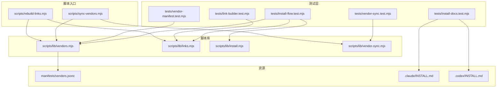
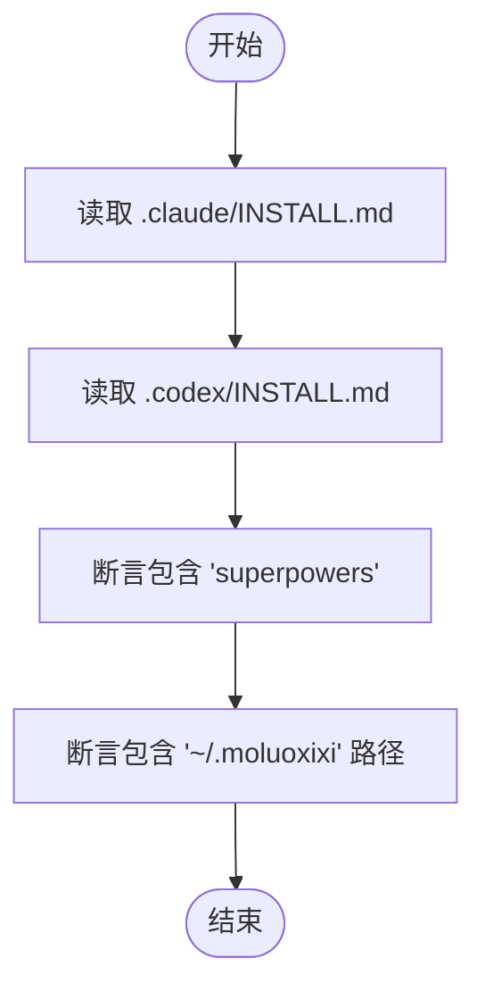
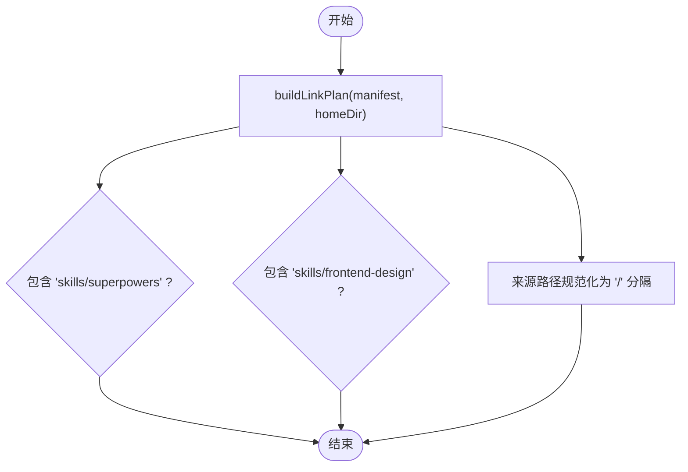
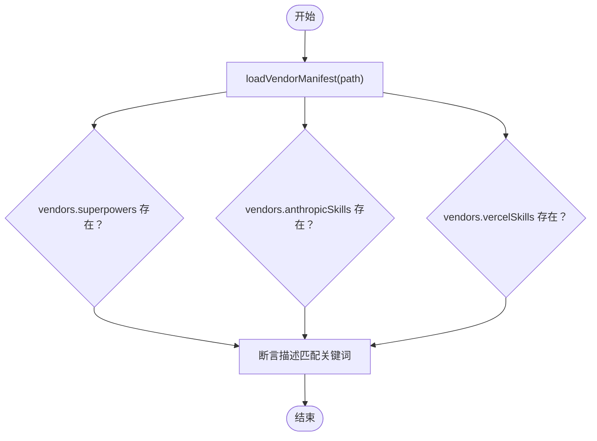
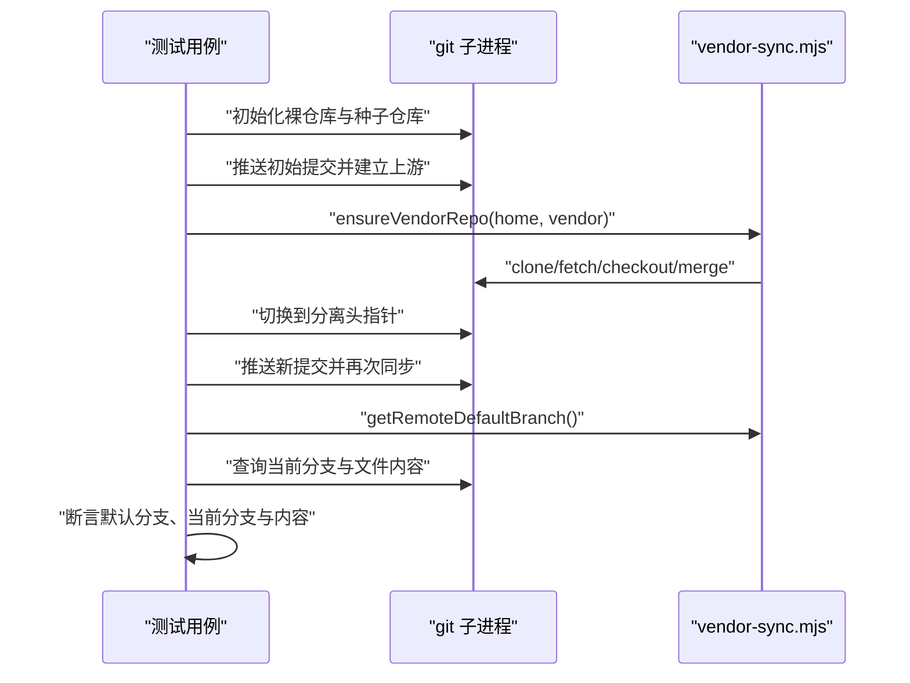
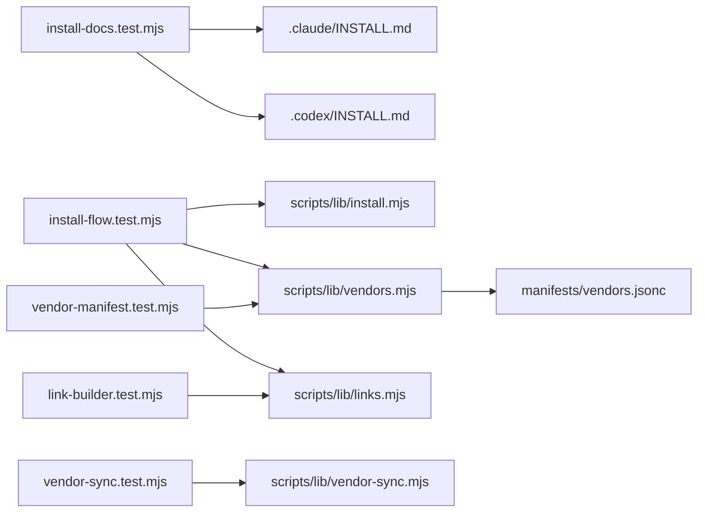

# 测试策略

<cite>
**本文引用的文件**
- [tests/install-docs.test.mjs](file://tests/install-docs.test.mjs)
- [tests/install-flow.test.mjs](file://tests/install-flow.test.mjs)
- [tests/link-builder.test.mjs](file://tests/link-builder.test.mjs)
- [tests/vendor-manifest.test.mjs](file://tests/vendor-manifest.test.mjs)
- [tests/vendor-sync.test.mjs](file://tests/vendor-sync.test.mjs)
- [scripts/lib/install.mjs](file://scripts/lib/install.mjs)
- [scripts/lib/links.mjs](file://scripts/lib/links.mjs)
- [scripts/lib/vendor-sync.mjs](file://scripts/lib/vendor-sync.mjs)
- [scripts/lib/vendors.mjs](file://scripts/lib/vendors.mjs)
- [scripts/rebuild-links.mjs](file://scripts/rebuild-links.mjs)
- [scripts/sync-vendors.mjs](file://scripts/sync-vendors.mjs)
- [manifests/vendors.jsonc](file://manifests/vendors.jsonc)
- [.claude/INSTALL.md](file://.claude/INSTALL.md)
- [.codex/INSTALL.md](file://.codex/INSTALL.md)
- [package.json](file://package.json)
</cite>

## 目录
1. [引言](#引言)
2. [项目结构](#项目结构)
3. [核心组件](#核心组件)
4. [架构总览](#架构总览)
5. [详细组件分析](#详细组件分析)
6. [依赖关系分析](#依赖关系分析)
7. [性能考量](#性能考量)
8. [故障排查指南](#故障排查指南)
9. [结论](#结论)
10. [附录](#附录)

## 引言
本文件系统化阐述 AIRules 项目的测试策略与方法论，覆盖安装文档一致性测试、安装流程集成测试、链接构建器单元测试、供应商清单解析测试以及供应商同步流程测试。测试采用 Node.js 原生测试框架，结合脚本库函数进行端到端验证，确保安装路径、链接策略与第三方供应商同步行为符合预期。

## 项目结构
测试相关文件与脚本分布如下：
- tests 目录：集中存放各模块测试用例
- scripts/lib：被测试的核心实现库（安装、链接、供应商清单、同步）
- scripts：命令行脚本入口（供手动执行与测试调用）
- manifests：供应商清单（JSONC）文件
- 安装文档：.claude/INSTALL.md 与 .codex/INSTALL.md



图表来源
- [tests/install-docs.test.mjs:1-14](file://tests/install-docs.test.mjs#L1-L14)
- [tests/install-flow.test.mjs:1-101](file://tests/install-flow.test.mjs#L1-L101)
- [tests/link-builder.test.mjs:1-36](file://tests/link-builder.test.mjs#L1-L36)
- [tests/vendor-manifest.test.mjs:1-13](file://tests/vendor-manifest.test.mjs#L1-L13)
- [tests/vendor-sync.test.mjs:1-72](file://tests/vendor-sync.test.mjs#L1-L72)
- [scripts/lib/install.mjs:1-105](file://scripts/lib/install.mjs#L1-L105)
- [scripts/lib/links.mjs:1-23](file://scripts/lib/links.mjs#L1-L23)
- [scripts/lib/vendor-sync.mjs:1-78](file://scripts/lib/vendor-sync.mjs#L1-L78)
- [scripts/lib/vendors.mjs:1-75](file://scripts/lib/vendors.mjs#L1-L75)
- [scripts/sync-vendors.mjs:1-62](file://scripts/sync-vendors.mjs#L1-L62)
- [scripts/rebuild-links.mjs:1-74](file://scripts/rebuild-links.mjs#L1-L74)
- [manifests/vendors.jsonc:1-107](file://manifests/vendors.jsonc#L1-L107)
- [.claude/INSTALL.md:1-108](file://.claude/INSTALL.md#L1-L108)
- [.codex/INSTALL.md:1-95](file://.codex/INSTALL.md#L1-L95)

章节来源
- [package.json:1-11](file://package.json#L1-L11)

## 核心组件
- 安装文档测试：校验安装文档中提及“superpowers”工作流与用户主目录布局（~/.moluoxixi）。
- 安装流程测试：在临时环境中模拟仓库、供应商源与目标目录，验证安装根目录创建、内容投递、链接重建与平台符号链接类型。
- 链接构建器测试：针对供应商清单生成链接计划，断言关键命名空间与目标路径存在性及来源规范化。
- 供应商清单测试：加载 vendors.jsonc，断言关键供应商存在与描述匹配。
- 供应商同步测试：使用 git 子进程模拟远程仓库，验证分离头指针恢复、默认分支识别与同步合并。

章节来源
- [tests/install-docs.test.mjs:1-14](file://tests/install-docs.test.mjs#L1-L14)
- [tests/install-flow.test.mjs:1-101](file://tests/install-flow.test.mjs#L1-L101)
- [tests/link-builder.test.mjs:1-36](file://tests/link-builder.test.mjs#L1-L36)
- [tests/vendor-manifest.test.mjs:1-13](file://tests/vendor-manifest.test.mjs#L1-L13)
- [tests/vendor-sync.test.mjs:1-72](file://tests/vendor-sync.test.mjs#L1-L72)

## 架构总览
测试体系围绕“脚本库函数 + 命令行脚本 + 清单文件”的组合展开，测试用例通过直接导入库函数或调用脚本入口，对安装路径、链接策略与同步逻辑进行验证。

```mermaid
sequenceDiagram
participant Test as "测试用例"
participant Install as "scripts/lib/install.mjs"
participant Links as "scripts/lib/links.mjs"
participant Vendors as "scripts/lib/vendors.mjs"
participant Sync as "scripts/lib/vendor-sync.mjs"
Test->>Vendors : "loadVendorManifest()"
Test->>Install : "getDefaultInstallPaths()/ensureInstallRoot()"
Test->>Install : "syncFirstPartyToHome()"
Test->>Install : "rebuildVendorSkillLinks()"
Install->>Vendors : "loadVendorManifest()"
Install->>Links : "buildLinkPlan()"
Test->>Install : "projectToClaude()/projectToCodex()"
Test->>Sync : "ensureVendorRepo()"
Sync->>Sync : "getRemoteDefaultBranch()"
```

图表来源
- [scripts/lib/install.mjs:40-105](file://scripts/lib/install.mjs#L40-L105)
- [scripts/lib/links.mjs:5-23](file://scripts/lib/links.mjs#L5-L23)
- [scripts/lib/vendors.mjs:64-75](file://scripts/lib/vendors.mjs#L64-L75)
- [scripts/lib/vendor-sync.mjs:58-77](file://scripts/lib/vendor-sync.mjs#L58-L77)

## 详细组件分析

### 安装文档测试（install-docs.test.mjs）
- 目标：确保安装文档中出现“superpowers”工作流提示与用户主目录布局（~/.moluoxixi）。
- 方法：读取 .claude/INSTALL.md 与 .codex/INSTALL.md，使用正则断言匹配。
- 关键断言：
  - 包含“superpowers”关键词
  - 包含“~/.moluoxixi”路径提示（跨平台兼容）
- 测试范围：安装文档一致性，不涉及文件系统操作。



图表来源
- [tests/install-docs.test.mjs:5-13](file://tests/install-docs.test.mjs#L5-L13)
- [.claude/INSTALL.md:1-108](file://.claude/INSTALL.md#L1-L108)
- [.codex/INSTALL.md:1-95](file://.codex/INSTALL.md#L1-L95)

章节来源
- [tests/install-docs.test.mjs:1-14](file://tests/install-docs.test.mjs#L1-L14)

### 安装流程测试（install-flow.test.mjs）
- 目标：验证从仓库到 Claude/Codex 的完整安装流程。
- 方法：在临时目录中准备仓库快照，构造虚拟供应商源，执行安装与链接重建，断言产物存在与内容特征。
- 关键步骤：
  - 创建临时工作区与仓库快照
  - 加载供应商清单并创建虚拟供应商源
  - 确保安装根目录存在
  - 将第一方内容投递至 ~/.moluoxixi
  - 重建供应商技能链接
  - 将内容投影到 Claude 与 Codex
- 关键断言：
  - ~/.moluoxixi 下存在指定规则与技能文件
  - ~/.claude 与 ~/.codex 目录存在
  - Codex 代理技能目录仅包含“superpowers”命名空间
  - 目标规则文件包含“MCP”标识
  - 链接计划包含目标路径条目
- 平台差异：根据操作系统选择 junction/dir 符号链接类型。

```mermaid
sequenceDiagram
participant T as "测试用例"
participant FS as "文件系统"
participant Inst as "install.mjs"
participant Vend as "vendors.mjs"
participant Link as "links.mjs"
T->>FS : "准备临时仓库快照"
T->>Vend : "loadVendorManifest()"
T->>Inst : "ensureInstallRoot()"
T->>Inst : "syncFirstPartyToHome()"
T->>Inst : "rebuildVendorSkillLinks()"
Inst->>Vend : "loadVendorManifest()"
Inst->>Link : "buildLinkPlan()"
T->>Inst : "projectToClaude()"
T->>Inst : "projectToCodex()"
T->>FS : "断言目标文件与目录存在"
```

图表来源
- [tests/install-flow.test.mjs:55-100](file://tests/install-flow.test.mjs#L55-L100)
- [scripts/lib/install.mjs:53-105](file://scripts/lib/install.mjs#L53-L105)
- [scripts/lib/links.mjs:5-23](file://scripts/lib/links.mjs#L5-L23)
- [scripts/lib/vendors.mjs:64-75](file://scripts/lib/vendors.mjs#L64-L75)

章节来源
- [tests/install-flow.test.mjs:1-101](file://tests/install-flow.test.mjs#L1-L101)

### 链接构建器测试（link-builder.test.mjs）
- 目标：验证链接计划生成逻辑，确保关键命名空间与目标路径正确。
- 方法：构造最小化供应商清单，调用 buildLinkPlan，断言计划项的存在性与来源规范化。
- 关键断言：
  - 计划包含“skills/superpowers”命名空间入口
  - 计划包含“skills/frontend-design”等目标
  - 来源路径规范化为正斜杠形式



图表来源
- [tests/link-builder.test.mjs:29-35](file://tests/link-builder.test.mjs#L29-L35)
- [scripts/lib/links.mjs:5-23](file://scripts/lib/links.mjs#L5-L23)

章节来源
- [tests/link-builder.test.mjs:1-36](file://tests/link-builder.test.mjs#L1-L36)

### 供应商清单测试（vendor-manifest.test.mjs）
- 目标：验证 vendors.jsonc 的结构与关键供应商存在性。
- 方法：加载清单，断言关键供应商（如 superpowers、anthropicSkills、vercelSkills）存在，并匹配描述中的关键词。
- 关键断言：
  - vendors 字段包含多个供应商条目
  - 描述文本匹配中文关键词（如工作流、brainstorming、TDD）



图表来源
- [tests/vendor-manifest.test.mjs:5-12](file://tests/vendor-manifest.test.mjs#L5-L12)
- [scripts/lib/vendors.mjs:64-75](file://scripts/lib/vendors.mjs#L64-L75)
- [manifests/vendors.jsonc:1-107](file://manifests/vendors.jsonc#L1-L107)

章节来源
- [tests/vendor-manifest.test.mjs:1-13](file://tests/vendor-manifest.test.mjs#L1-L13)

### 供应商同步测试（vendor-sync.test.mjs）
- 目标：验证供应商仓库克隆、分离头指针恢复与默认分支同步。
- 方法：使用 git 子进程在临时目录中创建裸仓库与种子仓库，推送不同提交，断言最终状态与默认分支。
- 关键步骤：
  - 初始化裸远程仓库与种子仓库，设置用户信息
  - 推送初始提交并建立上游
  - 调用 ensureVendorRepo 克隆并同步
  - 切换到分离头指针状态后再次同步
  - 断言默认分支、当前分支与文件内容
- 关键断言：
  - 默认分支为“canary”
  - 当前分支与默认分支一致
  - 文件内容为最新版本



图表来源
- [tests/vendor-sync.test.mjs:24-71](file://tests/vendor-sync.test.mjs#L24-L71)
- [scripts/lib/vendor-sync.mjs:58-77](file://scripts/lib/vendor-sync.mjs#L58-L77)

章节来源
- [tests/vendor-sync.test.mjs:1-72](file://tests/vendor-sync.test.mjs#L1-L72)

## 依赖关系分析
- 测试与实现的耦合度低：测试直接导入库函数，便于隔离验证。
- 供应商清单是链接与同步流程的输入源，测试通过加载清单驱动后续逻辑。
- 安装流程依赖链接构建器与供应商清单；同步流程依赖 git 子进程与远程仓库。



图表来源
- [tests/install-docs.test.mjs:1-14](file://tests/install-docs.test.mjs#L1-L14)
- [tests/install-flow.test.mjs:1-101](file://tests/install-flow.test.mjs#L1-L101)
- [tests/link-builder.test.mjs:1-36](file://tests/link-builder.test.mjs#L1-L36)
- [tests/vendor-manifest.test.mjs:1-13](file://tests/vendor-manifest.test.mjs#L1-L13)
- [tests/vendor-sync.test.mjs:1-72](file://tests/vendor-sync.test.mjs#L1-L72)
- [scripts/lib/install.mjs:1-105](file://scripts/lib/install.mjs#L1-L105)
- [scripts/lib/links.mjs:1-23](file://scripts/lib/links.mjs#L1-L23)
- [scripts/lib/vendor-sync.mjs:1-78](file://scripts/lib/vendor-sync.mjs#L1-L78)
- [scripts/lib/vendors.mjs:1-75](file://scripts/lib/vendors.mjs#L1-L75)
- [manifests/vendors.jsonc:1-107](file://manifests/vendors.jsonc#L1-L107)

章节来源
- [scripts/lib/install.mjs:1-105](file://scripts/lib/install.mjs#L1-L105)
- [scripts/lib/links.mjs:1-23](file://scripts/lib/links.mjs#L1-L23)
- [scripts/lib/vendor-sync.mjs:1-78](file://scripts/lib/vendor-sync.mjs#L1-L78)
- [scripts/lib/vendors.mjs:1-75](file://scripts/lib/vendors.mjs#L1-L75)

## 性能考量
- 测试运行时避免重复 IO：通过临时目录一次性准备快照，减少磁盘扫描与拷贝。
- 链接计划排序：对目标路径进行本地化比较排序，保证输出稳定且可预测。
- 平台差异处理：Windows 使用 junction，类 Unix 使用目录链接，减少跨平台兼容性问题。
- Git 操作：测试中使用子进程执行 git 命令，注意在 CI 环境中确保 git 可用与网络可达。

## 故障排查指南
- 安装文档测试失败
  - 症状：未匹配到“superpowers”或“~/.moluoxixi”。
  - 排查：核对 .claude/INSTALL.md 与 .codex/INSTALL.md 的内容与编码。
  - 参考：[tests/install-docs.test.mjs:5-13](file://tests/install-docs.test.mjs#L5-L13)
- 安装流程测试失败
  - 症状：目标目录不存在或内容不匹配。
  - 排查：确认 getDefaultInstallPaths 返回的路径、ensureInstallRoot 是否创建、链接是否为 junction/dir。
  - 参考：[tests/install-flow.test.mjs:55-100](file://tests/install-flow.test.mjs#L55-L100)，[scripts/lib/install.mjs:40-105](file://scripts/lib/install.mjs#L40-L105)
- 链接构建器测试失败
  - 症状：链接计划缺少关键条目或来源路径未规范化。
  - 排查：检查 vendors.jsonc 中的 cloneDir 与 links 配置，确认 buildLinkPlan 的路径拼接。
  - 参考：[tests/link-builder.test.mjs:29-35](file://tests/link-builder.test.mjs#L29-L35)，[scripts/lib/links.mjs:5-23](file://scripts/lib/links.mjs#L5-L23)
- 供应商清单测试失败
  - 症状：关键供应商缺失或描述不匹配。
  - 排查：检查 vendors.jsonc 的语法与注释处理，确认 parseJsonc 正常工作。
  - 参考：[tests/vendor-manifest.test.mjs:5-12](file://tests/vendor-manifest.test.mjs#L5-L12)，[scripts/lib/vendors.mjs:64-75](file://scripts/lib/vendors.mjs#L64-L75)
- 供应商同步测试失败
  - 症状：默认分支识别错误或同步后内容未更新。
  - 排查：确认 git 子进程返回码、远程 HEAD 解析逻辑与分支合并策略。
  - 参考：[tests/vendor-sync.test.mjs:24-71](file://tests/vendor-sync.test.mjs#L24-L71)，[scripts/lib/vendor-sync.mjs:21-77](file://scripts/lib/vendor-sync.mjs#L21-L77)

章节来源
- [tests/install-docs.test.mjs:1-14](file://tests/install-docs.test.mjs#L1-L14)
- [tests/install-flow.test.mjs:1-101](file://tests/install-flow.test.mjs#L1-L101)
- [tests/link-builder.test.mjs:1-36](file://tests/link-builder.test.mjs#L1-L36)
- [tests/vendor-manifest.test.mjs:1-13](file://tests/vendor-manifest.test.mjs#L1-L13)
- [tests/vendor-sync.test.mjs:1-72](file://tests/vendor-sync.test.mjs#L1-L72)
- [scripts/lib/install.mjs:1-105](file://scripts/lib/install.mjs#L1-L105)
- [scripts/lib/links.mjs:1-23](file://scripts/lib/links.mjs#L1-L23)
- [scripts/lib/vendor-sync.mjs:1-78](file://scripts/lib/vendor-sync.mjs#L1-L78)
- [scripts/lib/vendors.mjs:1-75](file://scripts/lib/vendors.mjs#L1-L75)

## 结论
本测试策略以“文档一致性 + 集成流程 + 单元逻辑 + 清单解析 + 同步流程”五维覆盖，既保证安装体验的一致性，又确保核心实现的稳定性。通过直接导入库函数与命令行脚本，测试具备良好的可维护性与可扩展性。

## 附录

### 测试环境搭建与配置
- 运行方式：通过 npm 脚本统一执行所有测试。
  - 参考：[package.json:7-9](file://package.json#L7-L9)
- 依赖要求：Node.js（支持原生 ES 模块），git（用于供应商同步测试）。
- 平台差异：Windows 使用 junction 链接，类 Unix 使用目录链接；测试自动检测平台类型。
- 临时目录：测试使用系统临时目录创建隔离环境，结束后清理。

章节来源
- [package.json:1-11](file://package.json#L1-L11)

### 测试用例设计思路与验证标准
- 设计思路
  - 文档测试：基于安装文档的静态内容断言，确保指引与实际实现一致。
  - 流程测试：通过临时文件系统快照与虚拟供应商源，模拟真实安装场景。
  - 单元测试：针对链接计划生成与清单解析的关键路径进行断言。
  - 同步测试：通过 git 子进程模拟远程仓库，验证默认分支与同步逻辑。
- 验证标准
  - 文件存在性：目标目录与文件必须存在。
  - 内容特征：关键文件包含特定标识（如“MCP”）。
  - 路径规范：链接来源与目标路径规范化为正斜杠分隔。
  - 分支状态：默认分支与当前分支一致，文件内容为最新。

章节来源
- [tests/install-docs.test.mjs:1-14](file://tests/install-docs.test.mjs#L1-L14)
- [tests/install-flow.test.mjs:1-101](file://tests/install-flow.test.mjs#L1-L101)
- [tests/link-builder.test.mjs:1-36](file://tests/link-builder.test.mjs#L1-L36)
- [tests/vendor-manifest.test.mjs:1-13](file://tests/vendor-manifest.test.mjs#L1-L13)
- [tests/vendor-sync.test.mjs:1-72](file://tests/vendor-sync.test.mjs#L1-L72)

### 测试结果解读与问题定位
- 失败定位：优先查看失败用例的断言点与调用链，结合对应实现文件定位问题。
- 常见问题
  - 路径分隔符：Windows 与类 Unix 的路径分隔符差异可能导致断言失败。
  - 链接类型：平台不一致会导致链接类型不同，需确认链接是否为 junction/dir。
  - Git 环境：同步测试需要可用的 git 与网络访问，CI 环境需提前准备。
- 建议：在本地调试时，可单独运行单个测试文件，逐步缩小问题范围。

章节来源
- [scripts/lib/install.mjs:36-38](file://scripts/lib/install.mjs#L36-L38)
- [scripts/lib/links.mjs:1-23](file://scripts/lib/links.mjs#L1-L23)
- [scripts/lib/vendor-sync.mjs:1-78](file://scripts/lib/vendor-sync.mjs#L1-L78)

### 测试扩展与自定义测试指导
- 新增测试文件：遵循现有命名约定 tests/*.test.mjs，使用 Node.js 原生测试 API。
- 引入新功能测试：在 scripts/lib 新增实现后，先编写单元测试，再补充集成测试。
- 覆盖边界条件：例如空清单、缺失供应商源、非标准路径等。
- 自动化执行：通过 npm 脚本统一执行，确保 CI 环境一致。

章节来源
- [package.json:7-9](file://package.json#L7-L9)
- [scripts/lib/install.mjs:1-105](file://scripts/lib/install.mjs#L1-L105)
- [scripts/lib/links.mjs:1-23](file://scripts/lib/links.mjs#L1-L23)
- [scripts/lib/vendor-sync.mjs:1-78](file://scripts/lib/vendor-sync.mjs#L1-L78)
- [scripts/lib/vendors.mjs:1-75](file://scripts/lib/vendors.mjs#L1-L75)