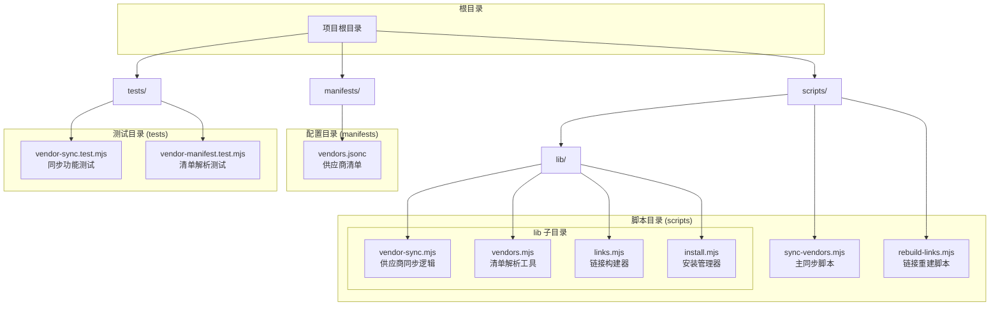
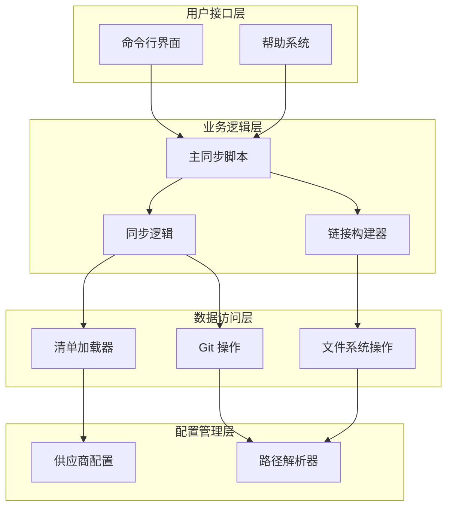
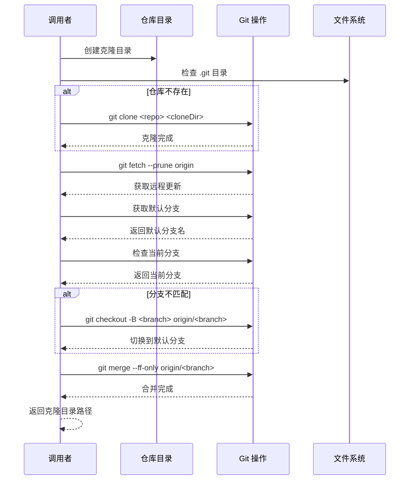
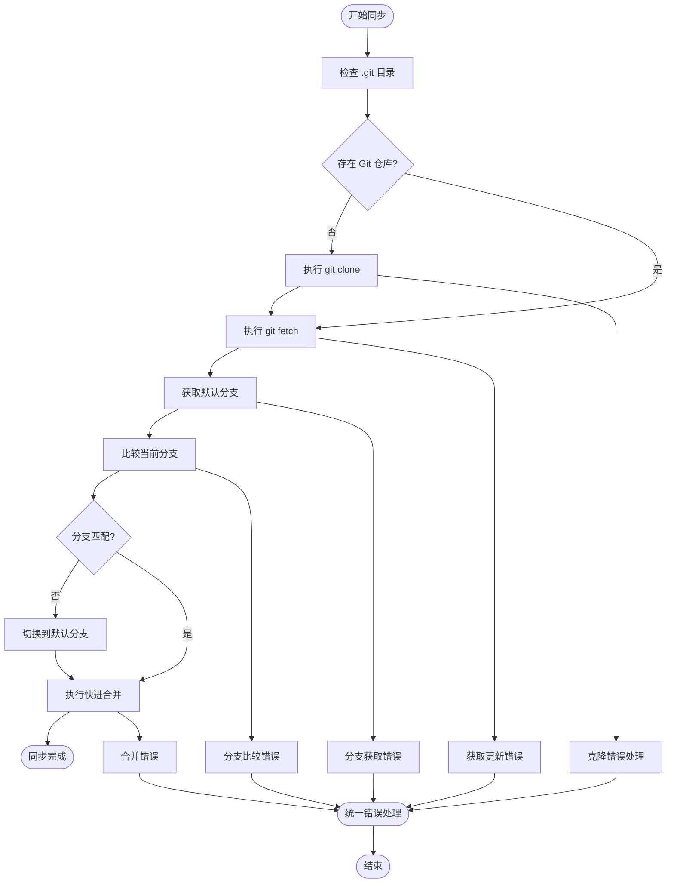
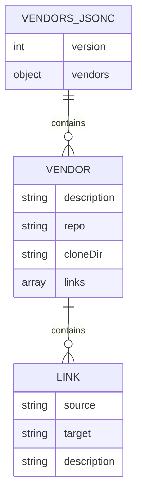
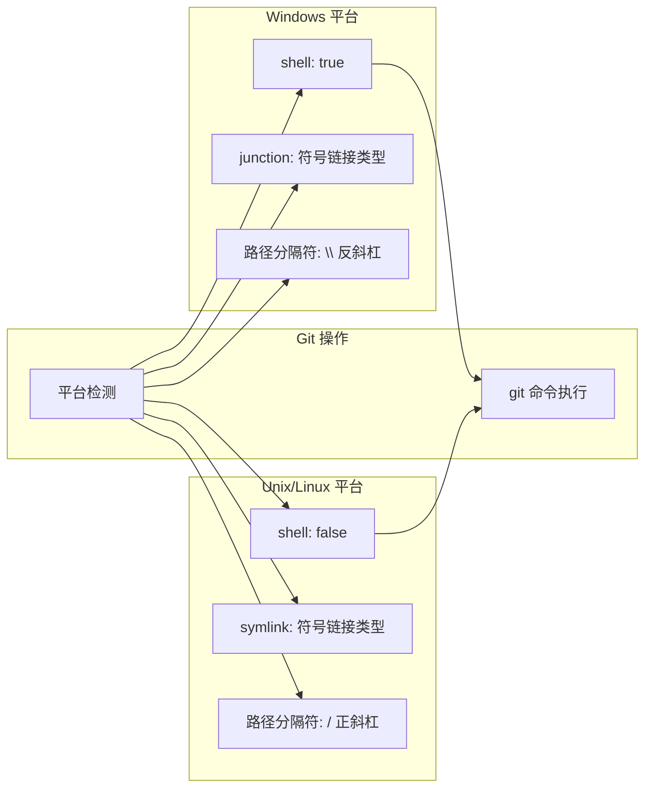
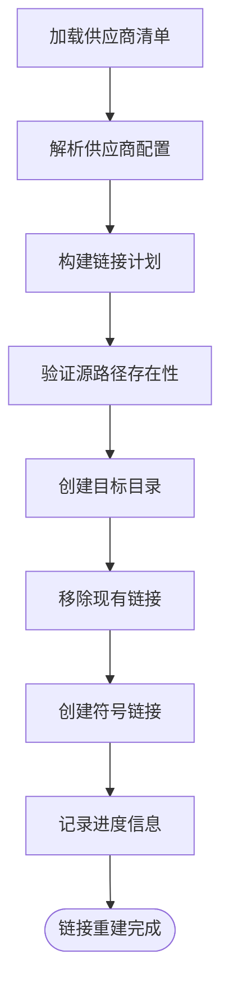
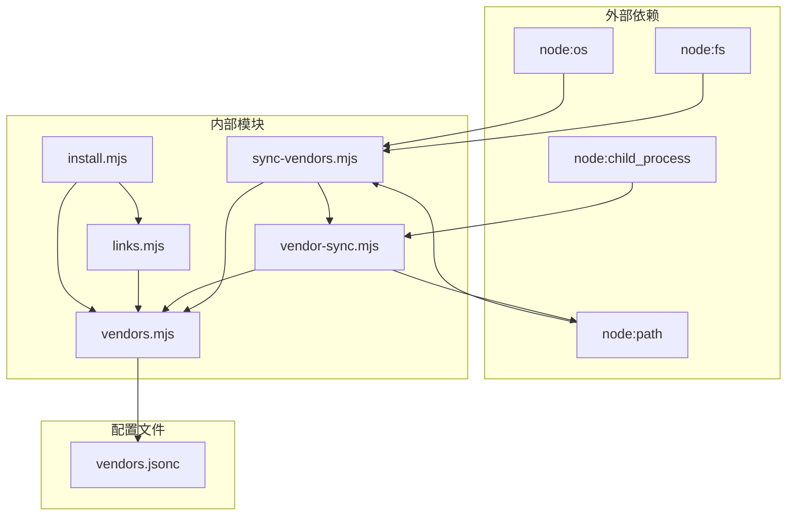

# 供应商同步脚本

<cite>
**本文档引用的文件**
- [sync-vendors.mjs](file://scripts/sync-vendors.mjs)
- [vendor-sync.mjs](file://scripts/lib/vendor-sync.mjs)
- [vendors.mjs](file://scripts/lib/vendors.mjs)
- [vendors.jsonc](file://manifests/vendors.jsonc)
- [links.mjs](file://scripts/lib/links.mjs)
- [install.mjs](file://scripts/lib/install.mjs)
- [rebuild-links.mjs](file://scripts/rebuild-links.mjs)
- [vendor-sync.test.mjs](file://tests/vendor-sync.test.mjs)
- [vendor-manifest.test.mjs](file://tests/vendor-manifest.test.mjs)
</cite>

## 目录
1. [简介](#简介)
2. [项目结构](#项目结构)
3. [核心组件](#核心组件)
4. [架构概览](#架构概览)
5. [详细组件分析](#详细组件分析)
6. [依赖关系分析](#依赖关系分析)
7. [性能考虑](#性能考虑)
8. [故障排除指南](#故障排除指南)
9. [结论](#结论)

## 简介

供应商同步脚本是 AIRules 项目中的一个关键工具，用于管理第三方技能仓库的同步和更新。该脚本通过解析供应商清单配置，自动克隆或更新指定的 Git 仓库，并确保所有供应商仓库都保持最新状态。

该项目的核心目标是为 Claude 和 Codex 平台提供统一的技能管理解决方案，通过将第一方和第三方技能仓库整合到一个标准化的目录结构中，实现跨平台的技能共享和复用。

## 项目结构

项目采用模块化的组织方式，主要包含以下关键目录和文件：



**图表来源**
- [sync-vendors.mjs:1-62](file://scripts/sync-vendors.mjs#L1-L62)
- [vendor-sync.mjs:1-78](file://scripts/lib/vendor-sync.mjs#L1-L78)
- [vendors.mjs:1-75](file://scripts/lib/vendors.mjs#L1-L75)

**章节来源**
- [sync-vendors.mjs:1-62](file://scripts/sync-vendors.mjs#L1-L62)
- [vendor-sync.mjs:1-78](file://scripts/lib/vendor-sync.mjs#L1-L78)
- [vendors.mjs:1-75](file://scripts/lib/vendors.mjs#L1-L75)

## 核心组件

### 主同步脚本 (sync-vendors.mjs)

主同步脚本是整个供应商同步系统的核心入口点，负责处理命令行参数、加载供应商清单并协调各个同步操作。

**主要功能特性：**
- 命令行参数解析（支持 `--home` 和 `--manifest` 参数）
- 帮助信息显示
- 供应商清单加载
- 仓库同步协调

**参数说明：**
- `--home <dir>`: 指定目标目录，默认为用户主目录下的 `.moluoxixi` 文件夹
- `--manifest <file>`: 指定供应商清单文件路径，默认为 `manifests/vendors.jsonc`
- `--help`: 显示帮助信息

### 供应商同步逻辑 (vendor-sync.mjs)

该模块实现了核心的 Git 操作逻辑，包括仓库克隆、分支管理和更新同步。

**关键函数：**
- `ensureVendorRepo()`: 主要同步函数，处理仓库的克隆和更新
- `getRemoteDefaultBranch()`: 获取远程默认分支名称
- `runGit()`: 封装 Git 命令执行

### 清单解析工具 (vendors.mjs)

提供 JSONC 格式配置文件的解析和路径处理功能。

**核心功能：**
- JSONC 解析（支持注释和尾随逗号）
- 路径规范化
- 文件系统操作辅助

**章节来源**
- [sync-vendors.mjs:9-61](file://scripts/sync-vendors.mjs#L9-L61)
- [vendor-sync.mjs:58-77](file://scripts/lib/vendor-sync.mjs#L58-L77)
- [vendors.mjs:64-75](file://scripts/lib/vendors.mjs#L64-L75)

## 架构概览

供应商同步系统的整体架构采用分层设计，确保了良好的模块化和可维护性：



**图表来源**
- [sync-vendors.mjs:46-59](file://scripts/sync-vendors.mjs#L46-L59)
- [vendor-sync.mjs:58-77](file://scripts/lib/vendor-sync.mjs#L58-L77)
- [links.mjs:5-22](file://scripts/lib/links.mjs#L5-L22)

系统采用事件驱动的设计模式，每个组件都有明确的职责分工：

1. **主同步脚本**：负责协调整个同步流程
2. **同步逻辑**：处理具体的 Git 操作和仓库管理
3. **链接构建器**：管理符号链接的创建和维护
4. **清单加载器**：解析和验证供应商配置
5. **Git 操作**：封装底层的版本控制操作

## 详细组件分析

### ensureVendorRepo 函数深度解析

`ensureVendorRepo` 函数是供应商同步的核心实现，负责处理仓库的完整生命周期管理。

#### 函数调用序列图



**图表来源**
- [vendor-sync.mjs:58-77](file://scripts/lib/vendor-sync.mjs#L58-L77)

#### 详细实现步骤

1. **目录准备阶段**
   - 解析并创建完整的克隆目录路径
   - 确保父目录存在，避免创建失败

2. **仓库克隆检测**
   - 检查目标目录是否已包含 `.git` 存储库
   - 如果不存在，则执行完整的 Git 克隆操作

3. **远程同步阶段**
   - 执行 `git fetch --prune origin` 获取最新的远程变更
   - 使用 `--prune` 参数清理已删除的远程分支引用

4. **分支管理**
   - 获取远程默认分支的准确名称
   - 比较当前分支与默认分支
   - 如需切换，使用强制分支创建确保一致性

5. **合并策略**
   - 使用 `--ff-only` 确保快进合并，避免不必要的合并提交
   - 保持历史记录的线性清晰

#### 错误处理机制

函数实现了多层次的错误处理：



**图表来源**
- [vendor-sync.mjs:5-19](file://scripts/lib/vendor-sync.mjs#L5-L19)
- [vendor-sync.mjs:21-52](file://scripts/lib/vendor-sync.mjs#L21-L52)

**章节来源**
- [vendor-sync.mjs:58-77](file://scripts/lib/vendor-sync.mjs#L58-L77)

### 供应商清单配置格式

供应商清单文件采用 JSONC 格式，支持注释和尾随逗号，提供了灵活的配置选项。

#### 配置结构定义



**图表来源**
- [vendors.jsonc:1-107](file://manifests/vendors.jsonc#L1-L107)

#### 配置字段说明

| 字段 | 类型 | 必需 | 描述 |
|------|------|------|------|
| `version` | number | 是 | 清单版本号，用于向后兼容性 |
| `vendors` | object | 是 | 供应商对象集合 |
| `description` | string | 否 | 供应商描述信息 |
| `repo` | string | 是 | Git 仓库地址 |
| `cloneDir` | string | 是 | 本地克隆目录相对路径 |
| `links` | array | 否 | 符号链接配置数组 |

#### 示例配置分析

以 `superpowers` 供应商为例：
- **仓库地址**: `https://github.com/obra/superpowers.git`
- **克隆目录**: `vendors/superpowers`
- **链接配置**: 将整个 `skills` 目录映射到 `skills/superpowers`

**章节来源**
- [vendors.jsonc:1-107](file://manifests/vendors.jsonc#L1-L107)

### 跨平台兼容性处理

系统针对不同操作系统进行了专门的适配处理：

#### 平台特定配置



**图表来源**
- [vendor-sync.mjs:9-11](file://scripts/lib/vendor-sync.mjs#L9-L11)
- [install.mjs:36-38](file://scripts/lib/install.mjs#L36-L38)

#### 关键兼容性措施

1. **Git 命令执行**
   - Windows 平台启用 `shell: true` 参数
   - 确保 Git 命令在不同平台上的正确执行

2. **符号链接类型**
   - Windows 使用 `junction` 类型（目录连接）
   - Unix 系统使用标准 `symlink` 类型

3. **路径处理**
   - 统一使用正斜杠 `/` 作为路径分隔符
   - 自动处理不同平台的路径差异

**章节来源**
- [vendor-sync.mjs:9-11](file://scripts/lib/vendor-sync.mjs#L9-L11)
- [install.mjs:36-38](file://scripts/lib/install.mjs#L36-L38)

### 链接管理机制

系统通过链接管理器将供应商仓库的内容映射到统一的访问路径：

#### 链接构建流程



**图表来源**
- [links.mjs:5-22](file://scripts/lib/links.mjs#L5-L22)
- [rebuild-links.mjs:60-70](file://scripts/rebuild-links.mjs#L60-L70)

**章节来源**
- [links.mjs:5-22](file://scripts/lib/links.mjs#L5-L22)
- [rebuild-links.mjs:50-71](file://scripts/rebuild-links.mjs#L50-L71)

## 依赖关系分析

系统采用松耦合的设计，各组件之间的依赖关系清晰明确：



**图表来源**
- [sync-vendors.mjs:1-8](file://scripts/sync-vendors.mjs#L1-L8)
- [vendor-sync.mjs:1-3](file://scripts/lib/vendor-sync.mjs#L1-L3)
- [vendors.mjs:1-2](file://scripts/lib/vendors.mjs#L1-L2)

### 模块间交互

系统遵循单一职责原则，每个模块都有明确的功能边界：

1. **sync-vendors.mjs**: 协调器角色，负责整体流程控制
2. **vendor-sync.mjs**: 业务逻辑实现，处理具体的 Git 操作
3. **vendors.mjs**: 工具类模块，提供通用的文件系统和解析功能
4. **links.mjs**: 链接管理器，处理符号链接的创建和维护
5. **install.mjs**: 安装管理器，提供完整的安装和部署功能

**章节来源**
- [sync-vendors.mjs:6-7](file://scripts/sync-vendors.mjs#L6-L7)
- [vendor-sync.mjs:1-3](file://scripts/lib/vendor-sync.mjs#L1-L3)
- [vendors.mjs:1-2](file://scripts/lib/vendors.mjs#L1-L2)

## 性能考虑

### 并行处理优化

当前实现采用串行处理方式，对于大量供应商仓库的情况，可以考虑以下优化方案：

1. **并发克隆**: 对于独立的仓库克隆操作，可以并行执行以提高效率
2. **批量更新**: 合并多个仓库的 fetch 操作
3. **缓存机制**: 缓存远程分支信息，减少重复查询

### 内存使用优化

- **渐进式处理**: 逐个处理供应商，避免同时加载所有配置到内存
- **流式输出**: 对于大型仓库，使用流式输出减少内存占用
- **垃圾回收**: 及时释放不再使用的临时对象

### 网络优化

- **连接复用**: 复用 Git 连接，减少握手开销
- **增量更新**: 仅同步必要的变更，避免全量传输
- **压缩传输**: 利用 Git 的压缩功能减少网络带宽

## 故障排除指南

### 常见错误及解决方案

#### Git 操作失败

**症状**: 同步过程中出现 Git 命令执行错误

**可能原因**:
- 网络连接不稳定
- Git 版本不兼容
- 权限不足

**解决方法**:
1. 检查网络连接状态
2. 更新 Git 到最新版本
3. 确认对目标目录具有写权限

#### 仓库克隆失败

**症状**: 克隆操作中断或失败

**可能原因**:
- 仓库地址无效
- 认证失败
- 磁盘空间不足

**解决方法**:
1. 验证仓库 URL 格式
2. 检查 SSH 密钥或凭据配置
3. 清理磁盘空间

#### 分支同步问题

**症状**: 无法正确切换到默认分支

**可能原因**:
- 远程分支名称变化
- 本地分支状态异常
- Git 配置问题

**解决方法**:
1. 手动检查远程分支列表
2. 清理本地分支缓存
3. 重新初始化 Git 配置

### 调试技巧

#### 启用详细日志

通过修改 `stdio` 参数可以获取更详细的 Git 操作输出：

```javascript
// 在 runGit 调用中设置 stdio: 'inherit'
runGit(['clone', vendor.repo, cloneDir], process.cwd(), { stdio: 'inherit' });
```

#### 验证配置文件

使用测试文件验证配置文件的正确性：

```bash
node tests/vendor-manifest.test.mjs
```

#### 手动测试同步流程

创建测试环境验证同步逻辑：

```bash
node tests/vendor-sync.test.mjs
```

**章节来源**
- [vendor-sync.test.mjs:24-71](file://tests/vendor-sync.test.mjs#L24-L71)
- [vendor-manifest.test.mjs:5-12](file://tests/vendor-manifest.test.mjs#L5-L12)

## 结论

供应商同步脚本是一个设计精良的工具，它成功地解决了多平台环境下第三方技能仓库的统一管理问题。通过模块化的架构设计、完善的错误处理机制和跨平台兼容性支持，该系统为 AIRules 项目提供了稳定可靠的供应商管理能力。

### 主要优势

1. **模块化设计**: 清晰的职责分离使得系统易于维护和扩展
2. **跨平台兼容**: 针对不同操作系统进行了专门的适配
3. **健壮的错误处理**: 多层次的错误检测和恢复机制
4. **灵活的配置**: 支持复杂的供应商和链接配置
5. **测试覆盖**: 完整的单元测试确保代码质量

### 改进建议

1. **性能优化**: 考虑实现并发处理以提高大规模仓库的同步效率
2. **监控机制**: 添加进度指示和状态报告功能
3. **配置验证**: 增强配置文件的验证和错误提示
4. **缓存策略**: 实现智能缓存减少重复的网络请求

该脚本为构建现代化的 AI 技能生态系统奠定了坚实的基础，其设计理念和实现方式值得在类似的项目中借鉴和应用。