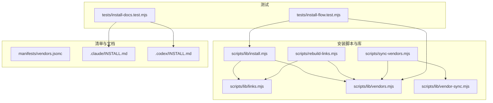
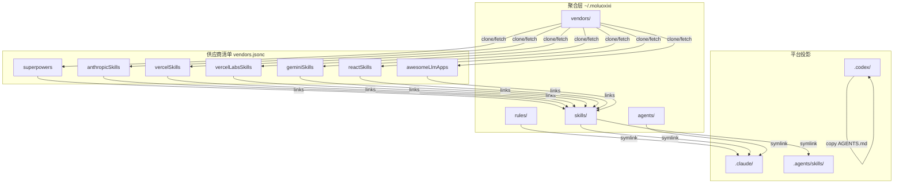
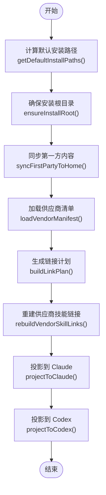
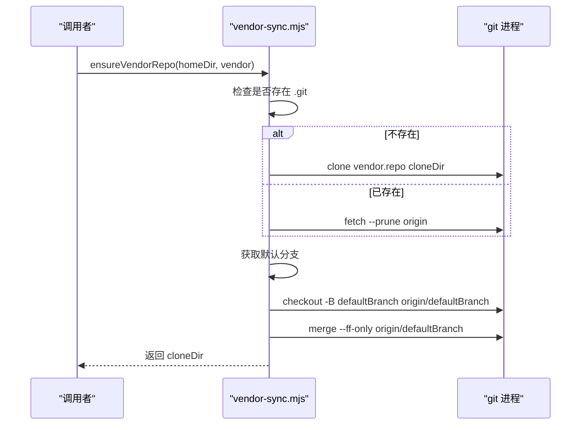
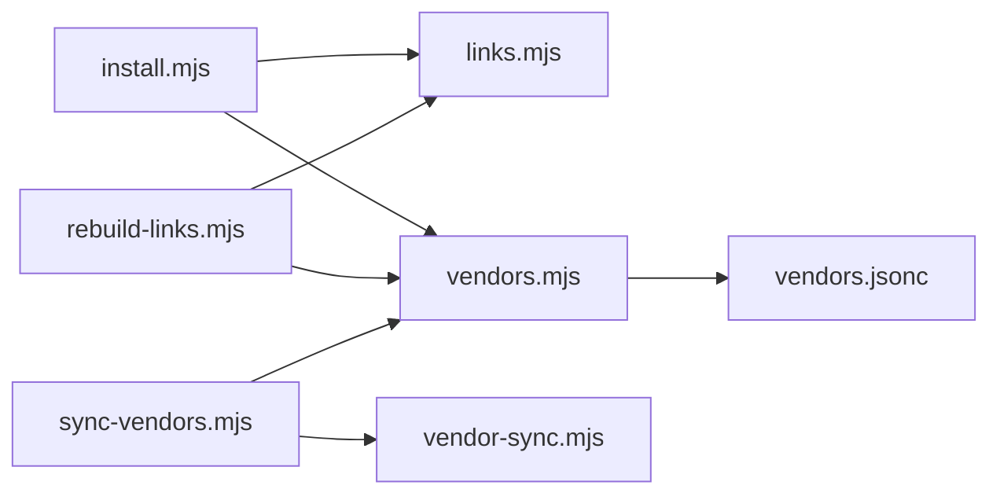

# 安装管理脚本

<cite>
**本文引用的文件**
- [install.mjs](file://scripts/lib/install.mjs)
- [links.mjs](file://scripts/lib/links.mjs)
- [vendors.mjs](file://scripts/lib/vendors.mjs)
- [vendor-sync.mjs](file://scripts/lib/vendor-sync.mjs)
- [sync-vendors.mjs](file://scripts/sync-vendors.mjs)
- [rebuild-links.mjs](file://scripts/rebuild-links.mjs)
- [vendors.jsonc](file://manifests/vendors.jsonc)
- [INSTALL.md（Claude）](file://.claude/INSTALL.md)
- [INSTALL.md（Codex）](file://.codex/INSTALL.md)
- [install-flow.test.mjs](file://tests/install-flow.test.mjs)
- [install-docs.test.mjs](file://tests/install-docs.test.mjs)
- [README.md](file://README.md)
- [package.json](file://package.json)
</cite>

## 目录
1. [简介](#简介)
2. [项目结构](#项目结构)
3. [核心组件](#核心组件)
4. [架构总览](#架构总览)
5. [详细组件分析](#详细组件分析)
6. [依赖关系分析](#依赖关系分析)
7. [性能考量](#性能考量)
8. [故障排除指南](#故障排除指南)
9. [结论](#结论)
10. [附录](#附录)

## 简介
本技术文档聚焦于安装管理脚本，系统性解析 install.mjs 模块的功能与实现，涵盖安装流程控制、依赖检查与环境验证、安装阶段划分（预检查、下载、配置、初始化）、组件协作方式、错误处理与回滚机制、安装配置选项、自定义安装路径、故障排除方法，以及安全与权限管理建议。该安装体系以统一的聚合层 ~/.moluoxixi 为核心，将第一方规则、技能与代理，以及第三方供应商技能进行集中管理，并通过符号链接分别投影到 Claude 与 Codex 的读取位置。

## 项目结构
本项目采用“功能模块化 + 可执行脚本”的组织方式：
- scripts/lib：核心库模块（install.mjs、links.mjs、vendors.mjs、vendor-sync.mjs）
- scripts：可执行脚本（sync-vendors.mjs、rebuild-links.mjs）
- manifests：供应商清单 vendors.jsonc
- .claude/.codex：面向不同平台的安装与升级指引
- tests：安装流程与文档一致性测试

图表来源
- [install.mjs:1-105](file://scripts/lib/install.mjs#L1-L105)
- [links.mjs:1-23](file://scripts/lib/links.mjs#L1-L23)
- [vendors.mjs:1-75](file://scripts/lib/vendors.mjs#L1-L75)
- [vendor-sync.mjs:1-78](file://scripts/lib/vendor-sync.mjs#L1-L78)
- [sync-vendors.mjs:1-62](file://scripts/sync-vendors.mjs#L1-L62)
- [rebuild-links.mjs:1-74](file://scripts/rebuild-links.mjs#L1-L74)
- [vendors.jsonc:1-107](file://manifests/vendors.jsonc#L1-L107)
- [.claude/INSTALL.md:1-108](file://.claude/INSTALL.md#L1-L108)
- [.codex/INSTALL.md:1-95](file://.codex/INSTALL.md#L1-L95)
- [install-flow.test.mjs:1-101](file://tests/install-flow.test.mjs#L1-L101)
- [install-docs.test.mjs:1-14](file://tests/install-docs.test.mjs#L1-L14)

章节来源
- [README.md:1-50](file://README.md#L1-L50)
- [package.json:1-11](file://package.json#L1-L11)

## 核心组件
- install.mjs：安装主流程库，提供默认安装路径、确保安装根目录、同步第一方内容、重建供应商技能链接、投影到 Claude/Codex 的入口等能力。
- links.mjs：根据供应商清单生成链接计划（目标与源），用于将第三方技能统一暴露到聚合层。
- vendors.mjs：供应商清单加载与解析（支持 JSONC 注释与尾随逗号）、路径规范化、仓库根定位、相对路径解析。
- vendor-sync.mjs：供应商仓库克隆与更新，自动检测默认分支并切换至最新状态。
- sync-vendors.mjs：命令行入口，遍历供应商清单并确保各仓库处于最新状态。
- rebuild-links.mjs：命令行入口，基于清单重建符号链接。
- vendors.jsonc：供应商清单，定义仓库地址、克隆目录、链接规则与描述。
- 安装文档：Claude 与 Codex 的安装与升级指引，明确安装目标与步骤。

章节来源
- [install.mjs:1-105](file://scripts/lib/install.mjs#L1-L105)
- [links.mjs:1-23](file://scripts/lib/links.mjs#L1-L23)
- [vendors.mjs:1-75](file://scripts/lib/vendors.mjs#L1-L75)
- [vendor-sync.mjs:1-78](file://scripts/lib/vendor-sync.mjs#L1-L78)
- [sync-vendors.mjs:1-62](file://scripts/sync-vendors.mjs#L1-L62)
- [rebuild-links.mjs:1-74](file://scripts/rebuild-links.mjs#L1-L74)
- [vendors.jsonc:1-107](file://manifests/vendors.jsonc#L1-L107)

## 架构总览
安装架构以“统一聚合层 + 平台投影”为核心思想：
- 统一聚合层 ~/.moluoxixi：集中存放第一方 rules/skills/agents 与 vendors 子目录，作为所有内容的唯一来源。
- 供应商管理：通过 vendors.jsonc 声明多个供应商，vendor-sync.mjs 负责克隆/更新仓库；links.mjs 与 rebuild-links.mjs 将供应商的特定子目录映射到聚合层的 skills 命名空间。
- 平台投影：
  - Claude：将 ~/.claude/rules/skills/agents 符号链接到 ~/.moluoxixi 对应目录。
  - Codex：将 ~/.agents/skills/superpowers 符号链接到 ~/.moluoxixi/skills，并同步 .codex/AGENTS.md 到 ~/.codex。

图表来源
- [install.mjs:62-104](file://scripts/lib/install.mjs#L62-L104)
- [links.mjs:5-22](file://scripts/lib/links.mjs#L5-L22)
- [vendors.jsonc:1-107](file://manifests/vendors.jsonc#L1-L107)
- [.claude/INSTALL.md:23-29](file://.claude/INSTALL.md#L23-L29)
- [.codex/INSTALL.md:13-22](file://.codex/INSTALL.md#L13-L22)

## 详细组件分析

### install.mjs：安装主流程库
- 默认安装路径
  - 提供 getDefaultInstallPaths，返回用户主目录、聚合根目录（moluoHome）、Claude/Codex 目录等。
- 安装根目录准备
  - ensureInstallRoot 确保 moluoHome 与 vendors 子目录存在。
- 第一方内容同步
  - syncFirstPartyToHome 将 repoRoot 下的 rules/skills/agents 复制到 moluoHome 对应目录。
- 供应商技能链接重建
  - rebuildVendorSkillLinks 加载清单、生成链接计划、逐条创建符号链接（Windows 使用 junction，其他平台使用目录链接）。
- 平台投影
  - projectToClaude：为 Claude 创建 rules/skills/agents 的符号链接。
  - projectToCodex：为 Codex 创建 AGENTS.md 与 .agents/skills/superpowers 的符号链接。
- 辅助函数
  - resetDir：递归删除并重新创建目录。
  - copyDirContents：复制目录内容，遵循符号链接真实目标。

图表来源
- [install.mjs:40-104](file://scripts/lib/install.mjs#L40-L104)
- [links.mjs:5-22](file://scripts/lib/links.mjs#L5-L22)
- [vendors.mjs:64-66](file://scripts/lib/vendors.mjs#L64-L66)

章节来源
- [install.mjs:1-105](file://scripts/lib/install.mjs#L1-L105)

### links.mjs：链接计划生成
- 输入：供应商清单对象与聚合层 home 目录。
- 输出：排序后的链接计划数组，每个条目包含 vendorId、source（规范化后的真实源路径）、target（规范化后的目标路径）。
- 关键逻辑：遍历 vendors 与 links，规范化路径并排序，便于稳定输出。

章节来源
- [links.mjs:1-23](file://scripts/lib/links.mjs#L1-L23)

### vendors.mjs：供应商清单解析与工具
- 解析：parseJsonc 支持注释与尾随逗号，兼容 JSONC。
- 加载：loadVendorManifest 读取并解析清单文件。
- 路径：normalizePath、resolveHomePath、getRepoRoot 提供路径规范化与解析能力。

章节来源
- [vendors.mjs:1-75](file://scripts/lib/vendors.mjs#L1-L75)

### vendor-sync.mjs：供应商仓库同步
- Git 操作封装：runGit 统一调用 git 并处理非零退出码。
- 默认分支探测：优先使用 symbolic-ref，其次 ls-remote，最后回退到列出远程分支选择。
- 同步策略：若不存在 .git 则 clone；否则 fetch 并与默认分支对齐；必要时 checkout -B 并 merge --ff-only。

图表来源
- [vendor-sync.mjs:5-77](file://scripts/lib/vendor-sync.mjs#L5-L77)

章节来源
- [vendor-sync.mjs:1-78](file://scripts/lib/vendor-sync.mjs#L1-L78)

### 可执行脚本：sync-vendors.mjs 与 rebuild-links.mjs
- sync-vendors.mjs
  - 命令行参数解析：--home、--manifest、--help。
  - 主流程：加载清单、确保 home 目录存在、遍历 vendors 调用 ensureVendorRepo。
- rebuild-links.mjs
  - 命令行参数解析：--home、--manifest、--help。
  - 主流程：加载清单、生成链接计划、逐条创建符号链接并打印日志。

章节来源
- [sync-vendors.mjs:1-62](file://scripts/sync-vendors.mjs#L1-L62)
- [rebuild-links.mjs:1-74](file://scripts/rebuild-links.mjs#L1-L74)

### 供应商清单 vendors.jsonc
- 定义版本、供应商列表与链接规则。
- 示例供应商：superpowers、anthropicSkills、vercelSkills、vercelLabsSkills、geminiSkills、reactSkills、awesomeLlmApps。
- 每个供应商包含：描述、仓库地址、克隆目录、链接数组（source/target）。

章节来源
- [vendors.jsonc:1-107](file://manifests/vendors.jsonc#L1-L107)

### 安装流程与验证测试
- install-flow.test.mjs：模拟完整安装流程，覆盖 ensureInstallRoot、同步第一方、重建链接、投影到 Claude/Codex，并断言关键文件存在与链接正确。
- install-docs.test.mjs：断言安装文档中提及 superpowers 与 ~/.moluoxixi 布局。

章节来源
- [install-flow.test.mjs:1-101](file://tests/install-flow.test.mjs#L1-L101)
- [install-docs.test.mjs:1-14](file://tests/install-docs.test.mjs#L1-L14)

## 依赖关系分析
- install.mjs 依赖 links.mjs 与 vendors.mjs，用于生成链接计划与加载清单。
- rebuild-links.mjs 与 sync-vendors.mjs 分别作为命令行入口，内部依赖 links.mjs、vendors.mjs 与 vendor-sync.mjs。
- vendors.jsonc 为上游数据源，被 vendors.mjs 解析后驱动链接与仓库同步。

图表来源
- [install.mjs:14-15](file://scripts/lib/install.mjs#L14-L15)
- [links.mjs](file://scripts/lib/links.mjs#L3)
- [vendors.mjs:1-2](file://scripts/lib/vendors.mjs#L1-L2)
- [sync-vendors.mjs:6-7](file://scripts/sync-vendors.mjs#L6-L7)
- [vendor-sync.mjs:1-3](file://scripts/lib/vendor-sync.mjs#L1-L3)
- [vendors.jsonc:1-107](file://manifests/vendors.jsonc#L1-L107)

## 性能考量
- 链接重建稳定性：links.mjs 对链接计划进行排序，保证输出稳定，避免重复或冲突。
- 目录操作幂等：resetDir 与 copyDirContents 在目标存在时先删除再创建，确保幂等性。
- Git 操作最小化：vendor-sync.mjs 仅在需要时切换分支并执行 fast-forward 合并，减少不必要的重写。
- 平台差异：符号链接类型根据平台自动选择（Windows 使用 junction，其他平台使用目录链接），避免跨平台兼容性问题。

## 故障排除指南
- 环境前置条件
  - 确认已安装 Git 与 Node.js，且 Claude/Codex 可正常使用。
- 安装路径问题
  - 自定义 home 目录：通过命令行参数 --home 指定 ~/.moluoxixi 的实际位置。
  - 自定义清单路径：通过 --manifest 指向自定义 vendors.jsonc。
- 供应商仓库同步失败
  - 检查网络连通性与仓库访问权限；查看 vendor-sync.mjs 的错误输出。
  - 若默认分支无法识别，手动确认远端 HEAD 格式或指定分支。
- 符号链接失败
  - Windows 上需管理员权限或启用开发者模式；确认目标路径存在且无同名文件。
  - 确认链接源路径有效，rebuild-links.mjs 会跳过缺失的源并给出警告。
- 平台投影不生效
  - Claude：确认 ~/.claude/rules/skills/agents 是否指向 ~/.moluoxixi 对应目录。
  - Codex：确认 ~/.agents/skills/superpowers 是否指向 ~/.moluoxixi/skills，且 ~/.codex/AGENTS.md 已同步。

章节来源
- [.claude/INSTALL.md:3-7](file://.claude/INSTALL.md#L3-L7)
- [.codex/INSTALL.md:3-7](file://.codex/INSTALL.md#L3-L7)
- [rebuild-links.mjs:60-64](file://scripts/rebuild-links.mjs#L60-L64)
- [vendor-sync.mjs:13-16](file://scripts/lib/vendor-sync.mjs#L13-L16)

## 结论
install.mjs 作为安装主流程库，提供了从路径规划、内容同步、链接重建到平台投影的完整能力。通过 vendors.jsonc 的声明式配置与 vendor-sync.mjs 的自动化仓库管理，安装体系实现了对第一方与第三方技能的统一聚合与稳定暴露。结合命令行脚本与测试用例，安装流程具备良好的可维护性与可验证性。建议在生产环境中配合权限与网络策略，确保安装过程的稳定性与安全性。

## 附录

### 安装配置选项
- 命令行参数
  - --home <dir>：覆盖默认聚合根目录（默认 ~/.moluoxixi）。
  - --manifest <file>：覆盖供应商清单路径（默认 manifests/vendors.jsonc）。
  - --help：显示帮助信息。
- 平台差异
  - Windows 使用 junction 链接，其他平台使用目录链接；脚本自动适配。

章节来源
- [rebuild-links.mjs:10-18](file://scripts/rebuild-links.mjs#L10-L18)
- [sync-vendors.mjs:10-18](file://scripts/sync-vendors.mjs#L10-L18)
- [install.mjs:36-38](file://scripts/lib/install.mjs#L36-L38)

### 错误处理与回滚机制
- 错误处理
  - vendor-sync.mjs 在 git 命令非零退出时抛出异常，包含标准错误输出。
  - rebuild-links.mjs 对缺失源路径进行跳过并记录警告。
- 回滚建议
  - 由于目录重置与链接重建是幂等操作，可通过重新运行脚本恢复一致状态。
  - 建议在关键步骤前备份 ~/.claude 与 ~/.codex 的旧链接，以便快速恢复。

章节来源
- [vendor-sync.mjs:13-16](file://scripts/lib/vendor-sync.mjs#L13-L16)
- [rebuild-links.mjs:61-64](file://scripts/rebuild-links.mjs#L61-L64)

### 安全考虑与权限管理
- 权限要求
  - Windows：创建 junction 需要管理员权限或启用开发者模式。
  - Unix：创建符号链接通常需要相应目录写权限。
- 安全建议
  - 仅从可信来源克隆供应商仓库，避免引入不受信任的技能。
  - 定期更新供应商仓库，确保使用最新版本。
  - 在 CI/CD 环境中限制 Node.js 与 Git 的访问范围，避免过度授权。

章节来源
- [.codex/INSTALL.md:54-80](file://.codex/INSTALL.md#L54-L80)
- [.claude/INSTALL.md:59-87](file://.claude/INSTALL.md#L59-L87)