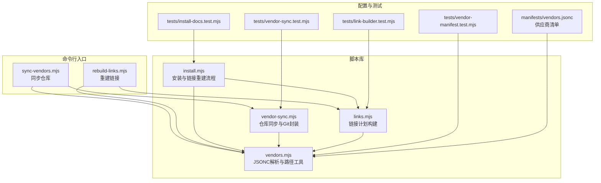
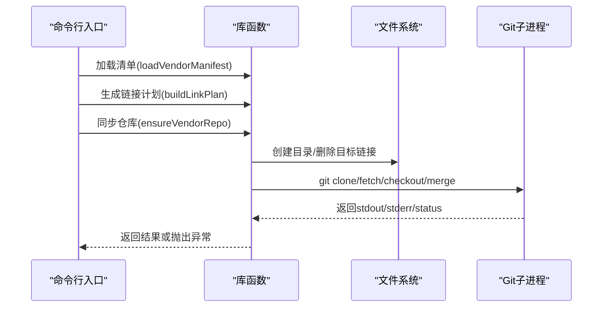
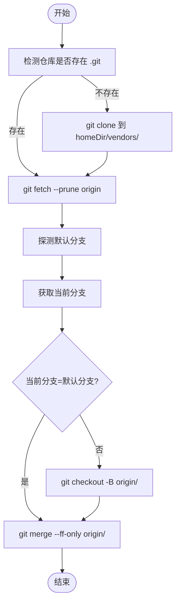
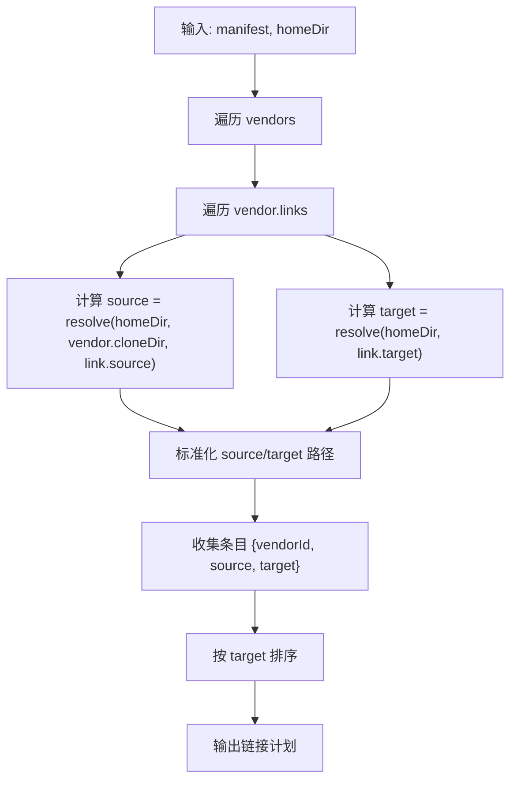
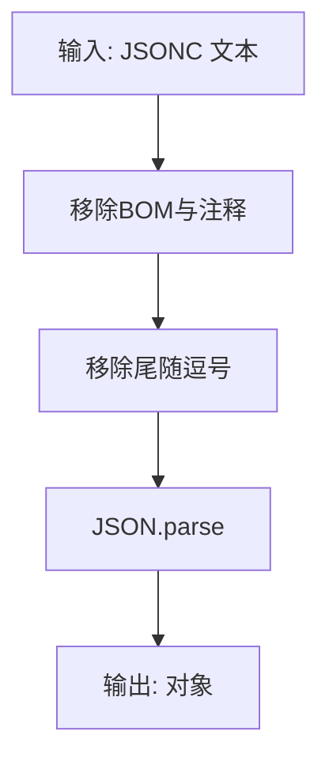
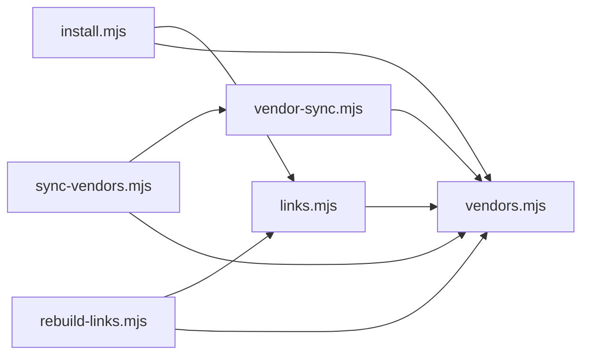

# 脚本库函数

<cite>
**本文引用的文件**
- [scripts/lib/vendor-sync.mjs](file://scripts/lib/vendor-sync.mjs)
- [scripts/lib/links.mjs](file://scripts/lib/links.mjs)
- [scripts/lib/vendors.mjs](file://scripts/lib/vendors.mjs)
- [scripts/lib/install.mjs](file://scripts/lib/install.mjs)
- [scripts/rebuild-links.mjs](file://scripts/rebuild-links.mjs)
- [scripts/sync-vendors.mjs](file://scripts/sync-vendors.mjs)
- [manifests/vendors.jsonc](file://manifests/vendors.jsonc)
- [tests/link-builder.test.mjs](file://tests/link-builder.test.mjs)
- [tests/vendor-manifest.test.mjs](file://tests/vendor-manifest.test.mjs)
- [tests/vendor-sync.test.mjs](file://tests/vendor-sync.test.mjs)
- [tests/install-docs.test.mjs](file://tests/install-docs.test.mjs)
</cite>

## 目录
1. [简介](#简介)
2. [项目结构](#项目结构)
3. [核心组件](#核心组件)
4. [架构总览](#架构总览)
5. [详细组件分析](#详细组件分析)
6. [依赖关系分析](#依赖关系分析)
7. [性能考量](#性能考量)
8. [故障排查指南](#故障排查指南)
9. [结论](#结论)
10. [附录](#附录)

## 简介
本文件为 AIRules 项目的脚本库函数详细参考文档，聚焦以下三个核心库模块：
- 仓库同步与 Git 封装：vendor-sync.mjs
- 链接管理与构建：links.mjs
- 清单解析与 JSONC 支持：vendors.mjs

文档内容涵盖各模块的函数签名、参数说明、返回值、错误处理策略、使用示例以及组合使用模式，并提供扩展指导，帮助开发者在不同平台（Windows/Linux/macOS）上正确配置和维护第三方技能来源与本地链接。

## 项目结构
脚本库位于 scripts/lib 下，配套入口脚本位于 scripts/ 目录，清单文件位于 manifests/ 目录，测试用例位于 tests/ 目录。整体采用“库函数 + 命令行入口 + 清单 + 测试”的分层组织方式。

图表来源
- [scripts/lib/vendor-sync.mjs:1-78](file://scripts/lib/vendor-sync.mjs#L1-L78)
- [scripts/lib/links.mjs:1-23](file://scripts/lib/links.mjs#L1-L23)
- [scripts/lib/vendors.mjs:1-75](file://scripts/lib/vendors.mjs#L1-L75)
- [scripts/lib/install.mjs:1-105](file://scripts/lib/install.mjs#L1-L105)
- [scripts/sync-vendors.mjs:1-62](file://scripts/sync-vendors.mjs#L1-L62)
- [scripts/rebuild-links.mjs:1-74](file://scripts/rebuild-links.mjs#L1-L74)
- [manifests/vendors.jsonc:1-107](file://manifests/vendors.jsonc#L1-L107)
- [tests/vendor-sync.test.mjs:1-72](file://tests/vendor-sync.test.mjs#L1-L72)
- [tests/link-builder.test.mjs:1-36](file://tests/link-builder.test.mjs#L1-L36)
- [tests/vendor-manifest.test.mjs:1-13](file://tests/vendor-manifest.test.mjs#L1-L13)
- [tests/install-docs.test.mjs:1-14](file://tests/install-docs.test.mjs#L1-L14)

章节来源
- [scripts/lib/vendor-sync.mjs:1-78](file://scripts/lib/vendor-sync.mjs#L1-L78)
- [scripts/lib/links.mjs:1-23](file://scripts/lib/links.mjs#L1-L23)
- [scripts/lib/vendors.mjs:1-75](file://scripts/lib/vendors.mjs#L1-L75)
- [scripts/lib/install.mjs:1-105](file://scripts/lib/install.mjs#L1-L105)
- [scripts/sync-vendors.mjs:1-62](file://scripts/sync-vendors.mjs#L1-L62)
- [scripts/rebuild-links.mjs:1-74](file://scripts/rebuild-links.mjs#L1-L74)
- [manifests/vendors.jsonc:1-107](file://manifests/vendors.jsonc#L1-L107)

## 核心组件
本节概述三个库模块的功能定位与职责边界：
- vendor-sync.mjs：负责仓库克隆、分支切换与合并，封装 Git 子进程调用，提供默认分支探测与错误处理。
- links.mjs：根据清单生成链接计划，计算源路径与目标路径，排序后输出统一的链接条目。
- vendors.mjs：提供路径规范化、JSONC 解析（注释与尾随逗号）、清单加载、仓库根目录与相对路径解析等工具。

章节来源
- [scripts/lib/vendor-sync.mjs:1-78](file://scripts/lib/vendor-sync.mjs#L1-L78)
- [scripts/lib/links.mjs:1-23](file://scripts/lib/links.mjs#L1-L23)
- [scripts/lib/vendors.mjs:1-75](file://scripts/lib/vendors.mjs#L1-L75)

## 架构总览
下图展示从命令行入口到库函数的调用链路，以及清单驱动的链接与仓库同步流程。

图表来源
- [scripts/sync-vendors.mjs:46-59](file://scripts/sync-vendors.mjs#L46-L59)
- [scripts/rebuild-links.mjs:50-71](file://scripts/rebuild-links.mjs#L50-L71)
- [scripts/lib/vendor-sync.mjs:58-77](file://scripts/lib/vendor-sync.mjs#L58-L77)
- [scripts/lib/links.mjs:5-22](file://scripts/lib/links.mjs#L5-L22)
- [scripts/lib/vendors.mjs:64-66](file://scripts/lib/vendors.mjs#L64-L66)

## 详细组件分析

### vendor-sync.mjs：仓库同步与 Git 封装
该模块提供仓库同步与 Git 操作的高层封装，确保仓库处于期望的默认分支状态，并进行必要的 fetch、checkout 与 merge 操作。

- 函数概览
  - runGit(args, cwd, options?)：执行 git 子进程，统一编码与 IO 处理；当退出码非零时抛出错误。
  - getRemoteDefaultBranch(cloneDir)：探测远程默认分支，兼容多种 HEAD 表达形式与分支列表回退逻辑。
  - ensureVendorRepo(homeDir, vendor)：主流程函数，负责克隆、拉取、切换分支与快进合并，最终返回克隆目录路径。

- 参数与返回
  - runGit
    - 参数
      - args：字符串数组，传递给 git 命令行
      - cwd：工作目录
      - options：可选对象，支持 stdio 控制
    - 返回：标准输出字符串（已去除空白）
    - 异常：当退出码非零时抛出错误
  - getRemoteDefaultBranch
    - 参数：cloneDir（仓库目录）
    - 返回：默认分支名（如 main/canary）
    - 异常：无法解析默认分支时抛出错误
  - ensureVendorRepo
    - 参数
      - homeDir：用户家目录或自定义根目录
      - vendor：包含 repo、cloneDir 的对象
    - 返回：最终克隆目录的绝对路径
    - 异常：Git 操作失败或默认分支解析失败时抛出错误

- 错误处理策略
  - runGit 对非零退出码直接抛错，保证上层调用能感知失败
  - getRemoteDefaultBranch 提供多级回退：symbolic-ref -> ls-remote -> branch -r，最后仍失败则抛错
  - ensureVendorRepo 在分支不一致时强制切换到默认分支并快进合并，避免历史分离导致的不一致

- 使用示例（命令行）
  - 同步所有供应商仓库：node scripts/sync-vendors.mjs
  - 可通过 --home 与 --manifest 覆盖默认路径

- 组合使用模式
  - 先同步仓库（ensureVendorRepo），再基于清单生成链接计划（buildLinkPlan），最后重建链接（rebuildVendorSkillLinks）

图表来源
- [scripts/lib/vendor-sync.mjs:58-77](file://scripts/lib/vendor-sync.mjs#L58-L77)

章节来源
- [scripts/lib/vendor-sync.mjs:1-78](file://scripts/lib/vendor-sync.mjs#L1-L78)
- [scripts/sync-vendors.mjs:46-59](file://scripts/sync-vendors.mjs#L46-L59)
- [tests/vendor-sync.test.mjs:24-71](file://tests/vendor-sync.test.mjs#L24-L71)

### links.mjs：链接管理与构建
该模块负责根据供应商清单生成链接计划，计算源路径与目标路径，并对结果进行排序，便于后续批量建立符号链接。

- 函数概览
  - buildLinkPlan(manifest, homeDir)：遍历清单中的每个供应商及其链接规则，计算绝对路径并生成条目，按目标路径排序后返回

- 参数与返回
  - buildLinkPlan
    - 参数
      - manifest：供应商清单对象（包含 vendors 字段）
      - homeDir：用户家目录或自定义根目录
    - 返回：链接计划数组，每项包含 vendorId、source、target
    - 异常：无显式异常；若清单缺失字段，可能产生空计划

- 关键实现细节
  - 使用 vendors.mjs 的 normalizePath 进行路径标准化
  - 使用 path.resolve 计算绝对路径，确保跨平台一致性
  - 结果按 target 进行本地化比较排序，保证输出稳定

- 使用示例（命令行）
  - 重建链接：node scripts/rebuild-links.mjs
  - 可通过 --home 与 --manifest 覆盖默认路径

- 组合使用模式
  - 与 vendors.mjs 的 loadVendorManifest 配合，先加载清单，再生成链接计划，最后批量建立符号链接

图表来源
- [scripts/lib/links.mjs:5-22](file://scripts/lib/links.mjs#L5-L22)
- [scripts/lib/vendors.mjs:4-6](file://scripts/lib/vendors.mjs#L4-L6)

章节来源
- [scripts/lib/links.mjs:1-23](file://scripts/lib/links.mjs#L1-L23)
- [scripts/rebuild-links.mjs:50-71](file://scripts/rebuild-links.mjs#L50-L71)
- [tests/link-builder.test.mjs:29-35](file://tests/link-builder.test.mjs#L29-L35)

### vendors.mjs：清单解析与路径工具
该模块提供 JSONC（带注释的 JSON）解析、路径规范化、清单加载与仓库根目录解析等基础能力。

- 函数概览
  - normalizePath(value)：将 Windows 反斜杠路径转换为正斜杠，便于跨平台一致性
  - parseJsonc(content)：移除注释与尾随逗号，生成合法 JSON 字符串后解析
  - loadVendorManifest(manifestPath)：读取清单文件并解析为对象
  - getRepoRoot(fromFileUrl)：根据导入元信息推导仓库根目录
  - resolveHomePath(homeDir, relativePath)：标准化相对路径拼接后的绝对路径

- 参数与返回
  - normalizePath
    - 参数：字符串路径
    - 返回：标准化后的路径
  - parseJsonc
    - 参数：原始文本
    - 返回：解析后的对象
    - 异常：JSON 解析失败时抛出错误
  - loadVendorManifest
    - 参数：清单文件路径
    - 返回：清单对象
    - 异常：文件读取或 JSON 解析失败时抛出错误
  - getRepoRoot
    - 参数：fromFileUrl（import.meta.url）
    - 返回：仓库根目录绝对路径
  - resolveHomePath
    - 参数：homeDir、relativePath
    - 返回：标准化后的绝对路径

- JSONC 解析算法要点
  - 逐字符扫描，识别字符串边界与转义
  - 移除单行注释（// ...）与块注释（/* ... */）
  - 移除对象与数组末尾的逗号
  - 最终交由 JSON.parse 解析

- 使用示例（命令行）
  - 加载清单：node scripts/rebuild-links.mjs --manifest <path>
  - 获取仓库根目录：用于定位仓库内资源

- 组合使用模式
  - 与 links.mjs 的 buildLinkPlan 协作，先加载清单，再生成链接计划
  - 与 vendor-sync.mjs 的 ensureVendorRepo 协作，先同步仓库，再生成链接计划

图表来源
- [scripts/lib/vendors.mjs:8-66](file://scripts/lib/vendors.mjs#L8-L66)

章节来源
- [scripts/lib/vendors.mjs:1-75](file://scripts/lib/vendors.mjs#L1-L75)
- [manifests/vendors.jsonc:1-107](file://manifests/vendors.jsonc#L1-L107)
- [tests/vendor-manifest.test.mjs:5-12](file://tests/vendor-manifest.test.mjs#L5-L12)

### install.mjs：安装与链接重建流程（集成层）
该模块整合了仓库同步与链接重建的完整流程，提供默认安装路径、目录准备、复制与链接等操作。

- 函数概览
  - getDefaultInstallPaths(userHome?)：返回默认安装路径集合（用户家目录、.moluoxixi、.claude、.codex 等）
  - ensureInstallRoot(paths)：确保安装根目录与 vendors 子目录存在
  - syncFirstPartyToHome(repoRoot, moluoHome)：将仓库内的 rules、skills、agents 复制到安装根目录
  - rebuildVendorSkillLinks({ homeDir, manifestPath })：加载清单、生成链接计划并批量建立符号链接
  - projectToClaude({ repoRoot, moluoHome, claudeHome })：将 rules/skills/agents 符号链接到 Claude 工作区
  - projectToCodex({ repoRoot, moluoHome, codexHome, codexAgentSkillsHome })：将 skills 符号链接到 Codex 工作区

- 参数与返回
  - getDefaultInstallPaths：返回包含 userHome、moluoHome、repoRoot、claudeHome、codexHome、codexAgentSkillsHome 的对象
  - ensureInstallRoot：无返回，确保目录存在
  - syncFirstPartyToHome：无返回，复制目录内容
  - rebuildVendorSkillLinks：返回链接计划数组
  - projectToClaude/projectToCodex：无返回，建立符号链接

- 平台差异
  - Windows 使用 junction，其他平台使用 dir 符号链接类型

- 组合使用模式
  - 先同步仓库（ensureVendorRepo），再复制官方内容（syncFirstPartyToHome），最后重建链接（rebuildVendorSkillLinks）

章节来源
- [scripts/lib/install.mjs:1-105](file://scripts/lib/install.mjs#L1-L105)

## 依赖关系分析
- vendor-sync.mjs 依赖 vendors.mjs 的路径工具（normalizePath）与清单加载（loadVendorManifest）
- links.mjs 依赖 vendors.mjs 的 normalizePath 与路径解析
- install.mjs 同时依赖 links.mjs 与 vendors.mjs，并封装了完整的安装流程
- 命令行入口脚本（sync-vendors.mjs、rebuild-links.mjs）分别调用 vendor-sync.mjs 与 links.mjs

图表来源
- [scripts/lib/vendor-sync.mjs:1-78](file://scripts/lib/vendor-sync.mjs#L1-L78)
- [scripts/lib/links.mjs:1-23](file://scripts/lib/links.mjs#L1-L23)
- [scripts/lib/vendors.mjs:1-75](file://scripts/lib/vendors.mjs#L1-L75)
- [scripts/lib/install.mjs:1-105](file://scripts/lib/install.mjs#L1-L105)
- [scripts/sync-vendors.mjs:1-62](file://scripts/sync-vendors.mjs#L1-L62)
- [scripts/rebuild-links.mjs:1-74](file://scripts/rebuild-links.mjs#L1-L74)

章节来源
- [scripts/lib/vendor-sync.mjs:1-78](file://scripts/lib/vendor-sync.mjs#L1-L78)
- [scripts/lib/links.mjs:1-23](file://scripts/lib/links.mjs#L1-L23)
- [scripts/lib/vendors.mjs:1-75](file://scripts/lib/vendors.mjs#L1-L75)
- [scripts/lib/install.mjs:1-105](file://scripts/lib/install.mjs#L1-L105)
- [scripts/sync-vendors.mjs:1-62](file://scripts/sync-vendors.mjs#L1-L62)
- [scripts/rebuild-links.mjs:1-74](file://scripts/rebuild-links.mjs#L1-L74)

## 性能考量
- Git 操作
  - clone/fetch/merge 会触发网络与磁盘 IO，建议在首次运行或需要更新时执行
  - 使用 --prune 选项清理已删除远程分支，减少本地冗余
- 路径计算
  - normalizePath 仅做简单替换，开销极低
  - buildLinkPlan 对大量链接进行排序，复杂度近似 O(n log n)，通常可忽略
- 文件系统
  - 批量建立符号链接时，Windows 使用 junction，Linux/macOS 使用 dir，注意权限与路径长度限制

## 故障排查指南
- Git 失败
  - 现象：runGit 抛出错误，提示 git 命令失败
  - 排查：确认网络连通性、认证配置、仓库地址是否有效；查看 stderr 输出
  - 参考：[scripts/lib/vendor-sync.mjs:5-19](file://scripts/lib/vendor-sync.mjs#L5-L19)
- 默认分支解析失败
  - 现象：getRemoteDefaultBranch 抛出“无法确定默认分支”错误
  - 排查：检查远程仓库 HEAD 设置、分支列表；必要时手动指定分支
  - 参考：[scripts/lib/vendor-sync.mjs:21-52](file://scripts/lib/vendor-sync.mjs#L21-L52)
- 链接目标缺失
  - 现象：rebuild-links.mjs 跳过不存在的源路径
  - 排查：确认仓库已同步且链接 source 路径正确
  - 参考：[scripts/rebuild-links.mjs:60-64](file://scripts/rebuild-links.mjs#L60-L64)
- JSONC 解析错误
  - 现象：parseJsonc 抛出 JSON 解析异常
  - 排查：检查注释语法、尾随逗号、引号配对；使用 loadVendorManifest 进行端到端验证
  - 参考：[scripts/lib/vendors.mjs:8-66](file://scripts/lib/vendors.mjs#L8-L66)
- 平台差异
  - 现象：Windows 上符号链接行为与 Linux/macOS 不同
  - 排查：确保以管理员权限运行（Windows junction 需要），或使用兼容的链接类型
  - 参考：[scripts/lib/install.mjs:36-38](file://scripts/lib/install.mjs#L36-L38)

章节来源
- [scripts/lib/vendor-sync.mjs:5-19](file://scripts/lib/vendor-sync.mjs#L5-L19)
- [scripts/lib/vendor-sync.mjs:21-52](file://scripts/lib/vendor-sync.mjs#L21-L52)
- [scripts/rebuild-links.mjs:60-64](file://scripts/rebuild-links.mjs#L60-L64)
- [scripts/lib/vendors.mjs:8-66](file://scripts/lib/vendors.mjs#L8-L66)
- [scripts/lib/install.mjs:36-38](file://scripts/lib/install.mjs#L36-L38)

## 结论
vendor-sync.mjs、links.mjs 与 vendors.mjs 三者协同，构成了 AIRules 项目中第三方技能来源的统一管理与链接体系。通过清单驱动的方式，既能灵活扩展新的供应商，又能保证链接的一致性与可维护性。结合命令行入口脚本与测试用例，开发者可以快速完成仓库同步与链接重建，并在不同平台上稳定运行。

## 附录

### API 参考速查
- vendor-sync.mjs
  - runGit(args, cwd, options?)
  - getRemoteDefaultBranch(cloneDir)
  - ensureVendorRepo(homeDir, vendor)
- links.mjs
  - buildLinkPlan(manifest, homeDir)
- vendors.mjs
  - normalizePath(value)
  - parseJsonc(content)
  - loadVendorManifest(manifestPath)
  - getRepoRoot(fromFileUrl)
  - resolveHomePath(homeDir, relativePath)

### 使用示例（命令行）
- 同步仓库：node scripts/sync-vendors.mjs [--home <dir>] [--manifest <file>]
- 重建链接：node scripts/rebuild-links.mjs [--home <dir>] [--manifest <file>]

### 扩展指导
- 新增供应商
  - 在清单中添加 vendor 条目，包含 repo、cloneDir 与 links 数组
  - 更新 links 数组以暴露所需技能目录或文件
  - 参考：[manifests/vendors.jsonc:1-107](file://manifests/vendors.jsonc#L1-L107)
- 自定义路径
  - 使用 getDefaultInstallPaths 获取默认路径，或传入自定义 homeDir
  - 参考：[scripts/lib/install.mjs:40-51](file://scripts/lib/install.mjs#L40-L51)
- 平台适配
  - Windows 使用 junction，其他平台使用 dir；可通过 linkTypeForCurrentPlatform 判断
  - 参考：[scripts/lib/install.mjs:36-38](file://scripts/lib/install.mjs#L36-L38)