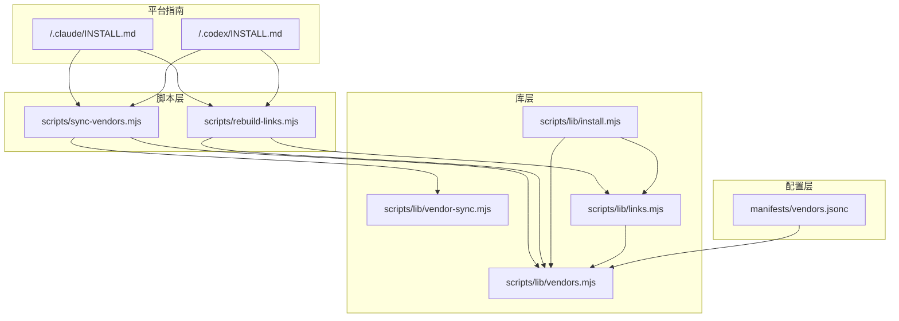
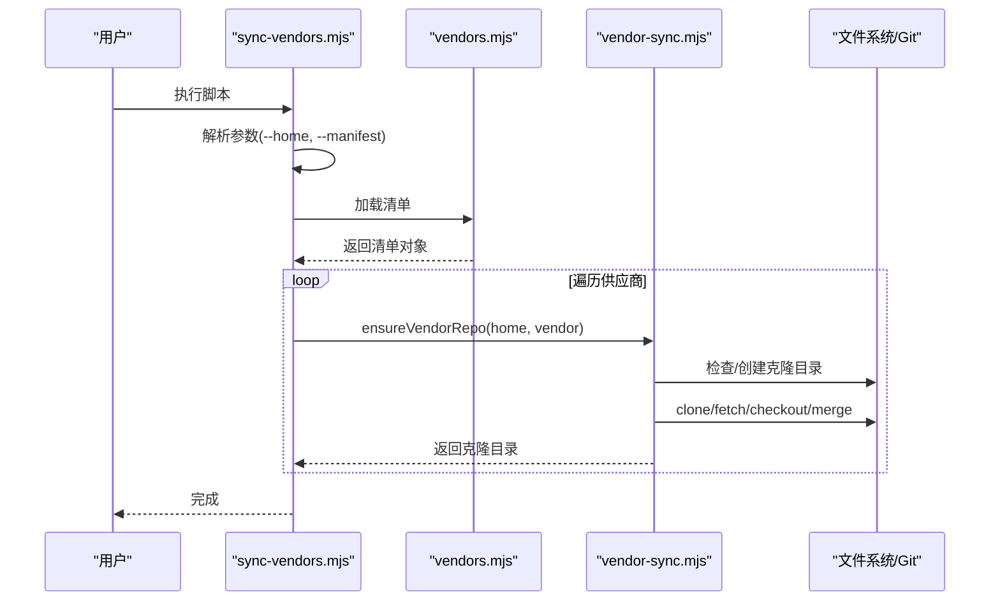
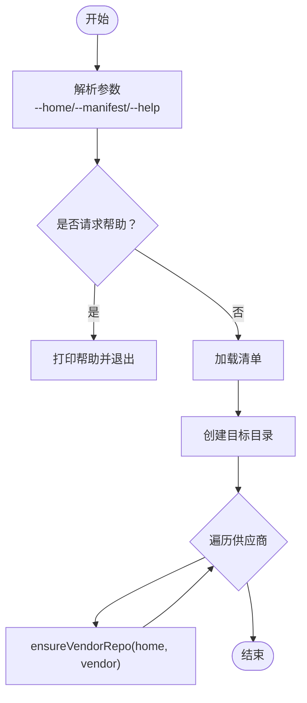
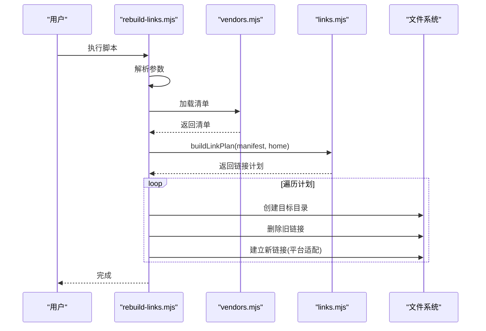
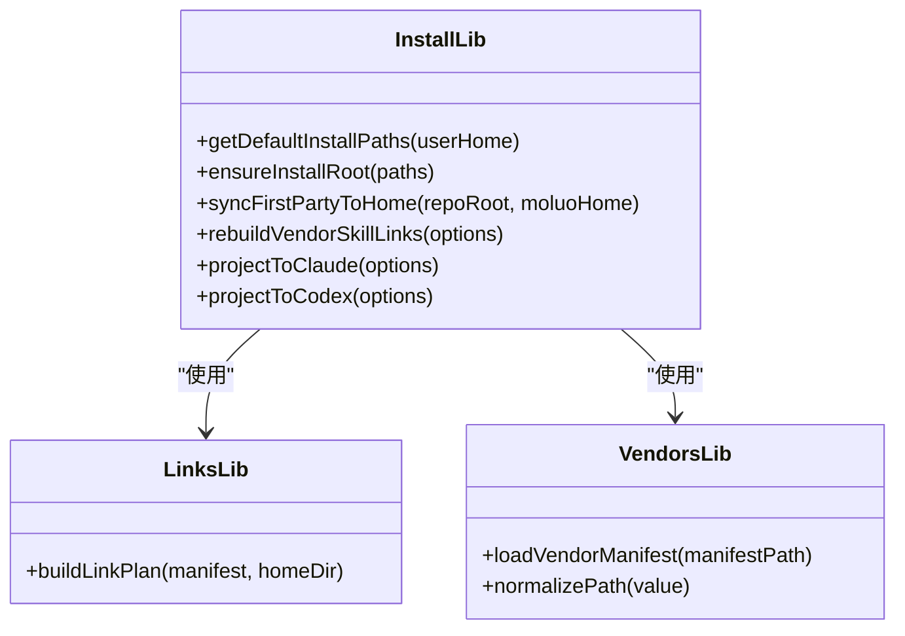
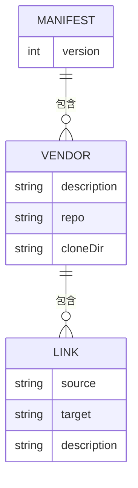
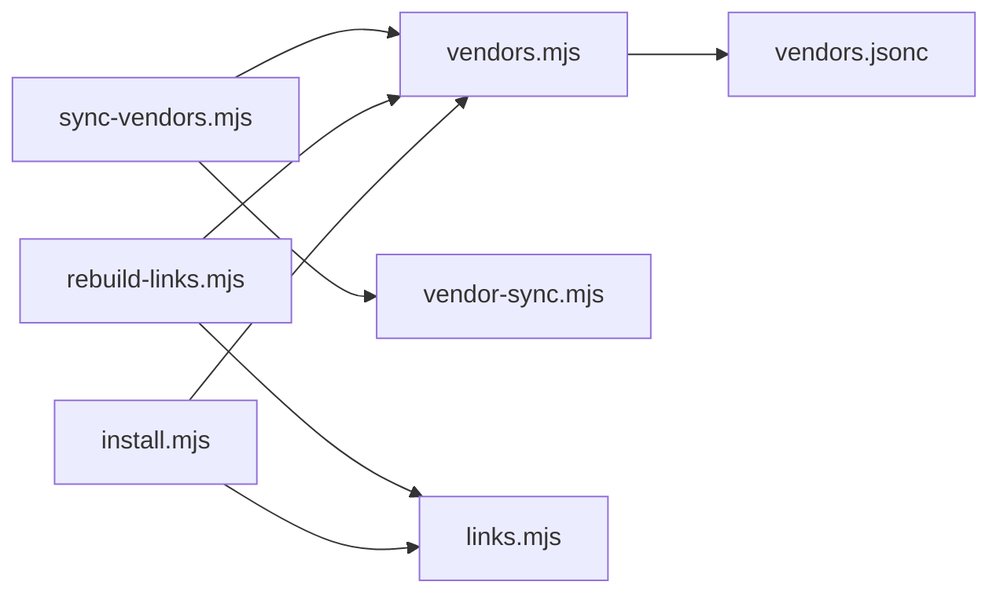

# 自动化脚本

<cite>
**本文引用的文件**
- [scripts/sync-vendors.mjs](file://scripts/sync-vendors.mjs)
- [scripts/rebuild-links.mjs](file://scripts/rebuild-links.mjs)
- [scripts/lib/vendor-sync.mjs](file://scripts/lib/vendor-sync.mjs)
- [scripts/lib/links.mjs](file://scripts/lib/links.mjs)
- [scripts/lib/install.mjs](file://scripts/lib/install.mjs)
- [scripts/lib/vendors.mjs](file://scripts/lib/vendors.mjs)
- [manifests/vendors.jsonc](file://manifests/vendors.jsonc)
- [.claude/INSTALL.md](file://.claude/INSTALL.md)
- [.codex/INSTALL.md](file://.codex/INSTALL.md)
- [tests/vendor-sync.test.mjs](file://tests/vendor-sync.test.mjs)
- [tests/link-builder.test.mjs](file://tests/link-builder.test.mjs)
- [tests/install-flow.test.mjs](file://tests/install-flow.test.mjs)
- [package.json](file://package.json)
- [README.md](file://README.md)
</cite>

## 目录
1. [简介](#简介)
2. [项目结构](#项目结构)
3. [核心组件](#核心组件)
4. [架构总览](#架构总览)
5. [详细组件分析](#详细组件分析)
6. [依赖关系分析](#依赖关系分析)
7. [性能考虑](#性能考虑)
8. [故障排除指南](#故障排除指南)
9. [结论](#结论)
10. [附录](#附录)

## 简介
本项目是一套用于管理个人 AI 规则与技能的自动化脚本集合，围绕统一的聚合层组织第一方与第三方内容，并为 Claude 与 Codex 提供一致的读取入口。核心目标包括：
- 供应商同步：克隆或更新第三方仓库，确保与远端默认分支保持一致
- 链接重建：根据清单将供应商与第一方内容映射到统一的技能目录
- 安装管理：在用户主目录下建立统一的聚合层，并将内容投影到 Claude/Codex 的专用目录

该体系通过清单文件定义供应商来源与链接规则，脚本自动完成下载、同步与链接操作，确保不同平台（macOS/Linux/Windows）的一致体验。

## 项目结构
项目采用“脚本 + 库 + 清单”的分层组织方式：
- scripts：顶层可执行脚本，负责命令行解析与流程编排
- scripts/lib：可复用的库模块，封装具体逻辑（同步、链接、安装）
- manifests：供应商清单，描述仓库来源与链接规则
- .claude/.codex：平台安装指南与入口配置
- tests：针对核心流程的单元测试与集成测试

图表来源
- [scripts/sync-vendors.mjs:1-62](file://scripts/sync-vendors.mjs#L1-L62)
- [scripts/rebuild-links.mjs:1-74](file://scripts/rebuild-links.mjs#L1-L74)
- [scripts/lib/vendor-sync.mjs:1-78](file://scripts/lib/vendor-sync.mjs#L1-L78)
- [scripts/lib/links.mjs:1-23](file://scripts/lib/links.mjs#L1-L23)
- [scripts/lib/install.mjs:1-105](file://scripts/lib/install.mjs#L1-L105)
- [scripts/lib/vendors.mjs:1-75](file://scripts/lib/vendors.mjs#L1-L75)
- [manifests/vendors.jsonc:1-107](file://manifests/vendors.jsonc#L1-L107)
- [.claude/INSTALL.md:1-108](file://.claude/INSTALL.md#L1-L108)
- [.codex/INSTALL.md:1-95](file://.codex/INSTALL.md#L1-L95)

章节来源
- [scripts/sync-vendors.mjs:1-62](file://scripts/sync-vendors.mjs#L1-L62)
- [scripts/rebuild-links.mjs:1-74](file://scripts/rebuild-links.mjs#L1-L74)
- [scripts/lib/vendor-sync.mjs:1-78](file://scripts/lib/vendor-sync.mjs#L1-L78)
- [scripts/lib/links.mjs:1-23](file://scripts/lib/links.mjs#L1-L23)
- [scripts/lib/install.mjs:1-105](file://scripts/lib/install.mjs#L1-L105)
- [scripts/lib/vendors.mjs:1-75](file://scripts/lib/vendors.mjs#L1-L75)
- [manifests/vendors.jsonc:1-107](file://manifests/vendors.jsonc#L1-L107)
- [.claude/INSTALL.md:1-108](file://.claude/INSTALL.md#L1-L108)
- [.codex/INSTALL.md:1-95](file://.codex/INSTALL.md#L1-L95)

## 核心组件
- 供应商同步脚本：解析命令行参数，加载清单，遍历供应商并确保仓库处于最新且与默认分支一致
- 链接重建脚本：基于清单生成链接计划，创建目标目录，删除旧链接并建立新链接
- 安装管理库：提供统一的安装路径、目录准备、内容同步与平台特定的链接策略
- 供应商清单：定义供应商仓库地址、克隆目录与链接规则，支持注释与尾随逗号的 JSONC 解析
- 平台安装指南：为 Claude 与 Codex 提供跨平台的安装与验证步骤

章节来源
- [scripts/sync-vendors.mjs:1-62](file://scripts/sync-vendors.mjs#L1-L62)
- [scripts/rebuild-links.mjs:1-74](file://scripts/rebuild-links.mjs#L1-L74)
- [scripts/lib/install.mjs:1-105](file://scripts/lib/install.mjs#L1-L105)
- [scripts/lib/vendors.mjs:1-75](file://scripts/lib/vendors.mjs#L1-L75)
- [manifests/vendors.jsonc:1-107](file://manifests/vendors.jsonc#L1-L107)
- [.claude/INSTALL.md:1-108](file://.claude/INSTALL.md#L1-L108)
- [.codex/INSTALL.md:1-95](file://.codex/INSTALL.md#L1-L95)

## 架构总览
整体架构遵循“清单驱动 + 可复用库 + 平台适配”的模式：
- 清单驱动：通过 vendors.jsonc 描述供应商与链接规则
- 可复用库：vendor-sync、links、vendors、install 提供核心能力
- 平台适配：根据操作系统选择符号链接类型（Windows 使用目录连接，类 Unix 使用目录链接）

图表来源
- [scripts/sync-vendors.mjs:46-59](file://scripts/sync-vendors.mjs#L46-L59)
- [scripts/lib/vendors.mjs:64-66](file://scripts/lib/vendors.mjs#L64-L66)
- [scripts/lib/vendor-sync.mjs:58-77](file://scripts/lib/vendor-sync.mjs#L58-L77)

章节来源
- [scripts/sync-vendors.mjs:1-62](file://scripts/sync-vendors.mjs#L1-L62)
- [scripts/lib/vendor-sync.mjs:1-78](file://scripts/lib/vendor-sync.mjs#L1-L78)
- [scripts/lib/vendors.mjs:1-75](file://scripts/lib/vendors.mjs#L1-L75)

## 详细组件分析

### 供应商同步脚本（sync-vendors.mjs）
- 功能概述：根据清单克隆或更新所有供应商仓库，确保当前分支与远端默认分支一致
- 参数
  - --home <dir>：覆盖默认目标目录（默认为用户主目录下的 .moluoxixi）
  - --manifest <file>：覆盖清单文件路径（默认为 manifests/vendors.jsonc）
  - --help：显示帮助信息
- 处理流程
  - 解析命令行参数并打印帮助
  - 加载清单并创建目标目录
  - 遍历清单中的每个供应商，调用 ensureVendorRepo
- 错误处理
  - 未知参数抛出异常
  - Git 子进程失败时抛出异常，包含退出码与标准错误
- 性能特性
  - 使用子进程执行 Git 命令，避免阻塞事件循环
  - 仅在需要时切换分支并进行快进合并

图表来源
- [scripts/sync-vendors.mjs:21-59](file://scripts/sync-vendors.mjs#L21-L59)
- [scripts/lib/vendor-sync.mjs:58-77](file://scripts/lib/vendor-sync.mjs#L58-L77)

章节来源
- [scripts/sync-vendors.mjs:1-62](file://scripts/sync-vendors.mjs#L1-L62)
- [scripts/lib/vendor-sync.mjs:1-78](file://scripts/lib/vendor-sync.mjs#L1-L78)

### 链接重建脚本（rebuild-links.mjs）
- 功能概述：根据清单生成链接计划，清理旧链接并建立新链接
- 参数
  - --home <dir>：覆盖默认目标目录
  - --manifest <file>：覆盖清单文件路径
  - --help：显示帮助信息
- 处理流程
  - 解析命令行参数并打印帮助
  - 加载清单并生成链接计划
  - 对每个计划项：创建目标目录、删除旧链接、建立新链接
- 平台适配
  - Windows 使用目录连接（junction），类 Unix 使用目录链接（dir）
- 错误处理
  - 未知参数抛出异常
  - 源路径不存在时跳过并记录警告

图表来源
- [scripts/rebuild-links.mjs:50-71](file://scripts/rebuild-links.mjs#L50-L71)
- [scripts/lib/links.mjs:5-22](file://scripts/lib/links.mjs#L5-L22)
- [scripts/lib/vendors.mjs:64-66](file://scripts/lib/vendors.mjs#L64-L66)

章节来源
- [scripts/rebuild-links.mjs:1-74](file://scripts/rebuild-links.mjs#L1-L74)
- [scripts/lib/links.mjs:1-23](file://scripts/lib/links.mjs#L1-L23)
- [scripts/lib/vendors.mjs:1-75](file://scripts/lib/vendors.mjs#L1-L75)

### 安装管理库（install.mjs）
- 功能概述：提供统一的安装路径、目录准备、内容同步与平台特定的链接策略
- 关键函数
  - getDefaultInstallPaths(userHome)：返回默认安装路径集合
  - ensureInstallRoot(paths)：创建必要的根目录
  - syncFirstPartyToHome(repoRoot, moluoHome)：将第一方内容复制到聚合层
  - rebuildVendorSkillLinks(options)：重建供应商技能链接
  - projectToClaude(options)：将内容投影到 Claude 专用目录
  - projectToCodex(options)：将内容投影到 Codex 专用目录
- 平台适配
  - Windows 使用目录连接（junction），类 Unix 使用目录链接（dir）
- 错误处理
  - 目录重置与清理时使用强制删除，避免残留导致冲突

图表来源
- [scripts/lib/install.mjs:40-105](file://scripts/lib/install.mjs#L40-L105)
- [scripts/lib/links.mjs:5-22](file://scripts/lib/links.mjs#L5-L22)
- [scripts/lib/vendors.mjs:64-75](file://scripts/lib/vendors.mjs#L64-L75)

章节来源
- [scripts/lib/install.mjs:1-105](file://scripts/lib/install.mjs#L1-L105)
- [scripts/lib/links.mjs:1-23](file://scripts/lib/links.mjs#L1-L23)
- [scripts/lib/vendors.mjs:1-75](file://scripts/lib/vendors.mjs#L1-L75)

### 供应商清单（vendors.jsonc）
- 功能概述：定义供应商仓库来源、克隆目录与链接规则，支持注释与尾随逗号
- 结构要点
  - version：清单版本
  - vendors：供应商列表，每个供应商包含描述、仓库地址、克隆目录与链接数组
  - links：每个链接包含源路径与目标路径，以及描述
- JSONC 支持
  - 解析器支持单行注释、多行注释与尾随逗号，便于人类阅读与维护

图表来源
- [manifests/vendors.jsonc:1-107](file://manifests/vendors.jsonc#L1-L107)

章节来源
- [manifests/vendors.jsonc:1-107](file://manifests/vendors.jsonc#L1-L107)
- [scripts/lib/vendors.mjs:8-66](file://scripts/lib/vendors.mjs#L8-L66)

### 平台安装指南（Claude/Codex）
- Claude 安装指南
  - 步骤：克隆仓库、同步供应商、重建链接、建立指向聚合层的链接
  - 验证：确认 vendors 与 skills 目录存在，Claude 读取路径正确
- Codex 安装指南
  - 步骤：克隆仓库、同步供应商、重建链接、复制 AGENTS.md、建立原生技能发现目录的链接
  - 验证：确认 .agents/skills/superpowers 指向聚合层，.codex/AGENTS.md 已同步

章节来源
- [.claude/INSTALL.md:1-108](file://.claude/INSTALL.md#L1-L108)
- [.codex/INSTALL.md:1-95](file://.codex/INSTALL.md#L1-L95)

## 依赖关系分析
- 脚本到库的依赖
  - sync-vendors.mjs 依赖 vendors.mjs 与 vendor-sync.mjs
  - rebuild-links.mjs 依赖 vendors.mjs 与 links.mjs
  - install.mjs 依赖 links.mjs 与 vendors.mjs
- 清单到库的依赖
  - vendors.mjs 被脚本与库共同使用，提供清单加载与路径规范化
- 平台指南对脚本的依赖
  - Claude/Codex 安装指南中直接调用脚本，形成端到端的安装流程

图表来源
- [scripts/sync-vendors.mjs:6-7](file://scripts/sync-vendors.mjs#L6-L7)
- [scripts/rebuild-links.mjs:6-7](file://scripts/rebuild-links.mjs#L6-L7)
- [scripts/lib/install.mjs:14-15](file://scripts/lib/install.mjs#L14-L15)
- [scripts/lib/vendors.mjs:64-66](file://scripts/lib/vendors.mjs#L64-L66)
- [manifests/vendors.jsonc:1-107](file://manifests/vendors.jsonc#L1-L107)

章节来源
- [scripts/sync-vendors.mjs:1-62](file://scripts/sync-vendors.mjs#L1-L62)
- [scripts/rebuild-links.mjs:1-74](file://scripts/rebuild-links.mjs#L1-L74)
- [scripts/lib/install.mjs:1-105](file://scripts/lib/install.mjs#L1-L105)
- [scripts/lib/vendors.mjs:1-75](file://scripts/lib/vendors.mjs#L1-L75)
- [manifests/vendors.jsonc:1-107](file://manifests/vendors.jsonc#L1-L107)

## 性能考虑
- Git 操作异步化：通过子进程执行 Git 命令，避免阻塞主线程
- 快进合并：仅在必要时切换分支并进行快进合并，减少不必要的切换成本
- 目录操作批量化：批量创建目录、删除旧链接与建立新链接，降低 I/O 次数
- 平台适配：根据操作系统选择最优的链接类型，减少跨平台兼容性开销

## 故障排除指南
- 常见错误与处理
  - 未知参数：脚本会抛出异常并提示帮助信息，检查参数拼写与顺序
  - Git 命令失败：查看标准错误输出，确认网络连通性与仓库访问权限
  - 源路径不存在：链接重建脚本会跳过并记录警告，检查清单中的 source 路径是否正确
- 调试建议
  - 使用 --help 查看参数说明
  - 在本地临时修改 --home 与 --manifest 参数进行隔离测试
  - 参考测试用例了解期望行为与边界条件
- 相关测试参考
  - 供应商同步测试：验证分离 HEAD 的恢复与默认分支同步
  - 链接构建测试：验证链接计划生成与目标路径匹配
  - 安装流程测试：验证从第一方内容到平台投影的完整流程

章节来源
- [scripts/sync-vendors.mjs:38-41](file://scripts/sync-vendors.mjs#L38-L41)
- [scripts/lib/vendor-sync.mjs:13-19](file://scripts/lib/vendor-sync.mjs#L13-L19)
- [tests/vendor-sync.test.mjs:24-72](file://tests/vendor-sync.test.mjs#L24-L72)
- [tests/link-builder.test.mjs:29-36](file://tests/link-builder.test.mjs#L29-L36)
- [tests/install-flow.test.mjs:55-101](file://tests/install-flow.test.mjs#L55-L101)

## 结论
本自动化脚本体系通过清单驱动的方式，将第一方与第三方内容统一聚合，并为 Claude 与 Codex 提供一致的读取入口。脚本具备良好的跨平台适配、清晰的参数接口与完善的错误处理机制。结合测试用例与平台安装指南，用户可以快速完成安装与升级，并在出现问题时进行有效排查。

## 附录

### 环境要求与权限
- 环境要求
  - Node.js：用于运行脚本
  - Git：用于克隆与更新仓库
  - 平台工具：Windows 上需要管理员权限以创建目录连接
- 权限设置
  - 目标目录需具备读写权限
  - Windows 上可能需要以管理员身份运行以创建目录连接

章节来源
- [.claude/INSTALL.md:3-7](file://.claude/INSTALL.md#L3-L7)
- [.codex/INSTALL.md:3-7](file://.codex/INSTALL.md#L3-L7)

### 使用示例与最佳实践
- 示例：Claude 安装
  - 步骤：克隆仓库、同步供应商、重建链接、建立指向聚合层的链接
  - 验证：确认 vendors 与 skills 目录存在，Claude 读取路径正确
- 示例：Codex 安装
  - 步骤：克隆仓库、同步供应商、重建链接、复制 AGENTS.md、建立原生技能发现目录的链接
  - 验证：确认 .agents/skills/superpowers 指向聚合层，.codex/AGENTS.md 已同步
- 最佳实践
  - 定期运行供应商同步脚本以保持第三方内容最新
  - 在变更清单后运行链接重建脚本以应用新的链接规则
  - 使用测试用例验证安装流程的正确性

章节来源
- [.claude/INSTALL.md:31-108](file://.claude/INSTALL.md#L31-L108)
- [.codex/INSTALL.md:24-95](file://.codex/INSTALL.md#L24-L95)

### 脚本定制与扩展指导
- 定制清单
  - 在 vendors.jsonc 中添加新的供应商条目，指定仓库地址、克隆目录与链接规则
  - 使用注释说明供应商用途，便于团队协作与维护
- 扩展功能
  - 新增链接规则：在供应商的 links 数组中添加新的 source/target 对
  - 自定义安装路径：通过脚本参数覆盖默认路径
  - 平台适配：根据需要调整链接类型与目录结构
- 调试与测试
  - 编写测试用例验证新增功能
  - 使用临时目录隔离测试，避免影响生产环境

章节来源
- [manifests/vendors.jsonc:1-107](file://manifests/vendors.jsonc#L1-L107)
- [scripts/sync-vendors.mjs:9-19](file://scripts/sync-vendors.mjs#L9-L19)
- [scripts/rebuild-links.mjs:9-19](file://scripts/rebuild-links.mjs#L9-L19)