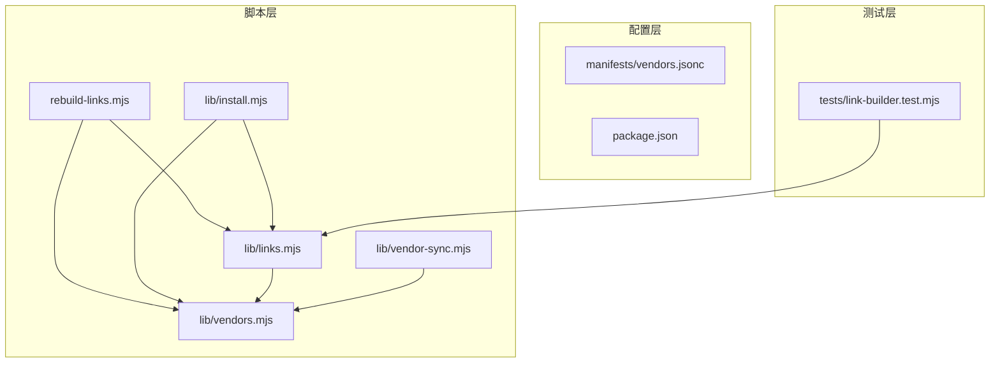
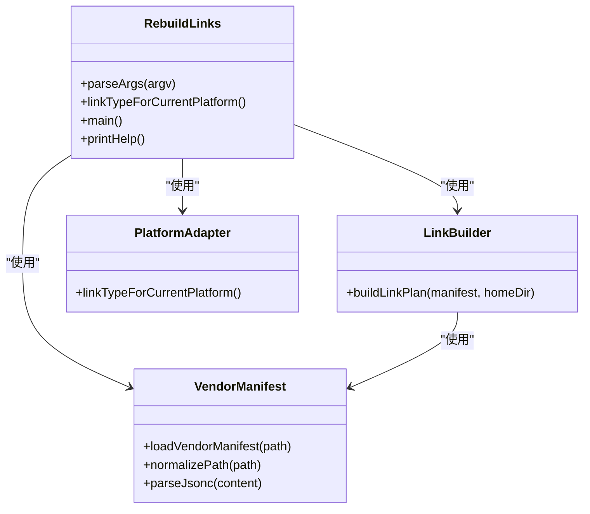
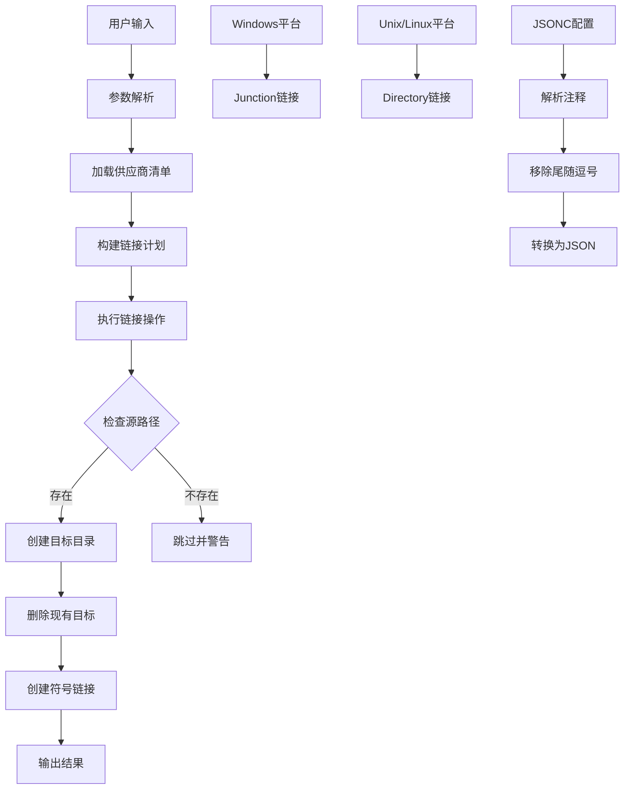
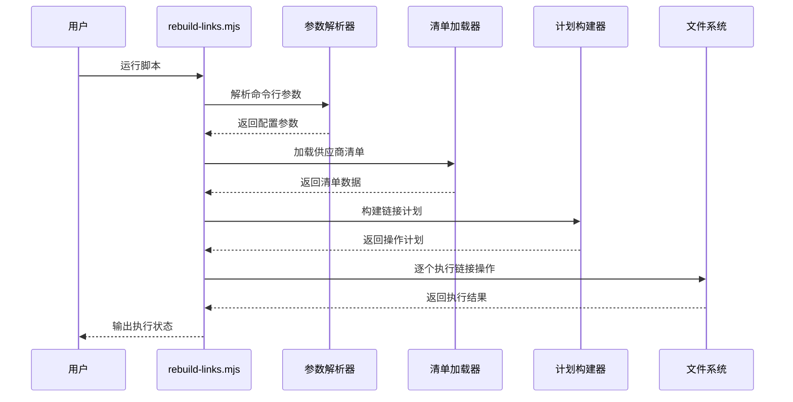
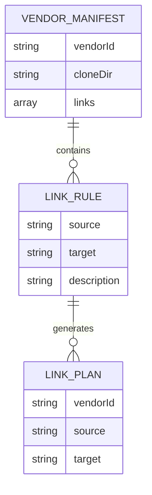
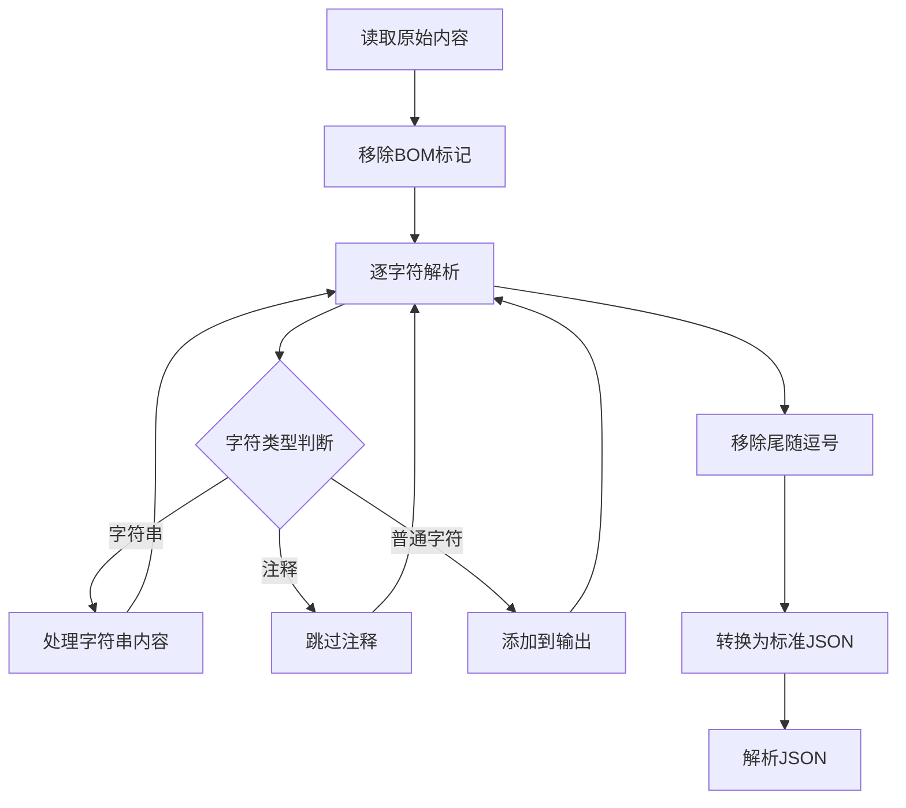
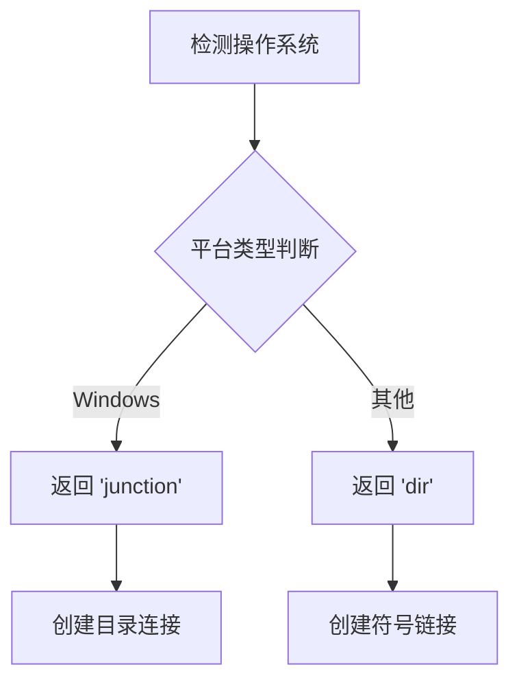
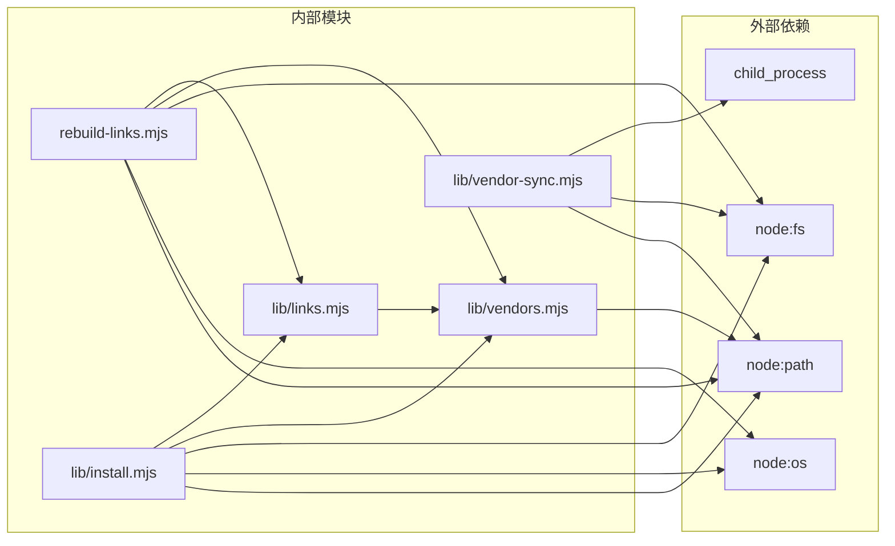

# 链接重建脚本

<cite>
**本文档引用的文件**
- [scripts/rebuild-links.mjs](file://scripts/rebuild-links.mjs)
- [scripts/lib/links.mjs](file://scripts/lib/links.mjs)
- [scripts/lib/vendors.mjs](file://scripts/lib/vendors.mjs)
- [scripts/lib/install.mjs](file://scripts/lib/install.mjs)
- [scripts/lib/vendor-sync.mjs](file://scripts/lib/vendor-sync.mjs)
- [manifests/vendors.jsonc](file://manifests/vendors.jsonc)
- [tests/link-builder.test.mjs](file://tests/link-builder.test.mjs)
- [README.md](file://README.md)
- [package.json](file://package.json)
</cite>

## 目录
1. [简介](#简介)
2. [项目结构](#项目结构)
3. [核心组件](#核心组件)
4. [架构概览](#架构概览)
5. [详细组件分析](#详细组件分析)
6. [依赖关系分析](#依赖关系分析)
7. [性能考虑](#性能考虑)
8. [故障排除指南](#故障排除指南)
9. [结论](#结论)
10. [附录](#附录)

## 简介

链接重建脚本是 Moluoxixi AI Rules 项目中的一个关键工具，用于重新构建和管理符号链接。该脚本基于 Node.js 编写，主要功能包括：

- **符号链接重建**：根据供应商清单重新生成符号链接
- **跨平台适配**：自动检测操作系统并选择合适的链接类型
- **路径解析**：统一处理不同操作系统的路径分隔符
- **批量操作**：支持一次性重建多个供应商的链接

该项目的核心理念是将第三方技能从各自的仓库中聚合到统一的目录结构中，然后通过符号链接的方式暴露给不同的 AI 平台（Claude 和 Codex）使用。

## 项目结构

项目采用模块化的组织方式，主要分为以下几个部分：



**图表来源**
- [scripts/rebuild-links.mjs:1-74](file://scripts/rebuild-links.mjs#L1-L74)
- [scripts/lib/install.mjs:1-105](file://scripts/lib/install.mjs#L1-L105)
- [scripts/lib/links.mjs:1-23](file://scripts/lib/links.mjs#L1-L23)
- [scripts/lib/vendors.mjs:1-75](file://scripts/lib/vendors.mjs#L1-L75)

**章节来源**
- [README.md:1-50](file://README.md#L1-L50)
- [package.json:1-11](file://package.json#L1-L11)

## 核心组件

### 主要组件概述

链接重建系统由以下核心组件构成：

1. **rebuild-links.mjs** - 主执行脚本，提供命令行接口
2. **links.mjs** - 链接计划构建器，负责生成链接操作计划
3. **vendors.mjs** - 供应商清单解析器，处理 JSONC 格式配置
4. **install.mjs** - 安装和同步功能模块
5. **vendor-sync.mjs** - 供应商仓库同步工具

### 组件交互关系



**图表来源**
- [scripts/rebuild-links.mjs:21-74](file://scripts/rebuild-links.mjs#L21-L74)
- [scripts/lib/links.mjs:5-22](file://scripts/lib/links.mjs#L5-L22)
- [scripts/lib/vendors.mjs:64-75](file://scripts/lib/vendors.mjs#L64-L75)

**章节来源**
- [scripts/rebuild-links.mjs:1-74](file://scripts/rebuild-links.mjs#L1-L74)
- [scripts/lib/links.mjs:1-23](file://scripts/lib/links.mjs#L1-L23)
- [scripts/lib/vendors.mjs:1-75](file://scripts/lib/vendors.mjs#L1-L75)

## 架构概览

### 系统架构图



**图表来源**
- [scripts/rebuild-links.mjs:50-71](file://scripts/rebuild-links.mjs#L50-L71)
- [scripts/lib/links.mjs:5-22](file://scripts/lib/links.mjs#L5-L22)
- [scripts/lib/vendors.mjs:64-66](file://scripts/lib/vendors.mjs#L64-L66)

### 数据流分析

链接重建过程的数据流可以分为以下几个阶段：

1. **配置加载阶段**：从 JSONC 文件中读取供应商配置
2. **路径解析阶段**：将相对路径转换为绝对路径
3. **链接计划生成阶段**：创建需要执行的操作列表
4. **执行阶段**：实际创建符号链接

## 详细组件分析

### rebuild-links.mjs - 主执行脚本

#### 功能特性

主执行脚本提供了完整的命令行接口，支持以下功能：

- **参数解析**：支持 `--home`、`--manifest`、`--help` 参数
- **平台检测**：自动识别操作系统并选择合适的链接类型
- **错误处理**：提供详细的错误信息和帮助文本

#### 关键实现细节



**图表来源**
- [scripts/rebuild-links.mjs:50-71](file://scripts/rebuild-links.mjs#L50-L71)

#### 参数配置详解

| 参数 | 类型 | 默认值 | 描述 |
|------|------|--------|------|
| `--home <dir>` | 字符串 | `~/.moluoxixi` | 指定目标根目录 |
| `--manifest <file>` | 字符串 | `manifests/vendors.jsonc` | 指定清单文件路径 |
| `--help` | 标志 | - | 显示帮助信息 |

**章节来源**
- [scripts/rebuild-links.mjs:9-19](file://scripts/rebuild-links.mjs#L9-L19)
- [scripts/rebuild-links.mjs:21-44](file://scripts/rebuild-links.mjs#L21-L44)

### LinkBuilder 类 - 链接计划构建器

#### 核心功能

链接计划构建器负责将供应商清单转换为具体的链接操作计划：

1. **遍历供应商**：扫描所有供应商定义
2. **解析链接规则**：处理每个供应商的链接配置
3. **路径规范化**：确保路径格式一致
4. **排序输出**：按目标路径排序以保证确定性

#### 数据结构设计



**图表来源**
- [scripts/lib/links.mjs:5-22](file://scripts/lib/links.mjs#L5-L22)
- [manifests/vendors.jsonc:10-16](file://manifests/vendors.jsonc#L10-L16)

#### 复杂度分析

- **时间复杂度**：O(n*m)，其中 n 是供应商数量，m 是每个供应商的链接数量
- **空间复杂度**：O(n*m)，用于存储链接计划

**章节来源**
- [scripts/lib/links.mjs:5-22](file://scripts/lib/links.mjs#L5-L22)

### VendorManifest - 供应商清单处理器

#### JSONC 支持

供应商清单使用 JSONC 格式，支持以下特性：

- **注释支持**：支持单行和多行注释
- **尾随逗号**：允许在对象和数组末尾使用逗号
- **字符串引号**：支持单引号和双引号

#### 解析算法



**图表来源**
- [scripts/lib/vendors.mjs:8-62](file://scripts/lib/vendors.mjs#L8-L62)

**章节来源**
- [scripts/lib/vendors.mjs:1-75](file://scripts/lib/vendors.mjs#L1-L75)
- [manifests/vendors.jsonc:1-107](file://manifests/vendors.jsonc#L1-L107)

### PlatformAdapter - 平台适配器

#### 跨平台链接策略

不同操作系统使用不同的链接类型：

| 操作系统 | 链接类型 | 说明 |
|----------|----------|------|
| Windows | Junction | Windows 特有的目录连接 |
| Unix/Linux | Directory | 标准的符号链接 |
| macOS | Directory | 标准的符号链接 |

#### 实现原理



**图表来源**
- [scripts/rebuild-links.mjs:46-48](file://scripts/rebuild-links.mjs#L46-L48)
- [scripts/lib/install.mjs:36-38](file://scripts/lib/install.mjs#L36-L38)

**章节来源**
- [scripts/rebuild-links.mjs:46-48](file://scripts/rebuild-links.mjs#L46-L48)
- [scripts/lib/install.mjs:36-38](file://scripts/lib/install.mjs#L36-L38)

## 依赖关系分析

### 模块依赖图



**图表来源**
- [scripts/rebuild-links.mjs:1-8](file://scripts/rebuild-links.mjs#L1-L8)
- [scripts/lib/install.mjs:1-16](file://scripts/lib/install.mjs#L1-L16)
- [scripts/lib/vendor-sync.mjs:1-4](file://scripts/lib/vendor-sync.mjs#L1-L4)

### 循环依赖检测

经过分析，系统中没有检测到循环依赖：
- `rebuild-links.mjs` 只依赖 `links.mjs` 和 `vendors.mjs`
- `install.mjs` 依赖 `links.mjs` 和 `vendors.mjs`
- `links.mjs` 仅依赖 `vendors.mjs`
- `vendors.mjs` 不依赖任何其他模块

**章节来源**
- [scripts/rebuild-links.mjs:1-8](file://scripts/rebuild-links.mjs#L1-L8)
- [scripts/lib/links.mjs:1-4](file://scripts/lib/links.mjs#L1-L4)
- [scripts/lib/vendors.mjs:1-3](file://scripts/lib/vendors.mjs#L1-L3)

## 性能考虑

### 时间复杂度优化

1. **单次遍历**：链接计划构建只进行一次遍历，避免重复扫描
2. **路径缓存**：通过预解析路径减少重复计算
3. **批量操作**：一次性处理所有链接，减少系统调用次数

### 内存使用优化

1. **渐进式处理**：逐个处理链接条目，避免同时加载所有数据
2. **最小化数据复制**：直接使用解析后的数据结构
3. **及时释放资源**：处理完每个条目后立即释放相关资源

### I/O 性能优化

1. **递归创建目录**：使用 `recursive: true` 避免多次系统调用
2. **原子操作**：先删除再创建，确保操作的原子性
3. **并行处理**：虽然当前实现是顺序处理，但架构支持并行扩展

## 故障排除指南

### 常见问题及解决方案

#### 1. 权限错误

**问题描述**：在某些系统上创建符号链接需要特殊权限

**解决方案**：
- 在 Windows 上以管理员身份运行
- 在 Unix/Linux 上确保有足够的文件系统权限
- 检查目标目录的写入权限

#### 2. 路径解析错误

**问题描述**：路径分隔符不正确导致链接失败

**解决方案**：
- 使用内置的路径规范化函数
- 确保使用绝对路径而非相对路径
- 检查路径中是否包含特殊字符

#### 3. 供应商仓库访问失败

**问题描述**：无法访问远程 Git 仓库

**解决方案**：
- 检查网络连接
- 验证 Git 凭据配置
- 确认仓库 URL 正确性

#### 4. 符号链接创建失败

**问题描述**：系统不支持特定类型的链接

**解决方案**：
- 检查操作系统支持的链接类型
- 确认目标文件系统支持符号链接
- 验证磁盘空间充足

### 调试技巧

#### 启用详细日志

```bash
node scripts/rebuild-links.mjs --home /custom/path --manifest /custom/manifest.json
```

#### 验证链接状态

```bash
# Linux/macOS
ls -la ~/.moluoxixi/skills/

# Windows
dir %USERPROFILE%\.moluoxixi\skills\
```

#### 检查配置文件

```bash
cat manifests/vendors.jsonc
```

**章节来源**
- [tests/link-builder.test.mjs:1-36](file://tests/link-builder.test.mjs#L1-L36)

## 结论

链接重建脚本是一个设计精良的工具，具有以下特点：

### 优势

1. **跨平台兼容**：自动适配不同操作系统的链接类型
2. **配置驱动**：通过 JSONC 配置文件管理复杂的链接规则
3. **错误处理**：提供完善的错误检测和处理机制
4. **模块化设计**：清晰的模块分离便于维护和扩展

### 改进建议

1. **并发处理**：可以考虑实现并行链接创建以提高性能
2. **增量更新**：支持只更新发生变化的链接
3. **回滚机制**：提供链接创建失败时的回滚功能
4. **监控指标**：添加执行时间和成功率等监控指标

该脚本成功实现了将多个第三方技能仓库聚合到统一目录结构的目标，为 AI 平台提供了标准化的技能访问接口。

## 附录

### 使用示例

#### 基本使用

```bash
# 使用默认配置
node scripts/rebuild-links.mjs

# 指定自定义目录
node scripts/rebuild-links.mjs --home /custom/home

# 指定自定义清单文件
node scripts/rebuild-links.mjs --manifest /custom/vendors.jsonc
```

#### 高级用法

```bash
# 查看帮助信息
node scripts/rebuild-links.mjs --help

# 结合安装脚本使用
node scripts/lib/install.mjs
```

### 最佳实践

1. **定期更新**：定期运行链接重建脚本以保持技能最新
2. **备份策略**：在重要操作前备份现有链接
3. **权限管理**：确保适当的文件系统权限
4. **监控告警**：建立链接状态监控机制

### 维护建议

1. **配置验证**：定期验证清单文件的语法正确性
2. **性能监控**：监控链接重建的执行时间和资源使用
3. **兼容性测试**：在新平台上测试链接功能
4. **文档更新**：及时更新相关的使用文档和配置说明