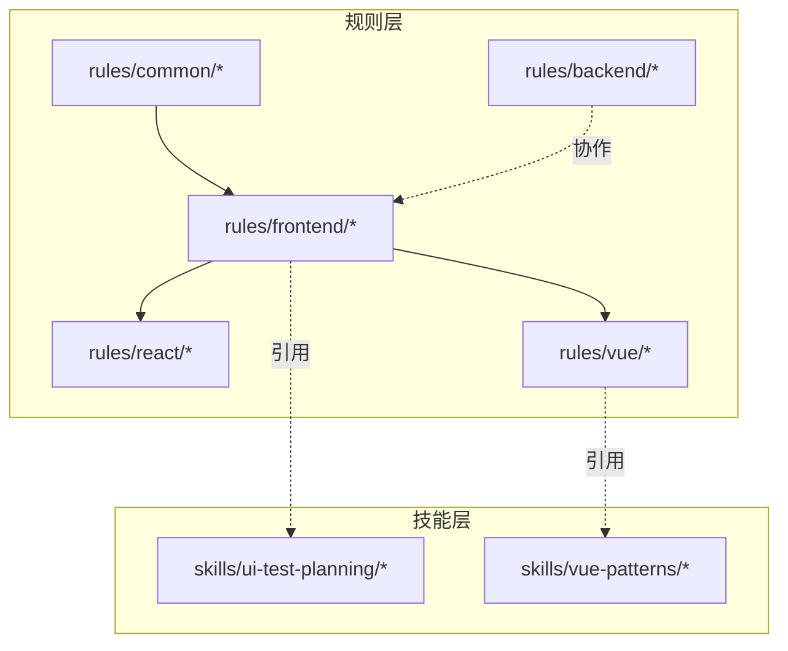
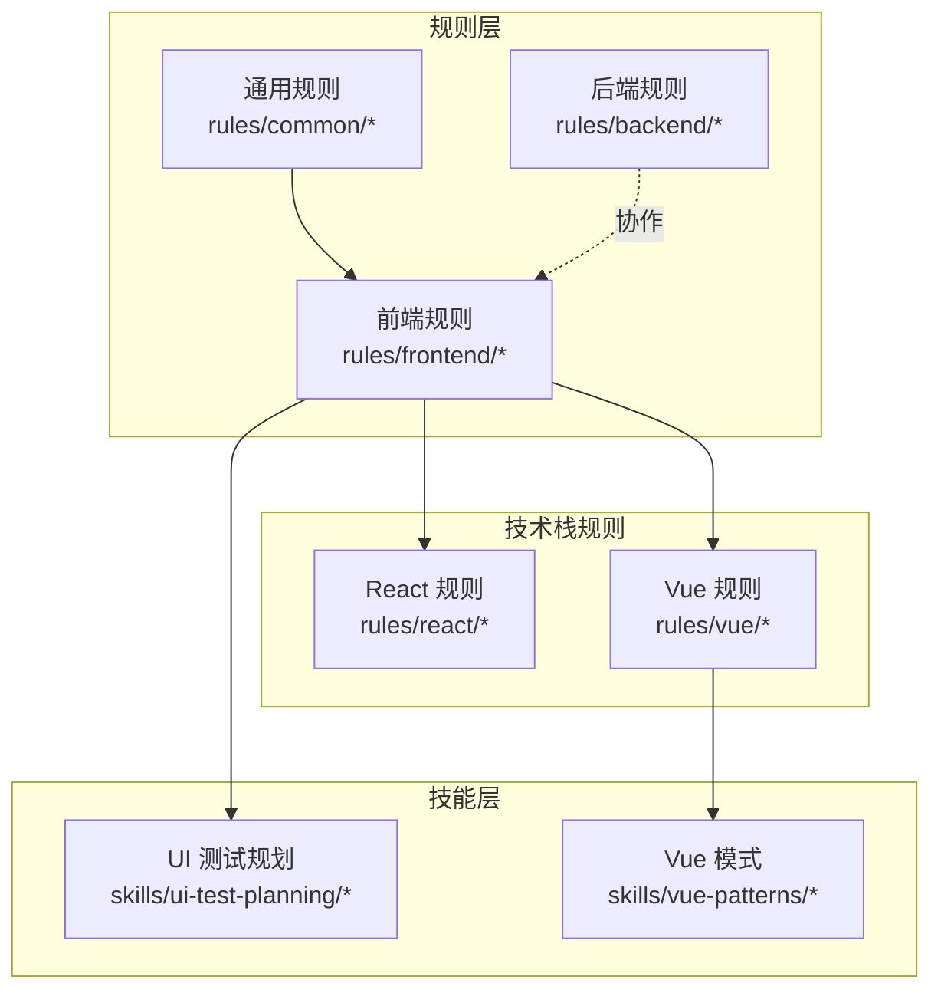
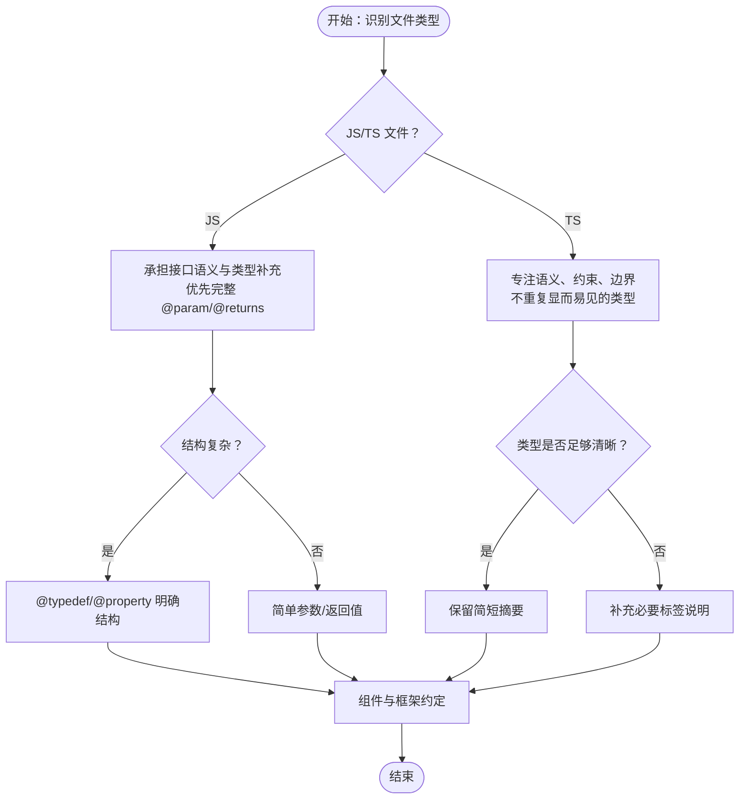
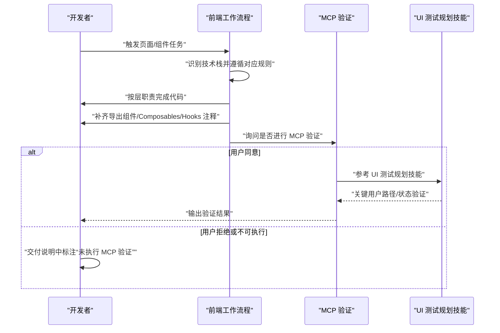
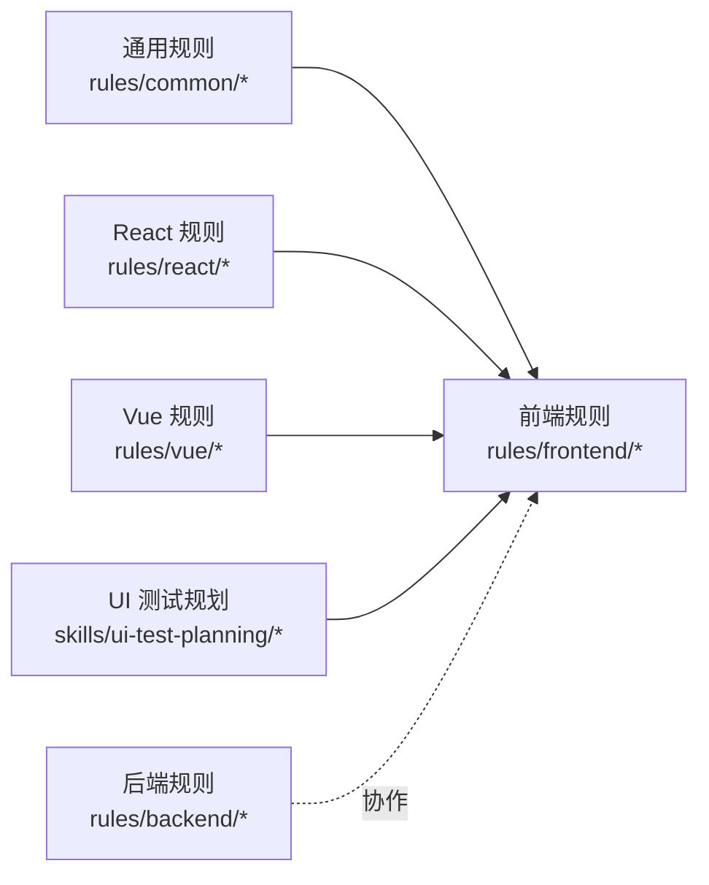

# 前端规则

<cite>
**本文引用的文件**
- [rules/frontend/overview.md](file://rules/frontend/overview.md)
- [rules/frontend/jsdoc.md](file://rules/frontend/jsdoc.md)
- [rules/frontend/workflow.md](file://rules/frontend/workflow.md)
- [rules/react/overview.md](file://rules/react/overview.md)
- [rules/vue/overview.md](file://rules/vue/overview.md)
- [rules/backend/overview.md](file://rules/backend/overview.md)
- [rules/common/overview.md](file://rules/common/overview.md)
- [rules/common/comments.md](file://rules/common/comments.md)
- [rules/README.md](file://rules/README.md)
- [skills/ui-test-planning/SKILL.md](file://skills/ui-test-planning/SKILL.md)
- [skills/vue-patterns/SKILL.md](file://skills/vue-patterns/SKILL.md)
- [README.md](file://README.md)
</cite>

## 目录
1. [简介](#简介)
2. [项目结构](#项目结构)
3. [核心组件](#核心组件)
4. [架构总览](#架构总览)
5. [详细组件分析](#详细组件分析)
6. [依赖分析](#依赖分析)
7. [性能考虑](#性能考虑)
8. [故障排查指南](#故障排查指南)
9. [结论](#结论)
10. [附录](#附录)

## 简介
本文件面向前端规则的使用者与维护者，系统化阐述前端规则的设计理念、组织结构与落地方法。前端规则以“页面结构、组件边界、状态管理与视觉一致性”为核心关注点，强调：
- 页面与组件职责清晰
- 首屏、交互与错误态完整
- 样式策略一致，避免混乱叠加
- 与 UI 测试规则协同
- 统一遵循 JSDoc 规范
- 标准化前端工作流程

同时，前端规则与后端规则在职责边界上互补：前端聚焦界面与交互，后端聚焦接口与业务实现；两者通过统一的规则层与技能层协作，确保端到端质量。

## 项目结构
前端规则位于 rules/frontend 目录，配套的 React/Vue 技术栈规则与通用规则共同构成规则体系。整体结构遵循“通用规则 + 语言/框架特定规则”的分层设计，便于跨项目复用与演进。

图表来源
- [rules/README.md:11-31](file://rules/README.md#L11-L31)
- [rules/frontend/overview.md:1-11](file://rules/frontend/overview.md#L1-L11)
- [rules/react/overview.md:1-11](file://rules/react/overview.md#L1-L11)
- [rules/vue/overview.md:1-11](file://rules/vue/overview.md#L1-L11)
- [rules/backend/overview.md:1-9](file://rules/backend/overview.md#L1-L9)
- [skills/ui-test-planning/SKILL.md:1-28](file://skills/ui-test-planning/SKILL.md#L1-L28)
- [skills/vue-patterns/SKILL.md:1-29](file://skills/vue-patterns/SKILL.md#L1-L29)

章节来源
- [rules/README.md:1-31](file://rules/README.md#L1-L31)
- [README.md:1-50](file://README.md#L1-L50)

## 核心组件
- 前端规则概览：定义前端关注点与与测试、注释、流程的协同关系。
- JSDoc 规则：统一前端文档注释风格，覆盖 JS/TS 文件差异、组件与框架约定、推荐标签与避免事项。
- 前端工作流程：定义页面类任务的触发条件、实施步骤、MCP 验证与不确定性处理策略。
- 通用规则与通用注释：提供跨语言注释原则与通用约束，支撑前端注释与流程的统一性。
- 技术栈规则（React/Vue）：在前端规则基础上细化页面层、组件层、复用逻辑层的职责边界与注释要求。
- 后端规则：与前端规则在职责边界上互补，保障前后端协作顺畅。

章节来源
- [rules/frontend/overview.md:1-11](file://rules/frontend/overview.md#L1-L11)
- [rules/frontend/jsdoc.md:1-50](file://rules/frontend/jsdoc.md#L1-L50)
- [rules/frontend/workflow.md:1-43](file://rules/frontend/workflow.md#L1-L43)
- [rules/common/overview.md:1-10](file://rules/common/overview.md#L1-L10)
- [rules/common/comments.md:1-29](file://rules/common/comments.md#L1-L29)
- [rules/react/overview.md:1-11](file://rules/react/overview.md#L1-L11)
- [rules/vue/overview.md:1-11](file://rules/vue/overview.md#L1-L11)
- [rules/backend/overview.md:1-9](file://rules/backend/overview.md#L1-L9)

## 架构总览
前端规则的架构围绕“规则层 + 技能层 + 协作关系”展开。规则层提供稳定约束（如注释规范、工作流程），技能层提供任务流程与实现策略；前后端规则在边界上互补，通过统一的注释与验证流程提升协作效率。

图表来源
- [rules/frontend/overview.md:1-11](file://rules/frontend/overview.md#L1-L11)
- [rules/react/overview.md:1-11](file://rules/react/overview.md#L1-L11)
- [rules/vue/overview.md:1-11](file://rules/vue/overview.md#L1-L11)
- [rules/common/overview.md:1-10](file://rules/common/overview.md#L1-L10)
- [rules/backend/overview.md:1-9](file://rules/backend/overview.md#L1-L9)
- [skills/ui-test-planning/SKILL.md:1-28](file://skills/ui-test-planning/SKILL.md#L1-L28)
- [skills/vue-patterns/SKILL.md:1-29](file://skills/vue-patterns/SKILL.md#L1-L29)

## 详细组件分析

### JSDoc 规则详解
JSDoc 规则统一前端文档注释风格，兼顾 JS/TS 的不同职责与侧重点，并对 React/Vue 组件与 Hooks/Composables 提供框架约定。其核心要点包括：
- 基本要求：导出的函数、组件、Hooks、Composables、Class、复杂 Util 默认应写 JSDoc；非导出但包含隐含副作用、缓存策略、兼容性分支或复杂数据约束的实现也应补 JSDoc 或短块注释。
- JS 文件：同时承担“接口语义”和“类型补充”职责，优先写完整 @param/@returns，复杂结构可用 @typedef/@property，回调/联合/可空值不直观时需明确，运行时抛错/副作用/外部约束需在描述中写清楚。
- TS 文件：主要承担“语义、约束、边界”职责，不重复 TypeScript 已清楚表达的静态类型；不要机械重复显而易见的参数类型和返回类型，重点写业务语义、前置条件、副作用、异常、并发约束、缓存语义和兼容性原因；仅当泛型语义、判别联合、不透明结构或跨层协议难以从类型直接读懂时再补充标签说明。
- 组件与框架约定：React 组件注释说明职责、重要 props 语义、副作用和渲染边界；Vue Composable 注释说明输入、返回约定、响应式行为和副作用；Hooks/Composables 特别说明调用时机限制与依赖假设。
- 推荐标签：@param、@returns、@typedef、@property、@throws、@example（仅在调用方式不直观时使用）。
- 避免事项：在 TypeScript 中把类型再抄一遍、为每个私有小函数机械补全模板化 JSDoc、用 JSDoc 替代更好的命名、拆分和类型设计。

图表来源
- [rules/frontend/jsdoc.md:11-27](file://rules/frontend/jsdoc.md#L11-L27)
- [rules/frontend/jsdoc.md:29-43](file://rules/frontend/jsdoc.md#L29-L43)

章节来源
- [rules/frontend/jsdoc.md:1-50](file://rules/frontend/jsdoc.md#L1-L50)

### 前端工作流程规则详解
前端工作流程规则适用于页面、组件与交互任务，明确了触发条件、实施步骤、MCP 验证与不确定性处理策略：
- 触发条件：写页面、改页面、补页面交互、页面联调、页面与接口联动调试。
- 实施步骤：先识别当前技术栈并遵循对应栈规则实现；按页面层、组件层、复用逻辑层的职责边界完成代码；为导出组件、Composables、Hooks 与复杂 Util 补齐注释，遵循 JSDoc 规则。
- MCP 验证：页面实现完成后，必须询问用户是否需要进行 MCP 验证；若同意，使用 MCP 验证关键用户路径、用户可见行为以及 loading/empty/error/success 状态；验证关注点参考 UI 测试规划技能；若拒绝或当前环境无法执行 MCP，必须在交付说明中明确标注“未执行 MCP 验证”。
- 不确定性处理：前端行为、接口结构、交互结果或页面状态不确定时，优先顺序为：先通过 MCP 调试、查看真实页面行为或真实接口返回；再读取现有代码、调用方和上下文；仍无法确定时再向用户提问。
- 避免事项：不因信息不完整而先写大段兼容逻辑；不在未验证真实行为前假设接口返回结构；不把“可能需要兼容”当作默认实现前提。

图表来源
- [rules/frontend/workflow.md:5-28](file://rules/frontend/workflow.md#L5-L28)
- [skills/ui-test-planning/SKILL.md:8-21](file://skills/ui-test-planning/SKILL.md#L8-L21)

章节来源
- [rules/frontend/workflow.md:1-43](file://rules/frontend/workflow.md#L1-L43)

### 技术栈规则与前端规则的关系
- React 规则：强调组件按职责拆分、数据流与状态边界清晰、客户端与服务端职责分离；导出组件、Hooks 与复杂 Util 的注释遵循前端 JSDoc 规则；页面类任务的实现与验证流程遵循前端工作流程。
- Vue 规则：优先使用 Composition API、Store 只放共享状态、Composables 负责复用逻辑；页面层处理路由与装配，组件层处理展示；Composables、导出组件与复杂工具函数的注释遵循前端 JSDoc 规则；页面类任务的实现与验证流程遵循前端工作流程。

章节来源
- [rules/react/overview.md:1-11](file://rules/react/overview.md#L1-L11)
- [rules/vue/overview.md:1-11](file://rules/vue/overview.md#L1-L11)

### 通用注释与通用规则
- 通用注释原则：注释默认解释“为什么”“约束是什么”“边界在哪里”，不复述显而易见的“代码做了什么”；只有当代码本身不足以表达意图时才加注释，避免噪音注释；注释要和代码一起维护；注释一旦过时，优先修正或删除。
- 必须写注释的场景：导出的公共 API 存在非直观约束、前置条件、后置行为或副作用；业务规则无法从命名直接看出；存在性能权衡、兼容性处理、降级分支或安全边界；临时 workaround 需要记录原因、触发条件和后续清理信号。
- 不应写注释的场景：逐行翻译代码、重复类型系统/函数名/变量名已经清楚表达的信息、用注释掩盖糟糕命名或过长函数；优先重构。
- 通用规则：明确需求后再进入实现、优先保留来源清晰可升级的依赖接入方式、规则负责定义“要做什么”，具体 workflow 尽量交给 skill、所有安装与升级路径都要可验证可回滚、注释属于规则层约束；通用注释原则见通用注释规则。

章节来源
- [rules/common/comments.md:1-29](file://rules/common/comments.md#L1-L29)
- [rules/common/overview.md:1-10](file://rules/common/overview.md#L1-L10)

### 前后端规则的协作关系
- 前端规则关注页面结构、组件边界、状态管理与视觉一致性，强调首屏、交互与错误态完整，样式策略一致。
- 后端规则关注接口边界、配置管理、认证授权、错误处理与可维护性，强调控制器薄、服务层清晰、DTO/schema 先于业务实现、环境变量与密钥不硬编码、日志与异常路径明确。
- 协作方式：前端负责用户可见行为与页面状态，后端负责接口契约与业务实现；两者通过统一的注释与验证流程协作，确保端到端质量与一致性。

章节来源
- [rules/frontend/overview.md:1-11](file://rules/frontend/overview.md#L1-L11)
- [rules/backend/overview.md:1-9](file://rules/backend/overview.md#L1-L9)

## 依赖分析
前端规则与相关模块之间的依赖关系如下：
- 前端规则依赖通用规则与通用注释，确保注释风格与通用约束一致。
- 前端规则依赖 React/Vue 技术栈规则，细化页面层、组件层、复用逻辑层的职责边界与注释要求。
- 前端规则依赖 UI 测试规划技能，用于 MCP 验证的关键用户路径与状态覆盖。
- 后端规则与前端规则在职责边界上互补，保障前后端协作顺畅。

图表来源
- [rules/common/overview.md:1-10](file://rules/common/overview.md#L1-L10)
- [rules/common/comments.md:1-29](file://rules/common/comments.md#L1-L29)
- [rules/frontend/overview.md:1-11](file://rules/frontend/overview.md#L1-L11)
- [rules/react/overview.md:1-11](file://rules/react/overview.md#L1-L11)
- [rules/vue/overview.md:1-11](file://rules/vue/overview.md#L1-L11)
- [rules/backend/overview.md:1-9](file://rules/backend/overview.md#L1-L9)
- [skills/ui-test-planning/SKILL.md:1-28](file://skills/ui-test-planning/SKILL.md#L1-L28)

章节来源
- [rules/README.md:11-31](file://rules/README.md#L11-L31)

## 性能考虑
- 注释与文档的性能影响：遵循“语义、约束、边界”优先的原则，避免在 TS 中重复显而易见的类型，减少注释维护成本与阅读负担。
- 验证与回归：通过 MCP 验证关键用户路径与状态，有助于在早期发现性能问题与回归风险，降低后期修复成本。
- 结构化注释：在复杂结构与回调场景使用 @typedef/@property 等标签，有助于静态分析与 IDE 辅助，间接提升开发效率与代码质量。

## 故障排查指南
- 注释不一致：若发现注释与代码意图不符，优先修正或删除过时注释，确保注释与代码同步维护。
- 复杂逻辑未明确：对于回调、联合值或可空值不直观的场景，补充必要的 JSDoc 说明，避免误解与误用。
- 未执行 MCP 验证：若因环境限制未执行 MCP 验证，需在交付说明中标注“未执行 MCP 验证”，并在后续版本中补齐。
- 不确定性处理：当行为、接口结构或页面状态不确定时，优先通过 MCP 调试与真实页面行为确认，再结合现有代码与上下文判断，最后再向用户提问。

章节来源
- [rules/frontend/jsdoc.md:45-49](file://rules/frontend/jsdoc.md#L45-L49)
- [rules/frontend/workflow.md:23-42](file://rules/frontend/workflow.md#L23-L42)

## 结论
前端规则以统一的注释风格、标准化的工作流程与明确的技术栈职责边界，支撑前端页面与组件的高质量交付。通过与通用规则、技术栈规则及 UI 测试规划技能的协同，前端规则与后端规则在职责边界上互补，确保端到端的质量与一致性。建议在实际项目中：
- 严格遵循 JSDoc 规则，确保注释聚焦“语义、约束、边界”；
- 按前端工作流程推进页面类任务，优先完成页面层、组件层、复用逻辑层的职责划分；
- 在 MCP 条件允许时执行验证，否则在交付说明中标注未执行验证；
- 面对不确定性时，优先通过 MCP 调试与真实行为确认，再结合上下文与用户确认。

## 附录
- 最佳实践示例（概念性指导）
  - 页面层：明确路由与装配职责，组件层专注于展示，避免在组件中混入业务逻辑。
  - 组件层：为导出组件与复杂 Util 补齐 JSDoc，说明职责、重要 props 语义、副作用与渲染边界。
  - 复用逻辑层：将共享逻辑抽取为 Composables/Hooks，明确调用时机限制与依赖假设。
  - 注释风格：在 TS 中避免重复类型，在 JS 中优先完整 @param/@returns，复杂结构使用 @typedef/@property。
  - 验证策略：以关键用户路径与状态覆盖为主，优先稳定的选择器与可访问性检查。