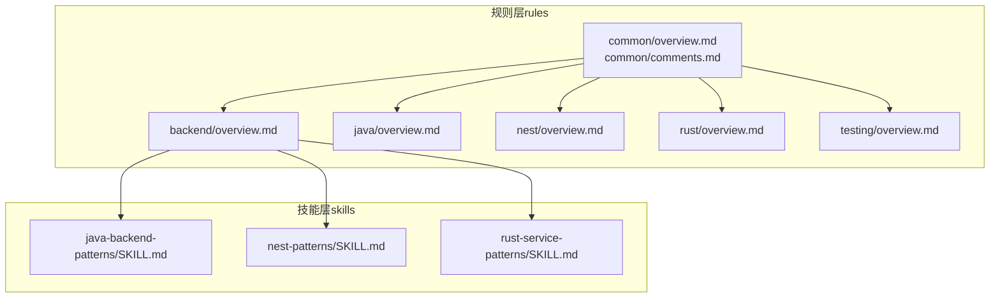
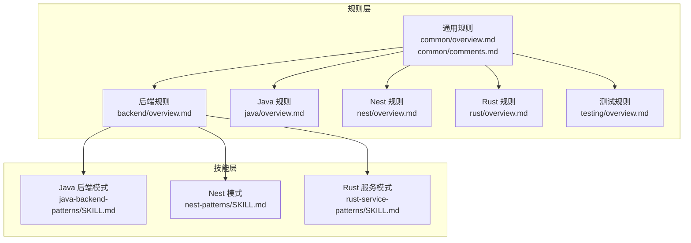
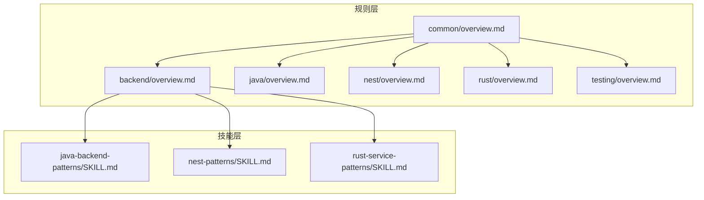

# 后端规则

<cite>
**本文引用的文件**
- [README.md](file://README.md)
- [rules/README.md](file://rules/README.md)
- [rules/backend/overview.md](file://rules/backend/overview.md)
- [rules/common/overview.md](file://rules/common/overview.md)
- [rules/common/comments.md](file://rules/common/comments.md)
- [rules/java/overview.md](file://rules/java/overview.md)
- [rules/nest/overview.md](file://rules/nest/overview.md)
- [rules/rust/overview.md](file://rules/rust/overview.md)
- [rules/testing/overview.md](file://rules/testing/overview.md)
- [skills/java-backend-patterns/SKILL.md](file://skills/java-backend-patterns/SKILL.md)
- [skills/nest-patterns/SKILL.md](file://skills/nest-patterns/SKILL.md)
- [skills/rust-service-patterns/SKILL.md](file://skills/rust-service-patterns/SKILL.md)
</cite>

## 目录
1. [简介](#简介)
2. [项目结构](#项目结构)
3. [核心组件](#核心组件)
4. [架构总览](#架构总览)
5. [详细组件分析](#详细组件分析)
6. [依赖关系分析](#依赖关系分析)
7. [性能考虑](#性能考虑)
8. [故障排查指南](#故障排查指南)
9. [结论](#结论)
10. [附录](#附录)

## 简介
本文件系统化梳理后端规则的设计原则、适用范围与最佳实践，结合仓库中已有的通用规则与多语言/框架规则，给出面向后端开发的统一质量标准与实施路径。目标是通过明确的边界划分、输入输出契约、错误处理与日志策略，以及可验证的测试与文档更新机制，确保后端代码在不同技术栈下的一致性与可维护性。

## 项目结构
该仓库采用“规则层 + 技能层”的分层组织方式：
- 规则层（rules）：定义稳定、可复用、跨任务的约束与原则，分为通用规则与语言/框架特定规则。
- 技能层（skills）：承载任务流程、检查清单与技术栈实现策略，指导具体落地步骤。

图表来源
- [rules/README.md:1-31](file://rules/README.md#L1-L31)
- [README.md:1-50](file://README.md#L1-L50)

章节来源
- [rules/README.md:1-31](file://rules/README.md#L1-L31)
- [README.md:1-50](file://README.md#L1-L50)

## 核心组件
后端规则的核心由以下维度构成：
- 接口边界与输入输出契约：控制器薄、DTO/schema 先于业务实现，参数校验与错误处理路径明确。
- 配置与密钥管理：环境变量与密钥不硬编码，配置加载标准化。
- 认证授权与跨领域行为：集中化守卫、拦截器与过滤器，统一认证、日志与异常处理。
- 可维护性与可测试性：事务边界清晰、数据访问层与业务层解耦、服务层可独立测试。

章节来源
- [rules/backend/overview.md:1-9](file://rules/backend/overview.md#L1-L9)

## 架构总览
后端规则在整体工作流中的定位如下：
- 规则层定义“要做什么”（边界、契约、错误与日志路径），技能层负责“怎么做”（流程、检查清单、技术栈策略）。
- 通用规则（common）对所有技术栈生效；语言/框架规则（如 Java、Nest、Rust）补充特定约束。
- 测试规则（testing）贯穿 UI、接口与服务测试，强调关键路径优先覆盖与验证链闭环。

图表来源
- [rules/README.md:1-31](file://rules/README.md#L1-L31)
- [rules/backend/overview.md:1-9](file://rules/backend/overview.md#L1-L9)
- [rules/java/overview.md:1-9](file://rules/java/overview.md#L1-L9)
- [rules/nest/overview.md:1-9](file://rules/nest/overview.md#L1-L9)
- [rules/rust/overview.md:1-9](file://rules/rust/overview.md#L1-L9)
- [rules/testing/overview.md:1-9](file://rules/testing/overview.md#L1-L9)
- [skills/java-backend-patterns/SKILL.md:1-28](file://skills/java-backend-patterns/SKILL.md#L1-L28)
- [skills/nest-patterns/SKILL.md:1-28](file://skills/nest-patterns/SKILL.md#L1-L28)
- [skills/rust-service-patterns/SKILL.md:1-28](file://skills/rust-service-patterns/SKILL.md#L1-L28)

## 详细组件分析

### 后端规则（通用）
- 设计原则
  - 控制器薄、服务层清晰：控制器仅负责传输映射，业务逻辑下沉至服务层。
  - DTO/schema 先于业务实现：先定义请求/响应模型与校验规则，再编写处理逻辑。
  - 环境变量与密钥不硬编码：通过配置模块集中加载，避免散落的敏感信息。
  - 日志、异常与验证路径明确：统一入口处进行参数校验、异常捕获与日志记录。
- 适用范围
  - 适用于所有后端项目，作为通用约束与质量门禁。
- 实施要点
  - 在模块/控制器/服务边界处明确职责，避免跨层耦合。
  - 将认证、授权、日志、异常处理等横切关注点集中化（守卫、拦截器、过滤器）。
  - 事务边界与数据访问层清晰，Repository 方法语义化、窄化。

章节来源
- [rules/backend/overview.md:1-9](file://rules/backend/overview.md#L1-L9)

### Java 规则（Spring Boot）
- 设计原则
  - controller、service、repository 角色稳定：各层职责清晰且不可互换。
  - DTO、validation、exception handler 明确：输入校验与异常处理标准化。
  - 事务边界与数据访问层清晰：Repository 专注存储，Service 管理事务。
  - 文档与测试同步更新：随功能迭代同步完善文档与测试。
- 与通用后端规则的关系
  - 通用后端规则中的“控制器薄、服务层清晰、DTO 先于业务实现、日志/异常/验证路径明确”在 Java 场景下得到细化与落地。

章节来源
- [rules/java/overview.md:1-9](file://rules/java/overview.md#L1-L9)

### Nest 规则（NestJS）
- 设计原则
  - module/controller/service/dto 分层明确：模块边界与公开 Provider 清晰。
  - provider 依赖收敛，不跨层直接耦合：通过依赖注入控制耦合度。
  - 参数校验、配置加载、异常过滤优先标准化：统一使用 DTO、管道与过滤器。
  - 测试至少覆盖 controller 输入边界与 service 业务分支：保证关键路径可测。
- 与通用后端规则的关系
  - 通用后端规则中的“控制器薄、服务层清晰、DTO 先于业务实现、日志/异常/验证路径明确”在 Nest 场景下以模块化、依赖注入与标准化中间件的方式实现。

章节来源
- [rules/nest/overview.md:1-9](file://rules/nest/overview.md#L1-L9)

### Rust 规则
- 设计原则
  - 错误类型显式建模：通过强类型错误表达失败路径，便于传播与处理。
  - I/O 与纯逻辑分离：纯函数与 I/O 函数边界清晰，提升可测试性。
  - 并发与异步行为要可测试：异步边界可见，便于隔离测试。
  - 模块边界保持小而清晰：小模块、强类型，降低复杂度。
- 与通用后端规则的关系
  - 通用后端规则中的“日志/异常/验证路径明确”在 Rust 中体现为显式错误类型与清晰的 I/O/纯逻辑分离。

章节来源
- [rules/rust/overview.md:1-9](file://rules/rust/overview.md#L1-L9)

### 通用注释规则（跨语言）
- 核心原则
  - 注释默认解释“为什么”“约束是什么”“边界在哪里”，不复述显而易见的“代码做了什么”。
  - 只有当代码本身不足以表达意图时才加注释，避免噪音注释。
  - 注释要和代码一起维护；注释一旦过时，优先修正或删除。
- 必须写注释的场景
  - 对外可复用接口存在非直观约束、前置条件、后置行为或副作用。
  - 业务规则无法从命名直接看出。
  - 存在性能权衡、兼容性处理、降级分支或安全边界。
  - 临时 workaround 需要记录原因、触发条件和后续清理信号。
- 不应写注释的场景
  - 逐行翻译代码。
  - 重复类型系统、函数名或变量名已经清楚表达的信息。
  - 用注释掩盖糟糕命名或过长函数；优先重构。
- 文档注释与行内注释
  - 对外可复用接口优先使用文档注释。
  - 局部复杂逻辑优先使用紧贴代码的短注释。
  - 注释应具体、可验证，避免“这里做一些处理”之类空话。

章节来源
- [rules/common/comments.md:1-29](file://rules/common/comments.md#L1-L29)

### 通用规则（跨项目）
- 基础原则
  - 明确需求后再进入实现：避免盲目开发。
  - 优先保留来源清晰、可升级的依赖接入方式：降低升级成本与风险。
  - 规则负责定义“要做什么”，具体 workflow 尽量交给 skill。
  - 所有安装与升级路径都要可验证、可回滚：保障可追溯性。
  - 注释属于规则层约束；通用注释原则见 common/comments.md。

章节来源
- [rules/common/overview.md:1-10](file://rules/common/overview.md#L1-L10)

### 测试规则（跨栈）
- 基础原则
  - 先定义关键路径：明确哪些路径必须被覆盖。
  - 关键流程优先覆盖：确保高价值路径有保障。
  - UI 测试聚焦用户可见行为，不依赖脆弱选择器：提升稳定性。
  - 构建、lint、测试、文档检查最好形成同一验证链：统一质量门禁。

章节来源
- [rules/testing/overview.md:1-9](file://rules/testing/overview.md#L1-L9)

### 技能层：Java 后端模式
- 工作流
  - 1) 定义请求与响应 DTO。
  - 2) 保持控制器仅负责传输映射。
  - 3) 将业务规则移入服务层。
  - 4) 保持 Repository 存储相关、可预期。
- 复查清单
  - 边界处的校验规则是否明确？
  - 事务作用域是否清晰？
  - 映射逻辑是否集中而非分散？
  - 服务测试能否在最小框架环境下运行？

章节来源
- [skills/java-backend-patterns/SKILL.md:1-28](file://skills/java-backend-patterns/SKILL.md#L1-L28)

### 技能层：Nest 模式
- 工作流
  - 1) 定义模块边界与公开 Provider。
  - 2) 在控制器实现前设计 DTO。
  - 3) 保持控制器方法聚焦传输相关职责。
  - 4) 将业务规则推入服务与领域助手。
- 复查清单
  - DTO 与校验规则是否在逻辑分支之前定义？
  - 配置是否通过专用模块或服务加载？
  - 认证、日志与错误处理是否标准化？
  - 服务逻辑能否在无 HTTP 传输的情况下测试？

章节来源
- [skills/nest-patterns/SKILL.md:1-28](file://skills/nest-patterns/SKILL.md#L1-L28)

### 技能层：Rust 服务模式
- 工作流
  - 1) 识别哪些代码是纯逻辑，哪些触达 I/O。
  - 2) 早期引入类型化的请求与响应模型。
  - 3) 在扩大并发前先建模失败路径。
  - 4) 在核心逻辑可测试后再添加集成点。
- 复查清单
  - 错误是否携带足够上下文传播？
  - 异步工作是否隔离在清晰的函数或 trait 之后？
  - 核心逻辑能否在无网络或数据库的情况下测试？
  - 序列化与校验边界是否明确？

章节来源
- [skills/rust-service-patterns/SKILL.md:1-28](file://skills/rust-service-patterns/SKILL.md#L1-L28)

## 依赖关系分析
后端规则与技能层的协作关系如下：
- 规则层提供稳定约束（边界、契约、错误与日志路径），技能层提供可执行的工作流与检查清单。
- 通用规则（common）对所有技术栈生效；语言/框架规则（java/nest/rust）在通用基础上补充特定约束。
- 测试规则（testing）贯穿 UI、接口与服务测试，与后端规则共同组成质量门禁。

图表来源
- [rules/common/overview.md:1-10](file://rules/common/overview.md#L1-L10)
- [rules/backend/overview.md:1-9](file://rules/backend/overview.md#L1-L9)
- [rules/java/overview.md:1-9](file://rules/java/overview.md#L1-L9)
- [rules/nest/overview.md:1-9](file://rules/nest/overview.md#L1-L9)
- [rules/rust/overview.md:1-9](file://rules/rust/overview.md#L1-L9)
- [rules/testing/overview.md:1-9](file://rules/testing/overview.md#L1-L9)
- [skills/java-backend-patterns/SKILL.md:1-28](file://skills/java-backend-patterns/SKILL.md#L1-L28)
- [skills/nest-patterns/SKILL.md:1-28](file://skills/nest-patterns/SKILL.md#L1-L28)
- [skills/rust-service-patterns/SKILL.md:1-28](file://skills/rust-service-patterns/SKILL.md#L1-L28)

## 性能考虑
- 控制器薄、服务层清晰有助于减少不必要的序列化与 I/O，提升吞吐。
- DTO 先于业务实现可提前发现边界问题，减少无效计算。
- 明确的日志与异常路径有利于快速定位瓶颈与故障点。
- 在 Java/Nest/Rust 中分别遵循对应的分层与模块化原则，降低调用链长度与耦合度，从而提升性能与可维护性。

## 故障排查指南
- 参数校验失败
  - 现象：请求被拒绝但未返回明确原因。
  - 排查：确认 DTO 与校验规则是否在逻辑分支之前定义；检查统一的参数校验与错误返回路径。
- 事务边界不清
  - 现象：业务状态不一致或并发冲突。
  - 排查：核对事务作用域是否清晰；确保 Repository 方法窄化、意图明确。
- 日志与异常缺失
  - 现象：问题难以复现或定位。
  - 排查：确认统一的异常过滤与日志记录路径；确保关键流程均有可观测性。
- 配置与密钥硬编码
  - 现象：部署失败或安全告警。
  - 排查：检查是否存在硬编码的敏感信息；统一通过配置模块加载。

章节来源
- [skills/java-backend-patterns/SKILL.md:22-28](file://skills/java-backend-patterns/SKILL.md#L22-L28)
- [skills/nest-patterns/SKILL.md:22-28](file://skills/nest-patterns/SKILL.md#L22-L28)
- [skills/rust-service-patterns/SKILL.md:22-28](file://skills/rust-service-patterns/SKILL.md#L22-L28)

## 结论
后端规则通过“通用约束 + 语言/框架细化 + 技能层流程”的组合，为不同技术栈下的后端开发提供了统一的质量标准与实施路径。遵循“控制器薄、服务层清晰、DTO 先于业务实现、日志/异常/验证路径明确”的原则，可在保证可维护性的同时提升可测试性与安全性。建议在团队内将规则作为质量门禁，技能作为执行手册，持续迭代与验证。

## 附录
- 安装与升级路径
  - Claude/Codex 安装与升级可通过仓库提供的远程安装脚本完成，安装完成后 superpowers 仍作为底层工作流能力存在，本仓库负责组织规则、技能与 agent 并统一投影到 Claude 与 Codex 的读取位置。
- 推荐分工
  - rules/ 负责稳定、可复用、跨任务的约束，如注释规范、代码组织原则、验证门禁。
  - skills/ 负责任务流程、检查清单和技术栈实现策略；若某项要求需要长期适用于多个 skill，优先写进 rules/，再由对应 skill 引用。

章节来源
- [README.md:15-49](file://README.md#L15-L49)
- [rules/README.md:26-31](file://rules/README.md#L26-L31)