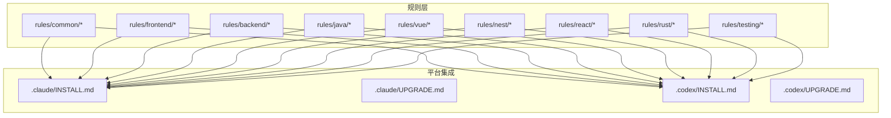
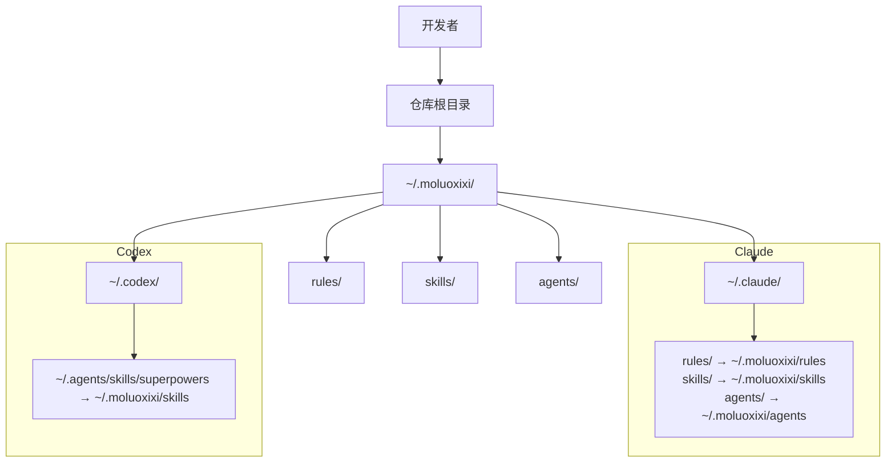
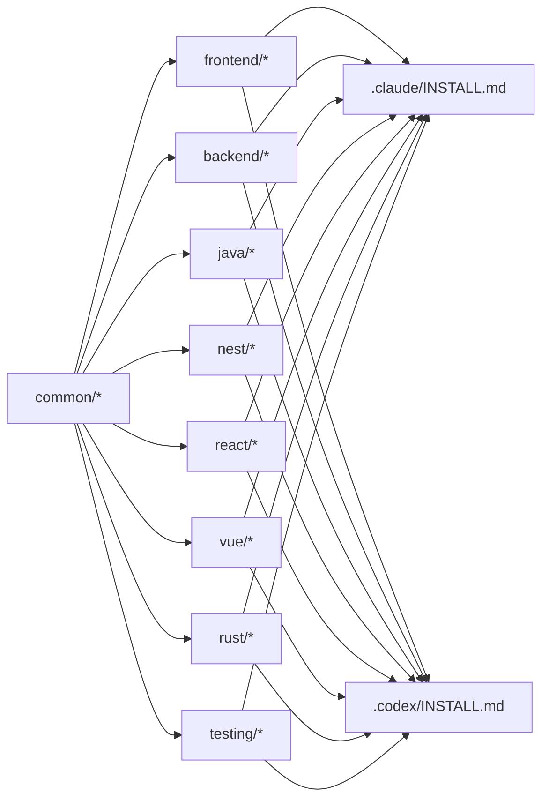

# 规则系统

<cite>
**本文引用的文件**
- [README.md](file://README.md)
- [rules/README.md](file://rules/README.md)
- [rules/common/overview.md](file://rules/common/overview.md)
- [rules/common/comments.md](file://rules/common/comments.md)
- [rules/frontend/overview.md](file://rules/frontend/overview.md)
- [rules/frontend/jsdoc.md](file://rules/frontend/jsdoc.md)
- [rules/frontend/workflow.md](file://rules/frontend/workflow.md)
- [rules/backend/overview.md](file://rules/backend/overview.md)
- [rules/java/overview.md](file://rules/java/overview.md)
- [rules/vue/overview.md](file://rules/vue/overview.md)
- [rules/nest/overview.md](file://rules/nest/overview.md)
- [rules/react/overview.md](file://rules/react/overview.md)
- [rules/rust/overview.md](file://rules/rust/overview.md)
- [rules/testing/overview.md](file://rules/testing/overview.md)
- [.claude/INSTALL.md](file://.claude/INSTALL.md)
- [.claude/UPGRADE.md](file://.claude/UPGRADE.md)
- [.codex/INSTALL.md](file://.codex/INSTALL.md)
- [.codex/UPGRADE.md](file://.codex/UPGRADE.md)
</cite>

## 目录
1. [简介](#简介)
2. [项目结构](#项目结构)
3. [核心组件](#核心组件)
4. [架构总览](#架构总览)
5. [详细组件分析](#详细组件分析)
6. [依赖关系分析](#依赖关系分析)
7. [性能考虑](#性能考虑)
8. [故障排查指南](#故障排查指南)
9. [结论](#结论)
10. [附录](#附录)

## 简介
本规则系统基于 superpowers 构建，提供一套统一的、可复用的开发约束与最佳实践，覆盖通用规则与多语言/多框架规则，并通过 Claude 与 Codex 平台进行统一安装与升级。其核心理念是：
- 规则层定义“要做什么”，具体实现流程尽量由技能层（skills）承载；
- 通用规则适用于所有项目，语言/框架规则仅覆盖特有约束；
- 通过 vendor 管理第三方技能，统一暴露到 Claude/Codex 的读取位置。

安装完成后，Claude 与 Codex 会读取 ~/.moluoxixi 下的 rules、skills、agents，确保平台间一致的体验与可维护性。

章节来源
- [README.md:1-50](file://README.md#L1-L50)

## 项目结构
规则系统采用“规则层 + 平台集成”的双层组织方式：
- 规则层（rules/）：包含通用规则与各语言/框架规则的概览与细则
- 平台集成（.claude/ 与 .codex/）：提供安装与升级脚本，将规则与技能映射到 Claude/Codex 的读取路径

图表来源
- [rules/README.md:1-31](file://rules/README.md#L1-L31)
- [.claude/INSTALL.md:1-108](file://.claude/INSTALL.md#L1-L108)
- [.codex/INSTALL.md:1-95](file://.codex/INSTALL.md#L1-L95)

章节来源
- [rules/README.md:1-31](file://rules/README.md#L1-L31)

## 核心组件
- 通用规则（common）
  - 设计原则：明确需求、依赖可升级、规则定义目标、安装升级可验证可回滚、注释属于规则层约束
  - 通用注释原则：解释“为什么/约束/边界”，避免噪音注释；对外接口优先文档注释，局部复杂逻辑用紧贴代码的短注释
- 前端规则（frontend）
  - 概览：页面结构、组件边界、状态管理与视觉一致性；与 UI 测试规则配合；文档注释遵循 jsdoc 规范；标准流程遵循 workflow
  - jsdoc：统一 JSDoc 风格，区分 JS 与 TS 的注释职责；推荐标签与避免事项
  - workflow：页面任务推进顺序、MCP 验证要求、不确定性处理优先级与避免事项
- 后端规则（backend）
  - 概览：接口边界、配置管理、认证授权、错误处理与可维护性；控制器薄、服务层清晰、DTO/schema 先业务实现、环境变量与密钥不硬编码、日志异常与验证路径明确
- Java 规则（java）
  - 概览：controller/service/repository 角色稳定、DTO/validation/exception handler 明确、事务边界与数据访问层清晰、文档与测试同步更新
- Vue 规则（vue）
  - 概览：优先 Composition API、store 只放共享状态、composables 负责复用逻辑、页面层处理路由与装配、组件层处理展示；注释遵循前端 jsdoc；页面类任务流程遵循 workflow
- Nest 规则（nest）
  - 概览：module/controller/service/dto 分层明确、provider 依赖收敛、参数校验/配置加载/异常过滤标准化、测试覆盖 controller 输入边界与 service 业务分支
- React 规则（react）
  - 概览：组件按职责拆分、数据流与状态边界清晰、客户端与服务端职责分离、页面编排结合外部技能、注释遵循前端 jsdoc；页面类任务流程遵循 workflow
- Rust 规则（rust）
  - 概览：错误类型显式建模、I/O 与纯逻辑分离、并发与异步行为可测试、模块边界小而清晰
- 测试规则（testing）
  - 概览：先定义关键路径、关键流程优先覆盖、UI 测试聚焦用户可见行为、构建/lint/测试/文档检查形成验证链

章节来源
- [rules/common/overview.md:1-10](file://rules/common/overview.md#L1-L10)
- [rules/common/comments.md:1-29](file://rules/common/comments.md#L1-L29)
- [rules/frontend/overview.md:1-11](file://rules/frontend/overview.md#L1-L11)
- [rules/frontend/jsdoc.md:1-50](file://rules/frontend/jsdoc.md#L1-L50)
- [rules/frontend/workflow.md:1-43](file://rules/frontend/workflow.md#L1-L43)
- [rules/backend/overview.md:1-9](file://rules/backend/overview.md#L1-L9)
- [rules/java/overview.md:1-9](file://rules/java/overview.md#L1-L9)
- [rules/vue/overview.md:1-11](file://rules/vue/overview.md#L1-L11)
- [rules/nest/overview.md:1-9](file://rules/nest/overview.md#L1-L9)
- [rules/react/overview.md:1-11](file://rules/react/overview.md#L1-L11)
- [rules/rust/overview.md:1-9](file://rules/rust/overview.md#L1-L9)
- [rules/testing/overview.md:1-9](file://rules/testing/overview.md#L1-L9)

## 架构总览
规则系统通过平台安装脚本将本地聚合层 ~/.moluoxixi 的 rules、skills、agents 映射到 Claude 与 Codex 的读取位置，实现统一的规则与技能消费入口。

图表来源
- [.claude/INSTALL.md:23-29](file://.claude/INSTALL.md#L23-L29)
- [.codex/INSTALL.md:11-22](file://.codex/INSTALL.md#L11-L22)

章节来源
- [.claude/INSTALL.md:1-108](file://.claude/INSTALL.md#L1-L108)
- [.codex/INSTALL.md:1-95](file://.codex/INSTALL.md#L1-L95)

## 详细组件分析

### 通用规则（common）
- 设计原则
  - 明确需求后再进入实现
  - 优先保留来源清晰、可升级的依赖接入方式
  - 规则负责定义“要做什么”，具体 workflow 尽量交给 skill
  - 所有安装与升级路径都要可验证、可回滚
  - 注释属于规则层约束；通用注释原则见 comments
- 通用注释规则
  - 核心原则：解释“为什么/约束/边界”，避免噪音注释；注释与代码一起维护
  - 必须写注释的场景：对外公共 API 的非直观约束、前置条件、后置行为、副作用；业务规则无法从命名看出；存在性能权衡、兼容性处理、降级分支或安全边界；临时 workaround 需要记录原因、触发条件和后续清理信号
  - 不应写注释的场景：逐行翻译代码；重复类型系统/函数名/变量名已清楚表达的信息；用注释掩盖糟糕命名或过长函数
  - 文档注释与行内注释：对外可复用接口优先文档注释；局部复杂逻辑优先短注释；注释应具体、可验证

章节来源
- [rules/common/overview.md:1-10](file://rules/common/overview.md#L1-L10)
- [rules/common/comments.md:1-29](file://rules/common/comments.md#L1-L29)

### 前端规则（frontend）
- 概览
  - 页面和组件职责清晰；首屏、交互和错误态完整；样式策略一致，不混乱叠加；与 UI 测试规则一起使用；文档注释统一遵循 jsdoc；标准流程遵循 workflow
- JSDoc 规则
  - 基本要求：前端代码的文档注释统一使用 JSDoc 风格；导出的函数/组件/hooks/composables/class/复杂 util 默认应写 JSDoc；非导出但包含隐含副作用/缓存策略/兼容性分支/复杂数据约束的实现，也应补 JSDoc 或短块注释
  - JS 文件：在 .js/.jsx 中，JSDoc 同时承担“接口语义”和“类型补充”职责；对公开函数/组件/工厂函数优先写完整 @param/@returns；结构体较复杂时可用 @typedef/@property；回调/联合值/可空值不直观时通过 JSDoc 明确；运行时会抛错/触发副作用或依赖外部约束需在描述中写清楚
  - TS 文件：在 .ts/.tsx 中，JSDoc 主要承担“语义、约束、边界”职责，不重复 TypeScript 已清楚表达的静态类型；不要机械重复显而易见的参数类型和返回类型；重点写业务语义、前置条件、副作用、异常、并发约束、缓存语义和兼容性原因；仅当泛型语义、判别联合、不透明结构或跨层协议难以从类型直接读懂时再补充标签说明；若 TypeScript 类型已经足够清楚，可保留简短摘要
  - 组件与框架约定：React 组件注释说明职责、重要 props 语义、副作用和渲染边界；Vue composable 注释说明输入、返回约定、响应式行为和副作用；hooks/composables 要特别说明调用时机限制与依赖假设
  - 推荐标签：@param、@returns、@typedef、@property、@throws、@example（仅在调用方式不直观时使用）
  - 避免事项：在 TypeScript 中把类型再抄一遍；为每个私有小函数机械补全模板化 JSDoc；用 JSDoc 替代更好的命名、拆分和类型设计
- 前端工作流（workflow）
  - Trigger：当任务主要目标是写页面/改页面/补页面交互/页面联调/页面与接口联动调试时，必须遵循本规则
  - Implementation：页面任务默认按以下顺序推进：识别当前技术栈并遵循对应栈规则实现；按页面层、组件层、复用逻辑层的职责边界完成代码；为导出组件、composables、hooks 与复杂 util 补齐注释，遵循 jsdoc
  - MCP 验证：页面实现完成后，必须询问用户是否需要进行 MCP 验证；如果用户同意，使用 MCP 验证关键用户路径、用户可见行为以及 loading/empty/error/success 状态；MCP 验证时，测试关注点参考 ui-test-planning；如果用户拒绝或当前环境无法执行 MCP，必须在交付说明中明确标注“未执行 MCP 验证”
  - 不确定性处理：当前端行为、接口结构、交互结果或页面状态不确定时，优先顺序：先通过 MCP 调试、查看真实页面行为或真实接口返回；再读取现有代码、调用方和上下文；仍无法确定时，再向用户提问
  - Avoid：不因信息不完整而先写大段兼容逻辑；不在未验证真实行为前假设接口返回结构；不把“可能需要兼容”当作默认实现前提

章节来源
- [rules/frontend/overview.md:1-11](file://rules/frontend/overview.md#L1-L11)
- [rules/frontend/jsdoc.md:1-50](file://rules/frontend/jsdoc.md#L1-L50)
- [rules/frontend/workflow.md:1-43](file://rules/frontend/workflow.md#L1-L43)

### 后端规则（backend）
- 概览
  - 接口边界、配置管理、认证授权、错误处理与可维护性
  - 控制器薄、服务层清晰
  - DTO/schema 先于业务实现
  - 环境变量与密钥不硬编码
  - 日志、异常和验证路径明确

章节来源
- [rules/backend/overview.md:1-9](file://rules/backend/overview.md#L1-L9)

### Java 规则（java）
- 概览
  - controller、service、repository 角色稳定
  - DTO、validation、exception handler 明确
  - 事务边界与数据访问层清晰
  - 文档与测试同步更新

章节来源
- [rules/java/overview.md:1-9](file://rules/java/overview.md#L1-L9)

### Vue 规则（vue）
- 概览
  - 优先使用 Composition API
  - store 只放共享状态
  - composables 负责复用逻辑
  - 页面层处理路由与装配，组件层处理展示
  - composables、导出组件与复杂工具函数的注释遵循前端 jsdoc
  - 页面类任务的实现与验证流程遵循前端 workflow

章节来源
- [rules/vue/overview.md:1-11](file://rules/vue/overview.md#L1-L11)

### Nest 规则（nest）
- 概览
  - module/controller/service/dto 分层明确
  - provider 依赖收敛，不跨层直接耦合
  - 参数校验、配置加载、异常过滤优先标准化
  - 测试至少覆盖 controller 输入边界与 service 业务分支

章节来源
- [rules/nest/overview.md:1-9](file://rules/nest/overview.md#L1-L9)

### React 规则（react）
- 概览
  - 组件按职责拆分
  - 优先保证数据流与状态边界清晰
  - 保持客户端与服务端职责分离
  - 页面编排结合 frontend-design 与 cache-components 等外部 skill
  - 导出组件、hooks 与复杂 util 的注释遵循前端 jsdoc
  - 页面类任务的实现与验证流程遵循前端 workflow

章节来源
- [rules/react/overview.md:1-11](file://rules/react/overview.md#L1-L11)

### Rust 规则（rust）
- 概览
  - 错误类型显式建模
  - I/O 与纯逻辑分离
  - 并发与异步行为要可测试
  - 模块边界保持小而清晰

章节来源
- [rules/rust/overview.md:1-9](file://rules/rust/overview.md#L1-L9)

### 测试规则（testing）
- 概览
  - 先定义关键路径
  - 关键流程优先覆盖
  - UI 测试聚焦用户可见行为，不依赖脆弱选择器
  - 构建、lint、测试、文档检查最好形成同一验证链

章节来源
- [rules/testing/overview.md:1-9](file://rules/testing/overview.md#L1-L9)

## 依赖关系分析
- 规则层内部依赖
  - common 为所有规则提供通用约束与注释原则
  - frontend 依赖 common 的注释原则与 workflow；同时为 vue、react 提供框架特定注释与流程约束
  - backend、java、nest、rust、testing 为各自语言/框架提供分层与质量门禁
- 平台集成依赖
  - .claude/INSTALL.md 与 .codex/INSTALL.md 将 ~/.moluoxixi 的 rules、skills、agents 映射到 Claude/Codex 的读取位置
  - 升级脚本确保 superpowers 与第三方 skills 的版本一致性

图表来源
- [rules/README.md:11-31](file://rules/README.md#L11-L31)
- [.claude/INSTALL.md:23-29](file://.claude/INSTALL.md#L23-L29)
- [.codex/INSTALL.md:11-22](file://.codex/INSTALL.md#L11-L22)

章节来源
- [rules/README.md:1-31](file://rules/README.md#L1-L31)
- [.claude/INSTALL.md:1-108](file://.claude/INSTALL.md#L1-L108)
- [.codex/INSTALL.md:1-95](file://.codex/INSTALL.md#L1-L95)

## 性能考虑
- 规则层的职责是定义约束与门禁，尽量避免在规则中引入重型实现细节，以降低认知负担与维护成本
- 前端注释与测试规则强调“可验证、可回滚”的安装与升级路径，有助于减少反复修改带来的性能损耗
- 平台集成脚本采用软链接方式，避免重复拷贝，提升安装与升级效率

## 故障排查指南
- 安装后 Claude/Codex 无法读取规则/技能
  - 确认 ~/.moluoxixi 是否存在且包含 rules、skills、agents
  - 确认 ~/.claude 或 ~/.agents/skills/superpowers 是否正确指向 ~/.moluoxixi
  - 使用验证命令检查目录是否存在
- 升级后规则/技能未生效
  - 重新执行升级脚本，确保 superpowers 与第三方 skills 已更新
  - 检查 ~/.claude 或 ~/.agents/skills/superpowers 的链接是否有效
- 前端页面实现与验证问题
  - 遵循 workflow 的 MCP 验证流程；如无法执行 MCP，需在交付说明中标注“未执行 MCP 验证”
  - 如遇到不确定性，优先通过 MCP 调试与真实行为对比，再读取现有代码与上下文

章节来源
- [.claude/INSTALL.md:89-108](file://.claude/INSTALL.md#L89-L108)
- [.claude/UPGRADE.md:41-52](file://.claude/UPGRADE.md#L41-L52)
- [.codex/INSTALL.md:82-95](file://.codex/INSTALL.md#L82-L95)
- [.codex/UPGRADE.md:40-48](file://.codex/UPGRADE.md#L40-L48)
- [rules/frontend/workflow.md:23-43](file://rules/frontend/workflow.md#L23-L43)

## 结论
本规则系统通过“规则层 + 平台集成”的架构，将通用约束与多语言/多框架规则统一管理，并以 Claude/Codex 为统一入口，实现可验证、可回滚、可复用的 AI 开发工作流。建议在团队内优先沉淀通用规则，再由技能层承载具体实现流程，确保规则与技能的协同演进。

## 附录
- 最佳实践
  - 在编写规则时，优先定义“要做什么”，将“怎么做”留给技能层
  - 注释应解释“为什么/约束/边界”，避免噪音注释
  - 前端页面实现完成后，务必进行 MCP 验证或在交付说明中标注未验证
  - 安装与升级路径必须可验证、可回滚
- 实际应用示例（步骤指引）
  - 在 Claude 中安装：按照 .claude/INSTALL.md 的步骤，将 ~/.moluoxixi 的 rules、skills、agents 映射到 ~/.claude
  - 在 Codex 中安装：按照 .codex/INSTALL.md 的步骤，建立 ~/.agents/skills/superpowers 到 ~/.moluoxixi/skills 的链接
  - 升级：分别执行 .claude/UPGRADE.md 与 .codex/UPGRADE.md 的快速升级命令，确保 superpowers 与第三方 skills 更新

章节来源
- [.claude/INSTALL.md:31-57](file://.claude/INSTALL.md#L31-L57)
- [.codex/INSTALL.md:24-52](file://.codex/INSTALL.md#L24-L52)
- [.claude/UPGRADE.md:3-17](file://.claude/UPGRADE.md#L3-L17)
- [.codex/UPGRADE.md:3-18](file://.codex/UPGRADE.md#L3-L18)