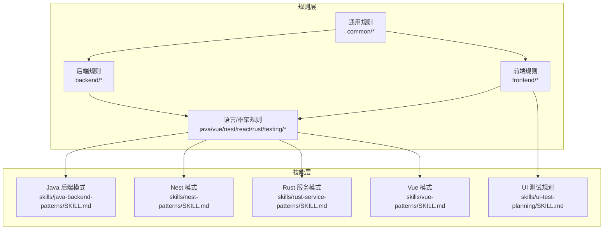
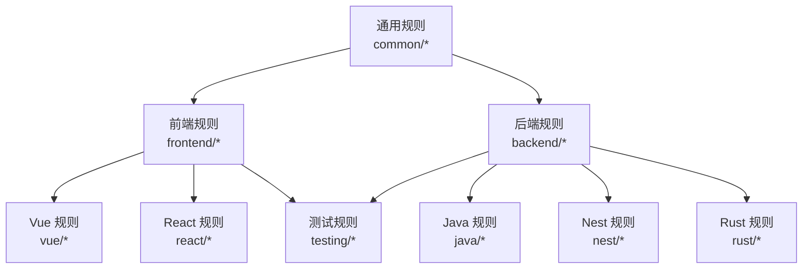
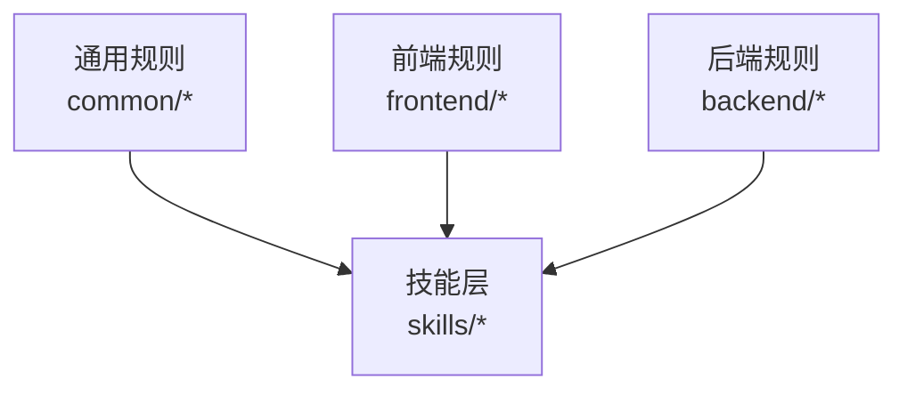

# 语言特定规则

<cite>
**本文引用的文件**
- [rules/README.md](file://rules/README.md)
- [rules/common/overview.md](file://rules/common/overview.md)
- [rules/common/comments.md](file://rules/common/comments.md)
- [rules/frontend/overview.md](file://rules/frontend/overview.md)
- [rules/frontend/jsdoc.md](file://rules/frontend/jsdoc.md)
- [rules/frontend/workflow.md](file://rules/frontend/workflow.md)
- [rules/backend/overview.md](file://rules/backend/overview.md)
- [rules/java/overview.md](file://rules/java/overview.md)
- [rules/vue/overview.md](file://rules/vue/overview.md)
- [rules/nest/overview.md](file://rules/nest/overview.md)
- [rules/react/overview.md](file://rules/react/overview.md)
- [rules/rust/overview.md](file://rules/rust/overview.md)
- [rules/testing/overview.md](file://rules/testing/overview.md)
- [skills/java-backend-patterns/SKILL.md](file://skills/java-backend-patterns/SKILL.md)
- [skills/nest-patterns/SKILL.md](file://skills/nest-patterns/SKILL.md)
- [skills/rust-service-patterns/SKILL.md](file://skills/rust-service-patterns/SKILL.md)
- [skills/vue-patterns/SKILL.md](file://skills/vue-patterns/SKILL.md)
- [skills/ui-test-planning/SKILL.md](file://skills/ui-test-planning/SKILL.md)
</cite>

## 目录
1. [引言](#引言)
2. [项目结构](#项目结构)
3. [核心组件](#核心组件)
4. [架构总览](#架构总览)
5. [详细组件分析](#详细组件分析)
6. [依赖关系分析](#依赖关系分析)
7. [性能考量](#性能考量)
8. [故障排查指南](#故障排查指南)
9. [结论](#结论)
10. [附录](#附录)

## 引言
本文件系统性梳理语言特定规则的设计理念、应用范围与最佳实践，覆盖 Java、Vue、NestJS、React、Rust 以及测试相关规则。同时阐明语言特定规则与通用规则的关系，以及在多语言项目中如何协调使用。文档以仓库内的规则与技能文件为依据，提供面向工程落地的指导与参考。

## 项目结构
规则体系采用“通用规则 + 技术栈特定规则 + 技能（工作流）”的分层组织：
- 通用规则层：适用于所有项目与语言，强调基础约束与注释原则。
- 技术栈规则层：针对前端、后端、Java、Vue、NestJS、React、Rust、测试等方向给出职责边界、约束与最佳实践。
- 技能层：提供可复用的工作流、检查清单与实现策略，用于指导页面、组件、服务等任务的落地。

图示来源
- [rules/README.md:1-31](file://rules/README.md#L1-L31)
- [rules/common/overview.md:1-10](file://rules/common/overview.md#L1-L10)
- [rules/frontend/overview.md:1-11](file://rules/frontend/overview.md#L1-L11)
- [rules/backend/overview.md:1-9](file://rules/backend/overview.md#L1-L9)
- [rules/java/overview.md:1-9](file://rules/java/overview.md#L1-L9)
- [rules/vue/overview.md:1-11](file://rules/vue/overview.md#L1-L11)
- [rules/nest/overview.md:1-9](file://rules/nest/overview.md#L1-L9)
- [rules/react/overview.md:1-11](file://rules/react/overview.md#L1-L11)
- [rules/rust/overview.md:1-9](file://rules/rust/overview.md#L1-L9)
- [rules/testing/overview.md:1-9](file://rules/testing/overview.md#L1-L9)
- [skills/java-backend-patterns/SKILL.md:1-28](file://skills/java-backend-patterns/SKILL.md#L1-L28)
- [skills/nest-patterns/SKILL.md:1-28](file://skills/nest-patterns/SKILL.md#L1-L28)
- [skills/rust-service-patterns/SKILL.md:1-28](file://skills/rust-service-patterns/SKILL.md#L1-L28)
- [skills/vue-patterns/SKILL.md:1-29](file://skills/vue-patterns/SKILL.md#L1-L29)
- [skills/ui-test-planning/SKILL.md:1-28](file://skills/ui-test-planning/SKILL.md#L1-L28)

章节来源
- [rules/README.md:1-31](file://rules/README.md#L1-L31)

## 核心组件
- 通用规则层
  - 基础原则：明确需求、依赖接入方式可升级、规则定义“要做什么”，流程尽量交给技能、安装升级路径可验证可回滚。
  - 注释原则：解释“为什么”“约束是什么”“边界在哪里”，避免噪音注释；对外可复用接口优先文档注释，局部复杂逻辑优先行内注释。
- 前端规则层
  - 页面结构、组件边界、状态管理与视觉一致性；与 UI 测试规则协同；注释统一遵循前端 JSDoc 规则；页面类任务流程遵循前端工作流。
- 后端规则层
  - 接口边界、配置管理、认证授权、错误处理与可维护性；控制器薄、服务层清晰；DTO/schema 先于业务实现；环境变量与密钥不硬编码；日志、异常与验证路径明确。
- 语言/框架规则层
  - Java：controller/service/repository 角色稳定、DTO/validation/exception handler 明确、事务边界与数据访问层清晰、文档与测试同步更新。
  - Vue：优先 Composition API、store 只放共享状态、composables 复用逻辑、页面层处理路由与装配、组件层处理展示；注释遵循前端 JSDoc；页面流程遵循前端工作流。
  - NestJS：module/controller/service/dto 分层明确、provider 依赖收敛、参数校验/配置加载/异常过滤标准化、测试覆盖 controller 输入边界与 service 业务分支。
  - React：组件按职责拆分、数据流与状态边界清晰、客户端与服务端职责分离、页面编排结合外部技能；注释遵循前端 JSDoc；页面流程遵循前端工作流。
  - Rust：错误类型显式建模、I/O 与纯逻辑分离、并发与异步行为可测试、模块边界小而清晰。
  - 测试：先定义关键路径、关键流程优先覆盖、UI 测试聚焦用户可见行为、构建/ lint/测试/文档检查形成验证链。

章节来源
- [rules/common/overview.md:1-10](file://rules/common/overview.md#L1-L10)
- [rules/common/comments.md:1-29](file://rules/common/comments.md#L1-L29)
- [rules/frontend/overview.md:1-11](file://rules/frontend/overview.md#L1-L11)
- [rules/frontend/jsdoc.md:1-50](file://rules/frontend/jsdoc.md#L1-L50)
- [rules/frontend/workflow.md:1-43](file://rules/frontend/workflow.md#L1-L43)
- [rules/backend/overview.md:1-9](file://rules/backend/overview.md#L1-L9)
- [rules/java/overview.md:1-9](file://rules/java/overview.md#L1-L9)
- [rules/vue/overview.md:1-11](file://rules/vue/overview.md#L1-L11)
- [rules/nest/overview.md:1-9](file://rules/nest/overview.md#L1-L9)
- [rules/react/overview.md:1-11](file://rules/react/overview.md#L1-L11)
- [rules/rust/overview.md:1-9](file://rules/rust/overview.md#L1-L9)
- [rules/testing/overview.md:1-9](file://rules/testing/overview.md#L1-L9)

## 架构总览
语言特定规则与通用规则的关系：
- 通用规则作为“规则层”的基础约束，定义注释、依赖接入、验证门禁等跨语言原则。
- 语言/框架规则在通用规则之上，细化到 Java/Vue/NestJS/React/Rust/测试等方向的职责边界与约束。
- 技能层承接“流程与实现策略”，将规则转化为可复用的工作流与检查清单，指导页面、组件、服务等任务落地。

图示来源
- [rules/common/overview.md:1-10](file://rules/common/overview.md#L1-L10)
- [rules/frontend/overview.md:1-11](file://rules/frontend/overview.md#L1-L11)
- [rules/backend/overview.md:1-9](file://rules/backend/overview.md#L1-L9)
- [rules/java/overview.md:1-9](file://rules/java/overview.md#L1-L9)
- [rules/vue/overview.md:1-11](file://rules/vue/overview.md#L1-L11)
- [rules/nest/overview.md:1-9](file://rules/nest/overview.md#L1-L9)
- [rules/react/overview.md:1-11](file://rules/react/overview.md#L1-L11)
- [rules/rust/overview.md:1-9](file://rules/rust/overview.md#L1-L9)
- [rules/testing/overview.md:1-9](file://rules/testing/overview.md#L1-L9)

## 详细组件分析

### Java 规则
- 设计理念
  - 以分层清晰、契约先行为核心：controller/service/repository 角色稳定，DTO/validation/exception handler 明确，事务边界与数据访问层清晰。
  - 文档与测试同步更新，确保实现与契约一致。
- 应用范围
  - 适用于 Java / Spring Boot 项目。
- 编码规范与最佳实践
  - 控制器薄、服务层清晰；DTO/schema 先于业务实现；环境变量与密钥不硬编码；日志、异常与验证路径明确。
  - 事务边界与数据访问层清晰，避免隐藏事务行为。
- 实际应用示例与代码片段
  - 示例路径：请求/响应 DTO 定义与控制器映射、服务层业务规则、仓储层存储逻辑。
  - 参考实现路径：[skills/java-backend-patterns/SKILL.md:15-27](file://skills/java-backend-patterns/SKILL.md#L15-L27)
- 与通用规则的关系
  - 遵循通用规则的“明确需求、依赖接入可升级、规则定义要做什么、安装升级可验证可回滚”等原则。

章节来源
- [rules/java/overview.md:1-9](file://rules/java/overview.md#L1-L9)
- [skills/java-backend-patterns/SKILL.md:1-28](file://skills/java-backend-patterns/SKILL.md#L1-L28)

### Vue 规则
- 设计理念
  - 优先使用 Composition API，store 只放共享状态，composables 负责复用逻辑；页面层处理路由与装配，组件层处理展示。
  - 注释遵循前端 JSDoc；页面类任务流程遵循前端工作流。
- 应用范围
  - 适用于 Vue 3 / Vite / Pinia / Vue Router 项目。
- 编码规范与最佳实践
  - 页面与组件职责清晰；首屏、交互与错误态完整；样式策略一致，不混乱叠加。
  - 导出组件、composables 与复杂工具函数的注释遵循前端 JSDoc；页面类任务的实现与验证流程遵循前端工作流。
- 实际应用示例与代码片段
  - 示例路径：页面编排、composables 复用逻辑、Pinia store 共享状态管理。
  - 参考实现路径：[skills/vue-patterns/SKILL.md:16-28](file://skills/vue-patterns/SKILL.md#L16-L28)
- 与通用规则的关系
  - 遵循通用注释原则与前端规则层的职责边界与注释规范。

章节来源
- [rules/vue/overview.md:1-11](file://rules/vue/overview.md#L1-L11)
- [skills/vue-patterns/SKILL.md:1-29](file://skills/vue-patterns/SKILL.md#L1-L29)

### NestJS 规则
- 设计理念
  - module/controller/service/dto 分层明确；provider 依赖收敛，不跨层直接耦合；参数校验、配置加载、异常过滤优先标准化。
  - 测试至少覆盖 controller 输入边界与 service 业务分支。
- 应用范围
  - 适用于 NestJS 项目。
- 编码规范与最佳实践
  - 控制器薄、服务层清晰；DTO/schema 先于业务实现；环境变量与密钥不硬编码；日志、异常与验证路径明确。
  - 模块边界与公共 provider 清晰；输入验证通过 DTO 与管道完成；认证、日志与错误处理标准化。
- 实际应用示例与代码片段
  - 示例路径：模块边界与公共 provider、DTO 与管道、控制器与服务的职责划分。
  - 参考实现路径：[skills/nest-patterns/SKILL.md:15-27](file://skills/nest-patterns/SKILL.md#L15-L27)
- 与通用规则的关系
  - 遵循通用规则的“明确需求、依赖接入可升级、规则定义要做什么、安装升级可验证可回滚”。

章节来源
- [rules/nest/overview.md:1-9](file://rules/nest/overview.md#L1-L9)
- [skills/nest-patterns/SKILL.md:1-28](file://skills/nest-patterns/SKILL.md#L1-L28)

### React 规则
- 设计理念
  - 组件按职责拆分；优先保证数据流与状态边界清晰；保持客户端与服务端职责分离。
  - 页面编排结合外部技能；注释遵循前端 JSDoc；页面类任务流程遵循前端工作流。
- 应用范围
  - 适用于 React / Next.js 项目。
- 编码规范与最佳实践
  - 页面与组件职责清晰；首屏、交互与错误态完整；样式策略一致，不混乱叠加。
  - 导出组件、hooks 与复杂 util 的注释遵循前端 JSDoc；页面类任务的实现与验证流程遵循前端工作流。
- 实际应用示例与代码片段
  - 示例路径：页面编排、hooks 复用逻辑、组件状态与数据流。
  - 参考实现路径：[skills/vue-patterns/SKILL.md:16-28](file://skills/vue-patterns/SKILL.md#L16-L28)
- 与通用规则的关系
  - 遵循通用注释原则与前端规则层的职责边界与注释规范。

章节来源
- [rules/react/overview.md:1-11](file://rules/react/overview.md#L1-L11)
- [skills/vue-patterns/SKILL.md:16-28](file://skills/vue-patterns/SKILL.md#L16-L28)

### Rust 规则
- 设计理念
  - 错误类型显式建模；I/O 与纯逻辑分离；并发与异步行为可测试；模块边界保持小而清晰。
- 应用范围
  - 适用于 Rust 服务、CLI 与工具项目。
- 编码规范与最佳实践
  - 识别纯逻辑与 I/O，引入强类型请求/响应模型；失败路径在扩大并发之前明确；集成点在核心逻辑可测试后再添加。
  - 错误传播具备足够上下文；异步工作隔离在清晰的函数或 trait 之后；序列化与验证边界明确。
- 实际应用示例与代码片段
  - 示例路径：错误类型建模、纯逻辑与 I/O 分离、异步边界与模块划分。
  - 参考实现路径：[skills/rust-service-patterns/SKILL.md:15-27](file://skills/rust-service-patterns/SKILL.md#L15-L27)
- 与通用规则的关系
  - 遵循通用规则的“明确需求、依赖接入可升级、规则定义要做什么、安装升级可验证可回滚”。

章节来源
- [rules/rust/overview.md:1-9](file://rules/rust/overview.md#L1-L9)
- [skills/rust-service-patterns/SKILL.md:1-28](file://skills/rust-service-patterns/SKILL.md#L1-L28)

### 测试规则
- 设计理念
  - 先定义关键路径，关键流程优先覆盖；UI 测试聚焦用户可见行为，不依赖脆弱选择器；构建、lint、测试、文档检查形成同一验证链。
- 应用范围
  - 适用于 UI、接口和服务测试。
- 编码规范与最佳实践
  - 用户可见行为优先；从最高价值用户旅程开始；选择器稳定且意图明确；捕获 loading/empty/error/success 状态。
  - 登录、导航与提交路径覆盖；失败截图/日志/痕迹易于检查。
- 实际应用示例与代码片段
  - 示例路径：关键用户旅程列表、Smoke/深度覆盖标记、稳定选择器与可访问性 Smoke 检查。
  - 参考实现路径：[skills/ui-test-planning/SKILL.md:15-27](file://skills/ui-test-planning/SKILL.md#L15-L27)
- 与通用规则的关系
  - 遵循通用规则的“明确需求、依赖接入可升级、规则定义要做什么、安装升级可验证可回滚”。

章节来源
- [rules/testing/overview.md:1-9](file://rules/testing/overview.md#L1-L9)
- [skills/ui-test-planning/SKILL.md:1-28](file://skills/ui-test-planning/SKILL.md#L1-L28)

### 前端注释与工作流
- 前端注释（JSDoc）
  - 基本要求：导出的函数、组件、hooks、composables、class、复杂 util 默认应写 JSDoc；非导出但包含隐含副作用、缓存策略、兼容性分支或复杂数据约束的实现，也应补 JSDoc 或短块注释。
  - JavaScript 文件：对公开函数、组件和工厂函数，优先写完整 @param/@returns；当结构体较复杂时，可使用 @typedef/@property；当回调、联合值或可空值不直观时，应通过 JSDoc 明确；运行时会抛错、触发副作用或依赖外部约束，应在描述中写清楚。
  - TypeScript 文件：JSDoc 主要承担“语义、约束、边界”职责，不重复 TypeScript 已清楚表达的静态类型；不要机械重复显而易见的参数类型和返回类型；重点写业务语义、前置条件、副作用、异常、并发约束、缓存语义和兼容性原因；若 TypeScript 类型已经足够清楚，可保留简短摘要而不是冗长标签。
  - 组件与框架约定：React 组件注释说明职责、重要 props 语义、副作用和渲染边界；Vue composable 注释说明输入、返回约定、响应式行为和副作用；hooks/composables 要特别说明调用时机限制与依赖假设。
  - 推荐标签：@param、@returns、@typedef、@property、@throws、@example（仅在调用方式不直观时使用）。
  - 避免事项：在 TypeScript 中把类型再抄一遍，形成双重维护；为每个私有小函数机械补全模板化 JSDoc；用 JSDoc 替代更好的命名、拆分和类型设计。
- 前端工作流
  - 触发条件：写页面、改页面、补页面交互、页面联调、页面与接口联动调试。
  - 实施步骤：先识别当前技术栈，并遵循对应栈规则实现；按页面层、组件层、复用逻辑层的职责边界完成代码；为导出组件、composables、hooks 与复杂 util 补齐注释，遵循前端 JSDoc。
  - MCP 验证：页面实现完成后，必须询问用户是否需要进行 MCP 验证；如果用户同意，使用 MCP 验证关键用户路径、用户可见行为以及 loading/empty/error/success 状态；如果用户拒绝或当前环境无法执行 MCP，必须在交付说明中明确标注“未执行 MCP 验证”。
  - 不确定性处理：优先通过 MCP 调试、查看真实页面行为或真实接口返回；再读取现有代码、调用方和上下文；仍无法确定时，再向用户提问。
  - 避免事项：不因信息不完整而先写大段兼容逻辑；不在未验证真实行为前假设接口返回结构；不把“可能需要兼容”当作默认实现前提。

章节来源
- [rules/frontend/jsdoc.md:1-50](file://rules/frontend/jsdoc.md#L1-L50)
- [rules/frontend/workflow.md:1-43](file://rules/frontend/workflow.md#L1-L43)

## 依赖关系分析
- 规则层与技能层的耦合
  - 语言/框架规则与技能层紧密配合：规则定义职责边界与约束，技能层提供可复用工作流与检查清单。
  - 前端规则与 UI 测试规则协同：前端注释与工作流为 UI 测试提供稳定的实现基础，UI 测试规划确保关键用户旅程被覆盖。
- 通用规则的统摄作用
  - 通用规则为所有语言/框架规则提供统一的注释原则与工程化约束，确保跨语言一致性。
- 多语言项目协调
  - 在多语言项目中，优先遵循通用规则与对应语言/框架规则；当出现冲突时，以通用规则为基准进行取舍；技能层提供可复用流程，降低跨语言协作成本。

图示来源
- [rules/common/overview.md:1-10](file://rules/common/overview.md#L1-L10)
- [rules/frontend/overview.md:1-11](file://rules/frontend/overview.md#L1-L11)
- [rules/backend/overview.md:1-9](file://rules/backend/overview.md#L1-L9)
- [skills/java-backend-patterns/SKILL.md:1-28](file://skills/java-backend-patterns/SKILL.md#L1-L28)
- [skills/nest-patterns/SKILL.md:1-28](file://skills/nest-patterns/SKILL.md#L1-L28)
- [skills/rust-service-patterns/SKILL.md:1-28](file://skills/rust-service-patterns/SKILL.md#L1-L28)
- [skills/vue-patterns/SKILL.md:1-29](file://skills/vue-patterns/SKILL.md#L1-L29)
- [skills/ui-test-planning/SKILL.md:1-28](file://skills/ui-test-planning/SKILL.md#L1-L28)

## 性能考量
- 规则层面
  - 通过“职责边界清晰、契约先行、注释与测试同步更新”减少返工与调试成本，间接提升整体开发效率。
- 技能层面
  - 使用可复用工作流与检查清单，缩短任务周期，降低不确定性带来的性能损耗。
- 多语言项目
  - 统一的通用规则与语言特定规则有助于在团队内形成一致的性能预期与质量基线。

## 故障排查指南
- 常见问题与定位
  - 注释缺失或过时：依据通用注释规则与前端 JSDoc 规则检查注释完整性与准确性。
  - 职责不清导致的耦合：对照语言/框架规则与技能层工作流，检查分层与边界是否符合要求。
  - 测试覆盖不足：依据 UI 测试规划与测试规则，确认关键用户旅程与状态覆盖情况。
- 排查流程
  - 识别问题类型（注释、职责、测试），定位到对应规则与技能文件，核对实现是否满足要求。
  - 通过 MCP 验证关键用户路径与状态，必要时补充注释或调整职责边界。

章节来源
- [rules/common/comments.md:1-29](file://rules/common/comments.md#L1-L29)
- [rules/frontend/jsdoc.md:1-50](file://rules/frontend/jsdoc.md#L1-L50)
- [rules/frontend/workflow.md:1-43](file://rules/frontend/workflow.md#L1-L43)
- [rules/testing/overview.md:1-9](file://rules/testing/overview.md#L1-L9)
- [skills/ui-test-planning/SKILL.md:15-27](file://skills/ui-test-planning/SKILL.md#L15-L27)

## 结论
语言特定规则在通用规则的统摄下，为 Java、Vue、NestJS、React、Rust 与测试提供了清晰的职责边界、编码规范与最佳实践。通过技能层的工作流与检查清单，这些规则能够高效落地到实际项目中。在多语言项目中，建议以通用规则为基准协调各语言规则，借助技能层的可复用流程降低协作成本，确保跨语言一致性与高质量交付。

## 附录
- 术语
  - 规则层：定义约束与原则的规则集合。
  - 技能层：提供可复用工作流与检查清单的实现策略。
- 参考路径
  - 通用注释原则：[rules/common/comments.md:1-29](file://rules/common/comments.md#L1-L29)
  - 前端 JSDoc 规则：[rules/frontend/jsdoc.md:1-50](file://rules/frontend/jsdoc.md#L1-L50)
  - 前端工作流规则：[rules/frontend/workflow.md:1-43](file://rules/frontend/workflow.md#L1-L43)
  - UI 测试规划：[skills/ui-test-planning/SKILL.md:1-28](file://skills/ui-test-planning/SKILL.md#L1-L28)