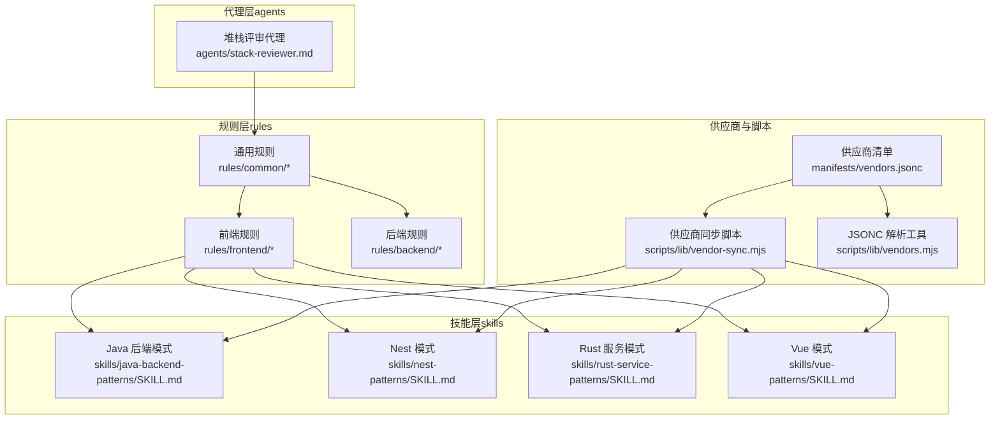
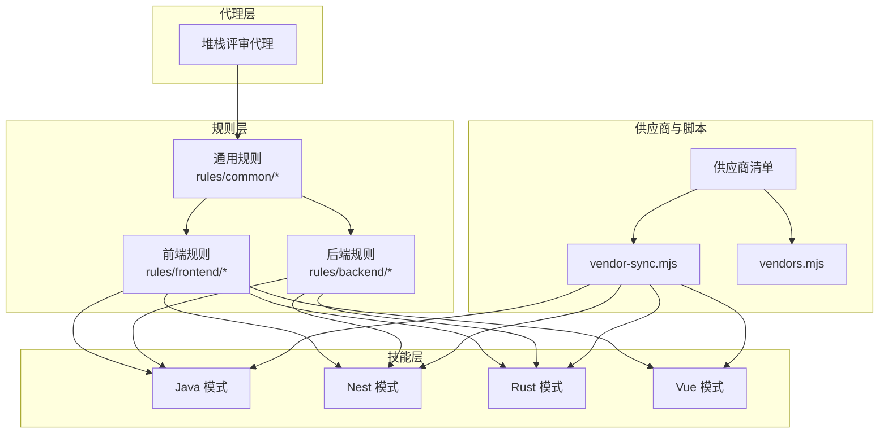
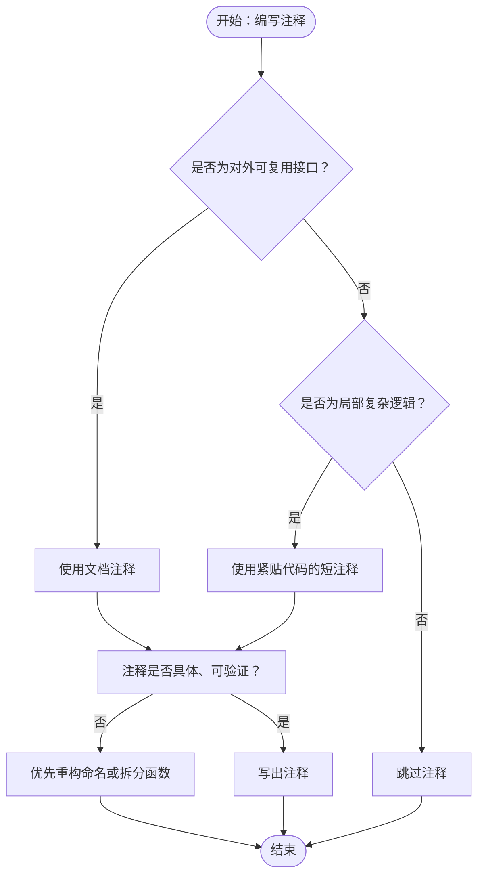
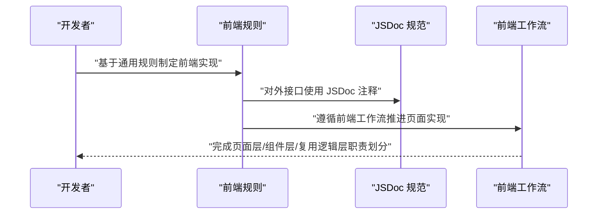
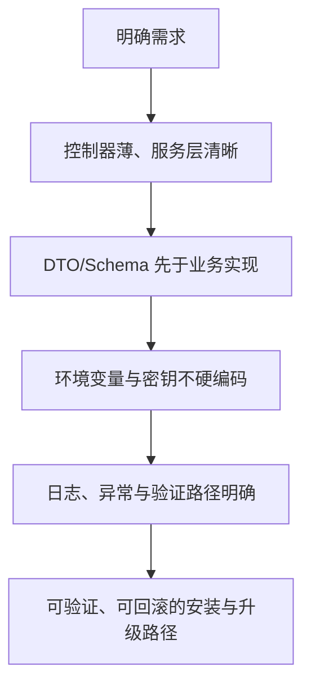
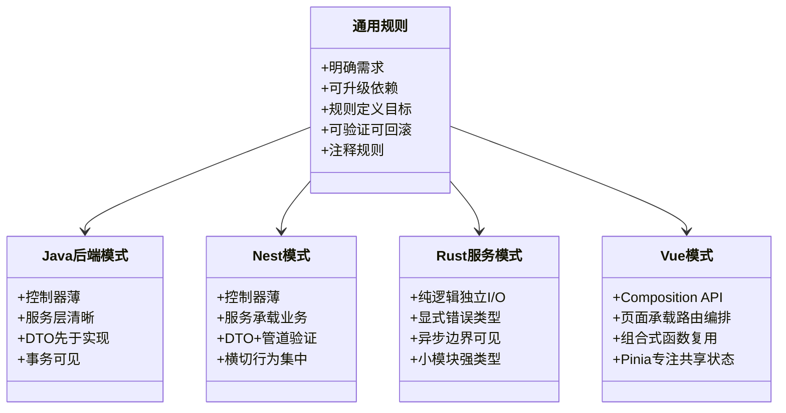
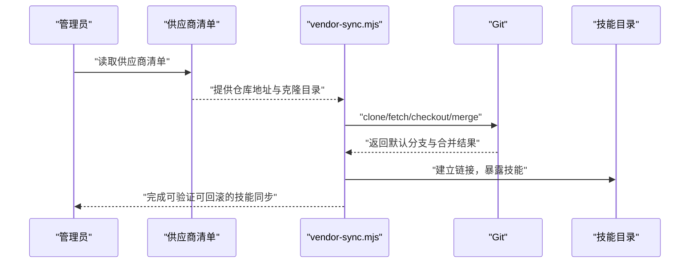
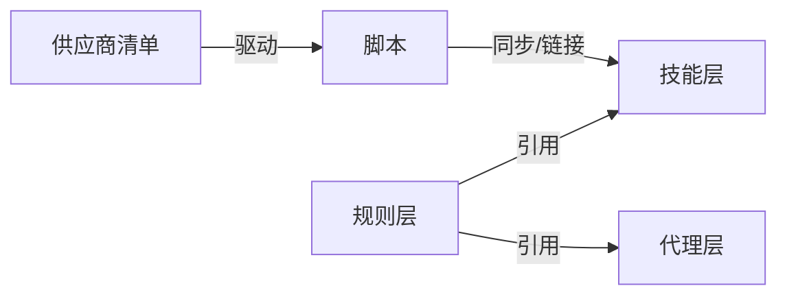

# 通用规则

<cite>
**本文引用的文件**
- [README.md](file://README.md)
- [rules/README.md](file://rules/README.md)
- [rules/common/overview.md](file://rules/common/overview.md)
- [rules/common/comments.md](file://rules/common/comments.md)
- [rules/backend/overview.md](file://rules/backend/overview.md)
- [rules/frontend/overview.md](file://rules/frontend/overview.md)
- [rules/frontend/jsdoc.md](file://rules/frontend/jsdoc.md)
- [rules/frontend/workflow.md](file://rules/frontend/workflow.md)
- [skills/java-backend-patterns/SKILL.md](file://skills/java-backend-patterns/SKILL.md)
- [skills/nest-patterns/SKILL.md](file://skills/nest-patterns/SKILL.md)
- [skills/rust-service-patterns/SKILL.md](file://skills/rust-service-patterns/SKILL.md)
- [skills/vue-patterns/SKILL.md](file://skills/vue-patterns/SKILL.md)
- [manifests/vendors.jsonc](file://manifests/vendors.jsonc)
- [scripts/lib/vendor-sync.mjs](file://scripts/lib/vendor-sync.mjs)
- [scripts/lib/vendors.mjs](file://scripts/lib/vendors.mjs)
</cite>

## 目录
1. [简介](#简介)
2. [项目结构](#项目结构)
3. [核心组件](#核心组件)
4. [架构总览](#架构总览)
5. [详细组件分析](#详细组件分析)
6. [依赖分析](#依赖分析)
7. [性能考虑](#性能考虑)
8. [故障排查指南](#故障排查指南)
9. [结论](#结论)
10. [附录](#附录)

## 简介
本文件系统化阐述“通用规则”的设计理念、作用范围与跨技术栈约束，聚焦注释规范、代码组织原则、验证与回滚路径等可复用的规则层约束。通用规则旨在为所有技术栈提供统一的“要做什么”的基础准则，同时将“怎么做”的具体实现细节委托给各技术栈的技能（skills）与代理（agents）。通过将规则层与技能层解耦，确保规则具备稳定性与可复用性，技能层专注于流程、检查清单与技术栈实现策略。

## 项目结构
该仓库以“规则层（rules）+ 技能层（skills）+ 代理层（agents）”为核心组织方式，规则层强调跨技术栈的通用约束，技能层聚焦任务流程与实现策略，代理层负责编排与执行。第三方技能通过供应商清单统一拉取与链接，最终投影到统一的技能入口，便于在 Claude/Codex 等平台复用。

图表来源
- [rules/README.md:1-31](file://rules/README.md#L1-L31)
- [rules/common/overview.md:1-10](file://rules/common/overview.md#L1-L10)
- [rules/frontend/overview.md:1-11](file://rules/frontend/overview.md#L1-L11)
- [rules/backend/overview.md:1-9](file://rules/backend/overview.md#L1-L9)
- [skills/java-backend-patterns/SKILL.md:1-28](file://skills/java-backend-patterns/SKILL.md#L1-L28)
- [skills/nest-patterns/SKILL.md:1-28](file://skills/nest-patterns/SKILL.md#L1-L28)
- [skills/rust-service-patterns/SKILL.md:1-28](file://skills/rust-service-patterns/SKILL.md#L1-L28)
- [skills/vue-patterns/SKILL.md:1-29](file://skills/vue-patterns/SKILL.md#L1-L29)
- [manifests/vendors.jsonc:1-107](file://manifests/vendors.jsonc#L1-L107)
- [scripts/lib/vendor-sync.mjs:1-78](file://scripts/lib/vendor-sync.mjs#L1-L78)
- [scripts/lib/vendors.mjs:1-75](file://scripts/lib/vendors.mjs#L1-L75)

章节来源
- [README.md:1-50](file://README.md#L1-L50)
- [rules/README.md:1-31](file://rules/README.md#L1-L31)

## 核心组件
- 通用规则概览：定义适用于所有项目的通用原则，强调“先明确需求再实现”“依赖接入方式可升级”“规则定义目标，流程交给技能”“安装与升级路径可验证可回滚”“注释属于规则层约束，详见通用注释原则”。
- 通用注释规则：统一注释的“为什么”“约束”“边界”导向，区分文档注释与行内注释，明确必须与不应写注释的场景，强调注释与代码共同维护。
- 技术栈规则：前端规则（页面结构、组件边界、状态管理、文档注释与流程）、后端规则（接口边界、配置管理、认证授权、错误处理与可维护性），二者均以通用规则为基础。
- 技能层模式：Java/Nest/Rust/Vue 等技术栈的实现模式，强调清晰的边界、DTO/Schema 先于业务实现、事务与映射逻辑隔离、纯逻辑与 I/O 分离等，均服务于通用规则的落地。
- 供应商与脚本：通过供应商清单统一管理第三方技能来源，脚本负责克隆、切换默认分支、合并上游变更，确保规则与技能的可验证与可回滚。

章节来源
- [rules/common/overview.md:1-10](file://rules/common/overview.md#L1-L10)
- [rules/common/comments.md:1-29](file://rules/common/comments.md#L1-L29)
- [rules/frontend/overview.md:1-11](file://rules/frontend/overview.md#L1-L11)
- [rules/backend/overview.md:1-9](file://rules/backend/overview.md#L1-L9)
- [skills/java-backend-patterns/SKILL.md:1-28](file://skills/java-backend-patterns/SKILL.md#L1-L28)
- [skills/nest-patterns/SKILL.md:1-28](file://skills/nest-patterns/SKILL.md#L1-L28)
- [skills/rust-service-patterns/SKILL.md:1-28](file://skills/rust-service-patterns/SKILL.md#L1-L28)
- [skills/vue-patterns/SKILL.md:1-29](file://skills/vue-patterns/SKILL.md#L1-L29)
- [manifests/vendors.jsonc:1-107](file://manifests/vendors.jsonc#L1-L107)
- [scripts/lib/vendor-sync.mjs:1-78](file://scripts/lib/vendor-sync.mjs#L1-L78)
- [scripts/lib/vendors.mjs:1-75](file://scripts/lib/vendors.mjs#L1-L75)

## 架构总览
通用规则作为规则层的核心，向下指导前端与后端规则，向上被各技术栈技能所引用与实现。供应商清单与脚本保障第三方技能的统一拉取、校验与链接，确保规则与技能的可验证与可回滚。

图表来源
- [rules/common/overview.md:1-10](file://rules/common/overview.md#L1-L10)
- [rules/frontend/overview.md:1-11](file://rules/frontend/overview.md#L1-L11)
- [rules/backend/overview.md:1-9](file://rules/backend/overview.md#L1-L9)
- [skills/java-backend-patterns/SKILL.md:1-28](file://skills/java-backend-patterns/SKILL.md#L1-L28)
- [skills/nest-patterns/SKILL.md:1-28](file://skills/nest-patterns/SKILL.md#L1-L28)
- [skills/rust-service-patterns/SKILL.md:1-28](file://skills/rust-service-patterns/SKILL.md#L1-L28)
- [skills/vue-patterns/SKILL.md:1-29](file://skills/vue-patterns/SKILL.md#L1-L29)
- [manifests/vendors.jsonc:1-107](file://manifests/vendors.jsonc#L1-L107)
- [scripts/lib/vendor-sync.mjs:1-78](file://scripts/lib/vendor-sync.mjs#L1-L78)
- [scripts/lib/vendors.mjs:1-75](file://scripts/lib/vendors.mjs#L1-L75)

## 详细组件分析

### 通用注释规则
- 设计理念
  - 注释优先解释“为什么”“约束是什么”“边界在哪里”，避免复述代码已显而易见的部分。
  - 注释需与代码共同维护，过时注释优先修正或删除。
  - 对外可复用接口优先使用文档注释，局部复杂逻辑优先使用紧贴代码的短注释。
- 必须写注释的场景
  - 导出的公共 API 存在非直观约束、前置条件、后置行为或副作用。
  - 业务规则无法从命名直接看出。
  - 存在性能权衡、兼容性处理、降级分支或安全边界。
  - 临时 workaround 需要记录原因、触发条件和后续清理信号。
- 不应写注释的场景
  - 逐行翻译代码。
  - 重复类型系统、函数名或变量名已清楚表达的信息。
  - 用注释掩盖糟糕命名或过长函数；优先重构。
- 文档注释与行内注释
  - 文档注释用于对外可复用接口；行内注释用于局部复杂逻辑。
  - 注释应具体、可验证，避免空话。

图表来源
- [rules/common/comments.md:1-29](file://rules/common/comments.md#L1-L29)

章节来源
- [rules/common/comments.md:1-29](file://rules/common/comments.md#L1-L29)

### 通用规则与前端规则的协作
- 前端规则以通用规则为基础，强调页面结构、组件边界、状态管理与视觉一致性，并统一遵循前端文档注释规范与标准流程。
- 前端文档注释规范要求对外接口使用 JSDoc 风格，导出函数、组件、hooks、composables、class、复杂 util 默认应写 JSDoc；在 TypeScript 中避免重复显而易见的类型，重点写业务语义、前置条件、副作用、异常、并发约束、缓存语义和兼容性原因。
- 前端标准流程包括：识别技术栈并遵循对应栈规则实现；按页面层、组件层、复用逻辑层完成职责边界；为导出组件、composables、hooks 与复杂 util 补齐注释。

图表来源
- [rules/frontend/overview.md:1-11](file://rules/frontend/overview.md#L1-L11)
- [rules/frontend/jsdoc.md:1-50](file://rules/frontend/jsdoc.md#L1-L50)
- [rules/frontend/workflow.md:1-43](file://rules/frontend/workflow.md#L1-L43)

章节来源
- [rules/frontend/overview.md:1-11](file://rules/frontend/overview.md#L1-L11)
- [rules/frontend/jsdoc.md:1-50](file://rules/frontend/jsdoc.md#L1-L50)
- [rules/frontend/workflow.md:1-43](file://rules/frontend/workflow.md#L1-L43)

### 通用规则与后端规则的协作
- 后端规则关注接口边界、配置管理、认证授权、错误处理与可维护性，强调控制器薄、服务层清晰、DTO/schema 先于业务实现、环境变量与密钥不硬编码、日志与异常路径明确。
- 这些约束与通用规则中的“明确需求后再进入实现”“优先保留来源清晰、可升级的依赖接入方式”“规则负责定义‘要做什么’，具体 workflow 尽量交给 skill”“所有安装与升级路径都要可验证、可回滚”高度契合。

图表来源
- [rules/backend/overview.md:1-9](file://rules/backend/overview.md#L1-L9)
- [rules/common/overview.md:1-10](file://rules/common/overview.md#L1-L10)

章节来源
- [rules/backend/overview.md:1-9](file://rules/backend/overview.md#L1-L9)
- [rules/common/overview.md:1-10](file://rules/common/overview.md#L1-L10)

### 通用规则与技术栈技能的协作
- Java 后端模式：强调控制器、服务与持久化边界清晰，DTO 与验证先于处理器绑定，最小化隐藏事务行为，保持仓储方法窄且意图明确。
- Nest 模式：强调控制器薄、业务逻辑进入服务、DTO 与管道验证输入、通过守卫、拦截器、过滤器集中横切行为。
- Rust 服务模式：强调纯逻辑与 I/O 分离、显式错误类型、使异步边界可见、优先小模块与强类型。
- Vue 模式：强调 Composition API 复用共享逻辑、路由级编排放在页面、可复用逻辑放入组合式函数、Pinia 专注共享状态而非页面本地 UI 状态，并遵循前端文档注释规范。

图表来源
- [rules/common/overview.md:1-10](file://rules/common/overview.md#L1-L10)
- [skills/java-backend-patterns/SKILL.md:1-28](file://skills/java-backend-patterns/SKILL.md#L1-L28)
- [skills/nest-patterns/SKILL.md:1-28](file://skills/nest-patterns/SKILL.md#L1-L28)
- [skills/rust-service-patterns/SKILL.md:1-28](file://skills/rust-service-patterns/SKILL.md#L1-L28)
- [skills/vue-patterns/SKILL.md:1-29](file://skills/vue-patterns/SKILL.md#L1-L29)

章节来源
- [skills/java-backend-patterns/SKILL.md:1-28](file://skills/java-backend-patterns/SKILL.md#L1-L28)
- [skills/nest-patterns/SKILL.md:1-28](file://skills/nest-patterns/SKILL.md#L1-L28)
- [skills/rust-service-patterns/SKILL.md:1-28](file://skills/rust-service-patterns/SKILL.md#L1-L28)
- [skills/vue-patterns/SKILL.md:1-29](file://skills/vue-patterns/SKILL.md#L1-L29)

### 供应商与脚本的协作
- 供应商清单统一管理第三方技能来源，脚本负责克隆仓库、获取默认分支、切换到默认分支并执行快进合并，确保规则与技能的可验证与可回滚。
- JSONC 解析工具支持解析带注释的配置文件，去除注释与尾随逗号后转换为标准 JSON，便于脚本读取与处理。

图表来源
- [manifests/vendors.jsonc:1-107](file://manifests/vendors.jsonc#L1-L107)
- [scripts/lib/vendor-sync.mjs:1-78](file://scripts/lib/vendor-sync.mjs#L1-L78)

章节来源
- [scripts/lib/vendors.mjs:1-75](file://scripts/lib/vendors.mjs#L1-L75)
- [scripts/lib/vendor-sync.mjs:1-78](file://scripts/lib/vendor-sync.mjs#L1-L78)
- [manifests/vendors.jsonc:1-107](file://manifests/vendors.jsonc#L1-L107)

## 依赖分析
- 规则层与技能层的耦合度低：规则层提供稳定、可复用的约束，技能层负责流程与实现策略，二者通过文件路径与文档引用耦合，避免直接代码依赖。
- 供应商与脚本的耦合：供应商清单驱动脚本执行，脚本负责仓库同步与链接，确保规则与技能的来源清晰、可升级、可验证、可回滚。
- 代理层与规则层：代理通过引用规则层内容进行堆栈评审与决策，保持代理层的通用性与规则层的稳定性。

图表来源
- [rules/README.md:1-31](file://rules/README.md#L1-L31)
- [manifests/vendors.jsonc:1-107](file://manifests/vendors.jsonc#L1-L107)
- [scripts/lib/vendor-sync.mjs:1-78](file://scripts/lib/vendor-sync.mjs#L1-L78)

章节来源
- [rules/README.md:1-31](file://rules/README.md#L1-L31)
- [manifests/vendors.jsonc:1-107](file://manifests/vendors.jsonc#L1-L107)
- [scripts/lib/vendor-sync.mjs:1-78](file://scripts/lib/vendor-sync.mjs#L1-L78)

## 性能考虑
- 注释与文档的维护成本：遵循“注释解释为什么、约束与边界”的原则，减少不必要的注释噪声，有助于降低阅读与维护成本。
- 代码组织与职责分离：前端页面层、组件层、复用逻辑层的职责边界清晰，后端控制器薄、服务层清晰，有助于提升可测试性与可维护性，间接提升整体性能。
- 供应商同步与链接：通过脚本统一拉取与链接第三方技能，减少手动操作带来的错误与重复工作，提高规则与技能的交付效率。

## 故障排查指南
- 注释不清晰或过时
  - 症状：注释与代码意图不符、注释缺失或冗余。
  - 处理：依据通用注释规则进行修正或删除，确保注释与代码共同维护。
  - 参考：[rules/common/comments.md:1-29](file://rules/common/comments.md#L1-L29)
- 前端注释不符合 JSDoc 规范
  - 症状：TypeScript 中重复显而易见的类型、缺少业务语义说明。
  - 处理：遵循前端 JSDoc 规范，重点写业务语义、前置条件、副作用、异常、并发约束、缓存语义和兼容性原因。
  - 参考：[rules/frontend/jsdoc.md:1-50](file://rules/frontend/jsdoc.md#L1-L50)
- 前端工作流执行不规范
  - 症状：页面实现未按页面层/组件层/复用逻辑层推进，或未进行 MCP 验证。
  - 处理：遵循前端工作流规则，完成页面实现后进行 MCP 验证或在交付说明中标注“未执行 MCP 验证”。
  - 参考：[rules/frontend/workflow.md:1-43](file://rules/frontend/workflow.md#L1-L43)
- 供应商同步失败
  - 症状：无法确定默认分支、合并失败或权限问题。
  - 处理：检查供应商清单配置，确认仓库地址与克隆目录正确；使用脚本重新执行同步与链接。
  - 参考：[scripts/lib/vendor-sync.mjs:1-78](file://scripts/lib/vendor-sync.mjs#L1-L78)，[manifests/vendors.jsonc:1-107](file://manifests/vendors.jsonc#L1-L107)
- JSONC 解析错误
  - 症状：解析带注释的配置文件时报错。
  - 处理：使用 JSONC 解析工具，确保注释与尾随逗号被正确移除后解析。
  - 参考：[scripts/lib/vendors.mjs:1-75](file://scripts/lib/vendors.mjs#L1-L75)

章节来源
- [rules/common/comments.md:1-29](file://rules/common/comments.md#L1-L29)
- [rules/frontend/jsdoc.md:1-50](file://rules/frontend/jsdoc.md#L1-L50)
- [rules/frontend/workflow.md:1-43](file://rules/frontend/workflow.md#L1-L43)
- [scripts/lib/vendor-sync.mjs:1-78](file://scripts/lib/vendor-sync.mjs#L1-L78)
- [scripts/lib/vendors.mjs:1-75](file://scripts/lib/vendors.mjs#L1-L75)
- [manifests/vendors.jsonc:1-107](file://manifests/vendors.jsonc#L1-L107)

## 结论
通用规则通过稳定的约束与清晰的注释规范，为所有技术栈提供统一的“要做什么”的指导；前端与后端规则在此基础上进一步细化职责边界与实现策略；技术栈技能将通用规则转化为可执行的工作流与检查清单；供应商与脚本确保规则与技能的来源清晰、可升级、可验证、可回滚。通过这种分层协作，通用规则能够在不同项目与技术栈中高效复用并持续演进。

## 附录
- 使用示例与最佳实践
  - 注释规范：对外可复用接口使用文档注释，局部复杂逻辑使用行内注释；注释应具体、可验证，避免空话。
  - 代码组织：前端按页面层/组件层/复用逻辑层推进，后端按控制器薄、服务层清晰推进；DTO/Schema 先于业务实现。
  - 验证与回滚：所有安装与升级路径必须可验证、可回滚；前端实现完成后进行 MCP 验证或在交付说明中标注未验证情况。
- 与其他规则类型的协作关系
  - 通用规则为规则层核心，指导前端与后端规则；前端与后端规则再被技术栈技能引用与实现；代理层通过引用规则层内容进行堆栈评审与决策。
  - 第三方技能通过供应商清单统一管理，脚本负责同步与链接，确保规则与技能的可验证与可回滚。