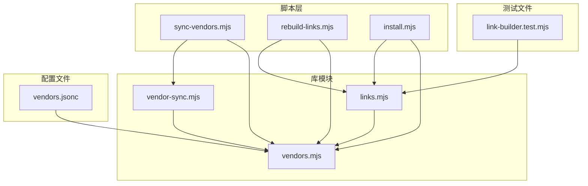
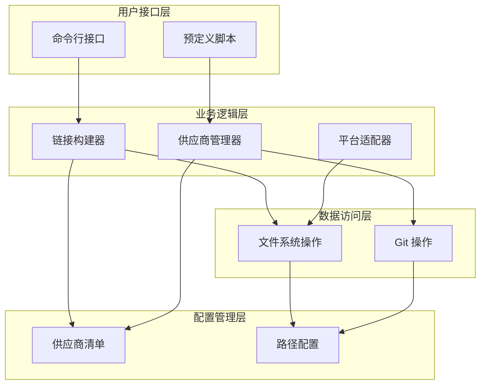
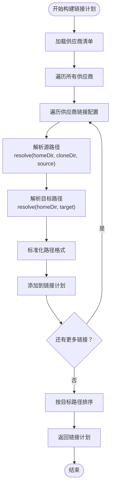
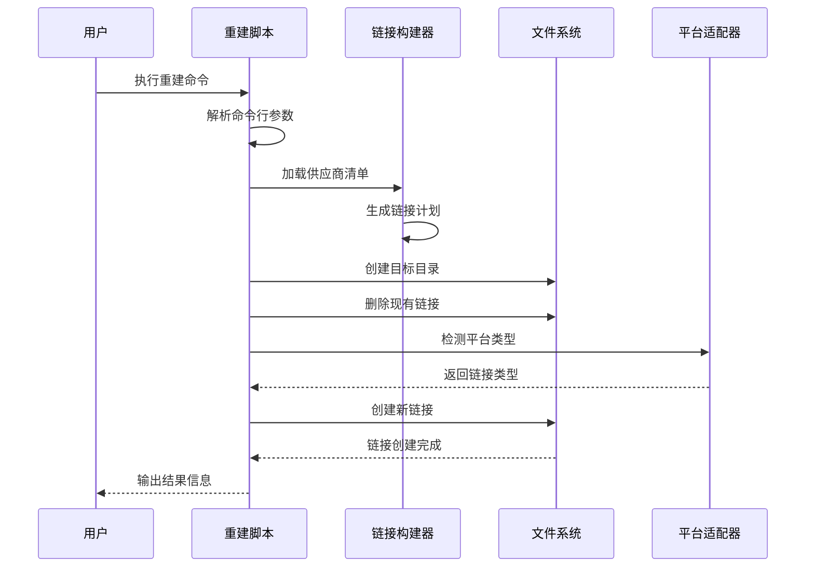
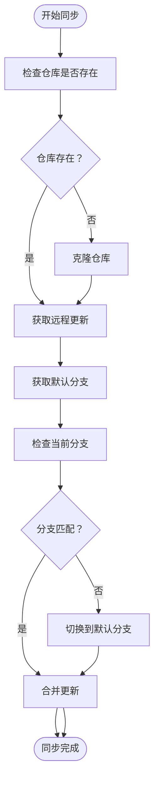
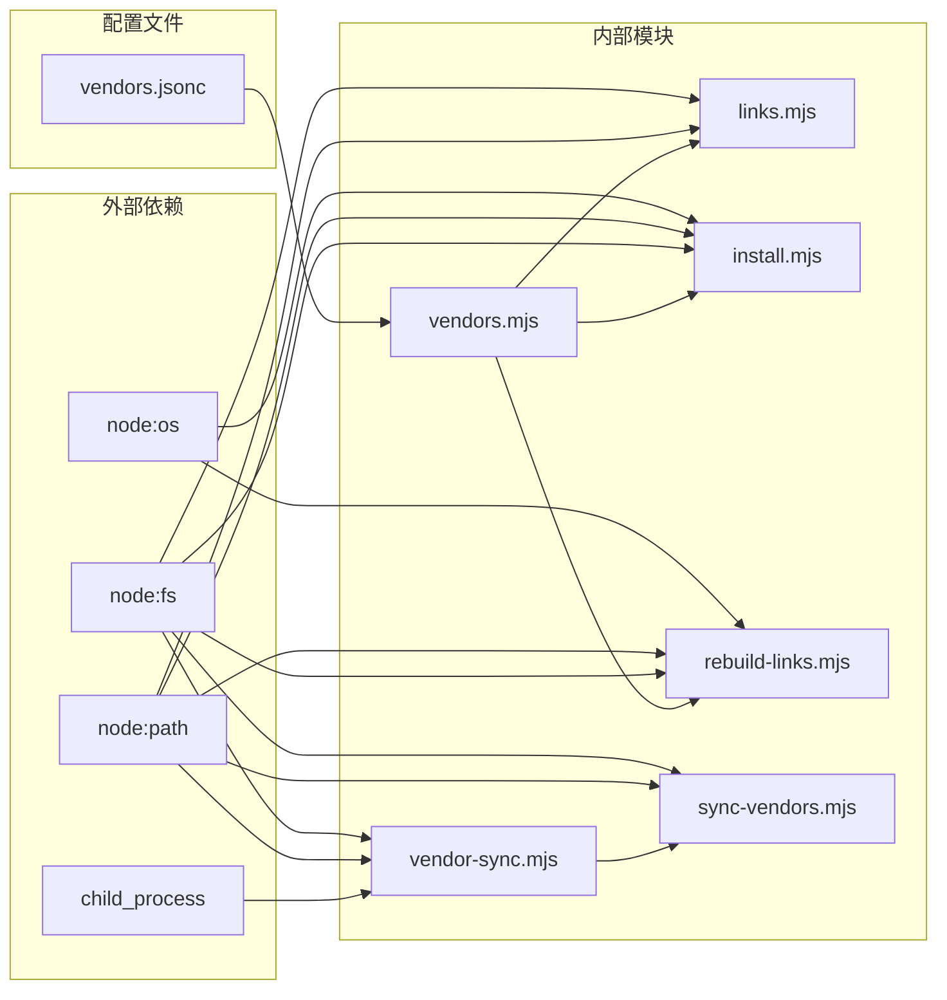

# 链接管理系统

<cite>
**本文档引用的文件**
- [scripts/lib/links.mjs](file://scripts/lib/links.mjs)
- [scripts/rebuild-links.mjs](file://scripts/rebuild-links.mjs)
- [scripts/lib/install.mjs](file://scripts/lib/install.mjs)
- [scripts/sync-vendors.mjs](file://scripts/sync-vendors.mjs)
- [scripts/lib/vendors.mjs](file://scripts/lib/vendors.mjs)
- [scripts/lib/vendor-sync.mjs](file://scripts/lib/vendor-sync.mjs)
- [manifests/vendors.jsonc](file://manifests/vendors.jsonc)
- [tests/link-builder.test.mjs](file://tests/link-builder.test.mjs)
- [README.md](file://README.md)
- [.claude/INSTALL.md](file://.claude/INSTALL.md)
- [.codex/INSTALL.md](file://.codex/INSTALL.md)
</cite>

## 目录
1. [简介](#简介)
2. [项目结构](#项目结构)
3. [核心组件](#核心组件)
4. [架构概览](#架构概览)
5. [详细组件分析](#详细组件分析)
6. [依赖关系分析](#依赖关系分析)
7. [性能考虑](#性能考虑)
8. [故障排除指南](#故障排除指南)
9. [结论](#结论)

## 简介

链接管理系统是 AIRules 项目的核心基础设施，负责管理软链接和符号链接的创建、维护和重建。该系统通过统一的链接构建器将多个来源的技能资源聚合到单一目录结构中，并为不同的 AI 平台（Claude 和 Codex）提供标准化的访问接口。

系统的核心目标是：
- **统一资源管理**：将第一方和第三方技能资源集中管理
- **跨平台兼容**：支持 macOS、Linux 和 Windows 平台
- **增量更新**：提供高效的链接重建机制
- **标准化接口**：为不同 AI 平台提供一致的访问方式

## 项目结构

链接管理系统主要由以下模块组成：

**图表来源**
- [scripts/sync-vendors.mjs:1-62](file://scripts/sync-vendors.mjs#L1-L62)
- [scripts/rebuild-links.mjs:1-74](file://scripts/rebuild-links.mjs#L1-L74)
- [scripts/lib/install.mjs:1-105](file://scripts/lib/install.mjs#L1-L105)

**章节来源**
- [README.md:1-50](file://README.md#L1-L50)
- [scripts/lib/links.mjs:1-23](file://scripts/lib/links.mjs#L1-L23)

## 核心组件

### 链接构建器 (Link Builder)

链接构建器是系统的核心组件，负责将供应商清单转换为实际的链接计划。其主要功能包括：

- **路径解析**：将相对路径转换为绝对路径
- **链接计划生成**：根据供应商配置生成链接操作列表
- **排序优化**：对链接计划进行排序以确保正确的处理顺序

### 供应商管理器 (Vendor Manager)

负责管理第三方供应商的同步和更新，包括：
- Git 仓库的克隆和更新
- 默认分支的检测和切换
- 本地分支与远程分支的同步

### 平台适配器 (Platform Adapter)

自动检测当前操作系统并选择合适的链接类型：
- **Windows**: 使用目录连接 (junction)
- **Unix-like**: 使用符号链接 (symlink)

**章节来源**
- [scripts/lib/links.mjs:5-22](file://scripts/lib/links.mjs#L5-L22)
- [scripts/lib/install.mjs:36-38](file://scripts/lib/install.mjs#L36-L38)
- [scripts/rebuild-links.mjs:46-48](file://scripts/rebuild-links.mjs#L46-L48)

## 架构概览

链接管理系统采用分层架构设计，确保了良好的模块化和可维护性：

**图表来源**
- [scripts/lib/links.mjs:1-23](file://scripts/lib/links.mjs#L1-L23)
- [scripts/lib/vendor-sync.mjs:58-77](file://scripts/lib/vendor-sync.mjs#L58-L77)
- [scripts/lib/vendors.mjs:64-66](file://scripts/lib/vendors.mjs#L64-L66)

## 详细组件分析

### 链接构建器实现

链接构建器的核心算法如下：

**图表来源**
- [scripts/lib/links.mjs:5-22](file://scripts/lib/links.mjs#L5-L22)

#### 关键特性

1. **路径标准化**：统一使用正斜杠分隔符，确保跨平台兼容性
2. **绝对路径解析**：将所有相对路径转换为绝对路径
3. **智能排序**：按目标路径字母顺序排序，确保一致的处理顺序

**章节来源**
- [scripts/lib/links.mjs:1-23](file://scripts/lib/links.mjs#L1-L23)
- [tests/link-builder.test.mjs:29-35](file://tests/link-builder.test.mjs#L29-L35)

### 链接重建脚本

链接重建脚本提供了完整的链接管理功能：

**图表来源**
- [scripts/rebuild-links.mjs:50-71](file://scripts/rebuild-links.mjs#L50-L71)

#### 功能特性

1. **参数解析**：支持自定义 home 目录和清单文件路径
2. **错误处理**：跳过不存在的源路径，继续处理其他链接
3. **平台检测**：自动识别操作系统并选择合适的链接类型
4. **日志输出**：提供详细的执行状态信息

**章节来源**
- [scripts/rebuild-links.mjs:1-74](file://scripts/rebuild-links.mjs#L1-L74)

### 供应商同步机制

供应商同步模块负责管理第三方仓库的生命周期：

**图表来源**
- [scripts/lib/vendor-sync.mjs:58-77](file://scripts/lib/vendor-sync.mjs#L58-L77)

**章节来源**
- [scripts/lib/vendor-sync.mjs:1-78](file://scripts/lib/vendor-sync.mjs#L1-L78)

### 平台特定实现

系统针对不同平台提供了专门的实现策略：

#### Windows 平台
- 使用目录连接 (junction) 替代符号链接
- 支持绝对路径和相对路径
- 需要管理员权限才能创建某些类型的连接

#### Unix-like 平台
- 使用标准符号链接 (symlink)
- 支持相对路径和绝对路径
- 更好的跨文件系统兼容性

**章节来源**
- [scripts/lib/install.mjs:36-38](file://scripts/lib/install.mjs#L36-L38)
- [scripts/rebuild-links.mjs:46-48](file://scripts/rebuild-links.mjs#L46-L48)

## 依赖关系分析

链接管理系统具有清晰的依赖层次结构：

**图表来源**
- [scripts/lib/links.mjs:1-3](file://scripts/lib/links.mjs#L1-L3)
- [scripts/lib/vendor-sync.mjs:1-3](file://scripts/lib/vendor-sync.mjs#L1-L3)

**章节来源**
- [scripts/lib/vendors.mjs:1-75](file://scripts/lib/vendors.mjs#L1-L75)
- [scripts/lib/install.mjs:1-16](file://scripts/lib/install.mjs#L1-L16)

## 性能考虑

### 时间复杂度分析

1. **链接构建阶段**：O(n*m)，其中 n 是供应商数量，m 是每个供应商的平均链接数
2. **路径解析阶段**：O(k)，其中 k 是总链接数
3. **文件系统操作**：O(k)，包括创建目录、删除链接和创建新链接

### 内存使用优化

- **增量处理**：只处理需要更新的链接
- **内存池**：避免重复创建相同的路径对象
- **流式处理**：对于大型清单文件使用流式解析

### 缓存策略

- **清单缓存**：缓存已解析的供应商清单
- **路径缓存**：缓存常用的路径解析结果
- **平台信息缓存**：缓存平台检测结果

## 故障排除指南

### 常见问题及解决方案

#### 1. 权限错误 (Windows)
**症状**：创建链接时出现权限不足错误
**解决方案**：
- 以管理员身份运行命令提示符
- 检查用户账户控制设置
- 确保目标目录具有适当的写入权限

#### 2. 路径解析错误
**症状**：链接无法正确解析到预期位置
**解决方案**：
- 验证 home 目录路径是否正确
- 检查相对路径是否相对于正确的根目录
- 确保路径分隔符在所有平台上保持一致

#### 3. Git 同步失败
**症状**：供应商仓库无法克隆或更新
**解决方案**：
- 检查网络连接和代理设置
- 验证 Git 可执行文件的可用性
- 检查仓库 URL 是否正确且可访问

#### 4. 平台兼容性问题
**症状**：在某些平台上链接无法正常工作
**解决方案**：
- 确认平台检测逻辑是否正确
- 验证链接类型是否适合目标平台
- 检查文件系统支持情况

### 调试技巧

1. **启用详细日志**：使用 `--verbose` 参数获取更多信息
2. **验证中间结果**：检查链接计划和路径解析结果
3. **隔离问题**：单独测试链接构建和文件系统操作
4. **平台测试**：在目标平台上进行全面测试

**章节来源**
- [scripts/rebuild-links.mjs:9-19](file://scripts/rebuild-links.mjs#L9-L19)
- [scripts/sync-vendors.mjs:9-19](file://scripts/sync-vendors.mjs#L9-L19)

## 结论

链接管理系统通过精心设计的架构和实现，成功解决了多平台、多来源的技能资源管理挑战。系统的主要优势包括：

1. **高度模块化**：清晰的职责分离使得系统易于维护和扩展
2. **跨平台兼容**：自动适应不同操作系统的特性差异
3. **高效性能**：优化的数据结构和算法确保快速的链接操作
4. **健壮性**：完善的错误处理和恢复机制保证系统稳定性

该系统为 AIRules 项目提供了坚实的基础，使得第一方和第三方技能资源能够统一管理，并为不同的 AI 平台提供一致的访问体验。通过持续的优化和改进，该系统将继续支持更复杂的使用场景和更高的性能要求。