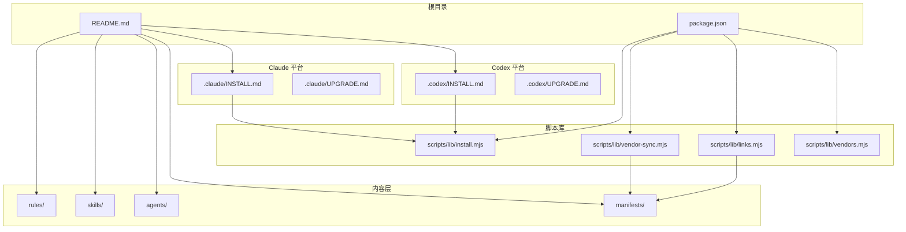
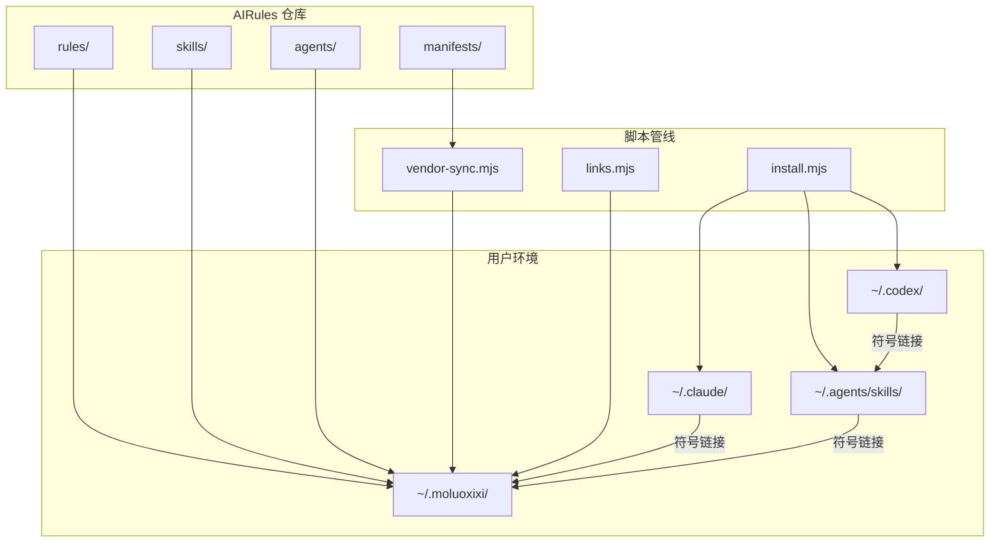
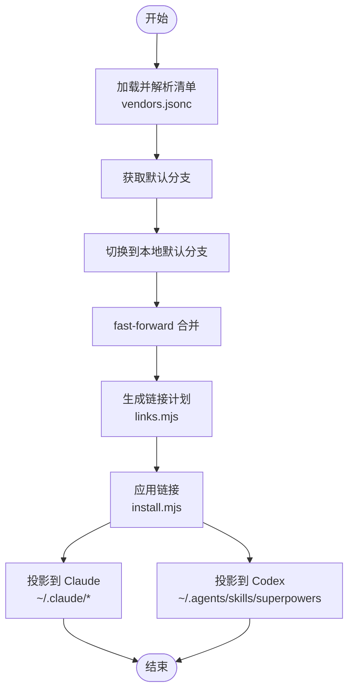
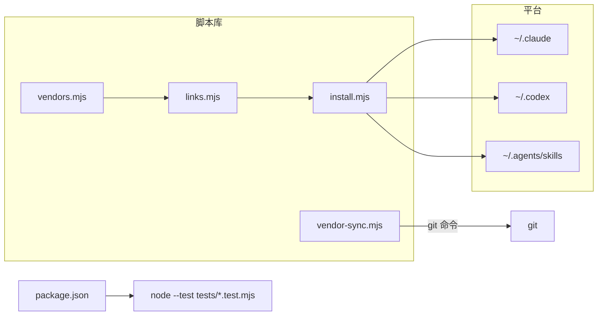

# 项目概述

<cite>
**本文引用的文件**
- [README.md](file://README.md)
- [package.json](file://package.json)
- [.claude/INSTALL.md](file://.claude/INSTALL.md)
- [.claude/UPGRADE.md](file://.claude/UPGRADE.md)
- [.codex/INSTALL.md](file://.codex/INSTALL.md)
- [.codex/UPGRADE.md](file://.codex/UPGRADE.md)
- [scripts/lib/install.mjs](file://scripts/lib/install.mjs)
- [scripts/lib/vendor-sync.mjs](file://scripts/lib/vendor-sync.mjs)
- [scripts/lib/links.mjs](file://scripts/lib/links.mjs)
- [scripts/lib/vendors.mjs](file://scripts/lib/vendors.mjs)
- [rules/README.md](file://rules/README.md)
- [rules/common/overview.md](file://rules/common/overview.md)
- [skills/java-backend-patterns/SKILL.md](file://skills/java-backend-patterns/SKILL.md)
- [agents/stack-reviewer.md](file://agents/stack-reviewer.md)
</cite>

## 目录
1. [简介](#简介)
2. [项目结构](#项目结构)
3. [核心组件](#核心组件)
4. [架构总览](#架构总览)
5. [组件详解](#组件详解)
6. [依赖关系分析](#依赖关系分析)
7. [性能考量](#性能考量)
8. [故障排查指南](#故障排查指南)
9. [结论](#结论)
10. [附录](#附录)

## 简介
AIRules 是一套建立在 superpowers 之上的个人 AI 开发工作流仓库。其核心理念并非替代 superpowers，而是在此基础上叠加第一方规则（rules）、技能（skills）、代理（agents），并通过 vendor 管理第三方技能，最终在 Claude 与 Codex 平台上提供统一的规则、技能与代理系统。安装完成后，superpowers 仍作为底层工作流能力存在，而本仓库负责将第一方规则、技能与代理组织起来，并统一投影到 Claude 与 Codex 的读取位置。

- 价值主张
  - 统一入口：通过标准化的安装与升级流程，在 Claude 与 Codex 上提供一致的体验。
  - 可扩展：以 vendor 机制管理第三方技能，支持增量扩展与版本化管理。
  - 可验证：所有安装与升级路径均可验证、可回滚，降低变更风险。
  - 分层清晰：规则层（rules）定义“要做什么”，技能层（skills）负责“怎么做”的流程与清单。

**章节来源**
- [README.md:1-50](file://README.md#L1-L50)

## 项目结构
项目采用分层与平台分离的组织方式：
- 根目录包含安装与升级指引（Claude 与 Codex 各自的 INSTALL/UPGRADE 文档）
- scripts/lib 提供安装、同步 vendor、生成链接计划等核心逻辑
- rules 存放第一方规则，按通用与技术栈划分
- skills 存放第一方技能，每个技能以独立目录与 SKILL.md 描述
- agents 存放代理定义
- manifests 存放 vendor 清单（如 vendors.jsonc）



**图表来源**
- [README.md:1-50](file://README.md#L1-L50)
- [.claude/INSTALL.md:1-108](file://.claude/INSTALL.md#L1-L108)
- [.codex/INSTALL.md:1-95](file://.codex/INSTALL.md#L1-L95)
- [scripts/lib/install.mjs:1-105](file://scripts/lib/install.mjs#L1-L105)
- [scripts/lib/vendor-sync.mjs:1-78](file://scripts/lib/vendor-sync.mjs#L1-L78)
- [scripts/lib/links.mjs:1-23](file://scripts/lib/links.mjs#L1-L23)
- [scripts/lib/vendors.mjs:1-75](file://scripts/lib/vendors.mjs#L1-L75)

**章节来源**
- [README.md:1-50](file://README.md#L1-L50)
- [package.json:1-11](file://package.json#L1-L11)

## 核心组件
- 规则（rules）
  - 作用：定义稳定、可复用、跨任务的约束与原则，强调“要做什么”
  - 结构：common 通用规则；按前端、后端、Java、Rust、Vue、React、Nest、Testing 等技术栈细分
  - 设计原则：通用规则集中于 common；仅技术栈特有的规则放入对应目录；第三方技能通过 vendor 聚合暴露
- 技能（skills）
  - 作用：描述“怎么做”的流程、检查清单与实现策略，通常以 SKILL.md 定义
  - 示例：Java 后端模式、UI 测试规划、Vue 模式、Nest 模式、Rust 服务模式等
- 代理（agents）
  - 作用：面向特定任务的智能体，如堆栈审查代理，用于在发布前识别规则与技能表面的缺口、冲突与重复
- vendor 管理
  - 作用：统一管理第三方技能来源，支持克隆、切换分支、合并与链接重建
  - 关键流程：解析清单 → 获取默认分支 → 确保本地仓库存在并同步 → 生成链接计划 → 建立软链接
- 平台适配（Claude 与 Codex）
  - Claude：将 ~/.claude/rules、skills、agents 指向 ~/.moluoxixi 对应目录
  - Codex：将 ~/.agents/skills/superpowers 指向 ~/.moluoxixi/skills，并同步 AGENTS.md

**章节来源**
- [rules/README.md:1-31](file://rules/README.md#L1-L31)
- [rules/common/overview.md:1-10](file://rules/common/overview.md#L1-L10)
- [skills/java-backend-patterns/SKILL.md:1-28](file://skills/java-backend-patterns/SKILL.md#L1-L28)
- [agents/stack-reviewer.md:1-20](file://agents/stack-reviewer.md#L1-L20)

## 架构总览
AIRules 的整体架构围绕“统一聚合层 + 平台适配层”展开：
- 统一聚合层（~/.moluoxixi）
  - rules、skills、agents、vendors 聚合于此，作为所有平台的共享源
- 平台适配层
  - Claude：通过符号链接将 ~/.claude/rules、skills、agents 指向聚合层
  - Codex：通过符号链接将 ~/.agents/skills/superpowers 指向聚合层，并同步 AGENTS.md
- vendor 管线
  - 解析清单 → 同步仓库 → 生成链接计划 → 建立软链接 → 投影到平台



**图表来源**
- [.claude/INSTALL.md:23-29](file://.claude/INSTALL.md#L23-L29)
- [.codex/INSTALL.md:11-22](file://.codex/INSTALL.md#L11-L22)
- [scripts/lib/install.mjs:68-104](file://scripts/lib/install.mjs#L68-L104)
- [scripts/lib/vendor-sync.mjs:58-77](file://scripts/lib/vendor-sync.mjs#L58-L77)
- [scripts/lib/links.mjs:5-22](file://scripts/lib/links.mjs#L5-L22)

## 组件详解

### 安装与升级流程（Claude）
- 安装目标
  - 在 ~/.moluoxixi 下聚合 rules、skills、agents、vendors
  - 在 ~/.claude 下建立 rules、skills、agents 的符号链接
- 关键步骤
  - 克隆或更新仓库至 ~/.moluoxixi
  - 同步 vendor 并重建技能链接
  - 建立 ~/.claude 的符号链接
- 验证要点
  - 确认 superpowers 已安装
  - 确认 ~/.moluoxixi/skills 与 ~/.claude/skills 指向一致

```mermaid
sequenceDiagram
participant U as "用户"
participant CLI as "命令行"
participant GIT as "git"
participant SYNC as "vendor-sync.mjs"
participant LINKS as "links.mjs"
participant INSTALL as "install.mjs"
participant CLAUDE as "~/.claude"
U->>CLI : 执行安装脚本
CLI->>GIT : 克隆/更新仓库到 ~/.moluoxixi
CLI->>SYNC : 同步 vendor
SYNC-->>CLI : 返回成功
CLI->>LINKS : 重建技能链接
LINKS-->>CLI : 返回链接计划
CLI->>INSTALL : 建立 ~/.claude 符号链接
INSTALL-->>CLAUDE : rules/skills/agents 指向 ~/.moluoxixi
CLI-->>U : 安装完成
```

**图表来源**
- [.claude/INSTALL.md:31-57](file://.claude/INSTALL.md#L31-L57)
- [scripts/lib/vendor-sync.mjs:58-77](file://scripts/lib/vendor-sync.mjs#L58-L77)
- [scripts/lib/links.mjs:5-22](file://scripts/lib/links.mjs#L5-L22)
- [scripts/lib/install.mjs:68-94](file://scripts/lib/install.mjs#L68-L94)

**章节来源**
- [.claude/INSTALL.md:1-108](file://.claude/INSTALL.md#L1-L108)
- [.claude/UPGRADE.md:1-52](file://.claude/UPGRADE.md#L1-L52)

### 安装与升级流程（Codex）
- 安装目标
  - 在 ~/.moluoxixi 聚合 rules、skills、agents、vendors
  - 在 ~/.agents/skills/superpowers 建立指向 ~/.moluoxixi/skills 的符号链接
  - 在 ~/.codex 同步 AGENTS.md
- 关键步骤
  - 克隆或更新仓库至 ~/.moluoxixi
  - 同步 vendor 并重建技能链接
  - 建立 ~/.agents/skills/superpowers 符号链接
  - 复制 AGENTS.md 到 ~/.codex
- 验证要点
  - 确认 superpowers 已安装
  - 确认 ~/.agents/skills/superpowers 指向正确
  - 确认 ~/.codex/AGENTS.md 已同步

```mermaid
sequenceDiagram
participant U as "用户"
participant CLI as "命令行"
participant GIT as "git"
participant SYNC as "vendor-sync.mjs"
participant LINKS as "links.mjs"
participant INSTALL as "install.mjs"
participant CODEX as "~/.codex"
participant AGS as "~/.agents/skills"
U->>CLI : 执行安装脚本
CLI->>GIT : 克隆/更新仓库到 ~/.moluoxixi
CLI->>SYNC : 同步 vendor
SYNC-->>CLI : 返回成功
CLI->>LINKS : 重建技能链接
LINKS-->>CLI : 返回链接计划
CLI->>INSTALL : 建立 ~/.agents/skills/superpowers 符号链接
CLI->>INSTALL : 复制 AGENTS.md 到 ~/.codex
INSTALL-->>CODEX : AGENTS.md 已同步
INSTALL-->>AGS : 指向 ~/.moluoxixi/skills
CLI-->>U : 安装完成
```

**图表来源**
- [.codex/INSTALL.md:24-52](file://.codex/INSTALL.md#L24-L52)
- [scripts/lib/vendor-sync.mjs:58-77](file://scripts/lib/vendor-sync.mjs#L58-L77)
- [scripts/lib/links.mjs:5-22](file://scripts/lib/links.mjs#L5-L22)
- [scripts/lib/install.mjs:96-104](file://scripts/lib/install.mjs#L96-L104)

**章节来源**
- [.codex/INSTALL.md:1-95](file://.codex/INSTALL.md#L1-L95)
- [.codex/UPGRADE.md:1-48](file://.codex/UPGRADE.md#L1-L48)

### vendor 管理与链接重建
- 清单解析
  - 支持 JSONC（带注释与尾随逗号）解析
  - 读取 vendors 字段与各 vendor 的 links 列表
- 仓库同步
  - 自动检测默认分支并切换到本地默认分支
  - 执行 fast-forward merge，确保与远端保持一致
- 链接计划
  - 基于清单计算 source 与 target 路径
  - 输出排序后的链接计划，便于重建
- 平台投影
  - 安装脚本根据平台类型建立符号链接
  - Claude：rules/skills/agents 指向聚合层
  - Codex：~/.agents/skills/superpowers 指向聚合层



**图表来源**
- [scripts/lib/vendors.mjs:64-66](file://scripts/lib/vendors.mjs#L64-L66)
- [scripts/lib/vendor-sync.mjs:21-52](file://scripts/lib/vendor-sync.mjs#L21-L52)
- [scripts/lib/vendor-sync.mjs:58-77](file://scripts/lib/vendor-sync.mjs#L58-L77)
- [scripts/lib/links.mjs:5-22](file://scripts/lib/links.mjs#L5-L22)
- [scripts/lib/install.mjs:68-104](file://scripts/lib/install.mjs#L68-L104)

**章节来源**
- [scripts/lib/vendors.mjs:1-75](file://scripts/lib/vendors.mjs#L1-L75)
- [scripts/lib/vendor-sync.mjs:1-78](file://scripts/lib/vendor-sync.mjs#L1-L78)
- [scripts/lib/links.mjs:1-23](file://scripts/lib/links.mjs#L1-L23)
- [scripts/lib/install.mjs:1-105](file://scripts/lib/install.mjs#L1-L105)

### 规则与技能的设计与职责
- 规则（rules）
  - 通用规则集中于 common，技术栈特有规则放入对应目录
  - 强调“要做什么”，避免与实现细节耦合
  - 与技能协作：若某项要求需长期适用，优先写入 rules，再由对应 skill 引用
- 技能（skills）
  - 以 SKILL.md 描述工作流、检查清单与边界
  - 示例：Java 后端模式强调控制器-服务-仓储边界、DTO 与校验前置、事务范围明确等
- 代理（agents）
  - 以任务为导向，如堆栈审查代理，聚焦缺失覆盖、冲突、重复与文档漂移等问题

**章节来源**
- [rules/README.md:1-31](file://rules/README.md#L1-L31)
- [rules/common/overview.md:1-10](file://rules/common/overview.md#L1-L10)
- [skills/java-backend-patterns/SKILL.md:1-28](file://skills/java-backend-patterns/SKILL.md#L1-L28)
- [agents/stack-reviewer.md:1-20](file://agents/stack-reviewer.md#L1-L20)

## 依赖关系分析
- 内部依赖
  - scripts/lib/install.mjs 依赖 scripts/lib/links.mjs 与 scripts/lib/vendors.mjs
  - scripts/lib/vendor-sync.mjs 依赖外部 git 命令
  - 安装/升级文档指导用户执行脚本与命令
- 外部依赖
  - Git：用于仓库克隆、分支切换与合并
  - Node.js：运行脚本与测试
  - 平台原生命令：macOS/Linux 使用 ln -sf，Windows 使用 mklink /J
- 平台耦合
  - Claude：符号链接指向 ~/.moluoxixi
  - Codex：符号链接指向 ~/.agents/skills/superpowers，并同步 AGENTS.md



**图表来源**
- [package.json:7-9](file://package.json#L7-L9)
- [scripts/lib/install.mjs:14-15](file://scripts/lib/install.mjs#L14-L15)
- [scripts/lib/vendor-sync.mjs:5-19](file://scripts/lib/vendor-sync.mjs#L5-L19)
- [.claude/INSTALL.md:46-50](file://.claude/INSTALL.md#L46-L50)
- [.codex/INSTALL.md:39-42](file://.codex/INSTALL.md#L39-L42)

**章节来源**
- [package.json:1-11](file://package.json#L1-L11)
- [scripts/lib/install.mjs:1-105](file://scripts/lib/install.mjs#L1-L105)
- [scripts/lib/vendor-sync.mjs:1-78](file://scripts/lib/vendor-sync.mjs#L1-L78)

## 性能考量
- I/O 行为
  - 安装与升级主要涉及文件系统操作（创建目录、删除旧链接、建立新链接），开销较低
  - vendor 同步通过 fast-forward 合并减少不必要的历史重写
- 平台差异
  - Windows 使用目录连接（junction），macOS/Linux 使用符号链接，均具备高效访问特性
- 可扩展性
  - 通过 vendor 清单与链接计划，新增第三方技能无需修改安装脚本
- 可验证性
  - 安装/升级文档提供 ls/ls -la 验证步骤，便于快速定位问题

[本节为通用建议，不直接分析具体文件]

## 故障排查指南
- 常见问题与定位
  - 仓库未更新：确认是否执行了 git pull 或 clone 步骤
  - vendor 同步失败：检查网络与 git 命令返回状态
  - 链接失效：确认 links.mjs 生成的链接计划是否被正确应用
  - 平台入口异常：检查 ~/.claude 或 ~/.agents/skills/superpowers 是否指向正确路径
- 验证清单
  - Claude：确认 ~/.claude/skills 是否指向 ~/.moluoxixi/skills
  - Codex：确认 ~/.agents/skills/superpowers 是否指向 ~/.moluoxixi/skills，且 ~/.codex/AGENTS.md 已同步
- 回滚与重试
  - 通过 fast-forward 合并与重新执行链接重建，可快速恢复到上一个稳定状态

**章节来源**
- [.claude/INSTALL.md:89-108](file://.claude/INSTALL.md#L89-L108)
- [.codex/INSTALL.md:82-95](file://.codex/INSTALL.md#L82-L95)
- [.claude/UPGRADE.md:41-52](file://.claude/UPGRADE.md#L41-L52)
- [.codex/UPGRADE.md:40-48](file://.codex/UPGRADE.md#L40-L48)

## 结论
AIRules 通过“统一聚合层 + 平台适配层”的设计，在 Claude 与 Codex 上实现了规则、技能与代理的统一管理与分发。其核心价值在于：
- 以 vendor 机制实现第三方技能的可扩展与可验证
- 以符号链接实现零拷贝的平台投影，降低维护成本
- 以清晰的职责划分（规则 vs 技能 vs 代理）提升团队协作效率
对于初学者，建议从安装与升级文档入手，理解平台入口与目录结构；对于有经验的开发者，可深入 vendor 清单与链接计划，定制扩展策略与 CI/CD 流程。

[本节为总结性内容，不直接分析具体文件]

## 附录
- 术语对照
  - 规则（rules）：定义约束与原则
  - 技能（skills）：描述流程与检查清单
  - 代理（agents）：面向任务的智能体
  - vendor：第三方技能来源
  - 符号链接：在不同平台使用不同命令实现的链接方式
- 相关文件索引
  - 安装与升级文档：.claude/INSTALL.md、.claude/UPGRADE.md、.codex/INSTALL.md、.codex/UPGRADE.md
  - 核心脚本：scripts/lib/install.mjs、scripts/lib/vendor-sync.mjs、scripts/lib/links.mjs、scripts/lib/vendors.mjs
  - 内容示例：rules/README.md、rules/common/overview.md、skills/java-backend-patterns/SKILL.md、agents/stack-reviewer.md

[本节为补充信息，不直接分析具体文件]