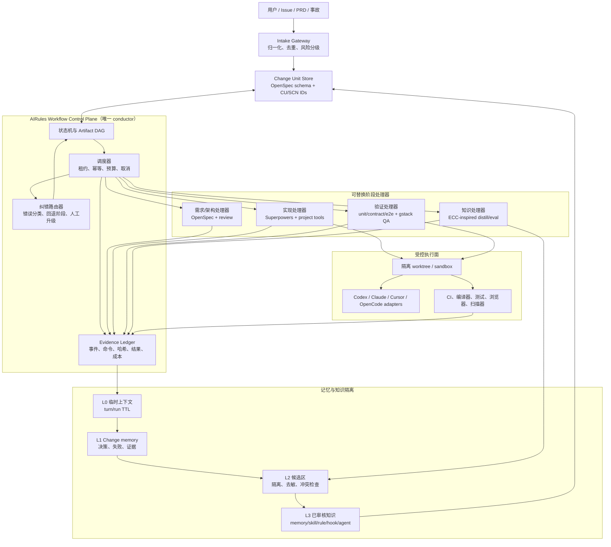
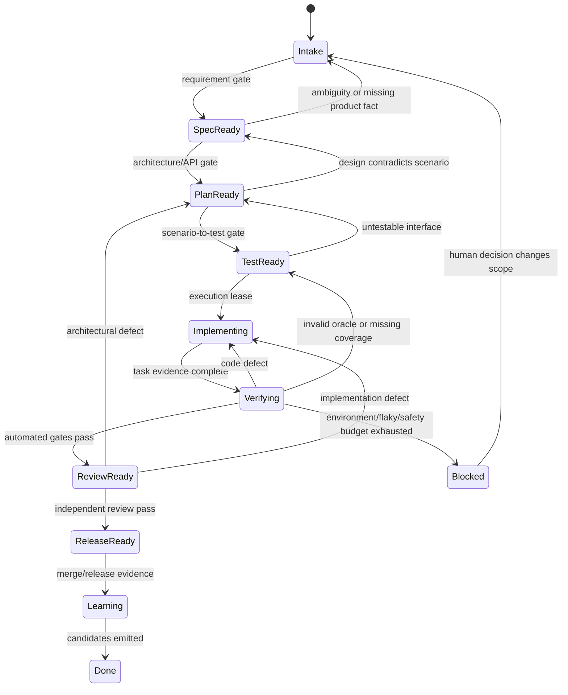

# AIRules 全链路 AI 研发工作流选型与架构方案

> 状态：Accepted；v1 核心切片已实现
>
> 日期：2026-07-10
>
> 范围：需求 -> 代码 -> 测试 -> 记忆 -> 持续沉淀
>
> 决策：采用“OpenSpec 规格主线 + AIRules 单一控制面 + Superpowers 工程方法 + gstack 质量能力 + ECC 控制与学习机制”的融合架构；Trellis 作为架构参考和可选适配器，不作为第二套事实源。

## 0. 执行摘要

不存在靠安装一个框架就能得到的“完美工作流”。真正可长期演进的方案必须先解决三件事：

1. 只有一个长期事实源，避免需求、任务、测试和记忆在多个框架间分叉。
2. 只有一个流程控制者，所有 Agent、skills、hooks 和外部工具都只是可替换的阶段处理器。
3. 每次状态迁移都必须由结构化产物和可复核证据驱动，而不是由 Agent 自称“已完成”驱动。

因此，本方案不选择完全自研 Agent 通信框架，也不让 Trellis、OpenSpec、Superpowers、gstack、ECC 并列成为五个 workflow owner。最终形态是：

- **OpenSpec** 承担规格与 change-unit 的长期主线。
- **AIRules Workflow Control Plane** 承担状态机、调度、门禁、证据、重试和审计，是唯一 conductor。
- **Superpowers** 提供 brainstorming、计划、TDD、系统调试、验证、评审等工程方法。
- **gstack** 提供高价值的产品/工程/设计评审、真实浏览器 QA、发布和文档校验能力。
- **ECC** 提供会话状态、可观测性、eval、自纠错、持续学习和安全控制的实现参考与可复用能力。
- **Trellis** 的任务状态、workspace journal、spec 更新和多宿主运行时设计值得吸收；只有在不与 OpenSpec 双写时才作为可选 runtime adapter。

## 1. 目标、约束与判断标准

### 1.1 目标

- 把模糊需求稳定转换为可实现、可验收、可追踪的规格。
- 让代码生成遵守领域边界、API 契约和测试先行原则。
- 让测试失败自动进入有界、可解释、可审计的纠错闭环。
- 隔离临时上下文、任务记忆、候选知识和正式长期记忆。
- 把被验证的经验持续提升为 memory、skill、rule、hook、agent 或工具适配，而不是把原始会话直接灌入知识库。
- 支持 Codex、Claude Code、Cursor、OpenCode 等不同宿主，但不让宿主目录反向定义业务流程。

### 1.2 非目标

- 第一阶段不自研模型网关、消息队列、向量数据库或多 Agent 通信协议。
- 第一阶段不追求无人值守地自动发布所有变更。
- 不把“更多 Agent”当作吞吐量的默认答案。
- 不允许任何外部框架拥有独立于 change-unit 的第二套完成状态。

### 1.3 成本估算前提

下文成本按两名熟悉 TypeScript、CI 和 Agent workflow 的工程师，先覆盖一个宿主、两个代表性仓库估算。跨组织权限、合规、多租户和云端调度不包含在首个 MVP 内。

## 2. 概念对齐

### 2.1 完全自研（Custom Built）

完全自研不是“多写几个 Agent prompt”，而是自行拥有以下基础设施：

- typed artifact protocol 与版本兼容；
- DAG / 状态机、依赖解析、任务租约、幂等和取消；
- Agent/宿主适配、上下文切片、权限和工具策略；
- 事件日志、证据账本、重试预算、错误分类和人工升级；
- 短期状态、长期记忆、检索、冲突处理、隐私和知识淘汰；
- eval、回放、可观测性、升级和迁移。

它能获得最高控制力，但基础设施成本远高于业务价值验证成本。只有当组织规模、合规或跨宿主调度需求证明现有工具无法满足时，才应逐步内收，而不是开局从零实现。

### 2.2 Trellis

这里需要区分两个概念：

1. **Mindfold Trellis 产品/runtime**：AIRules 历史集成将其定位为项目内 workflow runtime，由 `@mindfoldhq/trellis` CLI 生成 `.trellis/spec/`、`.trellis/tasks/`、`.trellis/workspace/` 以及宿主适配；其工作流覆盖 brainstorm、implement、check、update-spec 和 finish-work。
2. **Trellis-like 架构模式**：以 typed DAG、任务依赖、workspace journal、事件驱动调度和阶段产物为核心的通用编排方式。

Trellis 的强项是把任务状态、项目知识和宿主适配放进一个可运行体系。问题是：如果同时采用 OpenSpec，它的 `.trellis/spec/` 和 `.trellis/tasks/` 会自然形成第二套规格和任务事实源；workspace journal 也不能未经审核直接成为正式长期记忆。AIRules 历史还把上游模板视为 AGPL 边界，因此复制或二次分发前必须重新核对当前许可证和版本。

结论：吸收其运行时思想；默认不把完整 Trellis 放在核心主线上。对已有 Trellis 项目提供单向适配器，而不是双写。

### 2.3 OpenSpec

OpenSpec 是 artifact-guided 的规格生命周期工具，不是完整研发控制面。当前本机验证版本为 `1.4.1`，其默认 schema 是：

`proposal -> specs + design -> tasks -> apply -> archive`

它的关键价值是：

- proposal、requirements/scenarios、design、tasks 和 archive 的清晰事实链；
- schema 中显式的 artifact `requires` 依赖；
- `status --json` 与 `instructions --json` 提供机器可读编排接口；
- project-local custom schema 可扩展 test-plan、verify、retrospective 等产物；
- workspace、context-store、initiative 为跨仓库规划提供了新入口。

它的边界也很明确：默认不负责代码执行沙箱、测试矩阵、错误分类、重试预算、长期记忆治理和知识晋升。`schema` 仍标记为 experimental，升级时必须做 schema contract test。

### 2.4 Superpowers

Superpowers 是可组合、强制触发的工程方法集，核心链路包括：

`brainstorming -> worktree -> writing-plans -> TDD -> implementation -> review -> verification -> finish branch`

它擅长约束 Agent 的工作方式，尤其是需求澄清、RED-GREEN-REFACTOR、系统化调试、证据优先和双阶段评审。它不提供统一的持久状态、跨任务事实源、组织级记忆库或完整控制面。因此最适合做阶段处理器，不适合做 workflow database。

### 2.5 gstack

gstack 是一套高度产品化的 sprint/质量技能：office-hours、CEO/工程/设计/DX plan review、code review、真实浏览器 QA、ship、document-release、retro，以及可选 GBrain。它的优势是“看得见、跑得动”的真实 QA 和发布闭环。

它的局限是流程高度 opinionated，部分能力对 Bun、浏览器、特定宿主或外部服务有依赖。若把 `/spec`、`/autoplan`、`/qa`、`/ship` 全部当主线，就会与 OpenSpec 和 AIRules 状态重复。正确方式是按 change metadata 路由特定 gate，例如只有 UI 变更才触发 browser QA 和 design review。

### 2.6 ECC

这里的 ECC 不是行业统一的 “Execution Control Center” 标准。本机镜像对应 `affaan-m/ECC` `2.0.0`，其定位已从 Everything Claude Code 扩展为跨宿主 agent operating system，包含 skills、rules、hooks、session/state、control pane、eval、continuous learning、worktree 和 orchestration。

本方案所说的 **ECC 方向**，是抽象其“执行控制与纠错”能力：

- 会话适配和事件采集；
- readiness、quality gate 和 observability；
- verification loop 与 eval harness；
- 有界自治、observer 防重入和工作树生命周期；
- instinct/candidate -> evaluate -> evolve 的持续学习机制；
- 安全扫描和跨宿主安装适配。

ECC 覆盖面很广，直接全量采用会带来较大的能力面、升级面和规则冲突面。因此它适合作为控制面能力库和实现参考，而不是与 OpenSpec 并列的规格 owner。

### 2.7 生态自由组合（Ecosystem Mashup）

生态组合不是简单“全都安装”。成熟的组合必须先定义：

- 谁拥有事实；
- 谁决定状态；
- 每个外部模块只处理哪一个明确阶段；
- 输入/输出 schema、失败语义和版本边界；
- 如何禁用或替换某个模块而不破坏主线。

没有这些边界的 mashup 会迅速变成多套任务状态、重复 hooks、冲突规则和不可回放的隐式编排。

## 3. 四个方向的优劣势与落地成本

| 方向 | 需求 | 代码 | 测试与纠错 | 记忆 | 持续沉淀 | 主要风险 | 预计落地成本 |
| --- | --- | --- | --- | --- | --- | --- | --- |
| 完全自研 | 可完全匹配业务 schema，但早期容易把时间花在协议而非需求质量 | 可做最强的模块/API 约束，但需自建执行器、上下文切片和工具权限 | 可实现最严谨的 gate、回放和错误路由；所有可靠性机制都要自己证明 | 可精确隔离多层记忆；检索、冲突、隐私、淘汰均需自建 | 理论最强，可把组织经验编译为策略；eval 和治理成本极高 | 重复造基础设施、维护总成本失控、长期没有成熟垂直切片 | **极高**：3-6 个月 MVP，6-12 个月以上硬化 |
| 基于 Trellis | PRD/design/task 与项目 spec 结合紧密，启动快 | workflow runtime 和宿主适配完整，任务执行自然 | check/finish 提供闭环，但企业级风险测试、独立 verifier 和错误 taxonomy 仍需增强 | workspace journal 与 mem 可用，但必须增加候选隔离和正式晋升门 | update-spec/finish-work 有沉淀路径，缺少严格证据与知识治理时易污染 | 与 OpenSpec 双事实源、CLI/模板耦合、许可证和升级边界 | **中**：2-6 周试点，2-3 个月治理集成 |
| 生态自由组合 | OpenSpec + 强需求评审可达到最好覆盖 | Superpowers 方法成熟，能结合项目现有编译、API 和 TDD 工具 | gstack QA + Superpowers 验证 + ECC eval 可形成强闭环 | 可组合出分层模型，但必须由自有控制面统一 scope 与写入策略 | 可选择最好的 distill/eval/publish 能力 | 最大风险是多个 workflow owner、重复 hooks 和语义漂移 | **中高**：4-8 周垂直切片，3-6 个月稳定化 |
| 基于 ECC | 需求工具很多，但不是它最稳定的单一事实主线 | 跨宿主 rules/agents/skills 丰富，快速覆盖多技术栈 | verification、eval、quality gate、security、orchestration 很强 | session/state、memory persistence、instinct learning 完整度高 | continuous learning 是最强项之一 | 能力面过宽、裁剪困难、版本变化和本地规则冲突；规格治理仍需补齐 | **中**：2-4 周安装试点，2-4 个月裁剪与治理 |

### 3.1 结论

- **完全自研**：不选。只自研不可替代的薄控制面和契约。
- **完整 Trellis 主线**：不选。它与 OpenSpec 在 spec/task/memory 上重叠，但保留适配能力。
- **ECC 主线**：不选。它是优秀能力库，但不是本方案唯一的长期规格主线。
- **受控生态组合**：选择。前提是 AIRules conductor 与 change-unit contract 先于任何工具集成。

## 4. 最终方案：AIRules 单主线控制面

### 4.1 核心架构决策

| 决策 | 选择 | 理由 |
| --- | --- | --- |
| 长期规格事实源 | OpenSpec project schema | 提供 proposal/spec/design/tasks/archive 和机器可读状态，可扩展而不需要重造文件生命周期 |
| 流程事实源 | AIRules change-unit state + append-only evidence ledger | 完成状态必须可回放、可审计，不能由某个 Agent 的自然语言决定 |
| 唯一调度者 | AIRules conductor | 外部框架只能作为 handler/gate，禁止并列 workflow owner |
| 工程方法 | Superpowers 精选技能 | 成熟的 brainstorming、TDD、debug、review、verification 方法 |
| QA/发布 | gstack 按风险路由 | 只在 UI、DX、浏览器、发布等适用场景启用高价值能力 |
| 控制/学习 | ECC 模式与精选实现 | 复用 session、eval、observer guard、continuous learning 思想，避免全量规则覆盖 |
| Trellis | 可选只读/单向 adapter | 兼容已有 Trellis 项目；默认不允许 `.trellis` 与 OpenSpec 双写 |
| 持久存储 | v1 使用 Git artifacts + JSON snapshot + append-only JSONL | Git 负责可审查事实，JSONL 负责回放；规模化后可增加 SQLite 只读索引，不改变事实源 |

### 4.1.1 v1 实现映射

当前分支已经完成第一个可运行核心切片：

- 角色入口：`roles/airules-development/`，包含独立 rules、7 个 agents 和 6 个第一方 skills。
- 远程能力编排：`roles/airules-development/constants/skills.ts`，按角色路径全量同步 moluoxixi 资产，并选取 Superpowers、gstack、ECC 与 OpenAI Playwright 能力。
- 项目初始化器：`roles/airules-development/skills/init-project/scripts/init-project.mjs`，幂等安装项目规则、运行时、schema 与隔离知识目录。
- 控制内核：`roles/airules-development/skills/init-project/assets/project-root/.airules/workflow/bin/workflow.mjs`，实现 `init/status/next/gate/replay`、证据门禁、幂等事件、失败路由、重复失败阻断与快照修复。
- OpenSpec 主线：`roles/airules-development/skills/init-project/assets/project-root/openspec/schemas/airules-development/`，实现 7 阶段 artifact DAG。
- 契约 schema：`roles/airules-development/skills/init-project/assets/project-root/.airules/workflow/schemas/`，包含 change unit、workflow event、gate result 与 memory candidate。
- 角色契约测试：`roles/airules-development/__tests__/airules-development-role.test.ts`。

v1 证明单个 change 可以确定性推进、失败、回退、阻断和回放。跨 worktree 租约、SQLite 查询索引、自动知识晋升和组织级调度仍属于后续阶段，不标记为已实现。

### 4.2 系统架构图



这张图表达两个关键边界：第一，所有工具只通过 conductor 接收任务并回写证据；第二，原始会话只能进入临时层，不能越级写入正式知识。

### 4.3 Change Unit：所有阶段共享的最小工作单元

每个变更必须有唯一 `change_unit_id: CU-<name>`。文档数量不能决定任务数量；一个高内聚变更可以只有一个 task 文件，但所有产物必须映射到同一个 change unit。

建议的 artifact contract：

| 产物 | 责任 | 必要字段/规则 |
| --- | --- | --- |
| `change.json` | 控制面状态快照 | `change_unit_id`、状态、revision、策略/schema 版本、时间戳、事件序号、失败计数；通过 ledger 回放生成，不允许手工修改 |
| `proposal.md` | why/scope | 目标、非目标、约束、成功指标、未决问题 |
| `specs/**/spec.md` | what/done | `SCN-<capability>-<NNN>`、WHEN/THEN、异常路径、权限/状态/持久化契约 |
| `design.md` | how/why | 模块边界、API/schema、数据流、替代方案、迁移与回滚 |
| `tasks.md` | execution | 原子 task、依赖、可编辑边界、完成命令；不得重复定义需求 |
| `test-plan.md` | validation contract | 每个 test case 的 `covers: SCN-*`、层级、环境、oracle、数据和风险 |
| `evidence/events.jsonl` | runtime truth | run、handler、输入/输出哈希、命令、exit code、诊断、耗时、模型/工具版本 |
| `verify-report.md` | release evidence | scenario coverage、测试结果、未解决风险、豁免、回滚准备度 |
| `retrospective.md` | learning input | 根因、有效策略、失败尝试、可泛化候选，不直接写正式 memory |

### 4.4 状态机与门禁



门禁返回统一结构，而不是自由文本：

```json
{
  "gate": "scenario-coverage",
  "status": "fail",
  "failure_class": "TEST_CONTRACT_MISSING",
  "route_to": "TEST_READY",
  "evidence_refs": ["SCN-auth-003"],
  "retryable": false,
  "policy_version": "workflow-v1"
}
```

### 4.5 五个核心环节如何运转

#### A. 需求：模糊意图 -> 可执行规格

1. Intake 归一化输入，识别重复 change、受影响能力、风险和缺失事实。
2. Product 提供业务事实；Development 必须共同校验可实现性、可测试性、API、权限、状态和持久化契约。
3. requirement handler 生成 proposal 和 scenario，不允许用 mock 字段补不存在的接口。
4. requirement gate 检查：目标/非目标、每个 requirement 的 scenario、异常路径、可观测成功标准和 open questions。
5. 有高影响歧义时停在 `Intake`，不能把猜测传给代码 Agent。

#### B. 代码：规格 -> 高内聚实现

1. Architect 先定义模块边界、public API、依赖方向和变更 work unit。
2. Test Designer 先将 `SCN-*` 映射为失败测试或可执行 oracle。
3. Coder 只获得当前 task 所需的最小上下文切片：相关 spec、design decision、API、测试和允许编辑路径。
4. 采用 RED-GREEN-REFACTOR；API/schema/类型/依赖边界由机器 gate 校验。
5. 并行只发生在无共享写集的 DAG 节点；每个节点使用独立 worktree、文件租约和幂等 key。

#### C. 测试：验证 -> 有界自纠错

测试矩阵按风险生成，而不是统一追求单一覆盖率：

- unit：纯逻辑和边界值；
- contract：API、schema、事件、数据库迁移和兼容性；
- integration：模块/服务真实组合；
- E2E/browser：关键用户旅程和 UI 状态；
- security/performance/resilience：仅由风险元数据触发；
- regression：每个已修复 defect 必须新增可复现 oracle。

失败后必须先分类，再决定修复者：

| failure class | 回退位置 | 禁止行为 |
| --- | --- | --- |
| `REQUIREMENT_GAP` | Intake/SpecReady | 不允许 coder 猜业务规则 |
| `DESIGN_CONTRACT_ERROR` | PlanReady | 不允许只改测试迎合错误实现 |
| `IMPLEMENTATION_DEFECT` | Implementing | 不允许跳过失败测试 |
| `TEST_ORACLE_ERROR` | TestReady | 不允许把产品缺陷误报为 flaky |
| `ENVIRONMENT_FAILURE` | Blocked/infra handler | 不计入代码重试预算 |
| `FLAKY_TEST` | quarantine | 不允许静默重跑到绿色 |
| `SECURITY_POLICY` | human approval | 不允许 Agent 自动降级门禁 |

同一 failure signature 连续出现两次，或单个 change 的自动修复累计超过预算，就升级人工决策。每次重试必须产生新的诊断假设和证据，否则视为循环失控。

#### D. 记忆：分层、隔离、防污染

| 层 | 内容 | 生命周期 | 自动注入策略 | 写入权限 |
| --- | --- | --- | --- | --- |
| L0 Run Context | 当前 prompt、工具输出、临时摘要 | 小时/天，TTL | 仅当前 run | 自动 |
| L1 Change Memory | 决策、失败签名、证据索引、handoff | change 生命周期 | 仅同 repo + 同 change | conductor |
| L2 Candidate | 可复用事实/策略候选、来源和置信度 | 待审 | 默认不注入 | distiller 只可新增 |
| L3 Approved Memory | 已核验项目/组织事实 | 版本化，支持失效 | scope + provenance + top-k | curator/PR |
| L4 Policy Assets | skill、rule、hook、agent、schema | 发布版本 | 由 role/host 路由 | eval + review + publish |

正式检索必须带 `org/repo/role/change/security/version` scope，并返回 provenance、更新时间和适用条件。向量相似度只能做候选召回，不能替代权限、版本和冲突判定。

#### E. 持续沉淀：经验 -> 可发布资产

```text
session/event
  -> candidate extraction
  -> secret/PII scan
  -> dedupe + conflict detection
  -> replay/eval against positive and negative cases
  -> human or policy review
  -> classify(memory | skill | rule | hook | agent | schema)
  -> publish with version and rollback
  -> observe adoption and regressions
```

晋升规则：

- 一次性事实进入 change memory，不进入全局 memory。
- 可复用但尚未重复验证的做法进入 candidate。
- 多次出现、证据一致的项目事实进入 approved memory。
- 可执行过程进入 skill；不可违反的稳定约束才进入 rule。
- 只有确定、低风险、幂等的生命周期动作才进入 hook。
- 需要独立上下文或专业审查职责时才新增 agent。
- 所有正式资产必须通过回放/eval，并保留来源、适用范围、版本和撤销条件。

本仓库的 skills、agents、hooks、rules 均采用远程同步，因此正式晋升必须写入远端 `moluoxixi` 资产的对应 `roles/<role>/...` 路径，再由 AIRules 分发；不得在本分发仓库维护一份会漂移的本地副本。

### 4.6 Agent 协作协议

Agent 之间不依赖自由文本“互相聊天”，只交换 typed task envelope：

```yaml
task_id: TASK-CU-auth-004
change_unit_id: CU-auth
handler: implementer
input_artifacts:
  - specs/auth/spec.md#SCN-auth-003
  - design.md#token-rotation
allowed_write_roots:
  - src/auth
  - tests/auth
required_gates:
  - typecheck
  - unit
  - api-contract
budget:
  max_attempts: 3
  max_minutes: 30
output_contract:
  - patch
  - evidence
  - diagnostics
```

这使模型、宿主和具体 skill 都可替换；conductor 只依赖输入/输出契约和 gate 结果。

### 4.7 可观测性、安全与治理

必须记录但不默认向模型注入：

- 状态迁移、handler、模型/工具/策略版本；
- artifact hash、命令、exit code、测试和扫描摘要；
- 重试次数、失败分类、人工豁免和原因；
- token、时延、成本、缓存命中和上下文来源；
- secret/PII scan、权限拒绝和 prompt-injection 告警。

核心指标：

- 需求一次通过率与澄清次数；
- scenario -> test 覆盖率；
- 首次验证通过率、平均纠错轮数、flaky rate；
- escaped defect 和 rollback rate；
- change lead time、Agent 成本和人工等待时间；
- memory candidate 晋升率、撤销率、陈旧命中率；
- skill/rule 升级后的 eval 回归率。

## 5. 落地第一步：先建 Change Unit Contract，不先建 Agent

最关键的切入点是实现一个可回放的 **change-unit + state/gate/evidence contract**。如果这层没有先固定，后续接入任何 Trellis、ECC、Superpowers 或 gstack 都只会增加隐式状态和重复事实源。

### 5.1 第一个垂直切片

第一期只覆盖一个真实、规模适中的变更，打通：

`intake -> spec -> test-plan -> implement -> verify -> retrospective -> candidate`

需要交付四个稳定 schema：

1. `change-unit.schema.json`
2. `workflow-event.schema.json`
3. `gate-result.schema.json`
4. `memory-candidate.schema.json`

以及最小 CLI：

```text
airules workflow init <change>
airules workflow status <change> --json
airules workflow next <change>
airules workflow gate <change> <gate>
airules workflow replay <change>
```

### 5.2 首期验收标准

- 任一时刻都能从 artifacts + event ledger 重建 change 状态。
- 每个 `SCN-*` 都有 `covers: SCN-*` 的测试设计和最终证据。
- gate 失败能路由到正确阶段，而不是一律让 coder 重试。
- Agent 无法绕过 gate 自行把状态改成 Done。
- 原始会话不会自动进入 approved memory。
- 同一个 handler 可替换为不同宿主实现，状态机无需修改。
- 重复执行同一 task 不产生重复副作用。

### 5.3 暂不做的事情

- 不先做 dashboard。
- 不先做向量数据库。
- 不先做十几个 Agent 并行。
- 不先复制全部 ECC/gstack/Superpowers 资产。
- 不先设计跨组织云调度。

先证明一个 change 能被确定性推进、失败、回退、恢复和沉淀，再扩展并行、远程执行和组织级知识库。

## 6. 建议实施顺序

| 阶段 | 交付 | Exit criteria |
| --- | --- | --- |
| Phase 0：契约 | ADR、四个 schema、状态机、错误 taxonomy | schema contract tests 通过，状态可回放 |
| Phase 1：单仓垂直切片 | OpenSpec custom schema、CLI、Git/JSONL/SQLite、一个真实 change | 五环节端到端完成且证据齐全 |
| Phase 2：工程 handlers | Superpowers 的 brainstorm/TDD/debug/verify adapters | handler 可替换，失败分类稳定 |
| Phase 3：质量 handlers | gstack review/QA/ship 的风险路由 | UI/非 UI 变更不会误触发无关 gate |
| Phase 4：记忆治理 | candidate、eval、approval、expiry、conflict | 无自动越级晋升，可撤销、可审计 |
| Phase 5：规模化 | worktree DAG、租约、并行、跨仓 workspace | 并发无共享写冲突，恢复和取消可靠 |

## 7. 最终判断

“完美方案”不是选中一个最大而全的框架，而是建立一个足够小、足够硬的核心：

- 一个 change unit；
- 一个事实主线；
- 一个 conductor；
- 一套 typed artifacts；
- 一套证据驱动 gate；
- 一个有界纠错路由；
- 一条隔离、评估、审核后才晋升的知识流水线。

OpenSpec、Superpowers、gstack、ECC 和 Trellis 都应服从这套核心契约。这样才能既吸收生态能力，又保留替换权、审计能力和长期一致性。

## 附录 A：本次验证基线

- OpenSpec：本机 CLI `1.4.1`；已核对默认 `spec-driven` / `workspace-planning` schemas、`status --json`、`instructions --json`、workspace、context-store 和 initiative 命令面。
- Superpowers：本机远程同步镜像提交 `d884ae0`，标记 Release `v6.1.1`。
- gstack：本机远程同步镜像提交 `11de390`，package version `1.58.5.0`。
- ECC：本机远程同步镜像提交 `4130457`，package version `2.0.0`。
- Trellis：当前机器未安装 `trellis` CLI；概念核对基于 AIRules 历史 `trellis-development` 集成契约。进入实现前必须重新验证当前 CLI、许可证和宿主能力，不能把历史记录当作现行事实。
