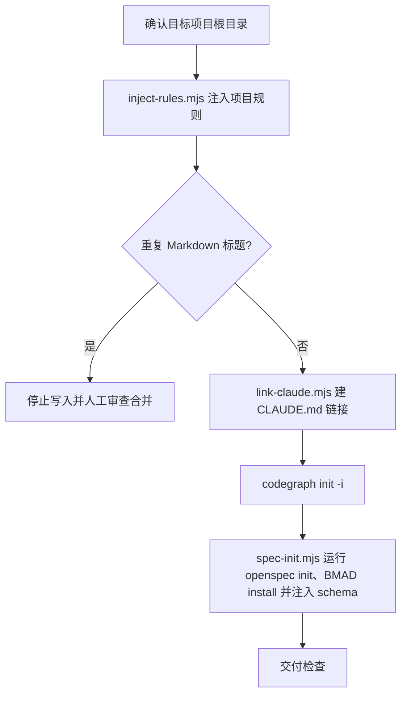

# Init Project

最小化项目初始化：注入项目规则、建立 `CLAUDE.md` 链接、初始化 CodeGraph、运行 OpenSpec 项目初始化与宿主入口安装，安装 BMAD BMM runtime，并把 `superpowers-bridge` schema 注入到项目级 `openspec/schemas/superpowers-bridge/`。

## 触发条件

- 用户创建新项目、初始化项目，或首次为已有项目接入 AIRules。
- 需要生成/补充项目根 `AGENTS.md`、建立 `CLAUDE.md` 链接、初始化 CodeGraph、安装 BMAD BMM runtime 或注册 OpenSpec schema。

## 不适合场景

- 项目已完成初始化，用户只要求普通业务代码、文档或单个 skill 修改。
- 目标目录或写入权限无法确认时，不猜测、不覆盖用户文件。

## 输出边界

- 只改初始化交付物：项目根 `AGENTS.md`、`CLAUDE.md` 链接、CodeGraph 初始化结果、BMAD BMM runtime、`openspec/schemas/superpowers-bridge/**` 与 `knowledge/index.md`。
- 不手建 OpenSpec 生命周期目录或命令；`openspec/`、active/archive/change 结构由 OpenSpec CLI 自己维护。
- 不创建 Qoder wiki 配置、不写 `.qoder/rules/AGENTS.md`、不改依赖目录、构建产物、vendor、宿主目录或用户未授权文件。
- `references/**` 只承载注入到用户项目的项目级规则；不写入 AIRules 维护者规则（变更分级、子代理调度、host 投影、发布流程等归 AIRules 仓库自身）。

## 初始化流程

| 环节 | 命令 | 关键输出 | 失败语义 |
|---|---|---|---|
| 规则注入 | `node "<init-project-skill>/scripts/inject-rules.mjs" <project>` | 项目根 `AGENTS.md`；当前规则源为空时只确保文件存在为空，不写默认规则 | 已有托管块时移除旧块；托管块不完整时停止并要求人工审查合并 |
| Claude 链接 | `node "<init-project-skill>/scripts/link-claude.mjs" <project>` | `CLAUDE.md` 链接指向 `AGENTS.md` | 非托管文件或链接到其它目标时停止 |
| CodeGraph | 在项目根执行 `codegraph init -i` | `.codegraph` 初始化状态 | 命令缺失报 `MISSING` |
| OpenSpec schema + BMAD runtime | `node "<init-project-skill>/scripts/spec-init.mjs" <project>` | 按目标项目已有宿主目录运行 `openspec init <project> --tools <detected> --no-color` 安装 OpenSpec 官方入口；支持 `.claude`、`.codex`、`.cursor`、`.qoder`、`.trae`、`.opencode`，都不存在时默认 `qoder`。同时运行 `bmad-method install --directory <project> --modules bmm --tools <detected> --yes` 安装 BMAD BMM runtime；BMAD tool 映射为 `.claude -> claude-code`，`.codex -> codex`，`.cursor -> cursor`，`.qoder -> qoder`，`.trae -> trae`，`.opencode -> opencode`，都不存在时默认 `qoder`。随后从 `assets/superpowers-bridge/` 与 `assets/knowledge/index.md` 复制缺失文件到 `openspec/schemas/superpowers-bridge/**` 与 `knowledge/index.md`，把 `openspec/config.yaml` 设为 `schema: superpowers-bridge`，并运行 `openspec schema validate superpowers-bridge` 与 `openspec schemas` 确认项目级注册 | 幂等，已存在 schema/knowledge 文件不覆盖；`openspec` 或 `bmad-method` 命令缺失时标 `MISSING` 并失败，不用本地骨架伪装完整初始化 |

- `<init-project-skill>` 表示已安装的全局 init-project skill 根目录（例如宿主 skills 目录下的 `init-project/`），不是目标项目内路径；执行前必须替换为真实绝对路径，且路径建议加双引号。
- 不要在目标项目内寻找 `skills/init-project/scripts/*.mjs`，这些脚本随全局 skill 分发；若无法定位全局 skill 根目录，标 `MISSING` 并提示用户提供。
- `inject-rules.mjs` 自动处理 `airules-base.md`；当前 `airules-base.md` 为空，因此不会向用户项目注入默认规则正文。

## 交付检查

| 检查项 | 期望 |
|---|---|
| 规则 | 项目根 `AGENTS.md` 存在；当前不注入默认规则正文 |
| `CLAUDE.md` | 链接指向 `AGENTS.md`；Windows 无符号链接权限时回退为同一文件实体硬链接，并在日志说明 |
| CodeGraph | `codegraph init -i` 真实执行并报告 `PASS`、`FAIL`、`MISSING` 或 `NOT RUN` |
| OpenSpec schema | `openspec/` 由 OpenSpec CLI 初始化；项目已有宿主目录或默认 `.qoder` 下存在 OpenSpec 官方入口；`openspec/schemas/superpowers-bridge/` 存在；`openspec/config.yaml` 含 `schema: superpowers-bridge`；`openspec schema validate superpowers-bridge` 通过；`openspec schemas` 能列出 `superpowers-bridge (project)` 或等价项目级条目 |
| BMAD BMM runtime | 项目已有宿主目录或默认 `.qoder` 下存在 BMAD BMM skills；`bmad-prd`、`bmad-create-epics-and-stories`、`bmad-shard-doc`、`bmad-generate-project-context` 可被宿主发现 |
| knowledge | `knowledge/index.md` 已建，长期背景事实落 `knowledge/`；变更生命周期产物由 OpenSpec 管理 |
