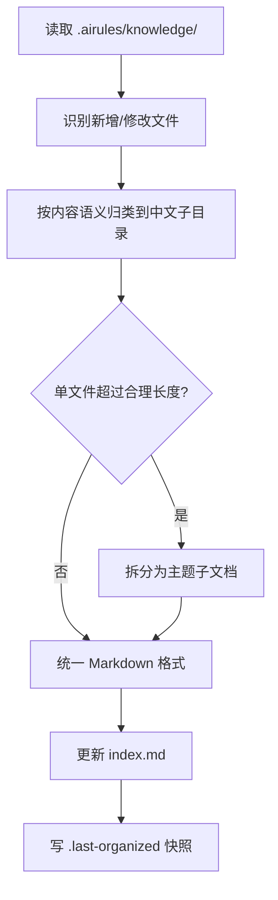

# 知识库整理

整理 `.airules/knowledge/` 目录：识别新增/修改文件、按语义归类到中文子目录、拆分超大文档、统一 Markdown 格式、更新 `index.md`。

## 触发方式

- **编排 diff 触发**：任务初始化时，编排检测到 `.airules/knowledge/` 有 git 变更或快照差异时自动显式调用。
- **用户手动调用**：用户直接按名调用 `organize-knowledge`。

不由 `description` 自动加载，无 `description` 字段。

## 不适合场景

- `.airules/knowledge/` 不存在或为空 → 报 `MISSING`，不自动创建目录骨架（由 `init-project` 负责）。
- 文档内容存在业务事实争议 → 只整理格式与归类，不修改业务事实文本。

## 核心流程



## 整理契约

1. **保留原文，不篡改业务事实**：仅移动、重命名、拆分、格式化；不修改文档的业务内容与数据。
2. **单文件合理长度**：单个 `.md` 文件建议不超过 400 行；超长文档按主题拆成子文档，主文档保留摘要与子文档链接。
3. **`index.md` 每行对应一个文件**：格式为 `- [标题](相对路径) — 一句话描述`；按子目录分组；已整理文件不重复处理（对比 `.last-organized` 快照）。
4. **已整理文件不重复处理**：通过 `.last-organized`（记录文件路径与 mtime/hash）判断哪些文件自上次整理后有变更，只处理变更集。
5. **子目录命名语义优先**：按文档内容的中文业务语义命名子目录，不强制套用固定分类模板。
6. **幂等性**：多次运行结果相同；不生成临时文件残留。

## index.md 格式规范

```markdown
# 知识库索引

<!-- 编排唯一入口：每行对应一个文件 -->

## 架构

- [文件标题](架构/文件名.md) — 一句话描述

## 接口协议

- [文件标题](接口协议/文件名.md) — 一句话描述

<!-- 按需添加其他中文子目录分组 -->
```

## 输出

- 整理后的 `.airules/knowledge/` 目录结构（文件已归类）
- 更新后的 `index.md`
- 写入 `.airules/knowledge/.last-organized`（记录本次整理的文件路径与时间戳）
- 状态报告：`PASS`（整理完成）/ `MISSING`（目录不存在）/ `N/A`（无变更文件，跳过）
