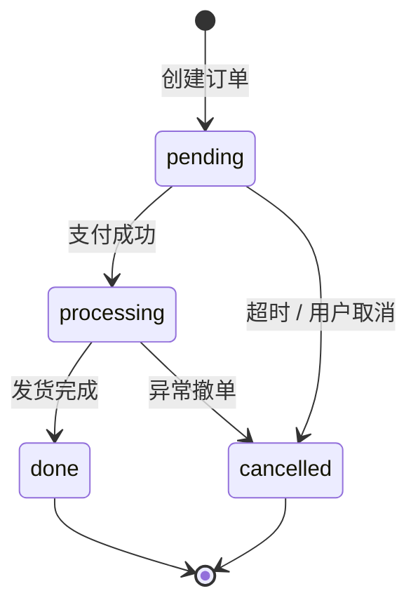

# 后端任务计划规范

本文件由 `writing-plans` 在任务触及后端（接口 / 服务 / 数据）时加载，补充后端专项必填字段。  
与通用任务模板（`writing-plans/SKILL.md`）配合使用，不重复通用字段。

---

## 后端任务专项必填字段

每个后端任务，除通用必填字段外，还必须包含以下内容。

### 1. 能力名称 / 模块名称

```
能力名称: <e.g. 用户认证模块 / 订单查询接口>
对应需求 ID: <来自 .airules/requirements/<feature>.md 的 REQ-xxx>
```

### 2. 对外接口契约

每个新增或修改的接口必须完整填写以下契约表；**禁止只写"新增接口"或"实现服务逻辑"，契约内容不得留白**：

| 项目 | 内容 |
|---|---|
| 接口类型 | `REST` / `RPC` / `CLI` / `消息队列` |
| method + path / RPC name / CLI command | `POST /api/v1/orders` |
| request schema | `{ userId: string, items: OrderItem[], remark?: string }` |
| response schema | `{ orderId: string, status: "pending", createdAt: ISO8601 }` |
| 必填字段 | `userId, items` |
| 可选字段 | `remark` |
| 枚举值 | `status: pending \| processing \| done \| cancelled` |
| 错误响应 | `400 INVALID_ITEMS / 403 PERMISSION_DENIED / 409 DUPLICATE_ORDER` |
| 权限前置条件 | `需 role: buyer 且 userId 与 token 匹配` |
| 数据副作用 | `写 orders 表、发 order.created 事件` |
| 兼容性说明 | `新增可选字段 remark，不破坏现有调用方` |

> 若需求需要字段但数据源、表结构、上游接口或权限规则不存在，必须标 `MISSING`；不得用默认值、空对象、静默跳过或降级逻辑伪装后端契约已满足。

### 3. 数据模型影响

说明本次任务对数据库表、集合、文件结构的变化：

| 表 / 集合 | 变更类型 | 变更字段 / 索引 | 迁移要求 |
|---|---|---|---|
| `orders` | 新增表 | `id, userId, items, status, createdAt` | 初始化迁移脚本 |
| `users` | 修改 | 新增 `lastOrderAt` 列 | 允许 NULL，回填 `NOT RUN` |

无数据模型变更则写 `N/A`；有变更但未列出视为不合规。

### 4. 权限规则

```
操作: 创建订单
权限判定:
  - 用户已登录（token 有效）
  - role 包含 buyer
  - userId 与 token 中 sub 一致（资源归属校验）
拒绝条件: 以上任一不满足返回 403 PERMISSION_DENIED
是否涉及 RBAC / ABAC 变更: 否 / 是（具体描述）
```

### 5. 状态机 / 业务流程

有状态流转时必须写出；无则写 `N/A`：



或文字说明每个状态、触发条件、允许的转换方向、禁止的转换路径。

### 6. 数据一致性与事务边界

```
事务边界: 写 orders 表 + 扣减库存（inventory 表）在同一数据库事务内
并发控制: 库存行加乐观锁（version 字段），失败重试最多 3 次
幂等性: 以 (userId, idempotencyKey) 为唯一键，重复请求返回已有订单
```

无事务/幂等要求则明确写"无事务边界要求 / 接口天然幂等"，不得留空。

### 7. 错误码与异常语义

| 错误码 | HTTP 状态 | 含义 | 触发条件 |
|---|---|---|---|
| `INVALID_ITEMS` | 400 | 订单项为空或商品不存在 | items 数组为空，或含下架商品 ID |
| `PERMISSION_DENIED` | 403 | 权限不足 | 见权限规则 |
| `DUPLICATE_ORDER` | 409 | 重复下单 | idempotencyKey 已存在 |
| `INSUFFICIENT_STOCK` | 422 | 库存不足 | 扣减库存失败 |

- 不得返回内部堆栈或数据库错误给调用方。
- 4xx 错误须附 `{ code, message }` 结构，`message` 可本地化。

### 8. 幂等性 / 并发 / 重试要求

```
幂等方案: 客户端生成 idempotencyKey（UUID），服务端以 (userId, key) 去重
并发上限: 单用户同时最多 5 个 in-flight 请求，超限返回 429
重试策略: 服务端内部重试（库存乐观锁）最多 3 次；客户端不重试（409 直接返回）
超时: 接口超时 3s，超时返回 504 并记日志
```

无相关要求则明确写 `N/A`，不得留空。

### 9. 兼容性与迁移影响

```
破坏性变更: 无 / 有（描述：删除字段 X，影响调用方 A、B）
向后兼容策略: 旧字段保留至 v2 下线 / 新旧版本共存 / 迁移截止日期
数据迁移: 需要 / 不需要（如需，说明脚本路径、回滚方案、预计时长）
调用方通知: 需要通知哪些团队/服务
```

### 10. 日志、审计、监控要求（如适用）

```
操作日志: 记录 userId、操作类型、资源 ID、IP、时间戳
审计要求: 敏感操作（支付、权限变更）写入审计表，不可删除
监控指标: 接口 P99 < 500ms；错误率 > 1% 触发告警
链路追踪: 注入 traceId，传播至下游服务
```

不适用则写 `N/A`。

### 11. 关联测试用例 ID

```
- TC-xxx（来自 .airules/tests/<feature>.md）
- TC-xxx
```

---

## 不合规红线

以下情况必须在任务文件中标 `BLOCKED`，不得进入编码：

1. 接口契约表中任何必填字段（request schema、response schema、错误响应、权限前置）留空。
2. 需求需要的字段但数据源/表结构/权限规则不存在，未标 `MISSING`。
3. 有状态流转但未写状态机（或说明）。
4. 有事务/幂等要求但未声明边界与方案。
5. 破坏性变更未声明兼容性与迁移策略。
6. 用默认值、空对象、静默跳过或降级逻辑掩盖缺失的上游依赖。
