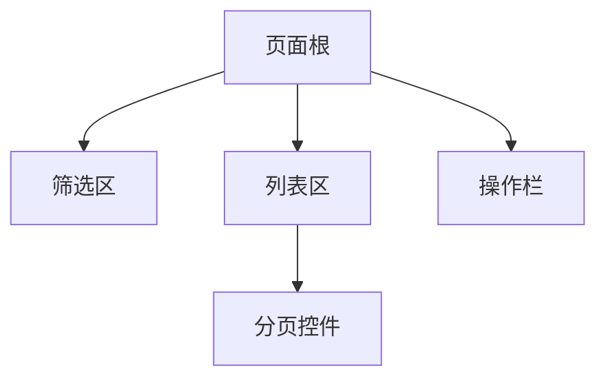

# 前端变更单元任务计划规范

本文件由 `writing-plans` 在任务触及前端变更单元时加载，补充前端专项必填字段。  
与通用任务模板（`writing-plans/SKILL.md`）配合使用，不重复通用字段。

前端变更单元可以是**页面**，也可以是**共享组件/hook/状态模块/请求封装/样式系统**；两类的必填字段有差异，按下方分类执行。

---

## A. 页面变更单元专项必填字段

变更单元为页面时，除通用必填字段外，还必须包含以下内容：

### 1. 页面路由与入口

```
路由路径: <e.g. /users/:id/profile>
入口文件: <e.g. src/pages/UserProfile.tsx>
父路由 / 布局组件: <e.g. AppLayout>
权限前置条件: <进入此页面所需角色或权限，无则写"无">
```

### 2. 页面布局图

以下至少选一种形式描述页面区域划分：

**选项 A — Mermaid 区域层级**



**选项 B — ASCII wireframe**

```
+--[Header / 面包屑]-----------------------------+
| [筛选区: 关键字输入 | 状态下拉 | 日期范围 | 搜索] |
+------------------------------------------------+
| [操作栏: 新建 | 批量删除]                        |
+------------------------------------------------+
| [列表区: 表格 / 卡片]                            |
|   列 1 | 列 2 | 列 3 | 操作列                   |
+------------------------------------------------+
| [分页控件]                                      |
+------------------------------------------------+
```

**选项 C — 区域层级表**

| 区域 | 职责 | 子区域 |
|---|---|---|
| 筛选区 | 收集过滤条件 | 关键字、状态、日期 |
| 列表区 | 展示主数据 | 表格、操作列 |
| 操作栏 | 批量/全局操作 | 新建、导出 |
| 分页控件 | 翻页与条数 | — |

### 3. 组件结构

```
PageRoot (<UserListPage>)
├── FilterPanel (复用 / 新建)
│   ├── SearchInput
│   ├── StatusSelect
│   └── DateRangePicker
├── ActionToolbar
│   ├── CreateButton
│   └── BatchDeleteButton
├── DataTable (复用 <CommonTable> / 新建)
│   └── OperationColumn
└── Pagination (复用 <AppPagination>)
```

**组件复用分析**（两类必填）：
- 复用既有组件：列出组件名 + 来源路径 + 复用原因
- 需新封装组件：列出组件名 + 封装原因 + 供哪些页面复用

### 4. 接口契约核对表

每个本页面调用的接口，必须逐行填写以下核对表；**不得 mock、猜字段、前端兜底来伪装接口已满足**：

| 项目 | 内容 |
|---|---|
| 接口名称 | `<描述性名称>` |
| method + path | `GET /api/v1/users` |
| 请求参数 | `{ page, pageSize, keyword?, status? }` |
| 响应字段（完整） | `{ total, list: [{ id, name, status, createdAt }] }` |
| 页面所需字段 | `id, name, status, createdAt` |
| 字段来源 | 接口返回 / 前端计算 / 本地 mock（须标注） |
| 差异状态 | `PASS` / `MISSING` / `PARTIAL` / `CONFLICT` |
| 处理建议 | 差异状态非 PASS 时必填：补接口字段 / 前后端协商 / 标 BLOCKED |

**差异状态说明**：
- `PASS`：接口已提供页面所需全部字段，类型/枚举一致
- `MISSING`：页面需要但接口没有的字段
- `PARTIAL`：接口有字段但结构/枚举/类型与页面需求不完全匹配
- `CONFLICT`：字段类型、枚举、结构与页面需求冲突

> **红线**：差异状态为 `MISSING` 或 `CONFLICT` 时，任务文件必须标 `BLOCKED`，不得进入编码。

### 5. 字段级配置表

页面所有数据字段逐字段列出，区分列表列、详情字段、表单字段：

| 字段名 | 来源接口 | 类型 | 是否必填 | 可枚举值 | 展示格式 | 备注 |
|---|---|---|---|---|---|---|
| `id` | `/api/v1/users` | `string` | 是 | — | 不展示 | 内部 key |
| `name` | `/api/v1/users` | `string` | 是 | — | 原值 | — |
| `status` | `/api/v1/users` | `enum` | 是 | `active/inactive` | 标签 chip | — |
| `createdAt` | `/api/v1/users` | `ISO8601` | 是 | — | `YYYY-MM-DD` | 本地化 |

### 6. 交互流程

描述页面核心交互链路（状态机 / 流程图 / 步骤列表均可）：

```
用户打开页面
  → 触发列表查询（默认分页 page=1, pageSize=20）
  → loading 状态
  → 查询成功 → 渲染列表
  → 查询失败 → error 状态（展示错误提示 + 重试按钮）
用户输入筛选条件 → 防抖 300ms → 重置 page=1 → 重新查询
用户点击新建 → 跳转 /users/new 或打开弹窗
用户点击删除（批量） → 确认弹窗 → 调用删除接口 → 刷新列表
```

### 7. 页面状态覆盖（四状态必须全部声明）

| 状态 | 触发条件 | 展示方式 | 备注 |
|---|---|---|---|
| loading | 接口请求中 | Skeleton / Spinner | 首屏与刷新均需 |
| empty | 接口返回空列表 | 空状态图 + 引导文案 | 区分"无数据"和"搜索无结果" |
| error | 接口失败 / 超时 | 错误提示 + 重试按钮 | 含 HTTP 4xx/5xx 两类 |
| no-permission | 权限不足 | 403 提示或隐藏入口 | 按设计稿决定隐藏还是提示 |

> 四种状态缺任一即视为计划不完整，不得进入编码。

### 8. 响应式 / 移动端要求

如适用，说明：
- 断点定义（如 `< 768px` 切换为卡片布局）
- 在移动端隐藏/折叠的区域
- 触摸目标最小尺寸要求

不适用则写 `N/A（仅桌面端）`。

### 9. 关联测试用例 ID

```
- TC-xxx（来自 .airules/tests/<feature>.md）
- TC-xxx
```

---

## B. 非页面前端变更单元专项必填字段

变更单元为**共享组件/hook/状态模块/请求封装/样式系统**时，页面路由、布局图标 `N/A`，但必须填写以下内容：

### B.1 消费方声明

```
被哪些页面或能力消费: <页面路径或能力名称列表，至少一项；若尚无消费方则标 PLANNED>
消费方引用形式: <import 路径 / 注册方式 / 全局注入>
```

### B.2 契约变化声明

逐项声明以下契约是否变化（变化则补充细节，无变化写"无"）：

| 契约类型 | 是否变化 | 变化说明 |
|---|---|---|
| props / 参数签名 | — | |
| 事件 / 回调 / 返回值 | — | |
| 状态（内部/共享） | — | |
| 样式 API（className/CSS 变量/token） | — | |
| 接口调用（新增/修改/删除） | — | |

> **红线**：有破坏性 props/事件/接口变更但未声明兼容性策略，任务文件标 `BLOCKED`。

### B.3 组件/hook 内部交互状态（如适用）

如组件/hook 自身管理 loading/empty/error 状态，必须声明：

| 状态 | 触发条件 | 对外暴露方式 | 备注 |
|---|---|---|---|
| loading | — | prop / 内部 | |
| empty | — | prop / 内部 | |
| error | — | prop / 内部 | |

不适用则写 `N/A（无内部异步状态）`。

### B.4 关联测试用例 ID

```
- TC-xxx（来自 .airules/tests/<feature>.md）
```

---

## 不合规红线

**页面变更单元**，以下情况必须标 `BLOCKED`：

1. 接口契约核对表存在 `MISSING` 或 `CONFLICT` 且无处理建议。
2. 页面布局图缺失（无任何一种形式）。
3. 四状态（loading / empty / error / no-permission）有任何一项未声明。
4. 字段级配置表未逐字段列出（不得写"见接口文档"代替）。
5. 需求文档（`.airules/requirements/<feature>.md`）中关联的接口字段标有 `MISSING`，但任务文件未标 `BLOCKED`。

**非页面前端变更单元**，以下情况必须标 `BLOCKED`：

1. 消费方声明为空（既无消费方也未标 `PLANNED`）。
2. 有破坏性 props/事件/接口变更但未声明兼容性策略。
3. 组件/hook 有内部异步状态但未在 B.3 声明（不得以 `N/A` 掩盖真实状态管理）。
