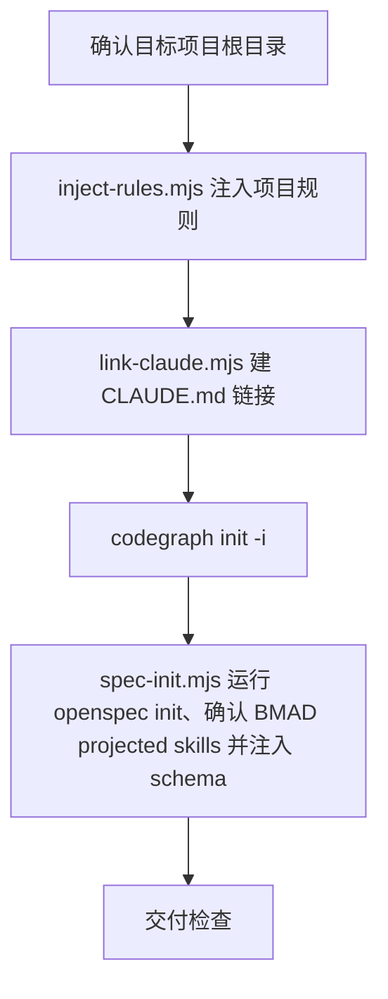

# Init Project

最小化项目初始化：注入项目规则、建立 `CLAUDE.md` 链接、初始化 CodeGraph、运行 OpenSpec 项目初始化与宿主入口安装，确认 AIRules role sync 已通过 vendor sparse clone/projection 安装精选 BMAD skills，并把 `superpowers-bridge` schema 注入到项目级 `openspec/schemas/superpowers-bridge/`。

## 触发条件

- 用户创建新项目、初始化项目，或首次为已有项目接入 AIRules。
- 需要生成/补充项目根 `AGENTS.md`、建立 `CLAUDE.md` 链接、初始化 CodeGraph、确认 BMAD projected skills 或注册 OpenSpec schema。

## 不适合场景

- 项目已完成初始化，用户只要求普通业务代码、文档或单个 skill 修改。
- 目标目录或写入权限无法确认时，不猜测、不覆盖用户文件。

## 输出边界

- 只改初始化交付物：项目根 `AGENTS.md`、`CLAUDE.md` 链接、CodeGraph 初始化结果、`openspec/schemas/superpowers-bridge/**` 与 `knowledge/index.md`；BMAD skills 由角色同步阶段投影，本脚本只验证不安装。
- 不手建 OpenSpec 生命周期目录或命令；`openspec/`、active/archive/change 结构由 OpenSpec CLI 自己维护。
- 不创建 Qoder wiki 配置、不写 `.qoder/rules/AGENTS.md`、不改依赖目录、构建产物、vendor、宿主目录或用户未授权文件。
- `references/**` 只承载注入到用户项目的项目级规则；不写入 AIRules 维护者规则（变更分级、子代理调度、host 投影、发布流程等归 AIRules 仓库自身）。

## 初始化流程

| 环节 | 命令 | 关键输出 | 失败语义 |
|---|---|---|---|
| 规则注入 | `node "<init-project-skill>/scripts/inject-rules.mjs" <project>` | 项目根 `AGENTS.md`；始终在 `< airules start: init-project-rules !>` / `< airules end: init-project-rules !>` 托管块内注入 `airules-base.md` 与通用 `agents.md` ECC agent baseline；前端字段、组件与测试矩阵纪律由 `frontend-superpowers-bridge` schema 承载；已有非托管内容保留，已有 AIRules 托管块整块替换；兼容迁移旧 `<!-- AIRULES:BEGIN init-project-rules -->` 标记 | 托管块不完整，或同时存在多个 AIRules 托管块时停止并要求人工审查合并 |
| Claude 链接 | `node "<init-project-skill>/scripts/link-claude.mjs" <project>` | `CLAUDE.md` 链接指向 `AGENTS.md` | 非托管文件或链接到其它目标时停止 |
| CodeGraph | 在项目根执行 `codegraph init -i` | `.codegraph` 初始化状态 | 命令缺失报 `MISSING` |
| OpenSpec schema + BMAD projected skills | `node "<init-project-skill>/scripts/spec-init.mjs" <project>` | 先通过 `openspec config path` 定位 OpenSpec 全局配置，并写入 `profile: custom`、`delivery: both`、全量 workflows（`propose, explore, new, continue, apply, ff, sync, archive, bulk-archive, verify, onboard`），确保 `/opsx:continue` 等全量 `/opsx:*` commands 与 skills 都会被官方 CLI 生成；随后按目标项目已有宿主目录运行 `openspec init <project> --tools <detected> --no-color` 安装 OpenSpec 官方入口；支持 `.claude`、`.codex`、`.cursor`、`.qoder`、`.trae`、`.opencode`，都不存在时默认 `qoder`。不运行 `bmad-method install --modules bmm`；BMAD 只走 AIRules role sync 的 vendor sparse clone/projection，脚本确认同一宿主 skills 目录下存在 `bmad-prd`、`bmad-create-epics-and-stories`、`bmad-generate-project-context`、`bmad-shard-doc`。随后从 `https://github.com/JiangWay/openspec-schemas.git` 克隆 `superpowers-bridge/` 到 `openspec/schemas/superpowers-bridge/**`，并从 `assets/knowledge/index.md` 复制缺失文件到 `knowledge/index.md`，把 `openspec/config.yaml` 设为 `schema: superpowers-bridge`，并运行 `openspec schema validate superpowers-bridge` 与 `openspec schemas` 确认项目级注册 | 幂等，已存在 schema/knowledge 文件不覆盖；`git`、`openspec` 缺失或 BMAD projected skills 缺失时标 `MISSING` 并失败；`openspec config path` 不返回路径或配置 JSON 无法解析时显式失败，不用 core profile、本地骨架或 BMAD runtime installer 伪装完整初始化 |

- `<init-project-skill>` 表示已安装的全局 init-project skill 根目录（例如宿主 skills 目录下的 `init-project/`），不是目标项目内路径；执行前必须替换为真实绝对路径，且路径建议加双引号。
- 不要在目标项目内寻找 `skills/init-project/scripts/*.mjs`，这些脚本随全局 skill 分发；若无法定位全局 skill 根目录，标 `MISSING` 并提示用户提供。
- `inject-rules.mjs` 只注入 `airules-base.md` 与通用 `agents.md` ECC agent baseline；前端专用纪律统一由 `frontend-superpowers-bridge` schema 提供。AIRules 规则必须只落在托管块内，后续重跑按整块替换，不在用户自有内容中做局部合并。

## 交付检查

| 检查项 | 期望 |
|---|---|
| 规则 | 项目根 `AGENTS.md` 存在；含 `< airules start: init-project-rules !>` / `< airules end: init-project-rules !>` 托管块；块内含 `airules-base.md` 与通用 ECC agents baseline；前端项目使用 `frontend-superpowers-bridge` schema 承载字段、组件与测试矩阵纪律；用户自有内容在托管块外保留 |
| `CLAUDE.md` | 链接指向 `AGENTS.md`；Windows 无符号链接权限时回退为同一文件实体硬链接，并在日志说明 |
| CodeGraph | `codegraph init -i` 真实执行并报告 `PASS`、`FAIL`、`MISSING` 或 `NOT RUN` |
| OpenSpec schema | `openspec/` 由 OpenSpec CLI 初始化；项目已有宿主目录或默认 `.qoder` 下存在 OpenSpec 官方入口；OpenSpec 全局配置为 `profile: custom`、`delivery: both` 且 workflows 包含 `continue` 等全量 workflow；宿主入口中存在 `/opsx:continue` 等全量 `/opsx:*` commands；`openspec/schemas/superpowers-bridge/` 存在；`openspec/config.yaml` 含 `schema: superpowers-bridge`；`openspec schema validate superpowers-bridge` 通过；`openspec schemas` 能列出 `superpowers-bridge (project)` 或等价项目级条目 |
| BMAD projected skills | 同一宿主 skills 目录下存在 AIRules 精选 BMAD skills；`bmad-prd`、`bmad-create-epics-and-stories`、`bmad-shard-doc`、`bmad-generate-project-context` 可被宿主发现；不得通过 `bmad-method install --modules bmm` 扩大安装面 |
| knowledge | `knowledge/index.md` 已建，长期背景事实落 `knowledge/`；变更生命周期产物由 OpenSpec 管理 |
