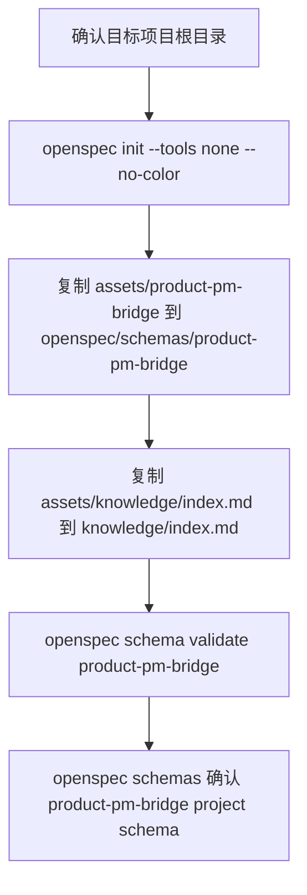

# Init Project

产品角色初始化只处理产品需求工作区：运行 OpenSpec 项目初始化与宿主入口安装，把 `product-pm-bridge` schema 注入到项目级 `openspec/schemas/product-pm-bridge/`，并创建 `knowledge/index.md` 作为长期产品背景入口。

## 触发条件

- 用户以产品/PM 角色初始化项目、需求仓库或产品文档工作区。
- 需要用 OpenSpec 管理 PRD、用户故事、验收标准、边界用例、ADR 与长期产品规格。

## 输出边界

- 只改 OpenSpec 项目资产、OpenSpec 官方宿主入口、`openspec/schemas/product-pm-bridge/**` 与 `knowledge/index.md`；`openspec/` 原生目录结构由 OpenSpec CLI 创建。
- 不注入开发规则、不创建 `AGENTS.md`/`CLAUDE.md` 链接、不初始化 CodeGraph。
- PM 方法论由 `pmSkills` 上游 skills 提供；本 skill 只负责把产品 schema 装进项目。

## 初始化流程

| 环节 | 命令 | 关键输出 | 失败语义 |
|---|---|---|---|
| OpenSpec schema | `node "<product-init-project-skill>/scripts/spec-init.mjs" <project>` | 运行 `openspec init <project> --tools claude,codex,cursor,qoder,trae,opencode --no-color` 安装 OpenSpec 官方宿主入口；随后从 `assets/product-pm-bridge/` 与 `assets/knowledge/index.md` 复制缺失文件到 `openspec/schemas/product-pm-bridge/**` 与 `knowledge/index.md`，把 `openspec/config.yaml` 设为 `schema: product-pm-bridge`，并验证 schema 注册 | 幂等，已存在 schema/knowledge 文件不覆盖；`openspec` 命令缺失时标 `MISSING` 并失败 |

## 交付检查

| 检查项 | 期望 |
|---|---|
| OpenSpec schema | `.claude`、`.codex`、`.cursor`、`.qoder`、`.trae`、`.opencode` 下存在 OpenSpec 官方入口；`openspec/schemas/product-pm-bridge/` 存在；`openspec/config.yaml` 含 `schema: product-pm-bridge`；`openspec schema validate product-pm-bridge` 通过；`openspec schemas` 能列出 `product-pm-bridge (project)` 或等价项目级条目 |
| knowledge | `knowledge/index.md` 已建；长期产品背景、业务规则、用户洞察和领域事实落 `knowledge/` |
