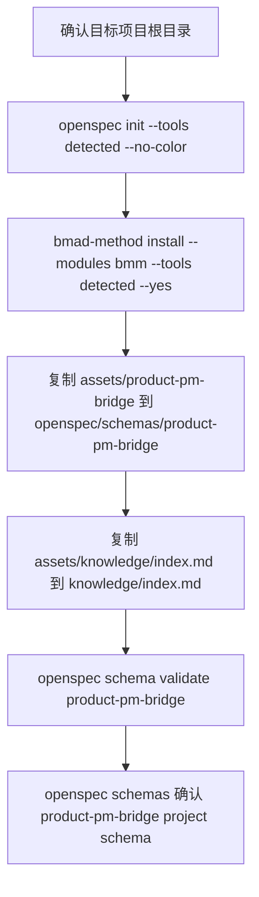

# Init Project

产品角色初始化只处理产品需求工作区：运行 OpenSpec 项目初始化与宿主入口安装，安装 BMAD BMM runtime，把 `product-pm-bridge` schema 注入到项目级 `openspec/schemas/product-pm-bridge/`，并创建 `knowledge/index.md` 作为长期产品背景入口。

## 触发条件

- 用户以产品/PM 角色初始化项目、需求仓库或产品文档工作区。
- 需要用 OpenSpec 与 BMAD 管理 PRD 校验、长文档分片、epic/story 拆分、验收标准、边界用例、ADR 与长期产品规格。

## 输出边界

- 只改 OpenSpec 项目资产、OpenSpec 官方宿主入口、BMAD BMM runtime、`openspec/schemas/product-pm-bridge/**` 与 `knowledge/index.md`；`openspec/` 原生目录结构由 OpenSpec CLI 创建。
- 不注入开发规则、不创建 `AGENTS.md`/`CLAUDE.md` 链接、不初始化 CodeGraph。
- PM 方法论由 `pmSkills` 与 BMAD 上游 skills 提供；本 skill 只负责把产品 schema 与 BMAD BMM runtime 装进项目。

## 初始化流程

| 环节 | 命令 | 关键输出 | 失败语义 |
|---|---|---|---|
| OpenSpec schema + BMAD runtime | `node "<product-init-project-skill>/scripts/spec-init.mjs" <project>` | 先通过 `openspec config path` 定位 OpenSpec 全局配置，并写入 `profile: custom`、`delivery: both`、全量 workflows（`propose, explore, new, continue, apply, ff, sync, archive, bulk-archive, verify, onboard`），确保 `/opsx:continue` 等全量 `/opsx:*` commands 与 skills 都会被官方 CLI 生成；随后按目标项目已有宿主目录运行 `openspec init <project> --tools <detected> --no-color` 安装 OpenSpec 官方入口；支持 `.claude`、`.codex`、`.cursor`、`.qoder`、`.trae`、`.opencode`，都不存在时默认 `qoder`。同时运行 `bmad-method install --directory <project> --modules bmm --tools <detected> --yes` 安装 BMAD BMM runtime；BMAD tool 映射为 `.claude -> claude-code`，`.codex -> codex`，`.cursor -> cursor`，`.qoder -> qoder`，`.trae -> trae`，`.opencode -> opencode`，都不存在时默认 `qoder`。随后从 `assets/product-pm-bridge/` 与 `assets/knowledge/index.md` 复制缺失文件到 `openspec/schemas/product-pm-bridge/**` 与 `knowledge/index.md`，把 `openspec/config.yaml` 设为 `schema: product-pm-bridge`，并验证 schema 注册 | 幂等，已存在 schema/knowledge 文件不覆盖；`openspec` 或 `bmad-method` 命令缺失时标 `MISSING` 并失败；`openspec config path` 不返回路径或配置 JSON 无法解析时显式失败，不用 core profile 或本地骨架伪装完整初始化 |

## 交付检查

| 检查项 | 期望 |
|---|---|
| OpenSpec schema | 项目已有宿主目录或默认 `.qoder` 下存在 OpenSpec 官方入口；OpenSpec 全局配置为 `profile: custom`、`delivery: both` 且 workflows 包含 `continue` 等全量 workflow；宿主入口中存在 `/opsx:continue` 等全量 `/opsx:*` commands；`openspec/schemas/product-pm-bridge/` 存在；`openspec/config.yaml` 含 `schema: product-pm-bridge`；`openspec schema validate product-pm-bridge` 通过；`openspec schemas` 能列出 `product-pm-bridge (project)` 或等价项目级条目 |
| BMAD BMM runtime | 项目已有宿主目录或默认 `.qoder` 下存在 BMAD BMM skills；`bmad-prd`、`bmad-create-epics-and-stories`、`bmad-shard-doc`、`bmad-generate-project-context` 可被宿主发现 |
| knowledge | `knowledge/index.md` 已建；长期产品背景、业务规则、用户洞察和领域事实落 `knowledge/` |
