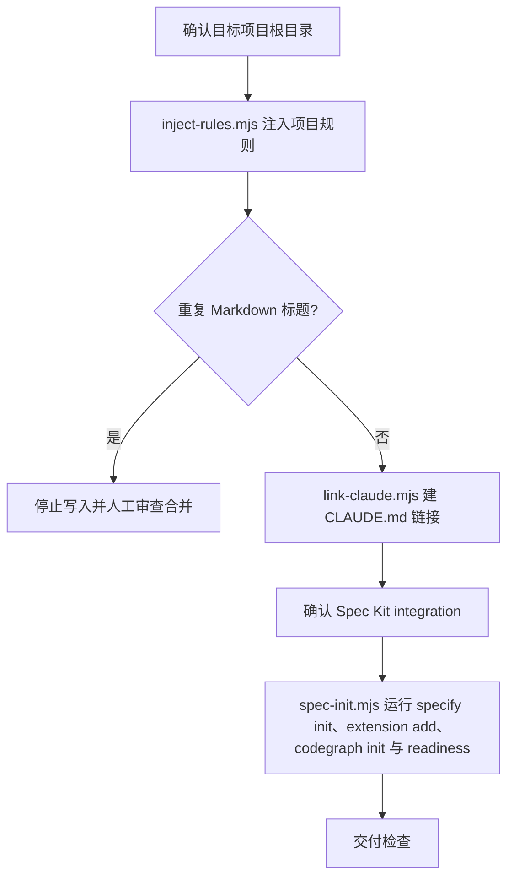

# Init Project

可选 Spec Kit 开发角色的完整项目初始化入口。它负责注入项目规则、建立 `CLAUDE.md` 链接、运行 **GitHub Spec Kit 原生项目初始化**、安装 **speckit-superpowers-bridge extension**、初始化 CodeGraph，并执行 bridge readiness 检查；不创建 OpenSpec schema，不复制 AIRules 自研 OpenSpec 资产，不接入 BMAD/gstack 初始化链路。

## 触发条件

- 用户创建新项目、初始化项目，或首次为已有项目接入 AIRules 可选 Spec Kit 开发角色。
- 目标项目需要项目根 `AGENTS.md`/`CLAUDE.md`、`specify init` 生成 `.specify/`、agent integration 命令和 Spec Kit 项目骨架。
- 目标项目需要安装 `lihan3238/speckit-superpowers-bridge`，让 Spec Kit `tasks.md` 交给原生 Superpowers 执行纪律。

## 不适合场景

- 项目明确要求默认 OpenSpec schema 工作流；应使用 `openspec-development` 的 `init-project`。
- 用户只要求普通业务开发、文档修改或已有 Spec Kit 项目的单个 feature 实现。
- 无法确认目标项目根目录时，不猜测、不写入。

## 初始化流程

| 环节 | 命令 | 关键输出 | 失败语义 |
|---|---|---|---|
| 规则注入 | `node "<init-project-skill>/scripts/inject-rules.mjs" <project>` | 项目根 `AGENTS.md`；新建/空文件默认注入 `airules-base.md`，检测为纯前端项目时额外注入 `frontend-only.md`；已有非托管内容不追加默认规则 | 已有托管块时移除旧块；托管块不完整时停止并要求人工审查合并 |
| Claude 链接 | `node "<init-project-skill>/scripts/link-claude.mjs" <project>` | `CLAUDE.md` 链接指向 `AGENTS.md` | 非托管文件或链接到其它目标时停止 |
| Spec Kit + bridge + CodeGraph | `node "<init-project-skill>/scripts/spec-init.mjs" <project>` | 运行 `specify init <project> --integration <integration> --force`，再运行 `specify extension add speckit-superpowers-bridge --from https://github.com/lihan3238/speckit-superpowers-bridge/releases/latest/download/speckit-superpowers-bridge.zip`，随后运行 `codegraph init -i`，最后运行 bridge readiness 脚本 | `specify` 或 `codegraph` 缺失时报 `MISSING` 并失败；extension/readiness 失败即失败，不用本地复制或 warning 伪装成功 |

- `<init-project-skill>` 表示已安装的全局 init-project skill 根目录（例如宿主 skills 目录下的 `init-project/`），不是目标项目内路径；执行前必须替换为真实绝对路径，且路径建议加双引号。
- `inject-rules.mjs` 自动处理 `airules-base.md`；`frontend-only.md` 只在检测到纯前端项目时按需注入，不属于 base 规则。

## Integration 选择

- Codex 默认：`specify init <project> --integration codex`。
- Claude Code：`specify init <project> --integration claude`。
- 其他 Spec Kit 官方支持的 integration 按用户宿主选择；不要自行发明 integration 名。
- 同时支持多个宿主时，优先按目标项目的主开发宿主初始化；bridge 的跨 agent handoff 由 extension 和共享 `.specify/superpowers-handoff.json` 管理。
- `spec-init.mjs` 默认使用 `codex`；需要覆盖时设置 `AIRULES_SPECKIT_INTEGRATION=<integration>`。

## 输出边界

- 允许写入目标项目根 `AGENTS.md`、`CLAUDE.md`，以及由 Spec Kit / bridge 原生生成的 `.specify/**`、宿主命令入口、bridge extension 文件和 `.codegraph/**`。
- 不写 `openspec/**`，不写 `openspec/schemas/**`，不设置 `schema: superpowers-bridge`。
- 不复制 `roles/openspec-development/skills/init-project/assets/**`。
- 不安装 BMAD BMM runtime，不写 gstack 资产。
- 不覆盖用户已有业务代码、依赖目录、构建产物或 vendor 目录。

## 交付检查

| 检查项 | 期望 |
|---|---|
| 规则 | 项目根 `AGENTS.md` 存在；新建/空文件含 `airules-base.md`，纯前端项目额外含 `frontend-only.md`，已有非托管内容不强行追加默认规则 |
| `CLAUDE.md` | 链接指向 `AGENTS.md`；Windows 无符号链接权限时回退为同一文件实体硬链接，并在日志说明 |
| Spec Kit | 目标项目存在 `.specify/`；`specify init` 命令真实执行过，没有用手写目录伪装 |
| Bridge | `.specify/extensions/speckit-superpowers-bridge/` 存在；`specify extension add` 使用 release ZIP 完成 |
| Superpowers handoff | 用户后续可在 `tasks.md` 生成后运行 `$speckit-superpowers-bridge` 或 `/speckit-superpowers-bridge` |
| CodeGraph | `codegraph init -i` 真实执行并报告 PASS、already initialized、FAIL、MISSING 或 NOT RUN |
| Schema 边界 | 目标项目没有因 `speckit-development` 初始化而新增 OpenSpec schema |
