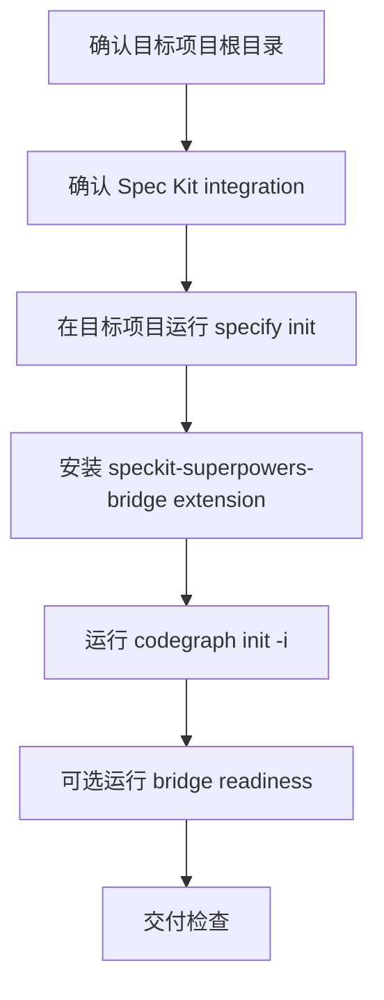

# Init Project

默认开发角色的轻量项目初始化入口。它只负责把目标项目接入 **GitHub Spec Kit 原生项目结构** 与 **speckit-superpowers-bridge extension**，不创建 OpenSpec schema，不复制 AIRules 自研 OpenSpec 资产，不接入旧 BMAD/gstack 初始化链路。

## 触发条件

- 用户创建新项目、初始化项目，或首次为已有项目接入 AIRules 默认开发角色。
- 目标项目需要 `specify init` 生成 `.specify/`、agent integration 命令和 Spec Kit 项目骨架。
- 目标项目需要安装 `lihan3238/speckit-superpowers-bridge`，让 Spec Kit `tasks.md` 交给原生 Superpowers 执行纪律。

## 不适合场景

- 项目明确要求旧 OpenSpec schema 工作流；应切换到 `openspec-development` 的 `init-project`。
- 用户只要求普通业务开发、文档修改或已有 Spec Kit 项目的单个 feature 实现。
- 无法确认目标项目根目录时，不猜测、不写入。

## 初始化流程

| 环节 | 命令 | 关键输出 | 失败语义 |
|---|---|---|---|
| Spec Kit 初始化 | `specify init <project> --integration <integration>` | `.specify/`、Spec Kit 命令入口、对应宿主 integration 文件 | `specify` 缺失时报 `MISSING specify CLI`；已有非空目录且用户允许保留时加 `--force` |
| Bridge 安装 | `specify extension add speckit-superpowers-bridge --from https://github.com/lihan3238/speckit-superpowers-bridge/releases/latest/download/speckit-superpowers-bridge.zip` | `.specify/extensions/speckit-superpowers-bridge/**`、`.specify/extensions.yml`、bridge 命令与 hooks | 安装失败即失败，不用本地复制伪装成功 |
| CodeGraph | 在目标项目根执行 `codegraph init -i` | `.codegraph` 初始化或已初始化状态 | `codegraph` 缺失时报 `MISSING codegraph` |
| Bridge readiness | PowerShell: `.\.specify\extensions\speckit-superpowers-bridge\scripts\powershell\bridge-status.ps1 -Readiness -Actor codex`；bash: `bash .specify/extensions/speckit-superpowers-bridge/scripts/bash/bridge-status.sh --readiness --actor codex` | 只读安装健康报告 | readiness 失败需暴露原因，不降级为 warning |

## Integration 选择

- Codex 默认：`specify init <project> --integration codex`。
- Claude Code：`specify init <project> --integration claude`。
- 其他 Spec Kit 官方支持的 integration 按用户宿主选择；不要自行发明 integration 名。
- 同时支持多个宿主时，优先按目标项目的主开发宿主初始化；bridge 的跨 agent handoff 由 extension 和共享 `.specify/superpowers-handoff.json` 管理。

## 输出边界

- 允许写入目标项目中由 Spec Kit / bridge 原生生成的 `.specify/**`、宿主命令入口、bridge extension 文件和 `.codegraph/**`。
- 不写 `openspec/**`，不写 `openspec/schemas/**`，不设置 `schema: superpowers-bridge`。
- 不复制 `roles/openspec-development/skills/init-project/assets/**`。
- 不安装 BMAD BMM runtime，不写 gstack 资产。
- 不覆盖用户已有业务代码、依赖目录、构建产物或 vendor 目录。

## 交付检查

| 检查项 | 期望 |
|---|---|
| Spec Kit | 目标项目存在 `.specify/`；`specify` 命令真实执行过，没有用手写目录伪装 |
| Bridge | `.specify/extensions/speckit-superpowers-bridge/` 存在；`specify extension add` 使用 release ZIP 完成 |
| Superpowers handoff | 用户后续可在 `tasks.md` 生成后运行 `$speckit-superpowers-bridge` 或 `/speckit-superpowers-bridge` |
| CodeGraph | `codegraph init -i` 真实执行并报告 PASS、already initialized、FAIL、MISSING 或 NOT RUN |
| Schema 边界 | 目标项目没有因默认 `speckit-development` 初始化而新增 OpenSpec schema |
