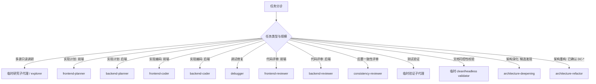

# AIRules

## 交付验证

- AI 代理完成修改后，质量检查必须按任务场景和风险分级执行；最终回复必须说明实际命令、结果、未执行项和原因。
- 高风险动作（删除、生产变更、安全/权限改动、跨模块重构、声明"已完成/已修复/已通过"）执行验证前，先做一次自我质疑：明确列出"这次最可能漏掉或验证不到什么"，据此补齐验证项再跑命令；不得跳过自我质疑直接宣称通过。
- 方法论能力（Superpowers、子代理委派、系统化调试、TDD）按各自适用判据及任务复杂度、风险匹配充分使用，不被本条抑制为默认不触发——委派判据见「子代理委派」节，调试/TDD 触发条件见对应 skill；全量回归测试、coverage 报告和构建不默认全量执行，仅在任务复杂度、风险匹配或用户明确要求时触发（改动生产代码时同步交付配套测试仍是默认交付的一部分）。
- 优先使用项目现有脚本和配置；缺少脚本、配置、依赖或测试入口时必须标记为 `MISSING`，不得伪造成已通过。
- 覆盖率优先采用项目阈值；无阈值时参考 statements、branches、functions、lines 均不低于 80%，新增或修改逻辑尽量达到 90%+ 有意义覆盖。
- 覆盖率不足时必须补充有效测试或报告原因；不得降低阈值、排除关键文件、删除断言或编写无意义测试来通过检查。
- 检查状态统一使用 `PASS`、`FAIL`、`MISSING`、`NOT RUN`、`N/A`，不得把失败、缺失、不相关或未运行转写成通过。
- 交付汇报必须按固定结构逐项收口，任一项缺失即视为漏报，不得因回复顺畅而省略：① 变更分级（L0/L1/L2 及判定依据）；② 改动内容（涉及文件与范围）；③ 验证（实际运行的命令与结果状态枚举）；④ 未执行项及原因；⑤ 风险 / `MISSING` / 待确认项（没有则显式写"无"）。轻量 L0 改动可压缩为一两句，但五个维度的事实不得隐去。

## 变更分级与确认门禁

- 所有生成、修改、删除动作开始前，必须先判定变更级别 L0、L1 或 L2，并在交付中说明判定依据；无法判定时按更高一级处理。
- L0：在既有口径、契约或模式内补充，不改变任何对外事实。包括补字段说明、示例、变更记录，或在既有测试模式下补用例。可直接执行，交付中说明改动与验证结果。
- L1：在既有边界内新增或修改，不触及对外口径、公共协议、模块边界、权限、状态机、数据一致性或安全边界。可直接执行，交付中附级别判定依据和验证结果。
- L2：触及需求口径、架构边界、公共协议、权限模型、状态机、数据一致性、安全边界、跨模块行为，或修改 rules、skills、初始化流程、默认分发配置。必须先完成澄清门禁并输出对应报告或计划，等待用户确认后才能执行。
- 同一动作横跨多级时按较高一级处理；缺少判定所需关键事实时，先尝试通过读代码、读文档、查知识源补齐，确实无法补齐时才升 L2 并走澄清门禁，不得一遇模糊就默认升级阻断。

## 澄清门禁

- 触发条件：命中 L2，或目标、角色、边界、流程、字段、状态、验收标准、冲突、风险中任一关键事实缺失（`MISSING`）或存在多个合理解释（歧义）。
- 触发后必须先输出《澄清问题清单》或对应设计报告，用苏格拉底式问题逐项暴露上述维度；未确认内容必须保留为 `MISSING`，不得用推断、默认值或代码反推替代。
- 澄清未闭环前不得定稿、不得写入正式产物、不得声明完成；只有用户确认或补齐事实后才能继续。
- 轻微、无歧义且用户已给出明确指令的 L0 改动不强制澄清，但仍需在交付中说明判定依据。

## 子代理委派

- 先按流程图选择环节；单文件、短命令、强耦合小改由主代理直接做，并说明未委派原因。
- 只有命中隔离、并行或独立复核收益时才拆子代理；并行前确认无依赖、无共享写入范围且可独立验证。

## 关键环节子代理调度索引（什么时候调用什么子代理）

图例 / 硬约束：

- 图中具名 agent 是默认调度入口；宿主不支持同名 agent 时，用同职责、同隔离边界的可用子代理。
- `skill` 决定方法论，`subagent` 决定隔离、并行和反自评边界；不得只因角色名不同拆 agent。
- 每次委派必须自包含；子代理回传必须由主代理用文件、diff、命令输出、日志或 URL 复核。
- reviewer 必须与 coder 是不同实例；拆 agent 必须命中隔离、并行或独立性之一。
- 实现性改动后默认在编码后、测试验证前走 `consistency-reviewer` 核对最终 diff；不得替代编码前 `consistency-check`。纯文档、纯注释、纯格式或无行为配置改动可标 `N/A`；缺少可核对上游时标 `MISSING blocked`。
- clean/headless validator 指干净隔离：无主会话历史、无宿主 AGENTS/baseline、无额外引导；无法提供时标 `MISSING` 或 `NOT RUN`，不得由主上下文自评为 `PASS`。

<!-- AIRULES:SKILL-INDEX:START -->
## Skill 触发索引

部分宿主（如 Qoder）不自动发现 skills，仅读取本 baseline。以下索引声明可用 skill 与触发条件；
当任务命中某条触发条件时，先读取 `skills/<name>/SKILL.md` 全文再按其流程执行。

| Skill | 触发条件（何时使用） |
|---|---|
| `design-docs` | 当用户提供视觉设计稿（Figma 导出、截图、设计规范文档、设计 token 清单、Design System 说明）并要求把视觉设计沉淀为前端可消费的结构化事实源，或要求生成、更新、标准化模块级视觉规格文档时使用。需要建立视觉事实源与 PRD/测试/实现计划导航关系时也使用。 |
| `handoff` | 当用户说"交接/handoff/换会话/写个总结给下一个会话/上下文快用完了"，或会话上下文明显过长需要中断转移时，输出一份新 agent 可直接消费的交接文档。 |
| `init-project` | 用于创建新项目、初始化项目、为已有项目首次接入 AIRules、生成项目根 AGENTS.md/CLAUDE.md 或初始化 CodeGraph 时触发。 |
| `retrospective-correction` | 用于用户指出实现与要求、计划、规则或验收标准存在偏差时触发；小偏差直接修复并说明，重大偏差先出修正计划、做原因归因，并强制写入纠偏记录沉淀为下次约束。 |
| `systematic-debugging` | Use when diagnosing technical failures, test failures, build errors, regressions, flaky behavior, or unexpected behavior before proposing fixes |
| `verification-before-completion` | Use when about to claim work is complete, fixed, passing, verified, ready to commit, or ready to publish |
<!-- AIRULES:SKILL-INDEX:END -->
