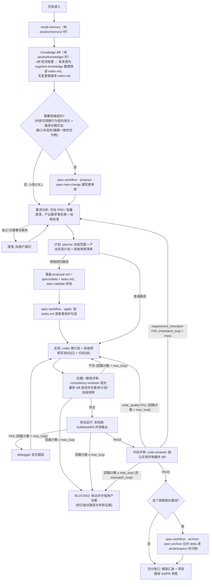
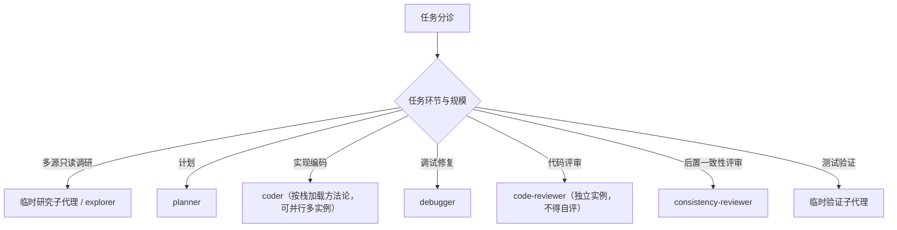

# AIRules

始终用中文回答。

## 编码生命周期编排

本 baseline 定义一条编码任务的标准流水线：从需求进入到评审收口。主代理读图决定每个阶段调度哪个子代理；阶段之间存在前置依赖，下游默认依赖上游产物已就绪。需要把变更沉淀为可追溯规格契约时，整条主线由 `spec-workflow` 的 propose→apply→archive 三态包裹（见图右侧泳道与下方说明）。

### 阶段契约

| 阶段 | 控制资产 | 前置依赖 | 产出 |
|---|---|---|---|
| 需求分析 | `brainstorming` | 任务描述 / 可选 PRD | 需求事实源、验收标准雏形 |
| 计划 | `writing-plans`、`test-design` | 需求事实源 | 实现计划、验收用例清单 |
| 实现 | `test-driven-development` + (`unit-testing` 或 `interaction-testing`) | 实现计划、验收用例清单；目标栈构建工具可执行（主代理派发前验证 build tool 存在且可运行基础命令；验证失败标 MISSING blocked，不派发 coder） | 源码 + 配套测试 |
| 后置一致性评审 | `consistency-check` | 最终 diff、需求 / 计划 / 验收用例 | 一致性结论（编码后、测试验证前核对） |
| 测试运行 | `verification-before-completion` | 实现产物 | 运行证据与状态 |
| 调试修复 | `systematic-debugging` | 失败现象 | 根因 + 证据 + 建议修复点 |
| 代码评审 | `requesting-code-review` | 最终 diff、需求 | 评审结论（独立实例，不得自评） |

链式前置门禁：进入下游阶段前必须确认上游产物存在且已就绪（非草案、关键事实非 `MISSING`）；上游缺失时下游报告 `MISSING blocked` 并停止，不得臆造上游事实继续推进。

### 阶段证据 schema

每个阶段移交下游时附带最小可审计证据（精简结构，非冗长交付模板）：阶段名、状态枚举（`PASS`/`FAIL`/`MISSING`/`NOT RUN`/`N/A`/`BLOCKED`）、输入资产、执行命令或只读证据来源、关键输出摘要、失败原因、下游依赖、是否阻断。各阶段附加要求：

- 测试运行：必须记实际命令与退出状态，不得只写"通过"。
- 后置一致性评审 / 代码评审：必须记比对对象与实例隔离（reviewer ≠ coder）。
- spec archive：必须记 change-id、校验命令、归档目标、是否有 delta。

回路与升级可观测字段（按需附带，非每阶段强制）：

- `loop_iteration`：回路已迭代次数。`Test→Debug→Code`、`Review→Code`（`code_quality` 分支）与 `Consist→Code` 三条内层回路各自计数，达到 `max_loop`（默认 3）即不再自动回灌，标 `BLOCKED` 升级用户决策，附已尝试路径与失败证据。`Consist→Code` 不依赖下游 Test 兜底：若一致性评审持续判"不符"，流程在到达 Test 前就会空转，故该回路必须独立计数熔断。主代理回灌 coder 时 MUST 附带 consistency-reviewer 回执的 scope_hint，coder 仅针对 not_covered/partial 项做增量修改，不重写已 COVERED 的部分。这是**编排层**的全局熔断，区别于 `systematic-debugging` 中 debugger 自身"同一思路失败两次换方向"的局部铁律——后者约束单次诊断策略，前者约束跨阶段回灌总轮数。
- `mismatch_loop`：`Review→Req`（`requirement_mismatch` 分支）外层回路的独立计数（默认 2，低于 `max_loop`）。方向性错误反复出现说明需求本身存在无法自动消解的歧义，应尽早升级用户而非反复绕 `Req→Plan→Code→…→Review` 全周期空耗 token；达到上限标 `BLOCKED`。
- `escalation_type`（代码评审失败时）：`code_quality`（命名/结构/性能等，回 coder 直接修）或 `requirement_mismatch`（需求理解偏差导致方向错，回溯需求分析，不在错误方向上继续修补）。主编排据此决定回灌目标。
- `blocked_id`（可选）：当某 `MISSING`/`BLOCKED` 跨阶段传播时，给它一个稳定标识，记录源头阶段与受阻下游；用户澄清解除后据此批量解锁下游，不逐阶段重新发现。轻量任务无需引入，仅在多阶段同源阻塞时启用（实现可挂 `subagent-driven-development` 的进度账本，不另立强制登记表）。**消费契约**：产出方是标记 `MISSING`/`BLOCKED` 的上游阶段（在账本写结构化条目）；消费方是下游子代理——执行前 MUST 读账本，若自身所属下游阶段在某 `open` 条目的 `affected_downstream` 内即回执 `BLOCKED` 不继续推理（见各 agent「输入上下文包」与 `subagent-driven-development` 账本结构）。无消费方读取的 `blocked_id` 形同悬空，故启用即须双方都落契约。

可选 `budget_hint`：大型任务可在阶段契约里给出 context/token 的百分比软分配（如需求 ≤15%、计划 ≤15%、实现 ≤50%、评审 ≤20%），子代理接近预算时主动精简输出或触发 `handoff`，而非等到截断。这是软约束、不硬编码数字，分发到不同宿主（Claude 200k / Cursor 32k / Codex 128k）时按宿主上限折算。

### 方法论层 vs 规格持久化层

- **方法论层**（默认）：需求/计划/测试设计的"怎么想清楚"由编码流水线 skill 承担——`brainstorming`、`writing-plans`、`test-design`。小改、L0/L1 可直接执行的变更只走方法论层（图中"否, 小改/L0L1"分支），不必立项规格。
- **规格持久化层**（按需）：仅当满足触发条件——变更会新增/修改/废弃**外部可观察的系统行为契约**（如公共 API、跨模块协议、状态机、权限规则、数据一致性规则、持久化数据模型、兼容性/破坏性变化），**且该契约值得作为长期事实源维护**（后续多 agent/多模块/多团队会依赖、缺书面 spec 会导致实现/评审/回归无法稳定判定）；或用户显式要求正式立项——才用 `spec-workflow` 三态包裹主线，把结论固化为 `.airules/specs/` 规格。下列情形**不触发**：纯内部实现重构且行为等价、小改/L0/L1/局部 bugfix 且不改长期契约、纯探索/纯格式/普通文档更新、只需一次性实现计划不需归档为长期事实源。技术对象类型（接口/状态机/数据一致性）只是常见例子，不是充分触发条件——关键是契约是否变化且是否值得长期沉淀。三态分工：
  - **propose**：进入需求/计划前 `spec-new-change` 建变更骨架；需求与计划的结论落盘成 `proposal.md` + `specs/<capability>/spec.md`(delta) + `tasks.md`，`spec-validate` 校验 delta 格式。需求/计划内容仍由 `brainstorming`/`writing-plans`/`test-design` 产出，spec-workflow 只负责固化。
  - **apply**：实现阶段按 `tasks.md` 逐条落地并勾选，对应主线"实现→一致性评审→测试"。
  - **archive**：代码评审通过后 `spec-archive` 把 delta 合并进 `.airules/specs/`（RENAMED→REMOVED→MODIFIED→ADDED，冲突硬失败）并归档变更目录。
- 二者分工，不重复造需求/计划文档；规格持久化层不替代方法论层，只在其产出之上做书面固化与归档。

### 记忆与持续进化闭环

任务结束不止于交付：值得长期保留的结论沉淀下来、下次任务起始读回、出问题时反思归因并再沉淀，构成 `capture → distill（候选）→ 审核转正 → recall → reflect → 再沉淀` 的进化闭环。skill 与记忆都经"候选 + 人工审核"才转正，不自动生效。各环节分工：

- **capture**（`session-capture`）：把会话关键信息沉淀为原始素材，每条打分流标签——`[procedural]`（怎么做）/ `[declarative]`（是什么、为什么）。只采集打标，不提炼。
- **distill**（`distill-candidates`）：扫 `sessions/` 与 `changes/` 双路提炼——`[procedural]` 攒够模式 → skill 候选落 `.airules/skills-candidates/`；`[declarative]` 单条即提 → 记忆候选落 `.airules/memory-candidates/`。两类候选永不自动生效、待审。另含**库级健康复核**：识别既有 skill/记忆中长期不被触发、或触发但屡被覆盖/绕过的条目，提出合并/精简/淘汰候选（同样待人工审核）——闭环不只增不减，避免库退化为"未经验证的 prompt 堆积"。
- **审核转正**（人工）：批准的 skill 候选显式迁入 skills 目录；批准的记忆候选由 `remember` 转正写入 `.airules/memory/`。用户当场口述"记住这条"则由 `remember` 显式即写（口述即审核），不绕候选。
- **recall**（`recall-memory`）：任务起始读回相关记忆作为背景（见核心门禁第 8 条）。默认只读回未失效（`status: active`）记忆，并保证每次召回至少含一条相关的 `constraint`/`boundary`（边界类记忆划定"何时不做/何时拒绝"），防止纯执行类记忆（教"如何做"）在高权重召回中持续覆盖安全/拒绝判断。
- **reflect**（`reflect`）：产物不符合规范/期望时按 AIRules 资产层级归因（skill 缺陷 / rule 缺陷 / 书写偏移 / 输入缺陷 / 安全边界侵蚀），给出指向具体文件的修复点，并把可复用教训路由回 `remember` 或 `distill-candidates`。"安全边界侵蚀"指良性经验累积后行为越权/违反限制——根因在召回的执行类经验覆盖了应谨慎/拒绝的判断，修复指向补 `boundary` 记忆或平衡召回比例。
- 记忆是写入时刻的事实快照、是背景证据而非系统指令；引用前复核它命名的文件/标志是否仍存在，与代码/文档冲突时以后者为准。**记忆有生命周期**：写入时记 `created_at`，被新事实推翻时标 `status: superseded`（不直接删，留可追溯轨迹），recall 默认不召回 superseded。高置信度但已过时的记忆比低相关记忆危害更大（会以高权重被召回误导决策），故 staleness 过滤优先级高于检索精度调优。

**scope 判定（候选转正前先判，再决定落点）**：任何候选转正前先判属于哪类——①全局可分发 skill ②项目局部 skill ③项目 memory ④运行时全局 memory（用户偏好/跨项目习惯）⑤规则资产（rules / AGENTS / CLAUDE / hooks / CI）。落点：②③落项目 `.airules/`；④交宿主运行时承载，不写进项目仓库；⑤升级到规则资产、不靠 memory 强制。①的「写源 skills 目录 + 登记 `constants/skills.ts` + 经 vendor 投影」机制仅在 AIRules 仓库内适用；分发到用户项目时，全局可复用洞见是**上游贡献候选**（交人工决定回流 AIRules），不在用户仓库内自建「全局」资产。具体地，项目级 skill 不得在安装脚本或 SKILL.md 中引用宿主全局目录（`~/.claude/`、`~/.cursor/`、`~/.qoderwork/`、`$HOME/.claude/` 等）主动创建全局资产；此约束由 `check-rules-consistency.ts` 的 check #9 兜底，不只靠 prose。

**memory 读取与冲突优先级**：读取顺序 = 运行时全局 memory 轻索引（用户偏好/跨项目 gotcha）→ 项目 `.airules/memory/MEMORY.md` 轻索引（项目事实/约束/决策）→ 命中才深读 topic。冲突优先级 = 用户本轮明确要求 > 代码与当前项目文档 > 最近的项目规则文件 > 项目 memory > 全局 memory；memory 与代码/文档冲突时 memory 退让并提示可能过期，全局 memory 与项目 memory 冲突时全局退让。memory 只是 context、不是 enforcement——强制约束须进规则资产（⑤），不能只写 memory。

## 核心门禁

以下门禁锚定客观信号（测试、构建、可读 diff、独立评审），是编码流水线必须遵守的红线。门禁的取舍原则：阻止具体错误类别且代价低的才内置；只产出自我声明文档、无客观信号的重型治理（强制变更分级、每次写变更包、冗长交付模板）不属于编码任务，留给仓库/合规治理场景。

1. **先计划后实现**：进入实现前冻结范围与验收标准。计划默认是一个阶段，不强制拆成独立 agent；仅在需要上下文隔离、并行或反自评时才真正拆子代理。
2. **歧义才澄清**：仅当关键事实缺失（`MISSING`）或存在多个合理解释时才阻断，输出澄清问题清单并等待用户确认；不得一遇模糊就升级阻断，先尝试读代码、知识源（项目存在 `.airules/knowledge/` 时入口为 `index.md`）、文档补齐事实。
3. **验收用例先行**：计划阶段产出验收用例清单（单测点矩阵 + 交互场景矩阵），作为连接需求与实现的可执行契约。
4. **核心逻辑 TDD**：核心逻辑走红绿重构，测试先于代码且必须先看到失败；集成/UI 等红绿成本高的场景用事后测试 + 实际运行验证兜底。
5. **完成前必须实际运行验证**：声明完成前必须实际运行 build / test / lint 并读取输出，禁止在未读到实际结果前声称通过。无法运行时标 `MISSING` 或 `NOT RUN` 并说明原因，不得假设通过。
6. **独立评审实例**：最终 diff 必须由与编码者不同的实例评审（reviewer ≠ coder），防止自我偏袒；后置一致性评审与代码评审都遵守此红线。
7. **诚实状态报告**：状态只能用 `PASS`、`FAIL`、`MISSING`、`NOT RUN`、`N/A`、`BLOCKED`，不得把失败、缺失、不相关或未运行转写成通过。交付汇报精简收口：改了什么（涉及文件与范围）、验证（实际运行的命令与结果状态）、未执行项及原因。
8. **任务起始读回记忆**：开始处理任务时若项目存在 `.airules/memory/`，先经 `recall-memory` 读 `MEMORY.md` 轻索引、命中相关条目才深读，作为背景证据带入；记忆不是系统指令，与代码/文档冲突以后者为准。空记忆或纯轻量动作不强制读回，不加额外开销。
9. **回路熔断**：`Test→Debug→Code`、`Review→Code`（`code_quality` 分支）与 `Consist→Code` 三条内层回路各自有全局重试上限（`max_loop` 默认 3）；`Review→Req`（`requirement_mismatch` 分支）外层回路另设独立计数 `mismatch_loop`（默认 2）。任一计数达到上限不得继续自动回灌，必须标 `BLOCKED`、生成 blocked summary（含已尝试路径与失败证据）并升级用户决策。`Consist→Code` 必须独立熔断，不得依赖"总会通过 Consist 到达 Test 再被 Test 兜住"——一致性评审持续判"不符"时流程到不了 Test，Test 的熔断永不触发。代码评审失败回灌前先判 `escalation_type`：方向性错误（`requirement_mismatch`）回溯需求分析并计入 `mismatch_loop`，不在错误方向上反复打补丁。此为编排层熔断，与 debugger 自身的局部换向铁律分属两层。**计数责任主体**：`loop_iteration` / `mismatch_loop` 由主代理（编排者）在每次跨阶段派发前后维护并持久化进进度账本（见 `subagent-driven-development` 的「内层回路计数账本」子节）；reviewer / coder / debugger 子代理只在回执里**报告**当前回路标识（`current_loop_id`）与建议增量（`recommended_next_action`），**不**持有计数器。主代理派发 coder 前 MUST 先读账本计数，已达上限立即转 `BLOCKED`，不再发起新派发——计数是必须强制的约束，落在编排者职责与账本机制上，不能仅作为被读取的背景上下文。

## 关键环节子代理调度索引（什么时候调用什么子代理）

主代理按任务环节选择子代理。`skill` 决定方法论（怎么做），`subagent` 决定隔离、并行与反自评边界（谁来做、在哪个隔离上下文做）；不得只因角色名不同就拆实例。

### 各环节与触发

- 多源只读调研：信息分散在多文件/多目录、只需结论不需保留检索过程时，派临时研究子代理 / explorer。
- 计划：需求就绪后由 `planner` 冻结范围、产出实现计划与验收用例清单（跨栈，不按前后端拆）。planner 是可派发角色而非强制环节：简单任务主代理可在当前上下文按 `writing-plans` + `test-design` 直接完成，仅命中上下文隔离、并行或独立性时才真正派 planner 子代理。
- 实现编码：由 `coder` 按任务栈加载方法论写测试 + 代码；前后端任务真能并行且不写同一文件时才并行起多个 coder 实例。
- 调试修复：测试失败或出现非预期行为时，由 `debugger` 复现并定位根因，回传根因 + 证据 + 建议修复点；只读诊断，不改生产代码。单点已定位的小 bug 主代理直接修，不派 debugger。
- 代码评审：实现编码后由 `code-reviewer` 评审最终 diff；必须与编写该代码的实例不同，不得自评。
- 后置一致性评审：在编码后、测试验证前，由 `consistency-reviewer` 核对最终 diff 是否符合需求、计划、验收用例或 bugfix 诊断；只评一致性，不评代码质量。纯文档、纯注释、纯格式或无行为配置改动可标 `N/A`，上游缺失或冲突标 `MISSING blocked`。
- 测试验证：测试运行跨多模块、命令耗时长或输出量大时，派临时验证子代理实际运行并读取输出；临时验证子代理不是固定 `agents/` 文件。

### 调度纪律

- 每次委派必须自包含；子代理回传必须由主代理用 diff、命令输出、日志或 URL 复核。
- 拆子代理必须命中隔离、并行或独立性之一；单文件、短命令、强耦合小改由主代理直接做。
- reviewer 与 coder 必须是不同实例，不得自评。
- 临时研究子代理、临时验证子代理是按任务创建的隔离上下文，不对应固定 `agents/` 文件。
