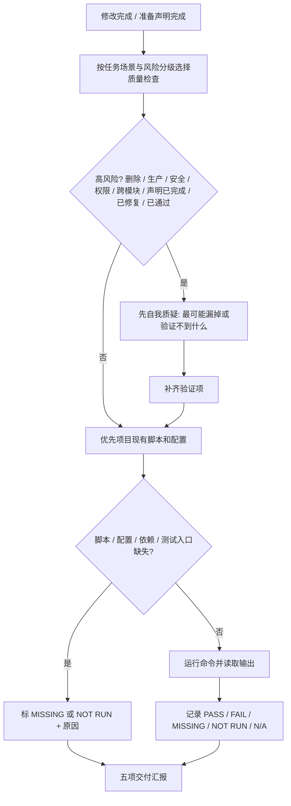
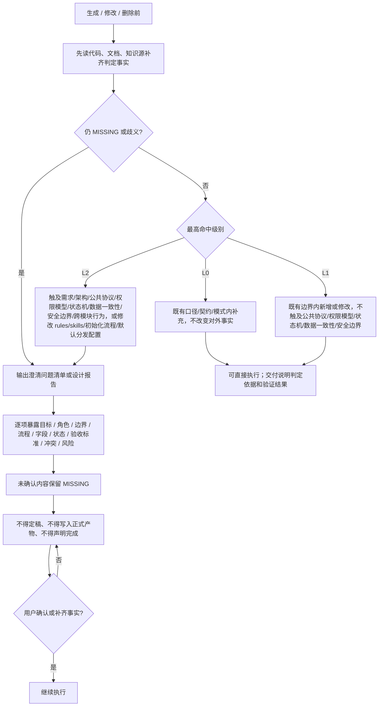
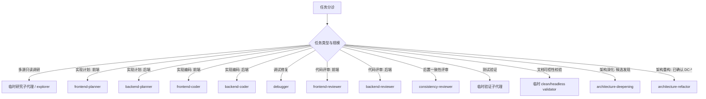

# AIRules

## 交付验证

图例 / 硬约束：

- 方法论能力按适用判据触发；全量回归、coverage 和构建只在任务复杂度、风险匹配或用户要求时运行，改生产代码时默认配套有效测试。
- 覆盖率优先项目阈值；无阈值时 statements、branches、functions、lines 均不低于 80%，新增/修改逻辑尽量 90%+。
- 覆盖率不足只能补有效测试或说明原因；不得降阈值、排除关键文件、删断言或写无意义测试。
- 状态只能用 `PASS`、`FAIL`、`MISSING`、`NOT RUN`、`N/A`；不得伪装通过，不得把失败、缺失、不相关或未运行转写成通过。
- 交付汇报必须收口五项：变更分级（L0/L1/L2 及判定依据）、改动内容（涉及文件与范围）、验证（实际运行的命令与结果状态）、未执行项及原因、风险 / `MISSING` / 待确认项（没有则显式写"无"）。

## 变更分级与澄清门禁

图例 / 硬约束：

- 同一动作横跨多级时按最高级别处理；无法判定时按更高一级处理。
- L0 只允许补字段说明、示例、变更记录或既有测试模式下补用例。
- L1 不得触及对外口径、公共协议、模块边界、权限模型、状态机、数据一致性或安全边界。
- L2、关键事实缺失（`MISSING`）或存在多个合理解释（歧义）时，必须输出澄清问题清单或设计报告，并等待用户确认。
- 澄清问题必须用苏格拉底式问题暴露缺口；不得用推断、默认值或代码反推替代用户确认。
- 澄清未闭环前不得定稿、不得写入正式产物、不得声明完成。
- 不得一遇模糊就升级阻断；先尝试读取代码、文档和知识源补齐事实。

## 子代理委派

- 先按流程图选择环节；单文件、短命令、强耦合小改由主代理直接做，并说明未委派原因。
- 只有命中隔离、并行或独立复核收益时才拆子代理；并行前确认无依赖、无共享写入范围且可独立验证。

## 关键环节子代理调度索引（什么时候调用什么子代理）

图例 / 硬约束：

- 图中具名 agent 是默认调度入口；宿主不支持同名 agent 时，用同职责、同隔离边界的可用子代理。
- `skill` 决定方法论，`subagent` 决定隔离、并行和反自评边界；不得只因角色名不同拆 agent。
- 每次委派必须自包含；子代理回传必须由主代理用文件、diff、命令输出、日志或 URL 复核。
- reviewer 必须与 coder 是不同实例；拆 agent 必须命中隔离、并行或独立性之一。
- 实现性改动后默认在编码后、测试验证前走 `consistency-reviewer` 核对最终 diff；不得替代编码前 `consistency-check`。纯文档、纯注释、纯格式或无行为配置改动可标 `N/A`；缺少可核对上游时标 `MISSING blocked`。
- clean/headless validator 指干净隔离：无主会话历史、无宿主 AGENTS/baseline、无额外引导；无法提供时标 `MISSING` 或 `NOT RUN`，不得由主上下文自评为 `PASS`。
