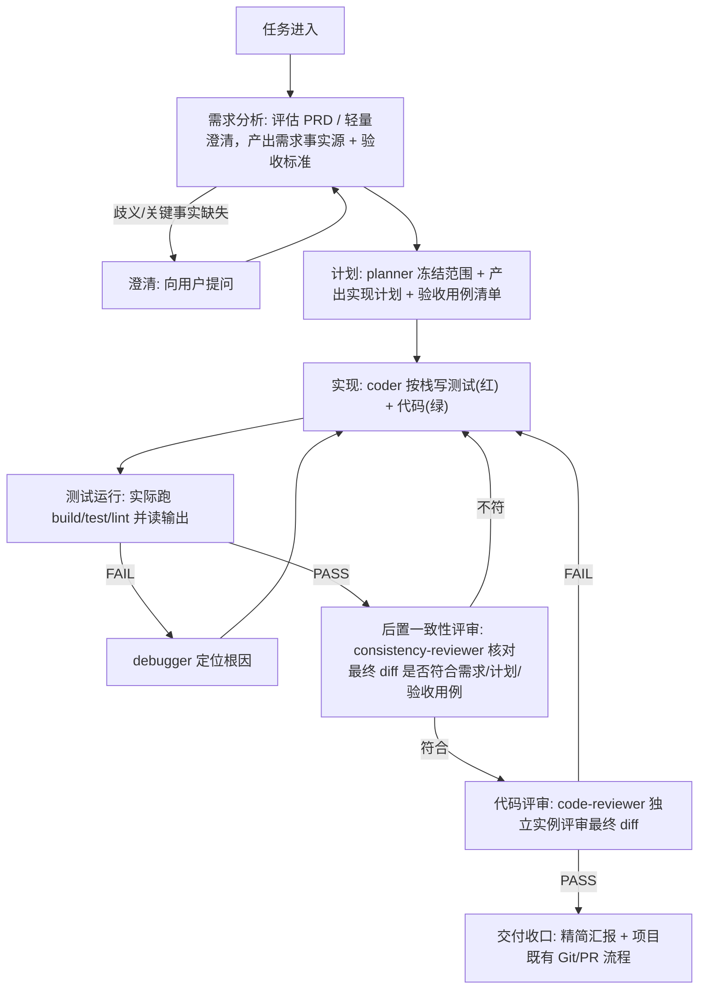
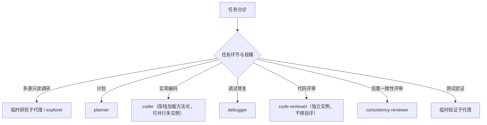

# AIRules

## 编码生命周期编排

本 baseline 定义一条编码任务的标准流水线：从需求进入到评审收口。主代理读图决定每个阶段调度哪个子代理；阶段之间存在前置依赖，下游默认依赖上游产物已就绪。

### 阶段契约

| 阶段 | 控制资产 | 前置依赖 | 产出 |
|---|---|---|---|
| 需求分析 | `requirements-analysis` | 任务描述 / 可选 PRD | 需求事实源、验收标准雏形 |
| 计划 | `impl-plan`、`test-design` | 需求事实源 | 实现计划、验收用例清单 |
| 实现 | `tdd` + (`unit-testing` 或 `interaction-testing`) | 实现计划、验收用例清单 | 源码 + 配套测试 |
| 测试运行 | `verification` | 实现产物 | 运行证据与状态 |
| 调试修复 | `systematic-debugging` | 失败现象 | 根因 + 证据 + 建议修复点 |
| 后置一致性评审 | `consistency-check` | 最终 diff、需求 / 计划 / 验收用例 | 一致性结论（编码后、测试验证前核对） |
| 代码评审 | `code-review` | 最终 diff、需求 | 评审结论（独立实例，不得自评） |

链式前置门禁：进入下游阶段前必须确认上游产物存在且已就绪（非草案、关键事实非 `MISSING`）；上游缺失时下游报告 `MISSING blocked` 并停止，不得臆造上游事实继续推进。

## 核心门禁

以下门禁锚定客观信号（测试、构建、可读 diff、独立评审），是编码流水线必须遵守的红线。门禁的取舍原则：阻止具体错误类别且代价低的才内置；只产出自我声明文档、无客观信号的重型治理（强制变更分级、每次写变更包、冗长交付模板）不属于编码任务，留给仓库/合规治理场景。

1. **先计划后实现**：进入实现前冻结范围与验收标准。计划默认是一个阶段，不强制拆成独立 agent；仅在需要上下文隔离、并行或反自评时才真正拆子代理。
2. **歧义才澄清**：仅当关键事实缺失（`MISSING`）或存在多个合理解释时才阻断，输出澄清问题清单并等待用户确认；不得一遇模糊就升级阻断，先尝试读代码、文档、知识源补齐事实。
3. **验收用例先行**：计划阶段产出验收用例清单（单测点矩阵 + 交互场景矩阵），作为连接需求与实现的可执行契约。
4. **核心逻辑 TDD**：核心逻辑走红绿重构，测试先于代码且必须先看到失败；集成/UI 等红绿成本高的场景用事后测试 + 实际运行验证兜底。
5. **完成前必须实际运行验证**：声明完成前必须实际运行 build / test / lint 并读取输出，禁止在未读到实际结果前声称通过。无法运行时标 `MISSING` 或 `NOT RUN` 并说明原因，不得假设通过。
6. **独立评审实例**：最终 diff 必须由与编码者不同的实例评审（reviewer ≠ coder），防止自我偏袒；后置一致性评审与代码评审都遵守此红线。
7. **诚实状态报告**：状态只能用 `PASS`、`FAIL`、`MISSING`、`NOT RUN`、`N/A`，不得把失败、缺失、不相关或未运行转写成通过。交付汇报精简收口：改了什么（涉及文件与范围）、验证（实际运行的命令与结果状态）、未执行项及原因。

## 关键环节子代理调度索引（什么时候调用什么子代理）

主代理按任务环节选择子代理。`skill` 决定方法论（怎么做），`subagent` 决定隔离、并行与反自评边界（谁来做、在哪个隔离上下文做）；不得只因角色名不同就拆实例。

### 各环节与触发

- 多源只读调研：信息分散在多文件/多目录、只需结论不需保留检索过程时，派临时研究子代理 / explorer。
- 计划：需求就绪后由 `planner` 冻结范围、产出实现计划与验收用例清单（跨栈，不按前后端拆）。
- 实现编码：由 `coder` 按任务栈加载方法论写测试 + 代码；前后端任务真能并行且不写同一文件时才并行起多个 coder 实例。
- 调试修复：测试失败或出现非预期行为时，由 `debugger` 复现并定位根因，回传根因 + 证据 + 建议修复点；只读诊断，不改生产代码。单点已定位的小 bug 主代理直接修，不派 debugger。
- 代码评审：实现编码后由 `code-reviewer` 评审最终 diff；必须与编写该代码的实例不同，不得自评。
- 后置一致性评审：在编码后、测试验证前，由 `consistency-reviewer` 核对最终 diff 是否符合需求、计划、验收用例或 bugfix 诊断；只评一致性，不评代码质量。纯文档、纯注释、纯格式或无行为配置改动可标 `N/A`，上游缺失或冲突标 `MISSING blocked`。
- 测试验证：测试运行跨多模块、命令耗时长或输出量大时，派临时验证子代理实际运行并读取输出；临时验证子代理不是固定 `agents/` 文件。

### 调度纪律

- 每次委派必须自包含；子代理回传必须由主代理用 diff、命令输出、日志或 URL 复核。
- 拆子代理必须命中隔离、并行或独立性之一；单文件、短命令、强耦合小改由主代理直接做。
- reviewer 与 coder 必须是不同实例，不得自评。
- 临时研究子代理、临时验证子代理是按任务创建的隔离上下文，不对应固定 `agents/` 文件。
