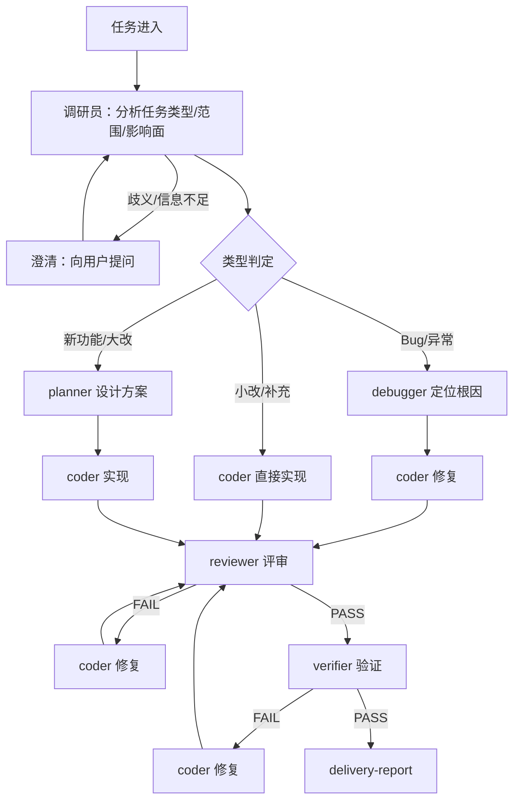

# AIRules Global Baseline

## 任务调度

```mermaid
flowchart TD
  Task["任务进入"] --> Research["调研员：分析任务类型/范围/影响面"]
  Research -->|歧义/信息不足| Clarify["澄清：向用户提问"] --> Research
  Research --> Type{"类型判定"}
  Type -->|Bug/异常| Debug["debugger 定位根因"]
  Type -->|新功能/大改| Plan["planner 设计方案"]
  Type -->|小改/补充| Code["coder 直接实现"]
  Debug --> Fix["coder 修复"]
  Plan --> Code2["coder 实现"]
  Fix --> Review["reviewer 评审"]
  Code --> Review
  Code2 --> Review
  Review -->|FAIL| FixR["coder 修复"] --> Review
  Review -->|PASS| Verify["verifier 验证"]
  Verify -->|FAIL| FixV["coder 修复"] --> Review
  Verify -->|PASS| Done["delivery-report"]
```

## 全局红线

- reviewer 与 coder 必须是不同实例，不得自评
- 不得伪装 PASS、降阈值、排除关键文件、删断言
- 澄清未闭环不得定稿、不得写入正式产物、不得声明完成
- 每次委派自包含；回传必须由主代理用 diff/命令输出/日志复核
- 后置子代理不得绕过/降级/伪装上游门禁