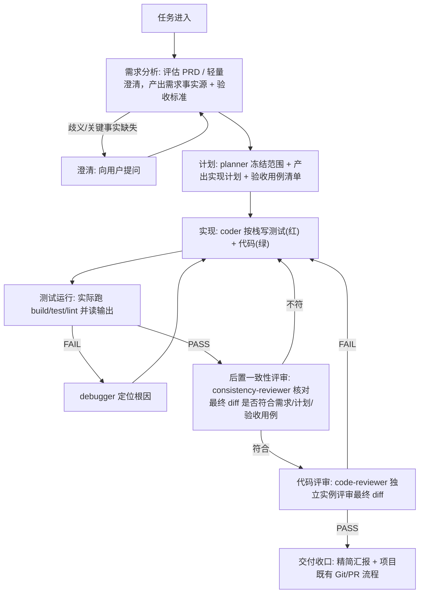

## 编码生命周期编排

本 baseline 定义一条编码任务的标准流水线：从需求进入到评审收口。主代理读图决定每个阶段调度哪个子代理；阶段之间存在前置依赖，下游默认依赖上游产物已就绪。

### 阶段契约

| 阶段 | 控制资产 | 前置依赖 | 产出 |
|---|---|---|---|
| 需求分析 | `brainstorming` | 任务描述 / 可选 PRD | 需求事实源、验收标准雏形 |
| 计划 | `writing-plans`、`test-design` | 需求事实源 | 实现计划、验收用例清单 |
| 实现 | `test-driven-development` + (`unit-testing` 或 `interaction-testing`) | 实现计划、验收用例清单 | 源码 + 配套测试 |
| 测试运行 | `verification-before-completion` | 实现产物 | 运行证据与状态 |
| 调试修复 | `systematic-debugging` | 失败现象 | 根因 + 证据 + 建议修复点 |
| 后置一致性评审 | `consistency-check` | 最终 diff、需求 / 计划 / 验收用例 | 一致性结论（编码后、测试验证前核对） |
| 代码评审 | `requesting-code-review` | 最终 diff、需求 | 评审结论（独立实例，不得自评） |

链式前置门禁：进入下游阶段前必须确认上游产物存在且已就绪（非草案、关键事实非 `MISSING`）；上游缺失时下游报告 `MISSING blocked` 并停止，不得臆造上游事实继续推进。
