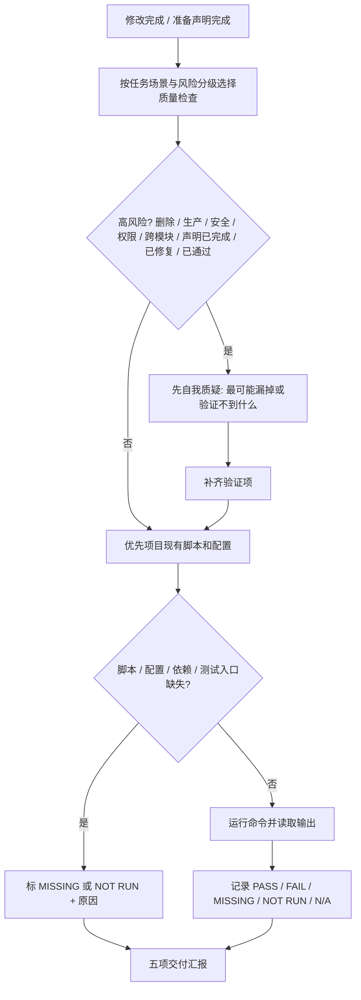

## 交付验证

图例 / 硬约束：

- 方法论能力按适用判据触发；全量回归、coverage 和构建只在任务复杂度、风险匹配或用户要求时运行，改生产代码时默认配套有效测试。
- 覆盖率优先项目阈值；无阈值时 statements、branches、functions、lines 均不低于 80%，新增/修改逻辑尽量 90%+。
- 覆盖率不足只能补有效测试或说明原因；不得降阈值、排除关键文件、删断言或写无意义测试。
- 状态只能用 `PASS`、`FAIL`、`MISSING`、`NOT RUN`、`N/A`；不得伪装通过，不得把失败、缺失、不相关或未运行转写成通过。
- 交付汇报必须收口五项：变更分级（L0/L1/L2 及判定依据）、改动内容（涉及文件与范围）、验证（实际运行的命令与结果状态）、未执行项及原因、风险 / `MISSING` / 待确认项（没有则显式写"无"）。
