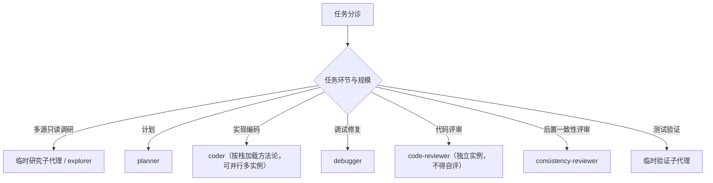

## 关键环节子代理调度索引（什么时候调用什么子代理）

主代理按任务环节选择子代理。`skill` 决定方法论（怎么做），`subagent` 决定隔离、并行与反自评边界（谁来做、在哪个隔离上下文做）；不得只因角色名不同就拆实例。

### 各环节与触发

- 多源只读调研：信息分散在多文件/多目录、只需结论不需保留检索过程时，派临时研究子代理 / explorer。
- 计划：需求就绪后由 `planner` 冻结范围、产出实现计划与验收用例清单（跨栈，不按前后端拆）。
- 实现编码：由 `coder` 按任务栈加载方法论写测试 + 代码；前后端任务真能并行且不写同一文件时才并行起多个 coder 实例。
- 调试修复：测试失败或出现非预期行为时，由 `debugger` 复现并定位根因，回传根因 + 证据 + 建议修复点；只读诊断，不改生产代码。单点已定位的小 bug 主代理直接修，不派 debugger。
- 代码评审：实现编码后由 `code-reviewer` 评审最终 diff；必须与编写该代码的实例不同，不得自评。
- 后置一致性评审：在编码后、测试验证前，由 `consistency-reviewer` 核对最终 diff 是否符合需求、计划、验收用例或 bugfix 诊断；只评一致性，不评代码质量。纯文档、纯注释、纯格式或无行为配置改动可标 `N/A`，上游缺失或冲突标 `MISSING blocked`。
- 测试验证：测试运行跨多模块、命令耗时长或输出量大时，派临时验证子代理实际运行并读取输出；临时验证子代理不是固定 `agents/` 文件。

### 调度纪律

- 每次委派必须自包含；子代理回传必须由主代理用 diff、命令输出、日志或 URL 复核。
- 拆子代理必须命中隔离、并行或独立性之一；单文件、短命令、强耦合小改由主代理直接做。
- reviewer 与 coder 必须是不同实例，不得自评。
- 临时研究子代理、临时验证子代理是按任务创建的隔离上下文，不对应固定 `agents/` 文件。
