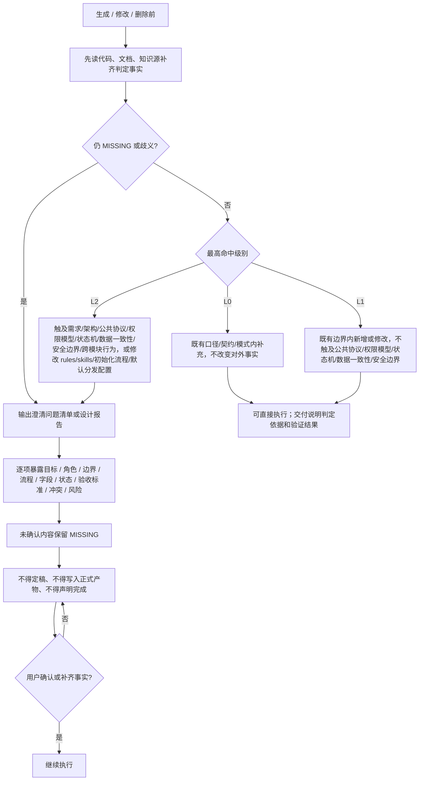

## 变更分级与澄清门禁

图例 / 硬约束：

- 同一动作横跨多级时按最高级别处理；无法判定时按更高一级处理。
- L0 只允许补字段说明、示例、变更记录或既有测试模式下补用例。
- L1 不得触及对外口径、公共协议、模块边界、权限模型、状态机、数据一致性或安全边界。
- L2、关键事实缺失（`MISSING`）或存在多个合理解释（歧义）时，必须输出澄清问题清单或设计报告，并等待用户确认。
- 澄清问题必须用苏格拉底式问题暴露缺口；不得用推断、默认值或代码反推替代用户确认。
- 澄清未闭环前不得定稿、不得写入正式产物、不得声明完成。
- 不得一遇模糊就升级阻断；先尝试读取代码、文档和知识源补齐事实。
